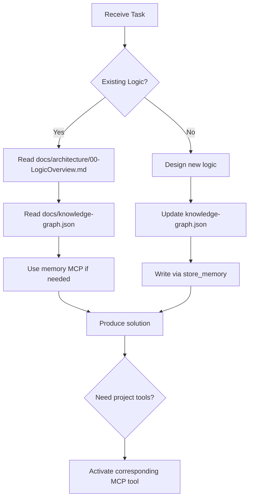

# Copilot Instructions for Xuanwu

Project-wide always-on instructions for GitHub Copilot Chat.

## Scope
- Apply these rules to all tasks in this repository.
- Use file-based instructions in `.github/instructions/*.instructions.md` for language or feature-specific rules.

## Single Sources of Truth
- Business logic: `docs/architecture/00-LogicOverview.md`
- Entity semantics and knowledge structure: `docs/knowledge-graph.json`
- AI analysis and task decomposition baseline: `skills/SKILL.md`

Reference material (non-SSOT):
- Codebase map and implementation patterns: `skills/SKILL.md`

> All project facts (Single Source of Truth) must come from:
>
> - `docs/knowledge-graph.json`
> - `docs/architecture/00-LogicOverview.md`
> - `skills/SKILL.md`
>
> Any inference, process definition, task decomposition, or AI judgment must be grounded in these three documents. Do not make unsupported assumptions.

## Reasoning Protocol
- Use deliberate reasoning before final answers.
- Do not jump to conclusions; define the core problem first.
- Break down causal relationships step by step.
- Apply first-principles thinking: reduce to fundamental elements, then rebuild.
- Make assumptions explicit before implementation.

## Analysis Frameworks
- Analyze with both necessary conditions and sufficient conditions.
- For critical arguments, include a devil's advocate viewpoint and then balance it with evidence.
- Use systems thinking for complex features; describe key variables and feedback loops.

## Operational Rule Set
```rules
IF task involves business logic
  THEN read docs/architecture/00-LogicOverview.md first

IF task involves entity relationships
  THEN inspect docs/knowledge-graph.json

IF historical context is required
  THEN use memory MCP

IF new knowledge is produced
  THEN store_memory and update knowledge-graph.json

IF project-level analysis is required
  THEN select the appropriate MCP tool

Forbidden:
- Inventing undefined logic
- Skipping the Knowledge Graph
- Adding persistent rules without persistence workflow
```

## Core Fact Source Rules (Mandatory)
```rules
1. All business logic must follow docs/architecture/00-LogicOverview.md.
2. All entity relations and knowledge structure must follow docs/knowledge-graph.json.
3. All AI judgments and task decomposition must follow skills/SKILL.md.
4. Do not generate logic without checking these documents.
5. If not defined, update Knowledge Graph first, then implement.
```

## Memory System Rules (store_memory x memory MCP)
```rules
1. When new business rules are created, write them through store_memory.
2. When historical context is needed, query via memory MCP.
3. Do not directly edit knowledge-graph.json without the memory workflow.
4. Do not implement persistent logic before synchronizing Knowledge Graph.
5. Cross-conversation decisions must be traceable through memory MCP.
6. Do not invent undefined logic.
```

## Encoding and Language Protocol
```rules
1. Global encoding: all source code, Markdown, and JSON must be UTF-8 (no BOM).
2. Language consistency (code): variable names, function names, and comments should be English by default.
3. Language consistency (domain): Traditional Chinese is allowed for Taiwan domain constraints where precision requires it.
4. Garbled text handling: never delete directly; perform semantic recovery before recompiling or committing.
```

## MCP Tool Usage Timing
1. `sonarqube`
  - Use for full code quality scans and technical debt analysis.
  - Use in CI/CD or before major PR merges.
2. `shadcn`
  - Use when creating/updating UI components from shadcn/ui.
  - Use for new pages, component library updates, or theme design.
3. `next-devtools`
  - Use for Next.js App Router, parallel routes, and server behavior diagnostics.
4. `chrome-devtools-mcp`
  - Use for browser-side debugging, UI behavior verification, and event inspection.
5. `context7`
  - Use for long-context retrieval and external knowledge lookup.
6. `sequential-thinking`
  - Use for multi-step reasoning and complex decision decomposition.
7. `software-planning`
  - Use for planning, decomposition, and DAG-based project plans.
8. `repomix`
  - Use for codebase-wide structure analysis and refactor pre-assessment.
9. `ESLint`
  - Use for static checks, style consistency, and defect detection before commit/CI.
10. `memory`
   - Use to query/update knowledge graph memory context.
11. `filesystem`
   - Use for read/write and project file operations.
12. `codacy`
   - Use for security, quality, and maintainability review in large PRs and CI.

## Copilot Decision Flow


## Architecture Philosophy
> Do not treat AI as a black box.
> Do not hardcode logic in prompts.
> Keep all knowledge traceable.
> Keep all decisions queryable.
> Keep all processes observable.

## TypeScript Module Header Rule
When creating or editing a `.ts` or `.tsx` file:
1. If the file does not already have a module header comment at the top, insert one.
2. Use this concise header template:

```ts
/**
 * Module: <file-name>
 * Purpose: <describe module responsibility>
 * Responsibilities: <primary responsibilities>
 * Constraints: deterministic logic, respect module boundaries
 */
```

- Place the header at the very top of the file.
- Keep it short, clear, and consistent across the repository.

## Mandatory Rules (Highest Priority)
- Use UTF-8 (no BOM) for all created/updated text files.
- Do not hardcode UI strings in pages/components.
- All UI text must use i18n keys.
- When adding or changing UI text, update both locale files with identical keys:
  - `public/localized-files/en.json`
  - `public/localized-files/zh-TW.json`
- Missing either locale key means the task is incomplete.

## Decision Workflow
1. Read `docs/architecture/00-LogicOverview.md` for business logic decisions.
2. Confirm entities and relations in `docs/knowledge-graph.json`.
3. Reuse existing code patterns from `skills/SKILL.md` and referenced files.
4. If logic is undefined, update knowledge first, then implement.

## Architecture Guardrails
- Respect layer direction and slice boundaries.
- Do not bypass public APIs across bounded contexts.
- Keep side effects in execution/application layers.
- Preserve authority boundaries (Search, Notification, Semantic, Firebase).

## Task Routing
- Bootstrap/tooling setup tasks: `.github/prompts/x-repomix-bootstrap.prompt.md`
- Refactor/migration/boundary remediation: `.github/prompts/x-arch-remediation.prompt.md`
- Compliance/pre-commit architecture checks: `.github/prompts/x-arch-gatekeeper.prompt.md` or `compliance-audit.prompt.md`

## Large Move Protocol
1. Submit a move-map (`source -> destination`) before moving files.
2. Move at most 5 files per batch, then run error checks.
3. Do not create barrel-only pseudo layering before real file moves.
4. Add compatibility shims only after new paths compile.
5. If a tool fails, report partial state and stop.

## Companion Instruction Files
- Multi-agent workspace conventions: `AGENTS.md`
- Project setup and contributor context: `README.md`