# Files

## File: .serena/memories/repo/mermaid_gap_backlog.md
````markdown
# mermaid_gap_backlog

> **Tags**: `#mermaid` `#gap` `#backlog` `#boundary-validation`

## 目前 Mermaid 缺口（以可落地實作為準）

1. Diagram Catalog 缺失
- 缺一份集中索引，列出每張 Mermaid 的來源文件、圖類型、狀態（Draft/Verified/Published）。

2. Cross-Diagram ID 規範缺失
- 尚未制定圖節點 ID 與 command/event 名稱對齊規範（例如 `CMD.PublishPost`, `EVT.PostPublished`）。

3. Legend / Notation 標準缺失
- 各圖色彩與線型語義未統一（guard-fail、async event、read model projection 等）。

4. Failure Path 覆蓋不足
- 部分流程圖已描述主幹，仍缺完整失敗分支（retry exhaustion、DLQ handoff、manual intervention）。

5. Lifecycle Coverage Matrix 缺失
- 缺一張 matrix 連結「Aggregate 狀態機 ↔ Command ↔ Event ↔ Saga」。

6. Runtime Mapping 缺失
- 圖面尚未對應實際 runtime 元件（topic name、queue 名稱、consumer group、retry policy）。

7. Review Evidence 缺失
- 尚無 Mermaid 渲染驗證記錄（版本、渲染器、截圖 hash、審核時間）。

## 建議優先順序（P1 → P3）

- P1: Diagram Catalog + Legend 標準 + Failure Path 補齊
- P2: Lifecycle Coverage Matrix + Cross-Diagram ID 規範
- P3: Runtime Mapping + Review Evidence

## 下一輪可執行任務

1. 在 `docs/architecture/diagrams/README.md` 新增 Diagram Catalog 表格模板。
2. 在 `docs/architecture/patterns/README.md` 新增 Mermaid Notation 標準（色彩/線型/標籤規則）。
3. 在 `docs/architecture/specs/contract-spec.md` 增加 Command/Event ID 命名約定段落。
````

## File: .serena/memories/repo/org_workspace_feed.md
````markdown
# org_workspace_feed

> **Tags**: `#architecture` `#feed` `#social` `#workspace` `#org` `#projection`

- 功能 1：工作區輸入文字與圖片發文，組織視圖以瀑布流聚合顯示所有工作區 PO。
- 放位：L1 組織聚合瀏覽；L2 工作區發文；L3 資源 `post`, `post_media`, `feed_projection`。
- `feed_projection` 是組織讀模型，不是原始內容主檔。
- 可見性：workspace-private 不進組織牆；workspace-org-visible 可投影到組織牆。
- 對應文件：`docs/architecture/org-workspace-feed-architecture.md`
````

## File: .serena/memories/repo/repomix_skill_usage_and_outputs.md
````markdown
# repomix_skill_usage_and_outputs

> **Tags**: `#repomix` `#skill` `#commands` `#outputs` `#docs-maintenance`

## 目的

- 用固定腳本重建 `.github/skills/xuanwu-skill`，保持 codebase skill 與實際專案同步。

## 使用方式（專案標準）

1. 確認依賴存在：`repomix`（目前在 `dependencies`）
2. 執行腳本：`npm run repomix:skill`
3. 腳本內容（來自 `package.json`）：

```bash
repomix --skill-generate xuanwu-skill --skill-output .github/skills/xuanwu-skill --force
```

## 產出位置

```text
.github/skills/xuanwu-skill/
├─ SKILL.md
└─ references/
   ├─ summary.md
   ├─ project-structure.md
   ├─ files.md
   └─ tech-stack.md
```

## 各產出用途

- `SKILL.md`：技能入口與使用說明（供 agent/assistant 快速引用）
- `references/summary.md`：打包摘要與統計
- `references/project-structure.md`：專案結構樹
- `references/files.md`：主要檔案內容索引/彙整
- `references/tech-stack.md`：技術棧觀測

## 何時執行

- 大量重構後（資料夾樹、核心模組、邊界改動）
- 架構文件 L1-L9 有明顯更新後
- 需要讓 AI/Agent 重新對齊最新 codebase 內容時

## 驗證重點

1. `SKILL.md` 與 `references/*` 是否都成功更新（檔案時間戳）
2. `references/project-structure.md` 是否反映目前資料夾樹
3. `references/tech-stack.md` 是否包含最新關鍵依賴（例如 `@tanstack/react-start`, `@atlaskit/*`, `xstate`, `vis-*`）

## 注意事項

- `--force` 會覆蓋既有 skill 內容，執行前可先檢視 git diff。
- 產出屬於「參考快照」，正規架構規則仍以 `docs/architecture/*` 與 Serena 記憶為準。
- 遵循 Boundary-First：先完成邊界驗證，再更新 skill 快照。
````

## File: .serena/memories/repo/resource_attribute_matrix.md
````markdown
# resource_attribute_matrix

> **Tags**: `#architecture` `#resource-matrix` `#schema` `#bilingual` `#contracts`

- 文件：`docs/architecture/resource-attribute-matrix.md`
- 欄位標準：`resource_type`, `required_fields`, `ownership_layer_1`, `ownership_layer_2`, `state_machine_template`, `validation_rules`, `acl_policy`, `financial_binding`, `ai_parsing_stage`, `audit_fields`。
- 核心規則：每個資源必須有雙層歸屬；AI 分段僅 `input_parsing` / `post_processing`；`task_item -> acceptance_record -> pack_batch -> ar_invoice/ap_bill` 為唯一合法財務鏈。
- 已覆蓋資源：document/file/image/task_item/checklist/acceptance_record/pack_batch/ar_invoice/ap_bill/post/post_media/feed_projection/schedule_item/assignment_record/availability_slot/skill/member_skill/task_skill_requirement/matching_result。
- 技能門檻規則：`task_skill_requirement` 是任務資格下限，不是推薦偏好；`matching_result.threshold_passed=false` 不得進入自動指派。
````

## File: .serena/memories/repo/scheduling_assignment.md
````markdown
# scheduling_assignment

> **Tags**: `#architecture` `#scheduling` `#assignment` `#workspace` `#org` `#capacity`

- 功能 2：工作區根據任務建立排程，組織視圖依排程進行跨工作區指派。
- 放位：L2 建立 `schedule_item`；L1 跨工作區排程總覽與組織指派；L3 `schedule_item`, `assignment_record`, `availability_slot`。
- 驗證：指派前必檢查 availability，不可超載；assignment 需有審計歷史。
- 對應文件：`docs/architecture/scheduling-assignment-architecture.md`
````

## File: .serena/memories/repo/skill_threshold.md
````markdown
# skill_threshold

> **Tags**: `#architecture` `#skills` `#qualification` `#task-threshold` `#matching`

- 功能 3 目前先以概念方式納入：技能不是推薦偏好，而是任務門檻。
- L1：`UC37-UC39` 管理技能字典、審核成員技能資格、管理任務技能門檻。
- L2：`WS29-WS30` 設定任務技能門檻、查看候選資格匹配。
- L3：`skill`, `member_skill`, `task_skill_requirement`, `matching_result`。
- 核心規則：`threshold_passed=false` 的成員不得進入自動指派流程。
````

## File: .serena/memories/repo/spec_org_workspace_feed.md
````markdown
# spec_org_workspace_feed

> **對應文件（待建立）**: `docs/architecture/specs/org-workspace-feed-architecture.md`
> **Tags**: `#spec` `#feed` `#post` `#projection` `#l1` `#l2` `#l3`

## 層級放位

| 層 | UC / Resource | 說明 |
|----|---------------|------|
| L1 | UC33 組織瀑布流瀏覽、UC34 聚合所有工作區 PO | OrgOwner/OrgMember 讀取；聚合由事件管線觸發 |
| L2 | WS25 建立貼文（文字+圖片）、WS26 設定貼文可見性 | WSOwner/WSAdmin/WSMember 可建立；可見性由建立者設定 |
| L3 | R44 建立貼文、R45 為貼文附加圖片、R46 投影到組織瀑布流 | R46 = 業務決策；寫入 feed_projection 由事件管線執行 |

## 核心資源

| 資源代碼 | scope | 雙層歸屬 |
|----------|-------|----------|
| `post` | workspace | `context_*` + `business_owner_id` |
| `post_media` | workspace | `context_*` + `business_owner_id` |
| `feed_projection` | org（讀模型） | `context_*` + `business_owner_id` |

## 關鍵設計約束

- `feed_projection` 是**只讀投影（read model）**，人工禁止直接改寫；寫入責任歸屬事件管線，觸發條件為 `PostVisibilitySetToOrg` 事件。
- `R46 投影到組織瀑布流` 代表工作區層的**業務授權決策**，不等於資料寫入。
- `UC34 聚合所有工作區 PO` 在 L1 定義為讀模型聚合能力，AI/System 以虛線表示系統自動觸發，非用戶手動。
- 貼文可見性（WS26）：WSMember 只能設定自己建立的貼文；WSAdmin/WSOwner 可設定所有貼文。

## L4 設計備用提示（子資源邊界）

- `post` 聚合根；`post_media` 為 `post` 的子資源（多對一），不獨立存活。
- `feed_projection` 不是 `post` 的直接子欄位，而是**跨聚合的衍生投影**，owner 為 org scope。
- 待 L4 文件確認：`post_media` 是否需要獨立 `resource_item` 記錄，或只是 `post` 欄位陣列。
````

## File: .serena/memories/repo/spec_resource_attribute_matrix.md
````markdown
# spec_resource_attribute_matrix

> **對應文件（待建立）**: `docs/architecture/specs/resource-attribute-matrix.md`
> **Tags**: `#spec` `#resource` `#schema` `#attribute` `#ownership` `#l3` `#l4` `#l6`

## 資料模型三表設計

```
resource_types     ← 型別定義（code / name / required_fields / validation_rules / state_machine_id）
resource_items     ← 實例（id / type / workspaceId / parentId / ownerId / status / ...）
resource_relations ← 關聯/依賴邊（from_id / to_id / relation_type / created_by）
```

## 資源型別完整清單

| 資源代碼 | 資源名稱 | 預設 scope | 雙層歸屬（context_* + ?） |
|----------|----------|------------|---------------------------|
| `document` | 文件 | workspace/task | `business_owner_id` |
| `file` | 檔案 | workspace/task | `business_owner_id` |
| `image` | 圖片 | workspace/task | `business_owner_id` |
| `task_item` | 任務項目（WBS） | workspace | `assignee_id` |
| `checklist` | 驗收/品質清單 | task | `qa_owner_id` |
| `acceptance_record` | 驗收記錄 | task | `accepted_by` |
| `pack_batch` | 打包批次 | task/workspace | `billing_owner_id` |
| `ar_invoice` | 應收單據 | workspace/org | `billing_owner_id` |
| `ap_bill` | 應付單據 | workspace/org | `billing_owner_id` |
| `post` | 貼文主體 | workspace | `business_owner_id` |
| `post_media` | 貼文媒體 | workspace | `business_owner_id` |
| `feed_projection` | 組織瀑布流投影 | org（讀模型） | `business_owner_id` |
| `schedule_item` | 排程項目 | workspace | `business_owner_id` |
| `assignment_record` | 指派紀錄 | workspace | `assignee_id` |
| `availability_slot` | 可用時段 | org | `assignee_id` |
| `skill` | 技能字典 | org | `business_owner_id` |
| `user_skill` | 用戶技能資產 | personal/user | `assignee_id` |
| `skill_mint_log` | 技能鑄造紀錄 | task/user | `accepted_by` |
| `task_skill_requirement` | 任務技能要求 | task | `business_owner_id` |
| `matching_result` | 資格匹配結果 | task/workspace | `assignee_id` |

## 雙層歸屬語意

- `context_*`：攜帶 `workspaceId` / `orgId` / `personalId`，決定資料可見與查詢 scope。
- 第二層 owner 欄位：決定業務操作授權（誰能編輯/刪除/驗收）。
- 兩層必須同時存在；缺少任一層查詢必須拒絕（安全邊界）。

## L4 設計備用提示

- 每個型別在 L4 需確認：nullable 欄位集合、必填欄位、預設狀態機模板 id。
- `resource_items.type` 是 discriminator；不同 type 可能有不同的 JSON schema extension 欄位。
- `task_item` 的 WBS 層級（epic/feature/story/task/subtask）以 `sub_type` 欄位區分，同屬一個 type。
````

## File: .serena/memories/repo/spec_resource_relationship_graph.md
````markdown
# spec_resource_relationship_graph

> **對應文件（待建立）**: `docs/architecture/specs/resource-relationship-graph.md`
> **Tags**: `#spec` `#graph` `#dependency` `#wbs` `#parent-child` `#l3` `#l4` `#l5`

## 關聯模型分類

### 1. 樹狀親子關係（Parent-Child）

- **儲存**：`resource_items.parent_id` 自參照（nullable，根節點為 null）
- **WBS 層級**：Epic → Feature → Story/Task → Sub-task
- **約束**：parent 必須存在且同屬同一 workspaceId；不允許跨工作區親子關係

### 2. 依賴關係圖（Dependency Graph）

- **儲存**：`resource_relations` 表，`relation_type = 'depends_on'`
- **有向邊**：`from_id` → `to_id`（from 依賴 to，to 完成後 from 才能開始）
- **循環偵測**：DFS 拓撲排序（R25）；偵測到環時阻擋 R22（新增依賴）操作
- **AI 輔助**：AI 系統定期主動掃描循環路徑（背景任務）

### 3. 技能關聯圖（Skill Graph）

```
task_item ──[has_requirement]──► task_skill_requirement
                                         │
                              [required_level >= ?]
                                         │
user_skill ──[current_level]──► matching_result ──[threshold_passed]──► assignment eligibility
```

- `task_skill_requirement.required_level` 對照 XP 等級表（apprentice ~ titan）
- `matching_result.threshold_passed = (user_skill.current_level >= required_level)`
- 未通過門檻者不得進入自動指派流程

### 4. 技能鑄造流（Skill Minting）

```
Declaration  → R50 task_skill_requirement（宣告任務最低資格）
Practice     → task_item 執行 + 產出提交（R19 標記完成）
Validation   → AI 審核 + 主管背書（R53 標記門檻通過）
Settlement   → 寫入 user_skill + skill_mint_log（XP 結算）
```

- XP 來源：僅能來自已完成且已驗證的任務，不接受手動直接改等級
- XP 累積後 current_level 依等級表自動推導

## XP 等級對照表

| Level | 名稱 | xp_total 區間 |
|-------|------|---------------|
| 1 | Apprentice（學徒） | 0–74 |
| 2 | Journeyman（熟練） | 75–149 |
| 3 | Expert（專家） | 150–224 |
| 4 | Artisan（大師） | 225–299 |
| 5 | Grandmaster（宗師） | 300–374 |
| 6 | Legendary（傳奇） | 375–449 |
| 7 | Titan（泰坦） | 450–524 |

## L4/L5 設計備用提示

- `resource_relations` 除 `depends_on` 外，未來可擴展 `blocks`、`duplicates`、`relates_to` 等 relation_type。
- 循環偵測需在 L5 定義為獨立子行為（precondition of R22），失敗時返回 `CyclicDependencyError` 事件。
- 技能鑄造的 Settlement 步驟需在 L8 Application Service 以 Saga 協調，不可在單次 Command Handler 內同步完成。
````

## File: .serena/memories/repo/spec_scheduling_assignment.md
````markdown
# spec_scheduling_assignment

> **對應文件（待建立）**: `docs/architecture/specs/scheduling-assignment-architecture.md`
> **Tags**: `#spec` `#scheduling` `#assignment` `#availability` `#l1` `#l2` `#l3`

## 層級放位

| 層 | UC / Resource | 說明 |
|----|---------------|------|
| L1 | UC35 跨工作區排程總覽、UC36 組織指派成員 | OrgOwner 操作；跨工作區聚合視圖 |
| L2 | WS27 建立任務排程、WS28 提交指派需求 | WSOwner/WSAdmin/WSMember 可操作 |
| L3 | R47 建立排程項目、R48 提交指派需求、R49 寫入指派紀錄 | R49 需 WSAdmin 以上權限 |

## 核心資源

| 資源代碼 | scope | 雙層歸屬 | 說明 |
|----------|-------|----------|------|
| `schedule_item` | workspace | `context_*` + `business_owner_id` | 工作區任務排程；含開始/結束時間 |
| `assignment_record` | workspace | `context_*` + `assignee_id` | 指派結果記錄；寫入後即為正式指派 |
| `availability_slot` | org | `context_*` + `assignee_id` | 成員可用時段；跨工作區共享，org scope |

## 業務流程

```
[WSMember] 建立 schedule_item（R47）
    │
    ▼
[WSMember] 提交指派需求（R48）
    │
    ├── 有設定技能門檻（R50 已執行）→ 系統比對 matching_result → 推薦候選人清單
    │
    └── 無技能門檻 → 僅支援人工指派
              │
              ▼
        [WSAdmin/OrgOwner] 確認指派 → 寫入 assignment_record（R49）
```

## 技能門檻前置條件

- `WS29 設定任務技能門檻` 是 `WS28 提交指派需求` 的**前置條件**。
- 未設定門檻 → 不可進入自動資格匹配推薦流程，只能人工指派。
- `availability_slot` 在指派前需確認成員在排程時段內有可用時段（避免衝突）。

## 組織層聚合（L1）

- `UC35 跨工作區排程總覽`：OrgOwner 可查看所屬組織所有工作區的 schedule_item 彙總，用於識別排程衝突與資源分配。
- `UC36 組織指派成員`：OrgOwner 跨工作區執行指派；最終仍寫入對應工作區的 `assignment_record`（workspaceId 不變）。
- `availability_slot` 由 org scope 管理，成員跨工作區共享可用時段資訊。

## L4/L5/L8 設計備用提示

- `schedule_item` → `assignment_record` 的轉換在 L8 以 Command Handler 協調，含以下步驟：
  1. 驗證 `availability_slot` 無衝突
  2. 確認 `matching_result.threshold_passed = true`（若有門檻）
  3. 寫入 `assignment_record`
  4. 發送 `MemberAssigned` 領域事件 → 觸發通知管線
- 跨工作區指派（L1 UC36）需在 L8 以 Saga 協調，因涉及多個工作區的 `assignment_record` 一致性。
- `availability_slot` 衝突偵測屬 L5 子行為：precondition `check_availability`，失敗時拋出 `AvailabilityConflictError`。
````

## File: docs/architecture/adr/ADR-0001-bottom-layer-naming-infrastructure-vs-atomic.md
````markdown
# ADR-0001：底層命名 — 基礎設施層（L9）vs. 原子操作層

- **Status**: Accepted
- **Date**: 2026-03-12
- **Deciders**: Architecture Team（xuanwu-commander）

---

## Context

在設計 L8/L9 底層時，出現兩種命名候選：
1. **原子操作層**（Atomic Operation Layer）
2. **基礎設施層**（Infrastructure Layer）

兩者命名都曾被提出，但「原子操作」有語意歧義，需要做出明確決策並記錄。

---

## Decision

採用 **基礎設施層（L9 Infrastructure Layer）**，搭配 **應用服務層（L8 Application Service Layer）**，共 2 個底層。

---

## Rationale

「原子操作」有兩種語意，兩者均已在其他層處理：

| 語意 | 已歸屬層 | 說明 |
|------|---------|------|
| ACID 原子性（DB transaction） | L9 Repository 內部機制 | DB transaction 屬儲存 adapter 的實作細節 |
| 原子動作（Command 最小操作） | L7 Contract 層（Command/Event 型別定義） | 每個 Command 本身即為最小可執行單元 |

「基礎設施層」對應 Hexagonal Architecture 的外部 Adapter Ring（Repo、EventBus、外部 API），職責邊界清晰：
- 與 L6 Domain Model 的 Port 定義形成互補（L6 定義介面，L9 實作適配）
- 符合 Clean Architecture 最外圈（Infrastructure / Framework 圈）命名慣例
- 避免與 L7 Contract 的「原子 Command」語義混淆

---

## Consequences

**正面影響**：
- 命名與 Hexagonal Architecture 標準術語對齊，降低新成員認知負擔。
- L8（業務編排）與 L9（技術適配）職責截然分明，符合 SRP。

**負面影響**：
- 「基礎設施」範疇較廣，實作者需遵守 `infrastructure-spec.md` 明確界定 L9 邊界，避免業務邏輯滲透。

---

## Alternatives Considered

| 選項 | 拒絕原因 |
|------|---------|
| 原子操作層（L8+L9 合一） | 違反 SRP；業務 Saga 與 DB Adapter 責任混合 |
| 原子操作層（僅 L9） | 語意不精確；L9 的責任是 I/O 適配，非原子性保障 |
| 只有一個底層（L8/L9 合一） | Saga 與 Repository 若在同一層，測試隔離性差 |

---

## References

- [L8 Application Service 設計](../blueprints/application-service-spec.md)
- [L9 Infrastructure 實作規格](../guidelines/infrastructure-spec.md)
````

## File: docs/architecture/adr/ADR-0002-wbs-as-resource-model.md
````markdown
# ADR-0002：WBS 任務項目以 Resource 模型建模

- **Status**: Accepted
- **Date**: 2026-03-12
- **Deciders**: Architecture Team（xuanwu-commander）

---

## Context

WBS（Work Breakdown Structure）任務項目（Epic/Feature/Story/Task/Sub-task）是否應建立獨立資料表或納入通用 Resource 模型？兩種方向均有先例。

---

## Decision

WBS 所有層級項目均以 **通用 Resource 模型**（`resource_items` 表）建模，以 `sub_type` discriminator 區分層級（epic / feature / story / task / subtask）。

---

## Rationale

評估 WBS 是否屬於「資源」的六項依據，均得出肯定結果：

| 評估面向 | 結論 |
|----------|------|
| 所有權邊界 | 皆屬特定工作區，攜帶 `workspaceId` scope |
| 生命週期管理 | 有 CRUD、歸檔、還原、版本記錄 |
| 權限控制 | 依 WSOwner/WSAdmin/WSMember/WSViewer 角色有不同讀寫限制 |
| 層級結構 | Epic → Feature → Story/Task → Sub-task 為樹狀資源模型（`parent_id` 自參照）|
| 跨資源關係 | 依賴關係（Dependency）= 資源間關聯邊（`resource_relations` 表）|
| 進度狀態 | 狀態/完成度屬資源屬性欄位，非獨立系統 |

採用通用資料模型的關鍵收益：
- 三表模型（`resource_types` + `resource_items` + `resource_relations`）可統一處理所有 20 種資源型別，包含未來擴展型別。
- 「進度儀表板」為工作區層的聚合視圖，底層資料來自各 Resource 的狀態欄位，無需額外進度表。

---

## Consequences

**正面影響**：
- 統一查詢介面；所有資源操作共用 Repository 模式。
- 新增資源型別只需在 `resource_types` 登記，不需新增 DB 表。

**負面影響**：
- `resource_items` 表欄位為 JSON extension（`extension_fields`），型別安全需在 L7 Contract 層靠 schema validation 保障。
- `sub_type` discriminator 需配合嚴格的 L4 邊界驗證，避免跨 sub_type 行為誤用。

---

## Alternatives Considered

| 選項 | 拒絕原因 |
|------|---------|
| 為每個 WBS 層級建立獨立表（epic_items, feature_items...）| 欄位高度重複；跨層級查詢需多次 JOIN |
| 專屬 WBS 服務（微服務分割）| 過度工程；在 MVP 階段無必要；增加跨服務一致性複雜度 |

---

## References

- [L3 Resource Use Case 圖](../use-cases/use-case-diagram-resource.md)
- [L4 Sub-Resource 邊界定義](../use-cases/use-case-diagram-sub-resource.md)
- [L6 Domain Model](../models/domain-model.md)
````

## File: docs/architecture/adr/ADR-0003-feed-projection-event-pipeline-only.md
````markdown
# ADR-0003：feed_projection 寫入責任 — 僅限事件管線，禁止直接寫入

- **Status**: Accepted
- **Date**: 2026-03-12
- **Deciders**: Architecture Team（xuanwu-commander）

---

## Context

`feed_projection`（組織瀑布流投影）是將工作區貼文（`post`）聚合到 org scope 的讀模型。
設計時需決定：誰有權寫入 `feed_projection`？

候選方案：
1. **WSAdmin 直接寫入**：允許管理員手動控制瀑布流內容
2. **僅事件管線**：`PostPublished` 事件觸發系統自動寫入，人工不可直接修改讀模型

---

## Decision

`feed_projection` 的寫入**僅由事件管線執行**（`PostPublished` 事件 → SB22 系統行為）。

任何人工 Command 只能觸發 `PublishPostCommand`（SB20），不可直接寫入 `feed_projection`。

---

## Rationale

- `feed_projection` 是**投影（Projection）**，不是業務資源；它的存在只是為了加速 org scope 的讀取查詢。
- 允許手動寫入讀模型會產生資料不一致風險（寫入 source-of-truth 的 `post` 表後，投影可能不同步）。
- 事件管線寫入支援**冪等重試**（SB52 冪等守衛 + idempotency key），系統崩潰後可安全重建投影。

CQRS 原則：
- 寫側（Command Side）：`post` 是 aggregate root，`PublishPost` 是唯一寫入入口。
- 讀側（Query Side）：`feed_projection` 是 Read Model，只由事件觸發更新。

---

## Consequences

**正面影響**：
- 寫側和讀側職責清晰分離（CQRS）。
- `feed_projection` 可安全重建（從 `post` 事件流 replay）。
- 消除人工誤寫讀模型的安全風險。

**負面影響**：
- 投影更新有**最終一致性延遲**（事件管線處理時間）；前端需處理短暫不一致。
- 若事件管線故障，需有 Dead Letter Queue + 告警機制（L9 EventBus Adapter 責任）。

---

## Alternatives Considered

| 選項 | 拒絕原因 |
|------|---------|
| WSAdmin 直接寫 feed_projection | 破壞 CQRS；寫側 source-of-truth 與讀模型可能不同步 |
| 同步寫入（在 PublishPost Handler 內同步更新投影）| 將讀側耦合至寫側 Handler；影響寫入延遲；難以分層測試 |

---

## References

- [L3 R46 投影到組織瀑布流](../use-cases/use-case-diagram-resource.md)
- [L5 SB20/SB22 發布貼文與事件管線](../use-cases/use-case-diagram-sub-behavior.md)
- [org-workspace-feed-architecture.md](../specs/org-workspace-feed-architecture.md)
````

## File: docs/architecture/adr/ADR-0004-skill-mint-log-immutability-xp-saga.md
````markdown
# ADR-0004：skill_mint_log 不可變性 + XP 結算 Saga 設計

- **Status**: Accepted
- **Date**: 2026-03-12
- **Deciders**: Architecture Team（xuanwu-commander）

---

## Context

技能鑄造結算（Settlement）後，`skill_mint_log` 的可變性設計需要決策：
1. **可修改**：允許管理員事後調整 XP 或手動更正
2. **不可變**：settled 記錄永久鎖定，錯誤只能通過新記錄補正

同時需決定 Settlement 步驟是同步在 Command Handler 內完成，還是非同步 Saga 處理。

---

## Decision

1. `skill_mint_log`（狀態為 `settled`）一旦寫入即**不可修改（immutable）**。
2. XP 一致性修正只能透過 `RecalculateXpCommand`（SB46）以冪等方式重算，不更改已有記錄。
3. Settlement 寫入（SB45）以**事件管線觸發的 Saga** 處理，非同步執行，必須支援冪等重試。

---

## Rationale

**不可變性理由**：
- `skill_mint_log` 是技能資歷的審計記錄（Audit Trail），篡改已驗證的鑄造記錄會破壞信任體系。
- 不可變記錄配合事件溯源（Event Sourcing）使投影可從頭重建，無需快照。
- 若允許修改，任何管理員操作都可能影響用戶 XP，產生安全疑慮（OWASP: Broken Access Control）。

**Saga 理由**：
- Settlement 涉及跨聚合更新：`skill_mint_log`（任務 context）+ `user_skill`（個人 context）。
- 跨聚合不可在同一 Command Handler 中同步完成（違反 L6 聚合根邊界規則：一次 Transaction 只能操作一個聚合根）。
- Saga 提供補償（Compensation）：若 `user_skill` XP 寫入失敗，可標記 `pending_retry`，避免 XP 丟失。

---

## Consequences

**正面影響**：
- 鑄造記錄形成可信任的 Audit Trail。
- Settlement Saga 支援故障恢復（idempotency key + pending_retry 狀態）。
- `RecalculateXp` 指令可安全在生產環境執行一致性修正，無破壞性。

**負面影響**：
- XP 顯示有最終一致性延遲（Saga 非同步處理）；前端需處理「pending」狀態。
- 需要 Dead Letter Queue 監控 Settlement Saga 失敗案例。

---

## Alternatives Considered

| 選項 | 拒絕原因 |
|------|---------|
| skill_mint_log 可修改 | 破壞 Audit Trail 完整性；安全風險 |
| 同步在 ApproveValidation Handler 內完成 Settlement | 跨聚合同步寫入違反 L6 聚合邊界規則 |
| 允許管理員直接調整 user_skill.xp_total | 繞過鑄造流程；無法重建 XP 來源鏈 |

---

## References

- [L4 SR42 Settlement 寫入](../use-cases/use-case-diagram-sub-resource.md)
- [L5 SB40–SB46 鑄造原子行為](../use-cases/use-case-diagram-sub-behavior.md)
- [L8 Saga 設計](../blueprints/application-service-spec.md)
````

## File: docs/architecture/adr/ADR-0005-workspace-github-repository-model.md
````markdown
# ADR-0005：工作區以 Repository 模型建模（GitHub 式開放結構）

- **Status**: Accepted
- **Date**: 2026-03-12
- **Deciders**: Architecture Team（xuanwu-commander）

---

## Context

工作區（Workspace）的設計需要決定：
1. 工作區角色（WSOwner/WSAdmin/WSMember/WSViewer）是靜態職稱還是動態派生？
2. 工作區與「組織」的關係：必須先有組織才能有工作區，還是個人也可以建立工作區？

---

## Decision

採用 **GitHub Repository 模型**：
- 工作區可屬於**個人帳號**（personal workspace）或**組織**（org workspace）。
- 角色（WSOwner/WSAdmin/WSMember/WSViewer）是**情境派生**的，非靜態職稱。
- `activeContext` 決定所有操作的 scope 隔離邊界（`workspaceId` + `orgId`/`personalId`）。

---

## Rationale

- **開放結構**：採用 GitHub 式開放組織結構，User 是唯一基礎 Actor，所有角色是情境衍生身份。
- **個人工作區**：支援個人開發者在無組織的情況下使用全功能工作區（UC7）。
- **嚴格 scope 隔離**：所有資源攜帶 `workspaceId`，查詢必須帶入 context，缺少則 L5 SB51 Scope 守衛直接拒絕。
- **四級角色繼承**：`WSOwner ⊇ WSAdmin ⊇ WSMember ⊇ WSViewer`，向下包含，降低角色邊界的認知複雜度。

---

## Consequences

**正面影響**：
- 個人開發者可立即使用，無需建立組織；降低入門門檻。
- 角色動態派生，同一用戶可在不同工作區擔任不同角色，靈活性高。
- 嚴格 scope 隔離確保多租戶安全邊界。

**負面影響**：
- `activeContext` 切換邏輯需前端嚴格管理；context 遺失會觸發 SB51 拒絕。
- 個人工作區與組織工作區的訂閱功能（gating）需要不同的授權路徑。

---

## Alternatives Considered

| 選項 | 拒絕原因 |
|------|---------|
| 工作區必須屬於組織 | 限制個人用戶；不符合 GitHub/Notion 等現代 SaaS 慣例 |
| 靜態角色（固定職稱） | 無法處理同一用戶跨工作區多角色情境 |
| 工作區無 scope 隔離 | 多租戶安全邊界缺失；違反 OWASP Broken Access Control |

---

## References

- [L1 Platform Use Case 圖](../use-cases/use-case-diagram-saas-basic.md)
- [L2 Workspace Use Case 圖](../use-cases/use-case-diagram-workspace.md)
- [L5 SB51 Scope 邊界守衛](../use-cases/use-case-diagram-sub-behavior.md)
````

## File: docs/architecture/blueprints/application-service-spec.md
````markdown
# L8 應用服務規格 — Application Service Specification

> **層級定位**：本文件定義 L8 應用服務層的 Command Handler 模式、三個核心 Saga 設計，以及事件管線的接線模式。
> 來源：[L5 Command 映射表](../use-cases/use-case-diagram-sub-behavior.md#l5-l8-command-mapping)、[L6 Domain Model](../models/domain-model.md)、[L7 Contract Spec](../specs/contract-spec.md)

---

## 一、Command Handler 通用模式

### 標準 Command Handler 骨架

```typescript
/**
 * L8 Application Service — Command Handler 通用模式
 * 所有 Command Handler 遵循此 7-step 流程
 */
async function handleCommand<C extends Command, E extends DomainEvent>(
  command: C,
  context: ActiveContext
): Promise<E | E[]> {
  // Step 1: ScopeGuard — 驗證 actor 情境與資源 scope 一致 (SB51)
  scopeGuard.verify(command, context);

  // Step 2: IdempotencyGuard — 若帶有 idempotencyKey，檢查是否已執行 (SB52)
  const cached = await idempotencyStore.checkAndLock(command.idempotencyKey);
  if (cached) return cached.result;

  // Step 3: Load Aggregate from Repository
  const aggregate = await repository.findById(command.aggregateId);

  // Step 4: OptimisticLockGuard — 若 Command 帶 version，核對 (SB53)
  if ('version' in command) {
    optimisticLockGuard.verify(aggregate.version, command.version);
  }

  // Step 5: Business Guard（DFS Cycle / Availability Conflict / Threshold 等）
  await businessGuard.verify(command, aggregate);

  // Step 6: Invoke Domain Method → Collect Events
  const events = aggregate.handle(command);

  // Step 7: Save + Publish Events
  await repository.save(aggregate);           // version++ inside
  await eventBus.publishAll(events);

  // Step 8: Release Idempotency Lock + Cache Result
  await idempotencyStore.setResult(command.idempotencyKey, events);
  return events;
}
```

---

## 二、Command Handler 一覽（L5 → L8 映射）

| Command 名稱 | Handler 位置 | Repository | Saga 觸發？ |
|-------------|-------------|-----------|-----------|
| `CreateTaskItemCommand` | `TaskItemCommandHandler` | `TaskItemRepository` | — |
| `StartTaskCommand` | `TaskItemCommandHandler` | `TaskItemRepository` | — |
| `CompleteTaskCommand` | `TaskItemCommandHandler` | `TaskItemRepository` | **XP Settlement Saga** (via `TaskCompleted`) |
| `AddDependencyCommand` | `DependencyCommandHandler` | `TaskItemRepository`, `ResourceRelationRepository` | — |
| `CopyTaskTreeCommand` | `TaskTreeCommandHandler` | `TaskItemRepository` | — |
| `PublishPostCommand` | `PostCommandHandler` | `PostRepository` | **Feed Projection Pipeline** (via `PostPublished`) |
| `CreateAssignmentCommand` | `AssignmentCommandHandler` | `ScheduleItemRepository`, `AvailabilitySlotRepository` | — |
| `ConfirmAssignmentCommand` | `AssignmentCommandHandler` | `ScheduleItemRepository` | **Notification Pipeline** (via `AssignmentConfirmed`) |
| `DeclareSkillMintCommand` | `SkillMintCommandHandler` | `UserSkillRepository` | — |
| `ApproveValidationCommand` | `SkillMintCommandHandler` | `UserSkillRepository` | **XP Settlement Saga** (via `ValidationApproved`) |
| `RecalculateXpCommand` | `XpCommandHandler` | `UserSkillRepository` | — |

---

## 三、Saga 設計

### Saga 1：XP 結算 Saga（XP Settlement Saga）

**觸發器**：`ValidationApproved` event

**步驟**：

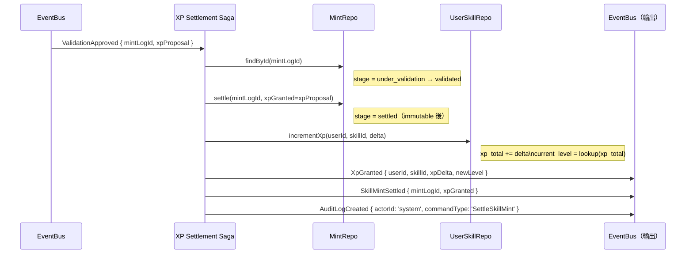

**補償（Compensation）**：
- `settle()` 寫入失敗 → 重試最多 3 次（指數退避）；超出 → 寫入 DLQ，發出 `SettlementFailed` alert。
- **不可 Rollback**：`skill_mint_log` 一旦進入 `validated` 即視為 soft-committed；`settle` 失敗需人工介入（不刪除記錄）。

---

### Saga 2：FeedProjection 管線（Feed Projection Pipeline）

**觸發器**：`PostPublished` event

**步驟**：

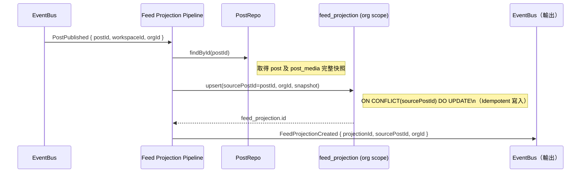

**不變式**：
- **只有此管線**可寫 `feed_projection`（ADR-0003）。
- 每個 `postId` 最多一個有效 `feed_projection`（upsert on `source_post_id`）。
- `PostArchived` 事件：管線更新 `feed_projection.is_hidden = true`（不刪除）。

---

### Saga 3：通知管線（Notification Pipeline）

**觸發器**：`AssignmentCreated`、`AssignmentConfirmed`、`TaskBlocked`、`XpGranted`、`ValidationRejected` 等

**步驟（以 AssignmentCreated 為例）**：

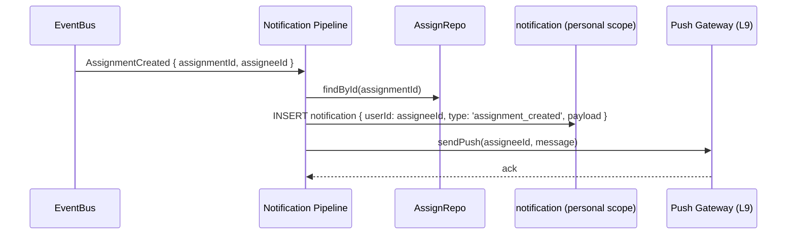

**不變式**：
- `notification` 為 personal scope，只有目標 `userId` 可讀取。
- Push 失敗不影響主流程；通知已寫入 DB，用戶可從 inbox 查看。

---

## 四、Application Service 層邊界規則

| 規則 | 說明 |
|-----|-----|
| **無 DB 直接存取** | Application Service 只透過 Repository 介面操作，不直接查詢 DB |
| **無 Domain Logic** | Application Service 只呼叫 Aggregate 方法；業務 invariant 在 Aggregate 中 |
| **無 Infrastructure 依賴** | Application Service 只依賴 Interface（Repository / EventBus / Guard interface）；實作在 L9 |
| **單一入口點** | 每個 Command 只有一個 Handler；不允許多個 Handler 監聽同一 Command |
| **Saga 為獨立協調者** | Saga 不是 Command Handler；Saga 透過 EventBus 事件驅動，不直接呼叫 Application Service |

---

## 五、Guard 執行順序保證

```
Command 進入 → ScopeGuard → IdempotencyGuard → LoadAggregate
                                                    → OptimisticLockGuard
                                                    → BusinessGuard（DFS / Availability / Threshold）
                                                    → aggregate.handle()
                                                    → save() + eventBus.publishAll()
```

**BusinessGuard 只套用於特定 Command**：

| Guard | 套用 Command |
|-------|------------|
| DFSCycleGuard | `AddDependencyCommand` |
| AvailabilityConflictGuard | `CreateAssignmentCommand` |
| ThresholdGuard | `CreateAssignmentCommand`（若 task 有 skill requirement）|
````

## File: docs/architecture/guidelines/infrastructure-spec.md
````markdown
# L9 基礎設施規格 — Infrastructure Specification

> **層級定位**：本文件定義 L9 基礎設施層的所有 Adapter、Repository 模式、EventBus 規格，以及 IdempotencyStore 和 OptimisticLock 的實作細節。
> 來源：[ADR-0001 基礎設施層命名決策](../adr/ADR-0001-bottom-layer-naming-infrastructure-vs-atomic.md)、[L5 Guards SB51-SB53](../use-cases/use-case-diagram-sub-behavior.md)、[L8 Application Service Spec](../blueprints/application-service-spec.md)

---

## 一、層結構

```
L9 基礎設施層
  ├── Repository 層（DB Adapters）
  │     ├── TaskItemRepository（Postgres）
  │     ├── PostRepository（Postgres）
  │     ├── ScheduleItemRepository（Postgres）
  │     ├── UserSkillRepository（Postgres）
  │     └── FeedProjectionRepository（Postgres read model）
  │
  ├── EventBus（事件匯流排）
  │     ├── LocalEventBus（dev/test）
  │     └── KafkaAdapter / SQS Adapter（production）
  │
  ├── IdempotencyStore
  │     └── RedisIdempotencyStore
  │
  ├── StorageAdapter
  │     └── S3 / GCS Adapter（post_media uploads）
  │
  └── External Adapters
        ├── NotificationGateway（Push / Email）
        └── AiServiceAdapter（skill matching suggestion）
```

---

## 二、Repository 介面規格

### 通用 Repository 介面

```typescript
/**
 * L9 Repository 基礎介面
 * 所有 Aggregate Repository 必須實作
 */
interface AggregateRepository<T extends AggregateRoot, ID = string> {
  findById(id: ID): Promise<T | null>;
  save(aggregate: T): Promise<void>;  // 包含 version++ 和 events 收集
  findByWorkspaceId(workspaceId: string, opts?: QueryOptions): Promise<T[]>;
}
```

### TaskItemRepository

```typescript
interface TaskItemRepository extends AggregateRepository<TaskItem> {
  /** WBS 樹查詢：取得節點及所有子孫 */
  findTreeByRootId(rootId: string): Promise<TaskItem[]>;

  /** 依賴 DAG 查詢：取得直接依賴的 task ids（for DFS use） */
  findDependencies(taskId: string): Promise<string[]>;

  /** 批次儲存（CopyTaskTree Saga 使用） */
  saveAll(tasks: TaskItem[]): Promise<void>;
}
```

### PostRepository

```typescript
interface PostRepository extends AggregateRepository<Post> {
  findByWorkspaceId(workspaceId: string, opts?: QueryOptions): Promise<Post[]>;
  findByOrgId(orgId: string, opts?: QueryOptions): Promise<Post[]>;
}
```

### UserSkillRepository

```typescript
interface UserSkillRepository extends AggregateRepository<UserSkill> {
  findByUserAndSkill(userId: string, skillId: string): Promise<UserSkill | null>;
  findAllByUserId(userId: string): Promise<UserSkill[]>;
  findSkillMintLogById(mintLogId: string): Promise<SkillMintLog | null>;
}
```

### FeedProjectionRepository（Read Model — 非標準 Aggregate Repo）

```typescript
/** 
 * feed_projection 為 read model，不遵循 AggregateRepository 模式。
 * 只有 FeedProjectionPipeline (L8 Saga) 可呼叫 upsert。
 * Query 端分開定義。
 */
interface FeedProjectionRepository {
  /** Idempotent 寫入（ON CONFLICT source_post_id DO UPDATE）*/
  upsert(projection: FeedProjection): Promise<void>;
  /** 隱藏投影（PostArchived 時呼叫）*/
  hide(sourcePostId: string): Promise<void>;
  /** 查詢 org 動態 */
  findByOrgId(orgId: string, cursor?: string, limit?: number): Promise<FeedProjection[]>;
}
```

---

## 三、EventBus 規格

### EventBus 介面

```typescript
interface EventBus {
  /** 發布單一事件 */
  publish<E extends DomainEvent>(event: E): Promise<void>;
  /** 批次發布（原子性，all-or-nothing） */
  publishAll<E extends DomainEvent>(events: E[]): Promise<void>;
  /** 訂閱事件（Saga / Pipeline 使用） */
  subscribe<E extends DomainEvent>(
    eventType: string,
    handler: (event: E) => Promise<void>
  ): void;
}
```

### 事件信封規格（Event Envelope）

```typescript
interface DomainEvent {
  readonly eventId: string;      // UUID（用於去重）
  readonly eventType: string;    // e.g. 'TaskCompleted'
  readonly aggregateId: string;
  readonly aggregateType: string;
  readonly occurredAt: string;   // ISO8601
  readonly payload: Record<string, unknown>;
  readonly metadata: {
    actorId: string;
    workspaceId?: string;
    orgId?: string;
    correlationId: string;       // 關聯 Saga 追蹤
    causationId?: string;        // 引發此事件的前一個事件 ID
  };
}
```

### DLQ（Dead Letter Queue）規則

| 情境 | 處理方式 |
|-----|---------|
| Handler 拋出可恢復錯誤 | 指數退避重試 3 次（1s / 4s / 9s） |
| 3 次重試後仍失敗 | 寫入 DLQ；發出 `alert.dlq_message` 系統告警 |
| DLQ 訊息無效（schema 不符）| 直接丟棄並記錄 `warn` 日誌 |
| 幂等事件重複送達 | 使用 `eventId` 去重；Handler 冪等必須保證 |

---

## 四、IdempotencyStore 規格（SB52）

### 介面

```typescript
interface IdempotencyStore {
  /**
   * 嘗試取得現有結果或加鎖
   * @returns null 代表鎖成功（尚無快取）；non-null 代表已有快取結果
   */
  checkAndLock(key: string, ttlSeconds?: number): Promise<unknown | null>;

  /** 儲存最終結果（成功後呼叫） */
  setResult(key: string, result: unknown, ttlSeconds?: number): Promise<void>;

  /** 解除鎖定（異常時呼叫） */
  releaseLock(key: string): Promise<void>;
}
```

### Redis 實作要點

```
key 格式：    idempotency:{commandType}:{idempotencyKey}
lock TTL：   30 秒（防止死鎖）
result TTL： 24 小時（客戶端可在此期間重送）

Lock 用 SET NX EX 原子指令
Result 用 SET XX PX（只覆蓋已存在的鎖）
```

---

## 五、OptimisticLock 規格（SB53）

### DB 層實作

```sql
-- save() 時的更新語句
UPDATE resource_items
SET    status = :status,
       extension_fields = :fields,
       version = version + 1,
       updated_at = NOW()
WHERE  id = :id
  AND  version = :expectedVersion;   -- 樂觀鎖條件

-- 影響行數 = 0 → 拋出 OptimisticLockException
```

### 例外層級

```typescript
class OptimisticLockException extends Error {
  readonly httpStatus = 409;
  readonly code = 'OPTIMISTIC_LOCK_CONFLICT';
  constructor(aggregateId: string, expected: number, actual: number) {
    super(`Optimistic lock conflict on ${aggregateId}: expected v${expected}, found v${actual}`);
  }
}
```

**客戶端重試策略**：收到 HTTP 409 後，重新 GET 最新版本，再次提交 Command（帶最新 version）。

---

## 六、StorageAdapter 規格（PostMedia 上傳）

```typescript
interface StorageAdapter {
  /**
   * 上傳媒體檔案
   * @returns 永久可存取 URL（CDN 路徑）
   */
  upload(file: Buffer, contentType: string, path: string): Promise<string>;

  /** 刪除媒體（post_media cascade 刪除時呼叫）*/
  delete(url: string): Promise<void>;

  /**
   * 產生短期預簽名 URL（前端直接上傳，不透過 API Server）
   * TTL: 15 分鐘
   */
  presignUploadUrl(path: string, contentType: string): Promise<string>;
}
```

### 安全注意事項

- 禁止 client 直接存取儲存 bucket URL；一律透過 CDN 或 presigned URL。
- `path` 格式：`{orgId}/{workspaceId}/post_media/{uuid}.{ext}`，防止路徑遍歷。
- MIME type 白名單：`image/jpeg`, `image/png`, `image/webp`, `video/mp4`, `application/pdf`。

---

## 七、ExternalAdapter 規格

### NotificationGateway

```typescript
interface NotificationGateway {
  /** 發送推播（FCM / APNs） */
  sendPush(userId: string, title: string, body: string, data?: Record<string, string>): Promise<void>;
  /** 發送 Email（Transactional） */
  sendEmail(to: string, templateId: string, variables: Record<string, string>): Promise<void>;
}
```

### AiServiceAdapter（技能門檻建議）

```typescript
interface AiServiceAdapter {
  /**
   * 建議 task 的技能需求與門檻等級
   * 在 CreateTaskItemCommand 後非同步呼叫（不阻塞主流程）
   */
  suggestSkillRequirements(taskDescription: string, orgId: string): Promise<SkillSuggestion[]>;
}
```

> **邊界規則**：AiServiceAdapter 是純外部呼叫，不寫入 Domain 狀態；結果作為建議顯示給用戶，用戶需明確執行 Command 才會生效。

---

## 八、基礎設施層依賴方向

```
L8 Application Service / Saga
  │
  │  ← 依賴介面（Repository, EventBus, Guard, StorageAdapter）
  │
L9 Infrastructure
  ├── PostgresTaskItemRepository implements TaskItemRepository
  ├── PostgresPostRepository implements PostRepository
  ├── PostgresUserSkillRepository implements UserSkillRepository
  ├── PostgresFeedProjectionRepository implements FeedProjectionRepository
  ├── KafkaEventBus implements EventBus
  ├── RedisIdempotencyStore implements IdempotencyStore
  ├── S3StorageAdapter implements StorageAdapter
  ├── FCMNotificationGateway implements NotificationGateway
  └── OpenAIAiServiceAdapter implements AiServiceAdapter
```

> L8 只知道介面；L9 只知道實作細節。這是 Hexagonal Architecture（Ports & Adapters）的核心原則。
````

## File: docs/architecture/models/domain-model.md
````markdown
# L6 領域模型 — Xuanwu Domain Model

> **層級定位**：本文件定義聚合根邊界、實體與值物件、領域 invariant，以及跨聚合事件橋。
> 上層輸入來源：[L4 Sub-Resource](../use-cases/use-case-diagram-sub-resource.md)、[L5 Sub-Behavior](../use-cases/use-case-diagram-sub-behavior.md)。
> 下層輸出至：[L7 Contract Spec](../specs/contract-spec.md)。

---

## 邊界驗證前置確認

| 層 | 文件 | 狀態 |
|----|------|------|
| L4 | `use-case-diagram-sub-resource.md` | ✅ 通過（SR01–SR54） |
| L5 | `use-case-diagram-sub-behavior.md` | ✅ 通過（SB01–SB54） |
| **L6** | `domain-model.md`（本文件） | 📝 定義中 |

---

## 資料模型基礎（三表設計）

```
resource_types      ← 型別定義（code / name / required_fields / validation_rules / state_machine_id）
resource_items      ← 所有資源實例（id / type / sub_type / workspaceId / orgId / parent_id / status / version）
resource_relations  ← 資源關聯/依賴邊（from_id / to_id / relation_type / created_by）
```

> 設計依據：[ADR-0002 WBS as Resource Model](../adr/ADR-0002-wbs-as-resource-model.md)

---

## 聚合根邊界（4 個 Aggregate）

### Aggregate 1：TaskItem（工作區資源 + WBS 樹）

**聚合根**：`task_item`（resource_items where type = 'task_item'）

```
TaskItem（Aggregate Root）
  ├── sub_type: epic | feature | story | task | subtask   ← discriminator
  ├── workspaceId（scope key，不可為 null）
  ├── parent_id → TaskItem（self-reference，nullable for root）
  ├── assignee_id（業務 owner）
  ├── status: draft | ready | in_progress | blocked | review | done | archived | cancelled
  ├── version（樂觀鎖）
  │
  ├── [Entity] TaskSkillRequirement（task_skill_requirement）
  │     ├── skill_id → Skill（org aggregate）
  │     ├── required_level: 1-7
  │     └── business_owner_id
  │
  └── [Read-only Association] MatchingResult（matching_result）
        ├── user_id
        ├── skill_id
        ├── threshold_passed: boolean
        └── source: system | manual
```

**Invariants**：
- `sub_type` 層級只能向下包含（epic > feature > story/task > subtask），禁止循環
- 刪除策略：`subtask` cascade；`epic/feature/story/task` 需 forbidden（有子項目時）
- 依賴關係（`resource_relations`）不可形成有向環（DFS 守衛：SB14）

---

### Aggregate 2：Post（工作區貼文）

**聚合根**：`post`（resource_items where type = 'post'）

```
Post（Aggregate Root）
  ├── workspaceId（scope key）
  ├── business_owner_id（業務 owner）
  ├── status: draft | published | archived
  ├── version（樂觀鎖）
  │
  └── [Entity] PostMedia（post_media）
        ├── media_type: image | video | file
        ├── url（儲存路徑，L9 Storage Adapter 提供）
        ├── sort_order: int
        └── business_owner_id

[Read Model - 非聚合內部] FeedProjection（feed_projection）
  ├── orgId（scope key，事件管線寫入）
  ├── source_post_id → Post
  └── feed_content（denormalized snapshot）
```

**Invariants**：
- `FeedProjection` 不屬於 Post 聚合內部，只由事件管線（SB22）寫入，禁止 Command 直接修改（ADR-0003）。
- `published` 狀態的 Post 觸發 `PostPublished` 事件，事件管線負責建立 `FeedProjection`。

---

### Aggregate 3：Assignment（排程 + 指派）

**聚合根**：`schedule_item`（resource_items where type = 'schedule_item'）

```
ScheduleItem（Aggregate Root）
  ├── workspaceId（scope key）
  ├── business_owner_id
  ├── start_time / end_time
  ├── status: pending | confirmed | in_execution | completed | cancelled
  ├── version（樂觀鎖）
  │
  └── [Entity] AssignmentRecord（assignment_record）
        ├── assignee_id（雙層 owner 之業務 owner）
        ├── workspaceId（繼承自 ScheduleItem）
        └── status: pending | confirmed | in_execution | completed | cancelled

[Shared Entity - org scope] AvailabilitySlot（availability_slot）
  ├── orgId（scope key）
  ├── assignee_id
  ├── start_time / end_time
  └── is_deleted（soft-delete）
```

**Invariants**：
- 建立 `AssignmentRecord` 前必須通過 `AvailabilitySlot` 無衝突驗證（L5 SB34）。
- 若有 `TaskSkillRequirement`，`matching_result.threshold_passed` 必須為 `true`（L5 SB35）。
- `AvailabilitySlot` 為 org scope，跨工作區共享，不屬於任何單一 `ScheduleItem` 聚合。

---

### Aggregate 4：SkillAsset（用戶技能資產）

**聚合根**：`user_skill`（個人 scope aggregate，屬 personal/user context）

```
UserSkill（Aggregate Root）
  ├── user_id（personal scope key）
  ├── skill_id → Skill（org aggregate，參照）
  ├── xp_total: int
  ├── current_level: 1-7（由 xp_total 推導，不可直接設定）
  ├── version（樂觀鎖）
  │
  └── [Immutable Log] SkillMintLog（skill_mint_log）
        ├── task_id → TaskItem
        ├── skill_id
        ├── mint_stage: declared | practicing | under_validation | validated | settled
        ├── xp_granted: int（settled 後不可為 null）
        └── created_at（immutable timestamp）
```

**Invariants**：
- `SkillMintLog` 狀態為 `settled` 後不可修改（ADR-0004）。
- `xp_total` 只能從已 `settled` 的 `SkillMintLog.xp_granted` 累加，不可直接設定。
- `current_level` 由 `xp_total` 對照等級表推導；等級表為唯讀系統配置。

---

### 支援實體（非聚合根）

```
Skill（技能字典，org scope）
  ├── code: string（唯一）
  ├── name: string
  └── orgId

ResourceType（型別定義）
  ├── code: string（唯一系統常數）
  ├── name: string
  ├── required_fields: string[]
  ├── validation_rules: json
  └── state_machine_id: string
```

---

## ER 圖（核心表）

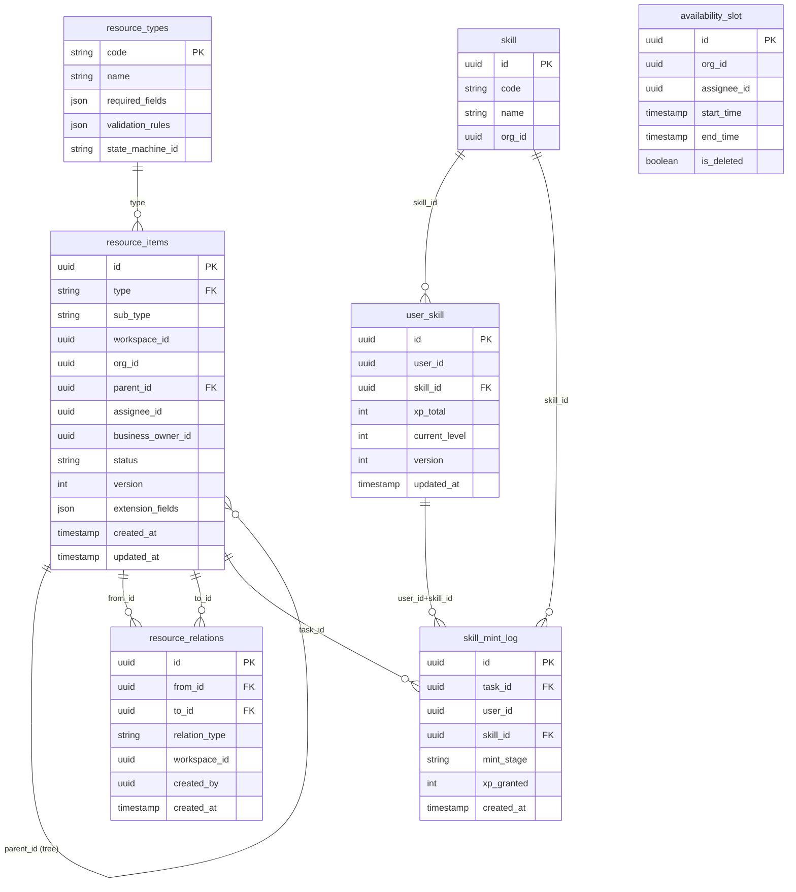

---

## 跨聚合事件橋

| 觸發事件（來源聚合）| 目標效果 | 處理層 |
|-------------------|---------|-------|
| `TaskCompleted`（TaskItem）| 觸發 XP 結算判斷（若有 SkillMintLog 在 validated 狀態）| L8 Settlement Saga |
| `PostPublished`（Post）| 觸發 FeedProjection 建立（SB22）| L8 事件管線 |
| `ValidationApproved`（SkillAsset）| 觸發 Settlement 寫入 SkillMintLog + 更新 UserSkill XP | L8 Settlement Saga |
| `AssignmentConfirmed`（Assignment）| 通知 MemberAssigned（通知管線）| L8 事件管線 |
| `CyclicDependencyDetected`（TaskItem dep 守衛）| 阻擋 AddDependency Command；觸發 AI 背景掃描告警 | L5 Guard（不入聚合）|

---

## XP 等級對照表（系統常數）

| Level | 名稱 | xp_total 下界（inclusive）| xp_total 上界（inclusive）|
|-------|------|--------------------------|--------------------------|
| 1 | Apprentice（學徒） | 0 | 74 |
| 2 | Journeyman（熟練） | 75 | 149 |
| 3 | Expert（專家） | 150 | 224 |
| 4 | Artisan（大師） | 225 | 299 |
| 5 | Grandmaster（宗師） | 300 | 374 |
| 6 | Legendary（傳奇） | 375 | 449 |
| 7 | Titan（泰坦） | 450 | 524 |

> XP 上限 524 是當前設計上界；達到後 `current_level` 保持 7（Titan），`xp_total` 繼續累積用於未來等級擴展。
````

## File: docs/architecture/use-cases/use-case-diagram-saas-basic.md
````markdown
# Xuanwu SaaS Use Case Diagram — 開放組織結構模型

> 採用 GitHub 式開放結構：**User 是唯一基礎 Actor，角色（OrgOwner / OrgMember）是情境派生，非靜態職稱。**
> 同一用戶可建立多個組織、同時身為多個組織的不同角色，並透過「切換情境」在 Personal ↔ 組織間自由切換。

## Actor 說明

| Actor | 類型 | 說明 |
|-------|------|------|
| **訪客** (Guest) | 基礎 Actor | 尚未登入，僅能執行公開操作 |
| **用戶** (User) | 基礎 Actor | 所有登入帳號的根 Actor；可同時擁有個人帳號與多個組織情境 |
| **組織擁有者** (OrgOwner) | 情境角色 | User 執行「建立組織」後在該組織內升格的角色，可管理多個組織 |
| **組織成員** (OrgMember) | 情境角色 | User 接受邀請後在特定組織內的協作角色 |
| **平台管理員** (PlatformAdmin) | 運營 Actor | SaaS 平台維運方，與業務角色完全分離 |
| **AI 系統** (AI System) | 系統 Actor | 自動化後台，虛線代表系統觸發而非用戶手動操作 |

> **情境角色說明**：OrgOwner 與 OrgMember 為同一個 User 在不同組織情境下的身份，不是獨立人物。
> 一個 User 可以同時是組織 A 的 OrgOwner、組織 B 的 OrgMember。

## Use Case 邊界

| 邊界 | 涵蓋 UC |
|------|---------|
| 🔐 身份驗證 | 註冊、登入（Email / OAuth）、登出、重設密碼、MFA |
| 👤 個人帳號 | 個人工作區、**建立組織**、**切換情境**、查看組織清單、個人訂閱 |
| 🏢 組織管理（Org Owner） | 設定組織、邀請成員、設定成員角色、移轉擁有權、帳單、刪除組織 |
| 👥 組織協作（Org Member） | 存取共用資源、在組織內建立工作區、離開組織 |
| ⚡ 核心功能 | 儀表板、資料管理、搜尋篩選、匯出、通知（資料依當前情境 scope 隔離） |
| 🖼️ 組織交流牆 | 組織瀑布流瀏覽、聚合所有工作區 PO |
| 🗓️ 組織排程協作 | 跨工作區排程總覽、組織指派成員 |
| 🧩 技能與資格 | 技能字典治理、採認用戶技能資產、任務技能門檻 |
| 🤖 AI 功能 | 智慧建議、語音轉文字、自動完成 |
| 🛡️ 平台管理後台 | 用戶管理、系統日誌、全站設定、使用量監控 |

## Diagram

```mermaid
graph LR
    classDef actor fill:#dbeafe,stroke:#3b82f6,color:#1e40af,font-weight:bold
    classDef roleActor fill:#dcfce7,stroke:#16a34a,color:#14532d,font-weight:bold
    classDef adminActor fill:#fef3c7,stroke:#f59e0b,color:#92400e,font-weight:bold
    classDef systemActor fill:#f3e8ff,stroke:#a855f7,color:#6b21a8,font-weight:bold
    classDef usecase fill:#f0fdf4,stroke:#22c55e,color:#166534

    Guest((訪客)):::actor
    User((用戶)):::actor
    OrgOwner((組織擁有者)):::roleActor
    OrgMember((組織成員)):::roleActor
    PlatformAdmin((平台管理員)):::adminActor
    AI((AI 系統)):::systemActor

    User -. 建立組織後升格 .-> OrgOwner
    User -. 接受邀請後加入 .-> OrgMember

    subgraph platform["🏢 Xuanwu SaaS 平台邊界"]
        subgraph auth["🔐 身份驗證"]
            UC1([註冊帳號]):::usecase
            UC2([電子郵件登入]):::usecase
            UC3([OAuth 社群登入]):::usecase
            UC4([登出]):::usecase
            UC5([重設密碼]):::usecase
            UC6([多因子驗證 MFA]):::usecase
        end
        subgraph personal["👤 個人帳號"]
            UC7([查看個人工作區]):::usecase
            UC8([建立組織]):::usecase
            UC9([切換情境 Personal ↔ 組織]):::usecase
            UC10([查看我的組織清單]):::usecase
            UC11([管理個人訂閱]):::usecase
        end
        subgraph orgManage["🏢 組織管理 — Org Owner 視角"]
            UC12([設定組織資訊]):::usecase
            UC13([邀請成員加入組織]):::usecase
            UC14([設定成員角色]):::usecase
            UC15([移轉組織擁有權]):::usecase
            UC16([管理組織訂閱帳單]):::usecase
            UC17([刪除組織]):::usecase
        end
        subgraph orgCollab["👥 組織協作 — Org Member 視角"]
            UC18([存取組織共用資源]):::usecase
            UC19([在組織內建立工作區]):::usecase
            UC20([離開組織]):::usecase
        end
        subgraph core["⚡ 核心功能（依情境 scope 隔離）"]
            UC21([查看儀表板]):::usecase
            UC22([管理資料]):::usecase
            UC23([搜尋與篩選]):::usecase
            UC24([匯出資料]):::usecase
            UC25([接收通知]):::usecase
        end
        subgraph social["🖼️ 組織交流牆"]
            UC33([組織瀑布流瀏覽]):::usecase
            UC34([聚合所有工作區 PO]):::usecase
        end
        subgraph planning["🗓️ 組織排程協作"]
            UC35([跨工作區排程總覽]):::usecase
            UC36([組織指派成員]):::usecase
        end
        subgraph qualification["🧩 技能與資格"]
            UC37([管理技能字典]):::usecase
            UC38([採認用戶技能資產]):::usecase
            UC39([管理任務技能門檻]):::usecase
        end
        subgraph ai["🤖 AI 功能"]
            UC26([AI 智慧建議]):::usecase
            UC27([語音輸入轉文字]):::usecase
            UC28([自動完成]):::usecase
        end
        subgraph adminPanel["🛡️ 平台管理後台"]
            UC29([管理所有用戶]):::usecase
            UC30([查看系統日誌]):::usecase
            UC31([系統設定]):::usecase
            UC32([監控平台使用量]):::usecase
        end
    end

    Guest --> UC1
    Guest --> UC2
    Guest --> UC3

    User --> UC2
    User --> UC3
    User --> UC4
    User --> UC5
    User --> UC6
    User --> UC7
    User --> UC8
    User --> UC9
    User --> UC10
    User --> UC11
    User --> UC21
    User --> UC22
    User --> UC23
    User --> UC24
    User --> UC25
    User --> UC26
    User --> UC27
    User --> UC28

    OrgOwner --> UC9
    OrgOwner --> UC12
    OrgOwner --> UC13
    OrgOwner --> UC14
    OrgOwner --> UC15
    OrgOwner --> UC16
    OrgOwner --> UC17
    OrgOwner --> UC21
    OrgOwner --> UC33
    OrgOwner --> UC34
    OrgOwner --> UC35
    OrgOwner --> UC36
    OrgOwner --> UC37
    OrgOwner --> UC38
    OrgOwner --> UC39

    OrgMember --> UC9
    OrgMember --> UC18
    OrgMember --> UC19
    OrgMember --> UC20
    OrgMember --> UC21
    OrgMember --> UC33
    OrgMember --> UC34
    OrgMember --> UC35

    PlatformAdmin --> UC21
    PlatformAdmin --> UC29
    PlatformAdmin --> UC30
    PlatformAdmin --> UC31
    PlatformAdmin --> UC32

    AI -.-> UC26
    AI -.-> UC27
    AI -.-> UC28
    AI -.-> UC32
    AI -.-> UC34
```

## 設計備註

- **實線 (`-->`)** = Actor 主動觸發的 Use Case
- **虛線 Actor→Actor (`-. label .->`)** = 同一 User 在特定操作後取得的情境角色關係
- **虛線 AI→UC (`-.->`)** = 系統自動驅動，不需用戶手動觸發
- **UC9 切換情境** 是核心 UC：切換後所有後續查詢自動套用對應 `activeContext: { type: 'personal' | 'org', id }` scope，禁止跨 scope 資料洩漏。
- **UC8 建立組織** 觸發後，系統自動賦予該 User 在新組織內的 `owner` 角色記錄（非前端狀態）。
- **UC34 聚合所有工作區 PO**：定義為讀模型聚合能力，使用者可查看結果，但聚合流程由系統事件管線觸發（AI/System 虛線）。
- **訂閱 gating**：`UC22 管理資料`、`UC24 匯出資料`、`UC26 AI 智慧建議` 依方案開關，邏輯置於 feature slice 的 `guards.ts`。
- **多租戶隔離**：所有 `platform` 邊界內的資料讀寫必須攜帶 `orgId` 或 `personalId` scope，禁止跨組織查詢。
- **OrgOwner 可管理多個組織**：無上限，與 GitHub Organizations 設計一致。
- **Team/Partner 放位**：`Team` 為 Organization 層治理/分組語意；`Partner` 為 Workspace 邀請語意，不在 L1 直接操作資源，需下沉到 L2 ACL 實作。
- **技能資產屬於用戶**：組織只治理 `skill` 字典與採認政策，不擁有技能本體；技能最終沉澱於 `user_skill`，使用者離開組織後仍保有能力資產。
- **技能＝任務門檻 + 鑄造來源**：在組織層先治理 `skill` 字典與採認規則，再由工作區任務設定 `required_skills` 作為排程與指派前的資格門檻；任務完成後經驗證通過，才能把 XP 與等級鑄造回 `user_skill`。

## 增量設計（功能 1 / 2）

| 功能 | L1 放位（組織層） | 對應文件 |
|---|---|---|
| 1. 組織<->工作區照片牆 | `F1-L1-1 組織瀑布流瀏覽`、`F1-L1-2 聚合所有工作區PO` | `docs/architecture/specs/org-workspace-feed-architecture.md` |
| 2. 工作區排程 + 組織指派 | `F2-L1-1 跨工作區排程總覽`、`F2-L1-2 組織指派成員` | `docs/architecture/specs/scheduling-assignment-architecture.md` |
````

## File: docs/architecture/use-cases/use-case-diagram-sub-behavior.md
````markdown
# Xuanwu 子行為層 Use Case / State Diagram — L5 Sub-Behavior Boundary

> **層級定位**：本文件為子資源層（L4）的下一層，定義每個子資源上的**原子行為（Atomic Behavior）**：
> precondition / postcondition、狀態機轉換、補償路徑、audit log 觸發點，以及 L8 Command 對應。
> 上層對應：[use-case-diagram-sub-resource.md](./use-case-diagram-sub-resource.md)（L4）。

---

## 邊界驗證前置確認

| 層 | 文件 | 狀態 |
|----|------|------|
| L1 | `use-case-diagram-saas-basic.md` | ✅ 通過 |
| L2 | `use-case-diagram-workspace.md` | ✅ 通過 |
| L3 | `use-case-diagram-resource.md` | ✅ 通過 |
| L4 | `use-case-diagram-sub-resource.md` | ✅ 通過 |
| **L5** | `use-case-diagram-sub-behavior.md`（本文件） | 📝 定義中 |

---

## 架構層級定位

```
Platform SaaS 邊界
└── Personal / Organization                          ← L1
    └── Workspace                                    ← L2
        └── Resource / Item (R1–R53)                ← L3
            └── Sub-Resource (SR01–SR54)            ← L4
                └── Sub-Behavior（本層）             ← L5
                    ├── WBS 狀態機（task_item 生命週期）
                    ├── 依賴循環偵測行為（DFS CycleCheck）
                    ├── 貼文發布流行為（post lifecycle）
                    ├── 指派前置行為（availability + threshold check）
                    ├── 技能鑄造四階段狀態機（Declaration→Settlement）
                    └── 通用子行為（audit log、冪等守衛、scope 邊界守衛）
```

---

## 原子行為設計準則

1. **每個原子行為 = 一個 Command Handler 或 Guard 函數的邊界**：不含業務編排邏輯，只含前置驗證 + 單一操作 + 事件發布。
2. **Precondition 在 L8 Command Handler 入口強制執行**；失敗直接返回錯誤事件，不進入聚合。
3. **Postcondition 以領域事件表達**；所有狀態轉換必須有對應的 `*Changed` 或 `*Occurred` 事件。
4. **所有狀態轉換產生 `AuditLogCreated` 事件**；寫入 audit log 為跨 domain 不可省略的副作用。
5. **Compensating action（補償）在 L8 Saga 內處理**；L5 只定義補償的觸發條件（precondition 失敗事件）。

---

## 狀態機定義

### 1. task_item 生命週期狀態機

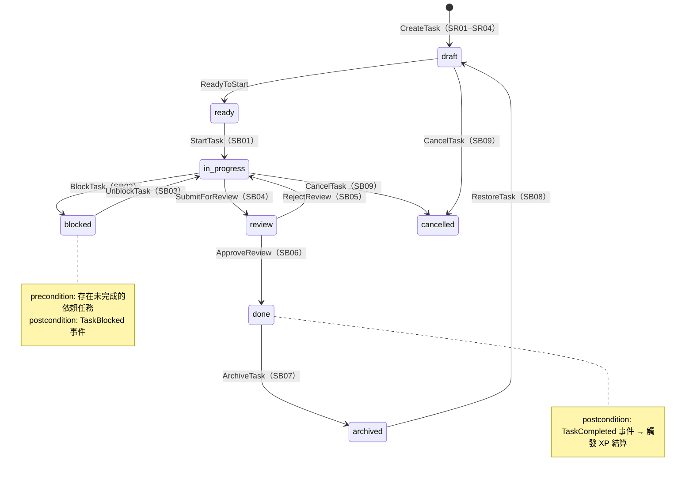

### 2. 技能鑄造四階段狀態機（skill_mint_log）

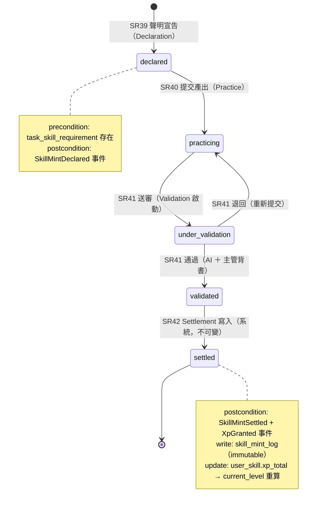

### 3. post 發布生命週期狀態機

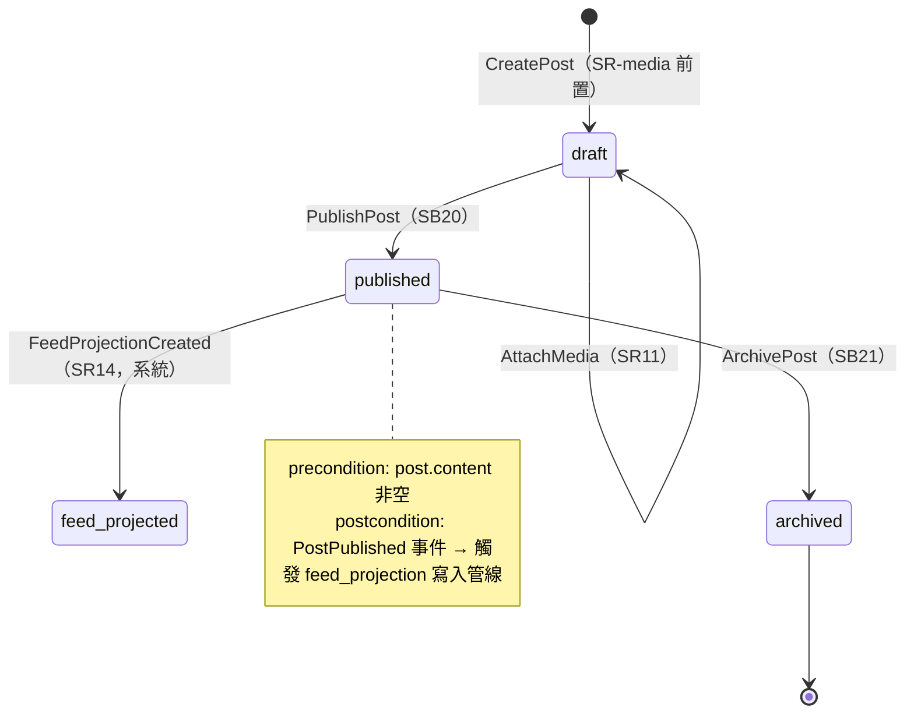

### 4. assignment_record 指派狀態機

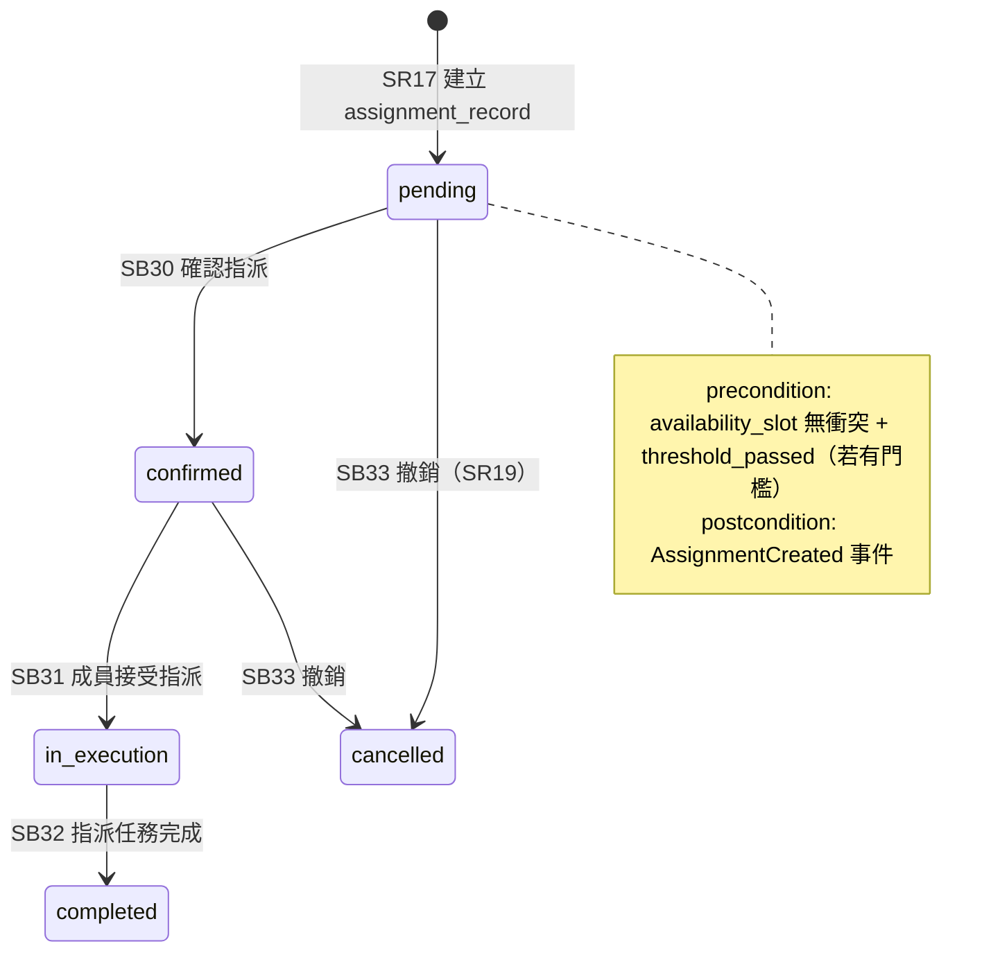

---

## 原子行為清單（SB01–SB46）

### ⚙️ WBS 任務生命週期行為（SB01–SB12）

| SB | 行為名稱 | L8 Command | precondition | postcondition（事件） | 補償觸發 |
|----|---------|-----------|-------------|---------------------|---------|
| SB01 | 開始任務 | `StartTaskCommand` | 状態為 ready；無未解除的 blocked 依賴 | `TaskStarted` | — |
| SB02 | 封鎖任務 | `BlockTaskCommand` | 狀態為 in_progress；依賴任務未完成 | `TaskBlocked` | — |
| SB03 | 解除封鎖 | `UnblockTaskCommand` | 狀態為 blocked；所有依賴任務已完成 | `TaskUnblocked` | — |
| SB04 | 提交審核 | `SubmitTaskReviewCommand` | 狀態為 in_progress；完成度 ≥ threshold | `TaskSubmittedForReview` | — |
| SB05 | 拒絕審核（退回） | `RejectTaskReviewCommand` | 狀態為 review；reviewer 有授權 | `TaskReviewRejected` | — |
| SB06 | 批准完成 | `ApproveTaskCommand` | 狀態為 review；reviewer 有授權 | `TaskCompleted` → 觸發 XP 結算判斷 | — |
| SB07 | 歸檔任務 | `ArchiveTaskCommand` | 狀態為 done | `TaskArchived` | — |
| SB08 | 還原歸檔 | `RestoreTaskCommand` | 狀態為 archived | `TaskRestored` | — |
| SB09 | 取消任務 | `CancelTaskCommand` | 狀態為 draft 或 in_progress；無進行中的子任務 | `TaskCancelled` | cascade 子任務取消 |
| SB10 | 設定父子關係 | `SetParentCommand` | 父節點存在且同 workspaceId；不形成循環 | `ParentSet` | — |
| SB11 | 移動任務層級 | `MoveTaskLevelCommand` | 目標 parent 允許此 sub_type | `TaskMoved` | — |
| SB12 | 複製任務子樹 | `CopyTaskTreeCommand` | 目標 parent 存在；複製深度 ≤ 5 | `TaskTreeCopied` | 失敗 → 刪除部分複製（補償） |

### 🔗 依賴循環偵測行為（SB13–SB15）

| SB | 行為名稱 | L8 Command / Guard | precondition | postcondition（事件） | 補償觸發 |
|----|---------|-------------------|-------------|---------------------|---------|
| SB13 | 新增依賴（帶循環前置守衛） | `AddDependencyCommand` | 邊不存在；DFS 偵測通過 | `DependencyAdded` | — |
| SB14 | 循環依賴偵測（DFS 守衛） | Guard（SB13 precondition） | from_id ≠ to_id；DFS 無環 | 偵測失敗 → `CyclicDependencyDetected` | 阻擋 SB13；AI 背景掃描觸發 |
| SB15 | 移除依賴 | `RemoveDependencyCommand` | 依賴邊存在 | `DependencyRemoved` | — |

### 📎 貼文與 feed\_projection 行為（SB20–SB24）

| SB | 行為名稱 | L8 Command | precondition | postcondition（事件） | 補償觸發 |
|----|---------|-----------|-------------|---------------------|---------|
| SB20 | 發布貼文 | `PublishPostCommand` | 狀態為 draft；content 非空；workspaceId 必填 | `PostPublished` → 觸發 feed_projection 管線 | — |
| SB21 | 歸檔貼文 | `ArchivePostCommand` | 狀態為 published | `PostArchived` | cascade feed_projection soft-delete |
| SB22 | 寫入 feed\_projection（系統） | 事件管線觸發（非 Command） | `PostPublished` 事件收到；orgId 存在 | `FeedProjectionCreated` | 失敗 → 重試（冪等鍵） |
| SB23 | 附加媒體 | `AttachMediaCommand` | post 為 draft 或 published（未鎖定） | `MediaAttached` | — |
| SB24 | 移除媒體 | `RemoveMediaCommand` | post_media 存在；post 未鎖定 | `MediaRemoved` | — |

### 🗓️ 指派前置與確認行為（SB30–SB36）

| SB | 行為名稱 | L8 Command / Guard | precondition | postcondition（事件） | 補償觸發 |
|----|---------|-------------------|-------------|---------------------|---------|
| SB30 | 確認指派 | `ConfirmAssignmentCommand` | assignment_record 狀態為 pending；授權確認 | `AssignmentConfirmed` | — |
| SB31 | 接受指派（成員） | `AcceptAssignmentCommand` | 狀態為 confirmed；assignee 本人 | `AssignmentAccepted` | — |
| SB32 | 完成指派任務 | `CompleteAssignmentCommand` | 狀態為 in_execution + task_item 完成 | `AssignmentCompleted` | — |
| SB33 | 撤銷指派 | `RevokeAssignmentCommand` | 狀態為 pending 或 confirmed | `AssignmentRevoked` | — |
| SB34 | 可用時段衝突偵測（守衛） | Guard（SR17 precondition） | availability_slot 不與現有 assignment 重疊 | 衝突 → `AvailabilityConflictDetected` | 阻擋 SR17 |
| SB35 | 門檻前置守衛 | Guard（SR17 precondition） | matching_result.threshold_passed = true（若設門檻） | 未通過 → `ThresholdNotMet` | 阻擋 SR17；推薦 SR27 設定 |
| SB36 | 跨工作區指派協調（Saga 觸發） | Saga（SB30 後觸發） | OrgOwner 指派 + 目標工作區 workspaceId 確認 | `CrossWorkspaceAssignmentInitiated` | Saga 補償 → 回滾所有工作區 assignment_record |

### 🏅 技能鑄造原子行為（SB40–SB46）

| SB | 行為名稱 | L8 Command | precondition | postcondition（事件） | 補償觸發 |
|----|---------|-----------|-------------|---------------------|---------|
| SB40 | 宣告技能鑄造（Declaration） | `DeclareSkillMintCommand` | task_skill_requirement 存在；未有進行中的鑄造 | `SkillMintDeclared` | — |
| SB41 | 提交實作產出（Practice） | `SubmitPracticeCommand` | mint_log 狀態為 declared | `PracticeSubmitted` | — |
| SB42 | 送審驗證（Validation 啟動） | `StartValidationCommand` | mint_log 狀態為 practicing；產出非空 | `ValidationStarted` | — |
| SB43 | 通過驗證（AI + 主管） | `ApproveValidationCommand` | 狀態為 under_validation；AI review + WSAdmin 背書 | `ValidationApproved` | — |
| SB44 | 退回驗證 | `RejectValidationCommand` | 狀態為 under_validation | `ValidationRejected` | → 退回 practicing |
| SB45 | 技能結算寫入（Settlement，系統） | 事件管線觸發 | `ValidationApproved` 事件；skill_mint_log 尚未 settled | `SkillMintSettled` + `XpGranted` | Saga 補償 → 若 XP 寫入失敗則標記 pending_retry |
| SB46 | 重算 XP 等級（冪等修正） | `RecalculateXpCommand` | skill_mint_log 完整；操作者為系統或 OrgOwner | `XpRecalculated` | — |

### 📋 通用子行為（SB50–SB54）

| SB | 行為名稱 | 觸發時機 | postcondition |
|----|---------|---------|--------------|
| SB50 | Audit Log 寫入 | 所有 SB01–SB46 成功執行後 | `AuditLogCreated`（actor / action / resourceId / timestamp） |
| SB51 | Scope 邊界守衛 | 所有 Command Handler 入口 | 缺少 workspaceId / orgId → `ScopeViolationRejected` |
| SB52 | 冪等守衛 | 所有 Command Handler 入口 | 相同 idempotency-key → 直接返回前次結果，不重複寫入 |
| SB53 | 樂觀鎖衝突處理 | 任何 write Command | version 不匹配 → `OptimisticLockConflict`；前端 retry |
| SB54 | 軟刪除歸檔守衛 | 刪除類 Command | 若有子資源未 cascade → `ChildExistsPreventsDeletion` |

---

## 行為-Command 對應表（L5 → L8 介面）

| 行為 SB | 對應 L8 Command Type | 結果事件 | Saga 捲入？ |
|---------|---------------------|---------|-----------|
| SB01 | `StartTaskCommand` | `TaskStarted` | 否 |
| SB06 | `ApproveTaskCommand` | `TaskCompleted` | 條件 Saga（XP 結算） |
| SB12 | `CopyTaskTreeCommand` | `TaskTreeCopied` | 是（補償） |
| SB13 | `AddDependencyCommand` | `DependencyAdded` | 否 |
| SB14 | DFS Guard | `CyclicDependencyDetected` | 否（阻擋） |
| SB20 | `PublishPostCommand` | `PostPublished` | 是（feed_projection 管線） |
| SB22 | 事件管線 | `FeedProjectionCreated` | 是（retry 冪等） |
| SB34 | Availability Guard | `AvailabilityConflictDetected` | 否（阻擋） |
| SB36 | Saga 觸發 | `CrossWorkspaceAssignmentInitiated` | 是（跨 WS 補償） |
| SB45 | 事件管線 | `SkillMintSettled` + `XpGranted` | 是（XP 補償） |

---

## L5 邊界驗證項目

> 以下各項須在進入 L6（領域模型）設計前逐一確認。

- [ ] 所有 Command 均對應唯一的 precondition（無模糊守衛）
- [ ] `CyclicDependencyDetected`、`AvailabilityConflictDetected`、`ThresholdNotMet` 三個阻擋事件均有明確的上游處理路徑
- [ ] `AuditLogCreated` 涵蓋所有狀態轉換類 SB（SB01–SB46），無例外
- [ ] `feed_projection` 的寫入只由事件管線觸發（SB22），人工 Command 只能觸發 SB20（PublishPost）
- [ ] `skill_mint_log`（settled）為 immutable，任何 Command 不可修改已 settled 記錄；XP 修正只透過 SB46（RecalculateXp）
- [ ] 所有跨工作區 Saga 均有明確補償對稱（SB36, SB45）
- [ ] 冪等守衛（SB52）在每個 Command Handler 入口強制執行，idempotency-key 由呼叫方提供
- [ ] 樂觀鎖（SB53）覆蓋所有 write Command（非 Query）

---

## Diagram（行為守衛流概覽）

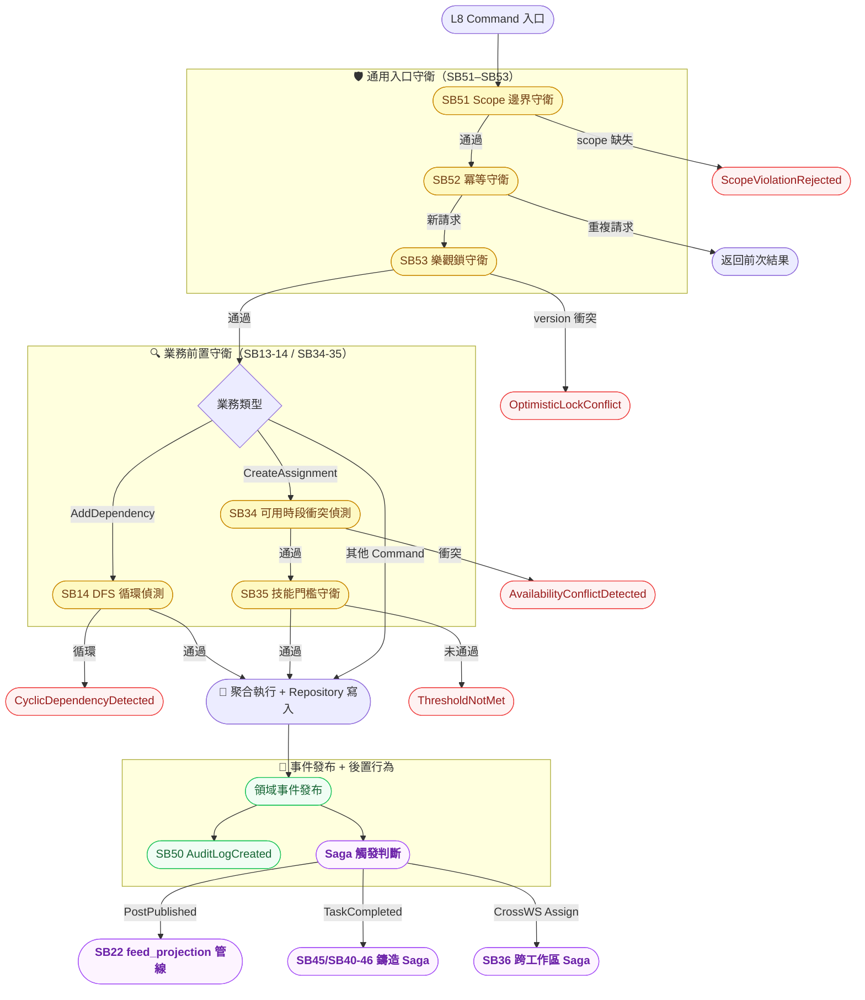
````

## File: docs/architecture/use-cases/use-case-diagram-sub-resource.md
````markdown
# Xuanwu 子資源層 Use Case Diagram — L4 Sub-Resource Boundary

> **層級定位**：本文件為資源層（L3）的下一層，細化每個 Resource 型別的**子資源邊界**：
> 親子結構（parent_id 樹）、owner scope 繼承規則、discriminator 欄位、讀寫路徑分離。
> 上層對應：[use-case-diagram-resource.md](./use-case-diagram-resource.md)（L3）。

---

## 邊界驗證前置確認

| 層 | 文件 | 狀態 |
|----|------|------|
| L1 | `use-case-diagram-saas-basic.md` | ✅ 通過 |
| L2 | `use-case-diagram-workspace.md` | ✅ 通過 |
| L3 | `use-case-diagram-resource.md` | ✅ 通過 |
| **L4** | `use-case-diagram-sub-resource.md`（本文件） | 📝 定義中 |

---

## 架構層級定位

```
Platform SaaS 邊界
└── Personal / Organization                          ← L1
    └── Workspace                                    ← L2
        └── Resource / Item (R1–R53)                ← L3
            └── Sub-Resource（本層）                 ← L4
                ├── WBS 樹：Epic → Feature → Story/Task → Sub-task
                ├── 貼文子資源：post → post_media
                ├── 排程子資源：schedule_item / assignment_record / availability_slot
                ├── 技能資格子資源：task_skill_requirement / matching_result
                └── 技能資產子資源：user_skill / skill_mint_log
```

---

## 子資源型別邊界定義

| 子資源代碼 | 所屬父資源 | parent_id 規則 | scope | 業務 owner 欄位 | discriminator | 刪除策略 |
|-----------|-----------|---------------|-------|---------------|---------------|---------|
| `task_item`（sub_type: feature） | task_item（epic） | 必填（強制歸屬） | workspace | `assignee_id` | `sub_type` | forbidden（移動先） |
| `task_item`（sub_type: story） | task_item（feature） | 必填 | workspace | `assignee_id` | `sub_type` | forbidden |
| `task_item`（sub_type: task） | task_item（story/feature） | 必填 | workspace | `assignee_id` | `sub_type` | forbidden |
| `task_item`（sub_type: subtask） | task_item（task） | 必填 | workspace | `assignee_id` | `sub_type` | cascade |
| `post_media` | `post` | 必填 | workspace | `business_owner_id` | `media_type` | cascade |
| `feed_projection` | `post`（org 投影） | nullable（讀模型） | org | `business_owner_id` | — | cascade |
| `assignment_record` | `schedule_item` | 必填 | workspace | `assignee_id` | — | forbidden |
| `availability_slot` | — | nullable（org scope） | org | `assignee_id` | — | soft-delete |
| `task_skill_requirement` | `task_item` | 必填 | task | `business_owner_id` | — | cascade |
| `matching_result` | `task_skill_requirement` | 必填 | task/workspace | `assignee_id` | — | cascade |
| `skill_mint_log` | `task_item` + `user_skill` | 必填（雙外鍵） | task/user | `accepted_by` | `mint_stage` | immutable |

### 雙層 Owner 語意（繼承 L3 規則）

- **`context_*`（workspaceId / orgId / personalId）**：決定資料可見與查詢的 scope，任何查詢必須帶入此 context，缺少則拒絕（安全邊界）。
- **業務 owner 欄位（assignee_id / business_owner_id / accepted_by 等）**：決定誰有業務操作授權（編輯、刪除、驗收）。
- 兩層必須同時存在；任一缺失均視為 scope 邊界違反。

---

## Actor 說明（繼承自 L3）

| Actor | 在子資源層的能力 |
|-------|---------------|
| **WSOwner** | 所有子資源 CRUD + 刪除 + scope 變更 |
| **WSAdmin** | 子資源 CRUD（不含刪除子資源型 epic/feature/story/task）+ 指派 + 技能設定 |
| **WSMember** | 建立 task/subtask + 進度更新 + 提交技能鑄造 + 留言 |
| **WSViewer** | 唯讀子資源清單與狀態（不含 owner 欄位） |
| **OrgOwner** | availability_slot 管理 + feed_projection 可見性 + 跨工作區指派 |
| **AI 系統** | 自動產生子任務、比對匹配、背景循環掃描 |

---

## Use Case 邊界（SR01–SR54）

| 邊界 | 涵蓋 UC | 說明 |
|------|---------|------|
| 🗂️ WBS 子任務樹 | SR01–SR10 | 子任務（feature/story/task/subtask）的 CRUD、移動、reorder |
| 📎 貼文媒體子資源 | SR11–SR16 | post_media 的附加、移除、排序、feed_projection 建立 |
| 🗓️ 排程與指派子資源 | SR17–SR26 | assignment_record / availability_slot 的建立、查詢、衝突檢查 |
| 🧩 技能資格子資源 | SR27–SR36 | task_skill_requirement 的設定與 matching_result 的比對 |
| 🏅 技能資產子資源 | SR37–SR46 | user_skill 的查詢、skill_mint_log 的寫入與查詢 |
| 📑 子資源讀路徑 | SR47–SR54 | 各型別的 Projection 查詢（Read Side） |

---

## Use Case 清單

### 🗂️ WBS 子任務樹（SR01–SR10）

| UC | 標題 | 操作者 | 前置條件 |
|----|------|--------|---------|
| SR01 | 在 Epic 下建立 Feature | WSOwner/WSAdmin | Epic 存在且 workspaceId 匹配 |
| SR02 | 在 Feature 下建立 Story | WSOwner/WSAdmin/WSMember | Feature 存在且 workspaceId 匹配 |
| SR03 | 在 Story/Task 下建立 Sub-task | WSOwner/WSAdmin/WSMember | 父任務存在；sub_type 不可再建 Epic/Feature |
| SR04 | 移動 Feature 至其他 Epic | WSOwner/WSAdmin | 同一 workspaceId 內 |
| SR05 | 移動 Story/Task 至其他 Feature | WSOwner/WSAdmin | 同一 workspaceId 內 |
| SR06 | 刪除 Sub-task（cascade） | WSOwner | 無下層子項目 |
| SR07 | 查詢 Epic 的所有子項目樹 | 全 Actor | workspaceId context 必填 |
| SR08 | 調整子任務排序（reorder） | WSOwner/WSAdmin | parent_id 不變 |
| SR09 | 複製子任務（含子樹） | WSOwner/WSAdmin | 目標 parent 存在 |
| SR10 | 查詢指定深度的子任務清單 | 全 Actor | depth 參數 ≥ 1 |

### 📎 貼文媒體子資源（SR11–SR16）

| UC | 標題 | 操作者 | 前置條件 |
|----|------|--------|---------|
| SR11 | 為 post 附加 post_media（圖片/影片） | WSOwner/WSAdmin/WSMember | post 存在且為草稿或已發布 |
| SR12 | 移除 post_media | WSOwner/WSAdmin（或 business_owner） | post 未鎖定 |
| SR13 | 調整 post_media 排序 | WSOwner/WSAdmin/WSMember | post 存在 |
| SR14 | 建立 feed_projection（自 post 投影） | 系統/WSOwner/WSAdmin | post 已發布 + orgId context 必填 |
| SR15 | 查詢 post 的 media 清單 | 全 Actor | workspaceId context 必填 |
| SR16 | 查詢組織瀑布流投影（feed_projection） | 全 Actor（org scope） | orgId context 必填 |

### 🗓️ 排程與指派子資源（SR17–SR26）

| UC | 標題 | 操作者 | 前置條件 |
|----|------|--------|---------|
| SR17 | 建立 assignment_record（寫入指派） | WSAdmin/OrgOwner | schedule_item 存在；matching_result.threshold_passed = true（若有門檻） |
| SR18 | 查詢任務的 assignment_record | WSOwner/WSAdmin | workspaceId context 必填 |
| SR19 | 撤銷 assignment_record | WSOwner/WSAdmin | 指派尚未執行（status = pending） |
| SR20 | 建立 availability_slot | OrgOwner/WSAdmin | orgId context 必填；時段不得重疊 |
| SR21 | 查詢成員的 availability_slot | WSOwner/WSAdmin | orgId context 必填 |
| SR22 | 刪除 availability_slot（soft-delete） | OrgOwner | 未被綁定中的 assignment_record |
| SR23 | 查詢 schedule_item 的指派歷史 | 全 Actor | workspaceId context 必填 |
| SR24 | 查詢可用時段衝突狀態 | WSOwner/WSAdmin | orgId context 必填 |
| SR25 | 跨工作區查詢成員排程（聚合視圖） | OrgOwner | orgId context 必填 |
| SR26 | 取消排程（連帶更新 assignment_record） | WSOwner/WSAdmin | schedule_item 狀態為 pending |

### 🧩 技能資格子資源（SR27–SR36）

| UC | 標題 | 操作者 | 前置條件 |
|----|------|--------|---------|
| SR27 | 為 task_item 設定 task_skill_requirement | WSOwner/WSAdmin | task_item 存在；skill code 存在於 skill 字典 |
| SR28 | 更新 task_skill_requirement 等級要求 | WSOwner/WSAdmin | task 尚未進入執行狀態 |
| SR29 | 刪除 task_skill_requirement（cascade matching_result） | WSOwner | 無進行中的 matching_result |
| SR30 | 對指定任務執行資格比對（觸發 matching_result 寫入） | 系統/WSAdmin | task_skill_requirement 存在 + user_skill 存在 |
| SR31 | 查詢 task_item 的資格要求清單 | 全 Actor | workspaceId context 必填 |
| SR32 | 查詢 matching_result（指定任務 + 指定成員） | WSOwner/WSAdmin | task context 必填 |
| SR33 | 查詢未通過門檻的候選人清單 | WSOwner/WSAdmin | matching_result 存在 |
| SR34 | 查詢已通過門檻的候選人清單 | 全 Actor | matching_result.threshold_passed = true |
| SR35 | 標記 matching_result 為已通過（手動背書） | WSOwner/WSAdmin | matching_result 存在 |
| SR36 | 撤銷 matching_result 背書 | WSOwner | matching_result.source = manual |

### 🏅 技能資產子資源（SR37–SR46）

| UC | 標題 | 操作者 | 前置條件 |
|----|------|--------|---------|
| SR37 | 查詢用戶技能資產（user_skill） | 本人/WSAdmin/OrgOwner | personalId context 必填 |
| SR38 | 查詢技能鑄造紀錄（skill_mint_log） | 本人/WSAdmin | task context + personalId context 必填 |
| SR39 | 提交技能聲明（Declaration 啟動鑄造流） | WSMember（執行者） | task_skill_requirement 對應任務存在 |
| SR40 | 提交任務完成產出（Practice → Validation） | WSMember（執行者） | task_item.status = in_progress |
| SR41 | AI 審核 + 主管背書（Validation 通過） | AI 系統 + WSAdmin | 產出已提交 |
| SR42 | 寫入 skill_mint_log（Settlement，不可變） | 系統 | Validation 通過；XP 計算完成 |
| SR43 | 查詢用戶的 XP 累積與等級 | 本人/全 Actor | personalId context 必填 |
| SR44 | 查詢技能等級表（公開唯讀） | 全 Actor | 無前置條件 |
| SR45 | 徽章顯示（依等級計算） | 全 Actor | user_skill.current_level 存在 |
| SR46 | 重算 XP 等級（系統一致性修正） | 系統 | skill_mint_log 完整；冪等操作 |

### 📑 子資源讀路徑（SR47–SR54）

| UC | 標題 | 讀模型型別 | 說明 |
|----|------|-----------|------|
| SR47 | 查詢 WBS 樹（投影） | `WbsTreeView` | 含 sub_type、status、assignee；不含 invariant |
| SR48 | 查詢貼文媒體列表（投影） | `PostMediaListView` | 依 post_id；含 media_type、sort_order |
| SR49 | 查詢組織瀑布流（投影） | `FeedProjectionView` | org scope；依時間排序 |
| SR50 | 查詢指派清單（投影） | `AssignmentListView` | 依 workspace + date range |
| SR51 | 查詢可用時段摘要（投影） | `AvailabilitySlotSummaryView` | org scope；依成員 + 時段 |
| SR52 | 查詢技能資格矩陣（投影） | `SkillRequirementMatrixView` | task + 候選人二維矩陣 |
| SR53 | 查詢鑄造進度（投影） | `MintProgressView` | 依 task_item；四階段 stage 狀態 |
| SR54 | 查詢用戶技能雷達（投影） | `UserSkillRadarView` | 依 personalId；多技能維度 |

---

## 權限矩陣（子資源層）

| UC 範圍 | WSOwner | WSAdmin | WSMember | WSViewer | OrgOwner | AI 系統 |
|---------|:-------:|:-------:|:--------:|:--------:|:--------:|:-------:|
| SR01–SR06（WBS CRUD） | ✓ | ✓ | ✓（task/subtask） | — | — | — |
| SR07–SR10（WBS 查詢/調整） | ✓ | ✓ | ✓（唯讀部分） | ✓（SR07/SR10） | — | — |
| SR11–SR13（media CRUD） | ✓ | ✓ | ✓ | — | — | — |
| SR14–SR16（feed投影/查詢） | ✓ | ✓ | ✓（SR14） | ✓（SR15/SR16） | ✓ | ✓（SR14 系統） |
| SR17–SR19（assignment_record） | ✓ | ✓ | — | — | ✓ | — |
| SR20–SR26（availability/schedule） | ✓ | ✓ | — | ✓（SR23/SR24 唯讀） | ✓ | — |
| SR27–SR36（技能資格） | ✓ | ✓ | ✓（SR31/SR34唯讀） | ✓（SR31/SR34） | — | ✓（SR30/SR41） |
| SR37–SR46（技能資產/鑄造） | ✓ | ✓ | ✓（本人SR37-SR41） | ✓（SR43/SR44/SR45） | — | ✓（SR41/SR42/SR46） |
| SR47–SR54（讀路徑投影） | ✓ | ✓ | ✓ | ✓ | ✓（SR49/SR51） | ✓ |

---

## 邊界驗證項目（L4）

> 以下各項須在進入 L5（子行為層）設計前逐一確認。

- [ ] 所有子資源的 `workspaceId`（或 `orgId`）均從父資源繼承，不可獨立設定
- [ ] `parent_id` 強制歸屬的子資源在父資源刪除時有明確策略（cascade 或 forbidden）
- [ ] `sub_type` discriminator 明確定義每種 task_item 的行為集合邊界
- [ ] `feed_projection` 為唯讀投影，只有系統事件管線可寫入（非人工直接寫入）
- [ ] `skill_mint_log` 寫入後不可修改（immutable），XP 一致性由重算指令（SR46）處理
- [ ] 讀路徑（SR47–SR54）全部為 Read Model Projection，不觸發任何 Command/副作用
- [ ] `assignment_record` 的建立必須驗證 `matching_result.threshold_passed`（若有門檻）
- [ ] 跨工作區子資源操作（SR25、SR14 的 org scope）需傳入 `orgId` context；workspaceId 不可省略

---

## Diagram

```mermaid
graph LR
    classDef roleActor fill:#dcfce7,stroke:#16a34a,color:#14532d,font-weight:bold
    classDef roleActorLite fill:#fef9c3,stroke:#ca8a04,color:#713f12,font-weight:bold
    classDef systemActor fill:#f3e8ff,stroke:#a855f7,color:#6b21a8,font-weight:bold
    classDef orgActor fill:#e0f2fe,stroke:#0284c7,color:#0c4a6e,font-weight:bold
    classDef wbsUC fill:#eff6ff,stroke:#3b82f6,color:#1e40af
    classDef mediaUC fill:#fdf4ff,stroke:#a855f7,color:#6b21a8
    classDef schedUC fill:#fff7ed,stroke:#f97316,color:#9a3412
    classDef skillUC fill:#f0fdf4,stroke:#22c55e,color:#166534
    classDef mintUC fill:#fefce8,stroke:#eab308,color:#713f12
    classDef readUC fill:#f1f5f9,stroke:#94a3b8,color:#475569,stroke-dasharray:4 2

    WSOwner((工作區擁有者)):::roleActor
    WSAdmin((工作區管理員)):::roleActor
    WSMember((工作區成員)):::roleActorLite
    WSViewer((工作區訪客)):::roleActorLite
    OrgOwner((組織擁有者)):::orgActor
    AI((AI 系統)):::systemActor

    subgraph subResource["📦 子資源層 Use Case（L4）"]

        subgraph wbs["🗂️ WBS 子任務樹（SR01–SR10）"]
            SR01([SR01 建立 Feature-in-Epic]):::wbsUC
            SR02([SR02 建立 Story-in-Feature]):::wbsUC
            SR03([SR03 建立 Sub-task]):::wbsUC
            SR04([SR04 移動 Feature]):::wbsUC
            SR05([SR05 移動 Story / Task]):::wbsUC
            SR06([SR06 刪除 Sub-task]):::wbsUC
            SR07([SR07 查詢子項目樹]):::wbsUC
            SR08([SR08 調整排序]):::wbsUC
            SR09([SR09 複製子任務]):::wbsUC
            SR10([SR10 查詢指定深度清單]):::wbsUC
        end

        subgraph media["📎 貼文媒體子資源（SR11–SR16）"]
            SR11([SR11 附加 post_media]):::mediaUC
            SR12([SR12 移除 post_media]):::mediaUC
            SR13([SR13 調整 media 排序]):::mediaUC
            SR14([SR14 建立 feed_projection]):::mediaUC
            SR15([SR15 查詢 media 清單]):::mediaUC
            SR16([SR16 查詢組織瀑布流]):::mediaUC
        end

        subgraph sched["🗓️ 排程與指派子資源（SR17–SR26）"]
            SR17([SR17 建立 assignment_record]):::schedUC
            SR18([SR18 查詢 assignment_record]):::schedUC
            SR19([SR19 撤銷 assignment_record]):::schedUC
            SR20([SR20 建立 availability_slot]):::schedUC
            SR21([SR21 查詢 availability_slot]):::schedUC
            SR22([SR22 刪除 availability_slot]):::schedUC
            SR23([SR23 查詢指派歷史]):::schedUC
            SR24([SR24 查詢時段衝突]):::schedUC
            SR25([SR25 跨工作區排程聚合]):::schedUC
            SR26([SR26 取消排程]):::schedUC
        end

        subgraph skillQual["🧩 技能資格子資源（SR27–SR36）"]
            SR27([SR27 設定 task_skill_requirement]):::skillUC
            SR28([SR28 更新等級要求]):::skillUC
            SR29([SR29 刪除要求]):::skillUC
            SR30([SR30 觸發資格比對]):::skillUC
            SR31([SR31 查詢要求清單]):::skillUC
            SR32([SR32 查詢 matching_result]):::skillUC
            SR33([SR33 查詢未通過候選人]):::skillUC
            SR34([SR34 查詢已通過候選人]):::skillUC
            SR35([SR35 手動背書通過]):::skillUC
            SR36([SR36 撤銷背書]):::skillUC
        end

        subgraph skillMint["🏅 技能資產子資源（SR37–SR46）"]
            SR37([SR37 查詢 user_skill]):::mintUC
            SR38([SR38 查詢 skill_mint_log]):::mintUC
            SR39([SR39 聲明 Declaration]):::mintUC
            SR40([SR40 提交產出 Practice]):::mintUC
            SR41([SR41 AI＋主管 Validation]):::mintUC
            SR42([SR42 系統 Settlement 寫入]):::mintUC
            SR43([SR43 查詢 XP 與等級]):::mintUC
            SR44([SR44 查詢等級表]):::mintUC
            SR45([SR45 顯示技能徽章]):::mintUC
            SR46([SR46 重算 XP 等級]):::mintUC
        end

        subgraph readSide["📑 讀路徑投影（SR47–SR54）"]
            SR47([SR47 WbsTreeView]):::readUC
            SR48([SR48 PostMediaListView]):::readUC
            SR49([SR49 FeedProjectionView]):::readUC
            SR50([SR50 AssignmentListView]):::readUC
            SR51([SR51 AvailabilitySlotSummaryView]):::readUC
            SR52([SR52 SkillRequirementMatrixView]):::readUC
            SR53([SR53 MintProgressView]):::readUC
            SR54([SR54 UserSkillRadarView]):::readUC
        end

    end

    %% WSOwner
    WSOwner --> SR01
    WSOwner --> SR02
    WSOwner --> SR03
    WSOwner --> SR04
    WSOwner --> SR05
    WSOwner --> SR06
    WSOwner --> SR07
    WSOwner --> SR08
    WSOwner --> SR09
    WSOwner --> SR10
    WSOwner --> SR11
    WSOwner --> SR12
    WSOwner --> SR13
    WSOwner --> SR14
    WSOwner --> SR17
    WSOwner --> SR18
    WSOwner --> SR19
    WSOwner --> SR26
    WSOwner --> SR27
    WSOwner --> SR28
    WSOwner --> SR29
    WSOwner --> SR35
    WSOwner --> SR36
    WSOwner --> SR37
    WSOwner --> SR38

    %% WSAdmin
    WSAdmin --> SR01
    WSAdmin --> SR02
    WSAdmin --> SR03
    WSAdmin --> SR04
    WSAdmin --> SR05
    WSAdmin --> SR07
    WSAdmin --> SR08
    WSAdmin --> SR09
    WSAdmin --> SR10
    WSAdmin --> SR11
    WSAdmin --> SR12
    WSAdmin --> SR13
    WSAdmin --> SR14
    WSAdmin --> SR17
    WSAdmin --> SR18
    WSAdmin --> SR19
    WSAdmin --> SR20
    WSAdmin --> SR21
    WSAdmin --> SR26
    WSAdmin --> SR27
    WSAdmin --> SR28
    WSAdmin --> SR30
    WSAdmin --> SR35
    WSAdmin --> SR37
    WSAdmin --> SR38

    %% WSMember
    WSMember --> SR02
    WSMember --> SR03
    WSMember --> SR07
    WSMember --> SR10
    WSMember --> SR11
    WSMember --> SR13
    WSMember --> SR14
    WSMember --> SR39
    WSMember --> SR40
    WSMember --> SR43

    %% WSViewer
    WSViewer --> SR07
    WSViewer --> SR10
    WSViewer --> SR15
    WSViewer --> SR16
    WSViewer --> SR23
    WSViewer --> SR24
    WSViewer --> SR31
    WSViewer --> SR34
    WSViewer --> SR43
    WSViewer --> SR44
    WSViewer --> SR45
    WSViewer --> SR47
    WSViewer --> SR48
    WSViewer --> SR49
    WSViewer --> SR50
    WSViewer --> SR52
    WSViewer --> SR54

    %% OrgOwner
    OrgOwner --> SR16
    OrgOwner --> SR17
    OrgOwner --> SR20
    OrgOwner --> SR21
    OrgOwner --> SR22
    OrgOwner --> SR25
    OrgOwner --> SR49
    OrgOwner --> SR51

    %% AI 系統
    AI --> SR14
    AI --> SR30
    AI --> SR41
    AI --> SR42
    AI --> SR46
```
````

## File: docs/repomix-instruction.md
````markdown
## 📌 Codebase 結構與準備

1. 保持目錄結構清晰且符合應用架構。([Repomix][1])
2. 編寫完整 README，包括專案概述與設置說明。([Repomix][1])
3. 對複雜程式碼加入註解與內部文檔。([Repomix][1])
4. 使用一致的命名規則。([Repomix][1])
5. 移除未使用的程式碼以降低干擾。([Repomix][1])
6. 拆分大型檔案成更小、更聚焦的模組。([Repomix][1])
7. 儘量減少不必要的依賴項。([Repomix][1])
8. 使用統一格式化工具確保風格一致。([Repomix][1])

---

## 🧠 Prompt 設計最佳實踐

9. Prompt 中先提供充足的專案上下文。([Repomix][1])
10. 複雜任務按步驟拆分成清晰小步驟。([Repomix][1])
11. 明確規定 AI 回應格式。([Repomix][1])
12. 提問具體且具目標導向。([Repomix][1])

---

## 🤖 AI 反饋處理與驗證

13. 驗證 AI 輸出對程式碼庫的準確性與相關性。([Repomix][1])
14. 確保理解背後的邏輯原因。([Repomix][1])
15. 評估建議的可行性與現實適用性。([Repomix][1])
16. 識別並詢問 AI 假設前提。([Repomix][1])

---

## 🔄 交互與迭代最佳實踐

17. 若回應不清楚，主動要求補充。([Repomix][1])
18. 給予 AI 關於輸出有用或無用的反饋。([Repomix][1])
19. 根據回應調整 prompt。([Repomix][1])
20. 如任務太寬泛，進一步拆分為更精細問題。([Repomix][1])

---

## 💼 常見場景應用模式

### ▶️ 分析碼

21. 要求先提供高層級總覽，再進入細節。([Repomix][1])
22. 聚焦特定關注區域或關鍵功能。([Repomix][1])
23. 請求識別模式與反模式。([Repomix][1])
24. 要求就可維護性與可擴充性做評估。([Repomix][1])

### ▶️ 重構

25. 說明目前代碼問題與痛點。([Repomix][1])
26. 指出重構目標並請求分步執行策略。([Repomix][1])
27. 要求說明改善後的優勢。([Repomix][1])

### ▶️ 偵錯

28. 提供完整錯誤訊息與預期行為。([Repomix][1])
29. 附加版本與執行環境資訊。([Repomix][1])
30. 要求根本原因分析與具體解決方案。([Repomix][1])

### ▶️ 新功能開發

31. 描述新功能細節與目的。([Repomix][1])
32. 指出與現有架構的整合方式。([Repomix][1])
33. 先要求設計再要求實作細節。([Repomix][1])
34. 請求建議測試案例以驗證功能。([Repomix][1])

---

## 🔄 開發流程與 AI 整合

35. 用 AI 自動化重複性任務。([Repomix][1])
36. 用 AI 協助進行代碼審查與改進提議。([Repomix][1])
37. 用 AI 生成與維護技術文檔。([Repomix][1])
38. 用 AI 協助產生測試用例或測試計劃。([Repomix][1])

---

## 🧠 AI 與人力協同

39. 始終核對 AI 輸出，不直接採納。([Repomix][1])
40. 保留人類創造性的最終控制與判斷。([Repomix][1])
41. 結合專業知識與 AI 能力提升質量。([Repomix][1])
42. 透過迭代改進流程與提示設計。([Repomix][1])

---
````

## File: functions/src/admin.ts
````typescript
import { getApps, initializeApp } from "firebase-admin/app";
import { getAuth } from "firebase-admin/auth";
import { getFirestore } from "firebase-admin/firestore";
import { getStorage } from "firebase-admin/storage";
````

## File: functions/src/index.ts
````typescript
import { onRequest } from 'firebase-functions/v2/https'
````

## File: README.md
````markdown
Welcome to your new TanStack Start app! 

# Getting Started

To run this application:

```bash
npm install
npm run dev
```

# Building For Production

To build this application for production:

```bash
npm run build
```

## Testing

This project uses [Vitest](https://vitest.dev/) for testing. You can run the tests with:

```bash
npm run test
```

## Styling

This project uses [Tailwind CSS](https://tailwindcss.com/) for styling.

### Removing Tailwind CSS

If you prefer not to use Tailwind CSS:

1. Remove the demo pages in `src/routes/demo/`
2. Replace the Tailwind import in `src/styles.css` with your own styles
3. Remove `tailwindcss()` from the plugins array in `vite.config.ts`
4. Uninstall the packages: `npm install @tailwindcss/vite tailwindcss -D`

## Linting & Formatting

This project uses [Biome](https://biomejs.dev/) for linting and formatting. The following scripts are available:


```bash
npm run lint
npm run format
npm run check
```


## Shadcn

Add components using the latest version of [Shadcn](https://ui.shadcn.com/).

```bash
pnpm dlx shadcn@latest add button
```


# TanStack Chat Application

Am example chat application built with TanStack Start, TanStack Store, and Claude AI.

## .env Updates

```env
ANTHROPIC_API_KEY=your_anthropic_api_key
```

## ✨ Features

### AI Capabilities
- 🤖 Powered by Claude 3.5 Sonnet 
- 📝 Rich markdown formatting with syntax highlighting
- 🎯 Customizable system prompts for tailored AI behavior
- 🔄 Real-time message updates and streaming responses (coming soon)

### User Experience
- 🎨 Modern UI with Tailwind CSS and Lucide icons
- 🔍 Conversation management and history
- 🔐 Secure API key management
- 📋 Markdown rendering with code highlighting

### Technical Features
- 📦 Centralized state management with TanStack Store
- 🔌 Extensible architecture for multiple AI providers
- 🛠️ TypeScript for type safety

## Architecture

### Tech Stack
- **Frontend Framework**: TanStack Start
- **Routing**: TanStack Router
- **State Management**: TanStack Store
- **Styling**: Tailwind CSS
- **AI Integration**: Anthropic's Claude API

# Paraglide i18n

This add-on wires up ParaglideJS for localized routing and message formatting.

- Messages live in `project.inlang/messages`.
- URLs are localized through the Paraglide Vite plugin and router `rewrite` hooks.
- Run the dev server or build to regenerate the `src/paraglide` outputs.


## Routing

This project uses [TanStack Router](https://tanstack.com/router) with file-based routing. Routes are managed as files in `src/routes`.

### Adding A Route

To add a new route to your application just add a new file in the `./src/routes` directory.

TanStack will automatically generate the content of the route file for you.

Now that you have two routes you can use a `Link` component to navigate between them.

### Adding Links

To use SPA (Single Page Application) navigation you will need to import the `Link` component from `@tanstack/react-router`.

```tsx
import { Link } from "@tanstack/react-router";
```

Then anywhere in your JSX you can use it like so:

```tsx
<Link to="/about">About</Link>
```

This will create a link that will navigate to the `/about` route.

More information on the `Link` component can be found in the [Link documentation](https://tanstack.com/router/v1/docs/framework/react/api/router/linkComponent).

### Using A Layout

In the File Based Routing setup the layout is located in `src/routes/__root.tsx`. Anything you add to the root route will appear in all the routes. The route content will appear in the JSX where you render `{children}` in the `shellComponent`.

Here is an example layout that includes a header:

```tsx
import { HeadContent, Scripts, createRootRoute } from '@tanstack/react-router'

export const Route = createRootRoute({
  head: () => ({
    meta: [
      { charSet: 'utf-8' },
      { name: 'viewport', content: 'width=device-width, initial-scale=1' },
      { title: 'My App' },
    ],
  }),
  shellComponent: ({ children }) => (
    <html lang="en">
      <head>
        <HeadContent />
      </head>
      <body>
        <header>
          <nav>
            <Link to="/">Home</Link>
            <Link to="/about">About</Link>
          </nav>
        </header>
        {children}
        <Scripts />
      </body>
    </html>
  ),
})
```

More information on layouts can be found in the [Layouts documentation](https://tanstack.com/router/latest/docs/framework/react/guide/routing-concepts#layouts).

## Server Functions

TanStack Start provides server functions that allow you to write server-side code that seamlessly integrates with your client components.

```tsx
import { createServerFn } from '@tanstack/react-start'

const getServerTime = createServerFn({
  method: 'GET',
}).handler(async () => {
  return new Date().toISOString()
})

// Use in a component
function MyComponent() {
  const [time, setTime] = useState('')
  
  useEffect(() => {
    getServerTime().then(setTime)
  }, [])
  
  return <div>Server time: {time}</div>
}
```

## API Routes

You can create API routes by using the `server` property in your route definitions:

```tsx
import { createFileRoute } from '@tanstack/react-router'
import { json } from '@tanstack/react-start'

export const Route = createFileRoute('/api/hello')({
  server: {
    handlers: {
      GET: () => json({ message: 'Hello, World!' }),
    },
  },
})
```

## Data Fetching

There are multiple ways to fetch data in your application. You can use TanStack Query to fetch data from a server. But you can also use the `loader` functionality built into TanStack Router to load the data for a route before it's rendered.

For example:

```tsx
import { createFileRoute } from '@tanstack/react-router'

export const Route = createFileRoute('/people')({
  loader: async () => {
    const response = await fetch('https://swapi.dev/api/people')
    return response.json()
  },
  component: PeopleComponent,
})

function PeopleComponent() {
  const data = Route.useLoaderData()
  return (
    <ul>
      {data.results.map((person) => (
        <li key={person.name}>{person.name}</li>
      ))}
    </ul>
  )
}
```

Loaders simplify your data fetching logic dramatically. Check out more information in the [Loader documentation](https://tanstack.com/router/latest/docs/framework/react/guide/data-loading#loader-parameters).

# Demo files

Files prefixed with `demo` can be safely deleted. They are there to provide a starting point for you to play around with the features you've installed.

# Learn More

You can learn more about all of the offerings from TanStack in the [TanStack documentation](https://tanstack.com).

For TanStack Start specific documentation, visit [TanStack Start](https://tanstack.com/start).
````

## File: src/features/auth/service/capability-contracts.ts
````typescript
export interface UserProfileDocument {
	email: string | null;
	displayName: string | null;
	photoURL: string | null;
	emailVerified: boolean;
	isAnonymous: boolean;
}
export interface UserDeviceRegistrationDocument {
	analyticsEnabled: boolean;
	messagingEnabled: boolean;
	messagingToken: string | null;
	messagingProvider: string | null;
	appCheckEnabled: boolean;
	appCheckTokenPresent: boolean;
	appCheckExpireTimeMillis: number | null;
	lastForegroundMessageId: string | null;
	lastForegroundMessageAt: number | null;
	lastForegroundMessageTitle: string | null;
	lastForegroundMessageBody: string | null;
	lastErrorCode: string | null;
	lastErrorMessage: string | null;
	deviceKind: "browser";
	userAgent: string | null;
}
````

## File: src/features/auth/service/capability-runtime.ts
````typescript
import { useSyncExternalStore } from "react";
import type { FirebaseForegroundMessageRecord } from "#/integrations/firebase/anti-corruption";
export interface CapabilityRuntimeState {
	status: "idle" | "bootstrapping" | "ready" | "error";
	latestMessage: FirebaseForegroundMessageRecord | null;
	errorMessage: string | null;
}
⋮----
function emit()
export function updateCapabilityRuntime(
	partial: Partial<CapabilityRuntimeState>,
)
export function resetCapabilityRuntime()
function subscribe(listener: () => void)
function getSnapshot()
export function useCapabilityRuntime()
````

## File: src/features/auth/service/session-commands.ts
````typescript
import {
	logFirebaseAnalyticsEvent,
	setFirebaseAnalyticsActor,
} from "#/integrations/firebase/analytics.write";
import {
	type FirebaseEmailPasswordCredential,
	signInWithFirebaseEmailPassword,
	signOutFirebaseSession,
} from "#/integrations/firebase/auth.write";
export async function signInWithEmailPasswordCommand(
	input: FirebaseEmailPasswordCredential,
)
export async function signOutSessionCommand(): Promise<void>
````

## File: src/features/auth/ui/auth-capability-bootstrap.tsx
````typescript
import { useEffect } from "react";
import { startFirebaseClientCapabilityBootstrap } from "../service/bootstrap-client-capabilities";
export function AuthCapabilityBootstrap()
````

## File: src/features/auth/ui/auth-capability-status.tsx
````typescript
import { Badge } from "#/lib/ui/shadcn/badge";
import { Card, CardContent, CardHeader, CardTitle } from "#/lib/ui/shadcn/card";
import { m } from "#/paraglide/messages";
import { useCapabilityRuntime } from "../service/capability-runtime";
````

## File: src/features/auth/ui/auth-page.tsx
````typescript
import { m } from "#/paraglide/messages";
import { AuthCapabilityBootstrap } from "./auth-capability-bootstrap";
import { AuthCapabilityStatus } from "./auth-capability-status";
import { AuthSessionCard } from "./auth-session-card";
export function AuthPage()
````

## File: src/features/auth/ui/auth-session-card.tsx
````typescript
import { useEffect, useState } from "react";
import {
	type FirebaseAuthSession,
	getCurrentAuthSession,
	subscribeAuthSession,
} from "#/integrations/firebase/auth.read";
import { firebaseClientFeatureConfig } from "#/integrations/firebase/client";
import { Badge } from "#/lib/ui/shadcn/badge";
import { Button } from "#/lib/ui/shadcn/button";
import {
	Card,
	CardContent,
	CardDescription,
	CardHeader,
	CardTitle,
} from "#/lib/ui/shadcn/card";
import { Input } from "#/lib/ui/shadcn/input";
import { Label } from "#/lib/ui/shadcn/label";
import { m } from "#/paraglide/messages";
import {
	signInWithEmailPasswordCommand,
	signOutSessionCommand,
} from "../service/session-commands";
⋮----
async function handleSubmit(event: React.FormEvent<HTMLFormElement>)
async function handleSignOut()
````

## File: src/features/graph/ui/graph-page.tsx
````typescript
import { m } from "#/paraglide/messages";
import { GraphCanvas } from "./graph-canvas";
export function GraphPage()
````

## File: src/integrations/firebase/auth.read.ts
````typescript
import { onAuthStateChanged } from "firebase/auth";
import { mapAuthSession, type FirebaseAuthSession } from "./anti-corruption";
import { firebaseAuth } from "./client";
export function getCurrentAuthSession(): FirebaseAuthSession | null
export function subscribeAuthSession(
  onData: (session: FirebaseAuthSession | null) => void,
): () => void
````

## File: src/integrations/firebase/auth.write.ts
````typescript
import {
  signInWithCustomToken,
  signInWithEmailAndPassword,
  signOut,
} from "firebase/auth";
import { mapAuthSession, type FirebaseAuthSession } from "./anti-corruption";
import { firebaseAuth } from "./client";
export interface FirebaseEmailPasswordCredential {
  email: string;
  password: string;
}
function requireSession(session: FirebaseAuthSession | null): FirebaseAuthSession
export async function signInWithFirebaseEmailPassword(
  input: FirebaseEmailPasswordCredential,
): Promise<FirebaseAuthSession>
export async function signInWithFirebaseCustomToken(
  customToken: string,
): Promise<FirebaseAuthSession>
export async function signOutFirebaseSession(): Promise<void>
````

## File: src/integrations/firebase/firestore.read.ts
````typescript
import {
  collection,
  doc,
  getDoc,
  getDocs,
  onSnapshot,
} from "firebase/firestore";
import {
  normalizeFirestoreRecord,
  type FirebaseDocumentRecord,
} from "./anti-corruption";
import { firebaseFirestore } from "./client";
type FirestoreProjector<TPayload> = (
  payload: Record<string, unknown>,
) => TPayload;
function isDefined<TValue>(value: TValue | null): value is TValue
export async function readFirestoreDocument<TPayload>(
  path: string,
  project: FirestoreProjector<TPayload>,
): Promise<FirebaseDocumentRecord<TPayload> | null>
export async function listFirestoreCollection<TPayload>(
  path: string,
  project: FirestoreProjector<TPayload>,
): Promise<FirebaseDocumentRecord<TPayload>[]>
export function subscribeFirestoreDocument<TPayload>(
  path: string,
  project: FirestoreProjector<TPayload>,
  onData: (record: FirebaseDocumentRecord<TPayload> | null) => void,
): () => void
export function subscribeFirestoreCollection<TPayload>(
  path: string,
  project: FirestoreProjector<TPayload>,
  onData: (records: FirebaseDocumentRecord<TPayload>[]) => void,
): () => void
````

## File: src/integrations/firebase/firestore.write.ts
````typescript
import { deleteDoc, doc, setDoc } from "firebase/firestore";
import {
  createFirestoreMergeData,
  createFirestoreRecordData,
  type FirebaseDocumentWriteMetadata,
} from "./anti-corruption";
import { firebaseFirestore } from "./client";
export async function writeFirestoreDocument<TPayload extends Record<string, unknown>>(
  path: string,
  payload: TPayload,
  metadata: FirebaseDocumentWriteMetadata = {},
): Promise<void>
export async function mergeFirestoreDocument<TPayload extends Record<string, unknown>>(
  path: string,
  payload: Partial<TPayload>,
  metadata: FirebaseDocumentWriteMetadata = {},
): Promise<void>
export async function deleteFirestoreDocument(path: string): Promise<void>
````

## File: src/integrations/firebase/storage.read.ts
````typescript
import { getDownloadURL, getMetadata, listAll, ref } from "firebase/storage";
import {
  mapStorageObjectRecord,
  type FirebaseStorageObjectRecord,
} from "./anti-corruption";
import { firebaseStorage } from "./client";
export interface FirebaseStorageObjectView extends FirebaseStorageObjectRecord {
  downloadUrl: string | null;
}
export async function readStorageObject(
  path: string,
): Promise<FirebaseStorageObjectView>
export async function listStorageFolder(
  path: string,
): Promise<FirebaseStorageObjectView[]>
````

## File: src/integrations/firebase/storage.write.ts
````typescript
import { deleteObject, ref, uploadBytes } from "firebase/storage";
import { firebaseStorage } from "./client";
import { readStorageObject, type FirebaseStorageObjectView } from "./storage.read";
export interface FirebaseStorageUploadInput {
  path: string;
  data: Blob | Uint8Array | ArrayBuffer;
  contentType?: string;
  customMetadata?: Record<string, string>;
}
export async function uploadStorageObject(
  input: FirebaseStorageUploadInput,
): Promise<FirebaseStorageObjectView>
export async function deleteStorageObject(path: string): Promise<void>
````

## File: src/integrations/pragmatic-dnd/drop-indicator.tsx
````typescript
import { DropIndicator } from '@atlaskit/pragmatic-drag-and-drop-react-drop-indicator/box'
interface GraphDropIndicatorProps {
  edge: 'left' | 'right' | 'top' | 'bottom'
  gap?: string
}
export function GraphDropIndicator(
````

## File: src/integrations/pragmatic-dnd/hitbox.ts
````typescript
import { attachClosestEdge, extractClosestEdge } from '@atlaskit/pragmatic-drag-and-drop-hitbox/closest-edge'
⋮----
export function withClosestHorizontalEdge<T extends Record<string, unknown>>(data: T, input: Input, element: Element)
````

## File: src/integrations/vis/dataset.ts
````typescript
import { DataSet } from 'vis-data'
export interface GraphNodeItem {
  id: string
  label: string
  x?: number
  y?: number
}
export interface GraphEdgeItem {
  id: string
  from: string
  to: string
  label?: string
}
export interface GraphVisDataSet {
  nodes: DataSet<GraphNodeItem, 'id'>
  edges: DataSet<GraphEdgeItem, 'id'>
}
export function createGraphDataSet(): GraphVisDataSet
export function syncGraphDataSet(
  dataSet: GraphVisDataSet,
  payload: { nodes: GraphNodeItem[]; edges: GraphEdgeItem[] },
): void
````

## File: src/integrations/vis/network.ts
````typescript
export interface GraphNetworkOptions {
  autoResize: boolean
  physics: { enabled: boolean; stabilization: boolean }
  interaction: { dragNodes: boolean; zoomView: boolean }
}
export function createGraphNetworkOptions(): GraphNetworkOptions
````

## File: src/lib/hooks/use-mobile.ts
````typescript
export function useIsMobile()
⋮----
const onChange = () =>
````

## File: src/lib/ui/shadcn/accordion.tsx
````typescript
import { ChevronDownIcon } from "lucide-react"
import { Accordion as AccordionPrimitive } from "radix-ui"
import { cn } from "#/lib/utils"
function Accordion({
  ...props
}: React.ComponentProps<typeof AccordionPrimitive.Root>)
function AccordionItem({
  className,
  ...props
}: React.ComponentProps<typeof AccordionPrimitive.Item>)
function AccordionTrigger({
  className,
  children,
  ...props
}: React.ComponentProps<typeof AccordionPrimitive.Trigger>)
````

## File: src/lib/ui/shadcn/alert-dialog.tsx
````typescript
import { AlertDialog as AlertDialogPrimitive } from "radix-ui"
import { cn } from "#/lib/utils"
import { Button } from "#/lib/ui/shadcn/button"
function AlertDialog({
  ...props
}: React.ComponentProps<typeof AlertDialogPrimitive.Root>)
⋮----
className=
⋮----
function AlertDialogCancel({
  className,
  variant = "outline",
  size = "default",
  ...props
}: React.ComponentProps<typeof AlertDialogPrimitive.Cancel> &
Pick<React.ComponentProps<typeof Button>, "variant" | "size">)
````

## File: src/lib/ui/shadcn/alert.tsx
````typescript
import { cva, type VariantProps } from "class-variance-authority"
import { cn } from "#/lib/utils"
⋮----
className=
````

## File: src/lib/ui/shadcn/aspect-ratio.tsx
````typescript
import { AspectRatio as AspectRatioPrimitive } from "radix-ui"
function AspectRatio({
  ...props
}: React.ComponentProps<typeof AspectRatioPrimitive.Root>)
````

## File: src/lib/ui/shadcn/avatar.tsx
````typescript
import { Avatar as AvatarPrimitive } from "radix-ui"
import { cn } from "#/lib/utils"
function Avatar({
  className,
  size = "default",
  ...props
}: React.ComponentProps<typeof AvatarPrimitive.Root> & {
  size?: "default" | "sm" | "lg"
})
⋮----
className=
````

## File: src/lib/ui/shadcn/breadcrumb.tsx
````typescript
import { ChevronRight, MoreHorizontal } from "lucide-react"
import { Slot } from "radix-ui"
import { cn } from "#/lib/utils"
function Breadcrumb(
⋮----
className=
⋮----
{children ?? <ChevronRight />}
    </li>
  )
}
function BreadcrumbEllipsis({
  className,
  ...props
}: React.ComponentProps<"span">)
````

## File: src/lib/ui/shadcn/button-group.tsx
````typescript
import { cva, type VariantProps } from "class-variance-authority"
import { Slot } from "radix-ui"
import { cn } from "#/lib/utils"
import { Separator } from "#/lib/ui/shadcn/separator"
⋮----
function ButtonGroup({
  className,
  orientation,
  ...props
}: React.ComponentProps<"div"> & VariantProps<typeof buttonGroupVariants>)
⋮----
className=
````

## File: src/lib/ui/shadcn/calendar.tsx
````typescript
import {
  ChevronDownIcon,
  ChevronLeftIcon,
  ChevronRightIcon,
} from "lucide-react"
import {
  DayPicker,
  getDefaultClassNames,
  type DayButton,
} from "react-day-picker"
import { cn } from "#/lib/utils"
import { Button, buttonVariants } from "#/lib/ui/shadcn/button"
⋮----
className=
````

## File: src/lib/ui/shadcn/card.tsx
````typescript
import { cn } from "#/lib/utils"
⋮----
className=
````

## File: src/lib/ui/shadcn/carousel.tsx
````typescript
import useEmblaCarousel, {
  type UseEmblaCarouselType,
} from "embla-carousel-react"
import { ArrowLeft, ArrowRight } from "lucide-react"
import { cn } from "#/lib/utils"
import { Button } from "#/lib/ui/shadcn/button"
type CarouselApi = UseEmblaCarouselType[1]
type UseCarouselParameters = Parameters<typeof useEmblaCarousel>
type CarouselOptions = UseCarouselParameters[0]
type CarouselPlugin = UseCarouselParameters[1]
type CarouselProps = {
  opts?: CarouselOptions
  plugins?: CarouselPlugin
  orientation?: "horizontal" | "vertical"
  setApi?: (api: CarouselApi) => void
}
type CarouselContextProps = {
  carouselRef: ReturnType<typeof useEmblaCarousel>[0]
  api: ReturnType<typeof useEmblaCarousel>[1]
  scrollPrev: () => void
  scrollNext: () => void
  canScrollPrev: boolean
  canScrollNext: boolean
} & CarouselProps
⋮----
function useCarousel()
function Carousel({
  orientation = "horizontal",
  opts,
  setApi,
  plugins,
  className,
  children,
  ...props
}: React.ComponentProps<"div"> & CarouselProps)
⋮----
className=
⋮----
function CarouselNext({
  className,
  variant = "outline",
  size = "icon",
  ...props
}: React.ComponentProps<typeof Button>)
````

## File: src/lib/ui/shadcn/chart.tsx
````typescript
import { cn } from "#/lib/utils"
⋮----
export type ChartConfig = {
  [k in string]: {
    label?: React.ReactNode
    icon?: React.ComponentType
  } & (
    | { color?: string; theme?: never }
    | { color?: never; theme: Record<keyof typeof THEMES, string> }
  )
}
type ChartContextProps = {
  config: ChartConfig
}
⋮----
function useChart()
⋮----
className=
⋮----
<div className=
⋮----
return <div className=
````

## File: src/lib/ui/shadcn/checkbox.tsx
````typescript
import { CheckIcon } from "lucide-react"
import { Checkbox as CheckboxPrimitive } from "radix-ui"
import { cn } from "#/lib/utils"
function Checkbox({
  className,
  ...props
}: React.ComponentProps<typeof CheckboxPrimitive.Root>)
````

## File: src/lib/ui/shadcn/collapsible.tsx
````typescript
import { Collapsible as CollapsiblePrimitive } from "radix-ui"
function Collapsible({
  ...props
}: React.ComponentProps<typeof CollapsiblePrimitive.Root>)
function CollapsibleTrigger({
  ...props
}: React.ComponentProps<typeof CollapsiblePrimitive.CollapsibleTrigger>)
````

## File: src/lib/ui/shadcn/command.tsx
````typescript
import { Command as CommandPrimitive } from "cmdk"
import { SearchIcon } from "lucide-react"
import { cn } from "#/lib/utils"
import {
  Dialog,
  DialogContent,
  DialogDescription,
  DialogHeader,
  DialogTitle,
} from "#/lib/ui/shadcn/dialog"
⋮----
className=
````

## File: src/lib/ui/shadcn/context-menu.tsx
````typescript
import { CheckIcon, ChevronRightIcon, CircleIcon } from "lucide-react"
import { ContextMenu as ContextMenuPrimitive } from "radix-ui"
import { cn } from "#/lib/utils"
function ContextMenu({
  ...props
}: React.ComponentProps<typeof ContextMenuPrimitive.Root>)
⋮----
function ContextMenuRadioGroup({
  ...props
}: React.ComponentProps<typeof ContextMenuPrimitive.RadioGroup>)
⋮----
className=
⋮----
function ContextMenuRadioItem({
  className,
  children,
  ...props
}: React.ComponentProps<typeof ContextMenuPrimitive.RadioItem>)
````

## File: src/lib/ui/shadcn/dialog.tsx
````typescript
import { XIcon } from "lucide-react"
import { Dialog as DialogPrimitive } from "radix-ui"
import { cn } from "#/lib/utils"
import { Button } from "#/lib/ui/shadcn/button"
function Dialog({
  ...props
}: React.ComponentProps<typeof DialogPrimitive.Root>)
function DialogTrigger({
  ...props
}: React.ComponentProps<typeof DialogPrimitive.Trigger>)
function DialogPortal({
  ...props
}: React.ComponentProps<typeof DialogPrimitive.Portal>)
function DialogClose({
  ...props
}: React.ComponentProps<typeof DialogPrimitive.Close>)
⋮----
className=
````

## File: src/lib/ui/shadcn/drawer.tsx
````typescript
import { Drawer as DrawerPrimitive } from "vaul"
import { cn } from "#/lib/utils"
function Drawer({
  ...props
}: React.ComponentProps<typeof DrawerPrimitive.Root>)
function DrawerTrigger({
  ...props
}: React.ComponentProps<typeof DrawerPrimitive.Trigger>)
function DrawerPortal({
  ...props
}: React.ComponentProps<typeof DrawerPrimitive.Portal>)
function DrawerClose({
  ...props
}: React.ComponentProps<typeof DrawerPrimitive.Close>)
function DrawerOverlay({
  className,
  ...props
}: React.ComponentProps<typeof DrawerPrimitive.Overlay>)
⋮----
className=
````

## File: src/lib/ui/shadcn/dropdown-menu.tsx
````typescript
import { CheckIcon, ChevronRightIcon, CircleIcon } from "lucide-react"
import { DropdownMenu as DropdownMenuPrimitive } from "radix-ui"
import { cn } from "#/lib/utils"
function DropdownMenu({
  ...props
}: React.ComponentProps<typeof DropdownMenuPrimitive.Root>)
⋮----
return (
    <DropdownMenuPrimitive.Portal>
      <DropdownMenuPrimitive.Content
        data-slot="dropdown-menu-content"
        sideOffset={sideOffset}
        className={cn(
          "z-50 max-h-(--radix-dropdown-menu-content-available-height) min-w-[8rem] origin-(--radix-dropdown-menu-content-transform-origin) overflow-x-hidden overflow-y-auto rounded-md border bg-popover p-1 text-popover-foreground shadow-md data-[side=bottom]:slide-in-from-top-2 data-[side=left]:slide-in-from-right-2 data-[side=right]:slide-in-from-left-2 data-[side=top]:slide-in-from-bottom-2 data-[state=closed]:animate-out data-[state=closed]:fade-out-0 data-[state=closed]:zoom-out-95 data-[state=open]:animate-in data-[state=open]:fade-in-0 data-[state=open]:zoom-in-95",
          className
        )}
        {...props}
      />
    </DropdownMenuPrimitive.Portal>
  )
}
function DropdownMenuGroup({
  ...props
}: React.ComponentProps<typeof DropdownMenuPrimitive.Group>)
⋮----
className=
````

## File: src/lib/ui/shadcn/empty.tsx
````typescript
import { cva, type VariantProps } from "class-variance-authority"
import { cn } from "#/lib/utils"
⋮----
className=
⋮----
className={cn(emptyMediaVariants({ variant, className }))}
      {...props}
    />
  )
}
function EmptyTitle(
````

## File: src/lib/ui/shadcn/field.tsx
````typescript
import { useMemo } from "react"
import { cva, type VariantProps } from "class-variance-authority"
import { cn } from "#/lib/utils"
import { Label } from "#/lib/ui/shadcn/label"
import { Separator } from "#/lib/ui/shadcn/separator"
⋮----
className=
````

## File: src/lib/ui/shadcn/form.tsx
````typescript
import type { Label as LabelPrimitive } from "radix-ui"
import { Slot } from "radix-ui"
import {
  Controller,
  FormProvider,
  useFormContext,
  useFormState,
  type ControllerProps,
  type FieldPath,
  type FieldValues,
} from "react-hook-form"
import { cn } from "#/lib/utils"
import { Label } from "#/lib/ui/shadcn/label"
⋮----
type FormFieldContextValue<
  TFieldValues extends FieldValues = FieldValues,
  TName extends FieldPath<TFieldValues> = FieldPath<TFieldValues>,
> = {
  name: TName
}
⋮----
const FormField = <
  TFieldValues extends FieldValues = FieldValues,
  TName extends FieldPath<TFieldValues> = FieldPath<TFieldValues>,
>({
  ...props
}: ControllerProps<TFieldValues, TName>) =>
const useFormField = () =>
type FormItemContextValue = {
  id: string
}
⋮----
className=
⋮----
function FormControl(
function FormDescription(
````

## File: src/lib/ui/shadcn/hover-card.tsx
````typescript
import { HoverCard as HoverCardPrimitive } from "radix-ui"
import { cn } from "#/lib/utils"
function HoverCard({
  ...props
}: React.ComponentProps<typeof HoverCardPrimitive.Root>)
````

## File: src/lib/ui/shadcn/input-group.tsx
````typescript
import { cva, type VariantProps } from "class-variance-authority"
import { cn } from "#/lib/utils"
import { Button } from "#/lib/ui/shadcn/button"
import { Input } from "#/lib/ui/shadcn/input"
import { Textarea } from "#/lib/ui/shadcn/textarea"
⋮----
className=
⋮----
if ((e.target as HTMLElement).closest("button"))
````

## File: src/lib/ui/shadcn/input-otp.tsx
````typescript
import { OTPInput, OTPInputContext } from "input-otp"
import { MinusIcon } from "lucide-react"
import { cn } from "#/lib/utils"
function InputOTP({
  className,
  containerClassName,
  ...props
}: React.ComponentProps<typeof OTPInput> & {
  containerClassName?: string
})
⋮----
containerClassName=
⋮----
className=
````

## File: src/lib/ui/shadcn/input.tsx
````typescript
import { cn } from "#/lib/utils"
function Input(
⋮----
className=
````

## File: src/lib/ui/shadcn/item.tsx
````typescript
import { cva, type VariantProps } from "class-variance-authority"
import { Slot } from "radix-ui"
import { cn } from "#/lib/utils"
import { Separator } from "#/lib/ui/shadcn/separator"
function ItemGroup(
function ItemSeparator({
  className,
  ...props
}: React.ComponentProps<typeof Separator>)
⋮----
className=
````

## File: src/lib/ui/shadcn/kbd.tsx
````typescript
import { cn } from "#/lib/utils"
⋮----
className=
````

## File: src/lib/ui/shadcn/menubar.tsx
````typescript
import { CheckIcon, ChevronRightIcon, CircleIcon } from "lucide-react"
import { Menubar as MenubarPrimitive } from "radix-ui"
import { cn } from "#/lib/utils"
⋮----
function MenubarPortal({
  ...props
}: React.ComponentProps<typeof MenubarPrimitive.Portal>)
⋮----
className=
⋮----
function MenubarRadioItem({
  className,
  children,
  ...props
}: React.ComponentProps<typeof MenubarPrimitive.RadioItem>)
⋮----
function MenubarSubContent({
  className,
  ...props
}: React.ComponentProps<typeof MenubarPrimitive.SubContent>)
````

## File: src/lib/ui/shadcn/navigation-menu.tsx
````typescript
import { cva } from "class-variance-authority"
import { ChevronDownIcon } from "lucide-react"
import { NavigationMenu as NavigationMenuPrimitive } from "radix-ui"
import { cn } from "#/lib/utils"
⋮----
className=
⋮----
function NavigationMenuTrigger({
  className,
  children,
  ...props
}: React.ComponentProps<typeof NavigationMenuPrimitive.Trigger>)
function NavigationMenuContent({
  className,
  ...props
}: React.ComponentProps<typeof NavigationMenuPrimitive.Content>)
````

## File: src/lib/ui/shadcn/pagination.tsx
````typescript
import {
  ChevronLeftIcon,
  ChevronRightIcon,
  MoreHorizontalIcon,
} from "lucide-react"
import { cn } from "#/lib/utils"
import { buttonVariants, type Button } from "#/lib/ui/shadcn/button"
⋮----
className=
⋮----
function PaginationNext({
  className,
  ...props
}: React.ComponentProps<typeof PaginationLink>)
function PaginationEllipsis({
  className,
  ...props
}: React.ComponentProps<"span">)
````

## File: src/lib/ui/shadcn/popover.tsx
````typescript
import { Popover as PopoverPrimitive } from "radix-ui"
import { cn } from "#/lib/utils"
function Popover({
  ...props
}: React.ComponentProps<typeof PopoverPrimitive.Root>)
function PopoverTrigger({
  ...props
}: React.ComponentProps<typeof PopoverPrimitive.Trigger>)
⋮----
className=
````

## File: src/lib/ui/shadcn/progress.tsx
````typescript
import { Progress as ProgressPrimitive } from "radix-ui"
import { cn } from "#/lib/utils"
````

## File: src/lib/ui/shadcn/radio-group.tsx
````typescript
import { CircleIcon } from "lucide-react"
import { RadioGroup as RadioGroupPrimitive } from "radix-ui"
import { cn } from "#/lib/utils"
function RadioGroup({
  className,
  ...props
}: React.ComponentProps<typeof RadioGroupPrimitive.Root>)
function RadioGroupItem({
  className,
  ...props
}: React.ComponentProps<typeof RadioGroupPrimitive.Item>)
````

## File: src/lib/ui/shadcn/scroll-area.tsx
````typescript
import { ScrollArea as ScrollAreaPrimitive } from "radix-ui"
import { cn } from "#/lib/utils"
function ScrollArea({
  className,
  children,
  ...props
}: React.ComponentProps<typeof ScrollAreaPrimitive.Root>)
function ScrollBar({
  className,
  orientation = "vertical",
  ...props
}: React.ComponentProps<typeof ScrollAreaPrimitive.ScrollAreaScrollbar>)
````

## File: src/lib/ui/shadcn/select.tsx
````typescript
import { CheckIcon, ChevronDownIcon, ChevronUpIcon } from "lucide-react"
import { Select as SelectPrimitive } from "radix-ui"
import { cn } from "#/lib/utils"
function Select({
  ...props
}: React.ComponentProps<typeof SelectPrimitive.Root>)
function SelectGroup({
  ...props
}: React.ComponentProps<typeof SelectPrimitive.Group>)
function SelectValue({
  ...props
}: React.ComponentProps<typeof SelectPrimitive.Value>)
function SelectTrigger({
  className,
  size = "default",
  children,
  ...props
}: React.ComponentProps<typeof SelectPrimitive.Trigger> & {
  size?: "sm" | "default"
})
⋮----
className=
⋮----
function SelectLabel({
  className,
  ...props
}: React.ComponentProps<typeof SelectPrimitive.Label>)
function SelectItem({
  className,
  children,
  ...props
}: React.ComponentProps<typeof SelectPrimitive.Item>)
function SelectSeparator({
  className,
  ...props
}: React.ComponentProps<typeof SelectPrimitive.Separator>)
function SelectScrollUpButton({
  className,
  ...props
}: React.ComponentProps<typeof SelectPrimitive.ScrollUpButton>)
function SelectScrollDownButton({
  className,
  ...props
}: React.ComponentProps<typeof SelectPrimitive.ScrollDownButton>)
````

## File: src/lib/ui/shadcn/separator.tsx
````typescript
import { Separator as SeparatorPrimitive } from "radix-ui"
import { cn } from "#/lib/utils"
function Separator({
  className,
  orientation = "horizontal",
  decorative = true,
  ...props
}: React.ComponentProps<typeof SeparatorPrimitive.Root>)
````

## File: src/lib/ui/shadcn/sheet.tsx
````typescript
import { XIcon } from "lucide-react"
import { Dialog as SheetPrimitive } from "radix-ui"
import { cn } from "#/lib/utils"
function Sheet(
function SheetTrigger({
  ...props
}: React.ComponentProps<typeof SheetPrimitive.Trigger>)
function SheetClose({
  ...props
}: React.ComponentProps<typeof SheetPrimitive.Close>)
function SheetPortal({
  ...props
}: React.ComponentProps<typeof SheetPrimitive.Portal>)
⋮----
className=
````

## File: src/lib/ui/shadcn/skeleton.tsx
````typescript
import { cn } from "#/lib/utils"
⋮----
className=
````

## File: src/lib/ui/shadcn/slider.tsx
````typescript
import { Slider as SliderPrimitive } from "radix-ui"
import { cn } from "#/lib/utils"
function Slider({
  className,
  defaultValue,
  value,
  min = 0,
  max = 100,
  ...props
}: React.ComponentProps<typeof SliderPrimitive.Root>)
className=
````

## File: src/lib/ui/shadcn/sonner.tsx
````typescript
import {
  CircleCheckIcon,
  InfoIcon,
  Loader2Icon,
  OctagonXIcon,
  TriangleAlertIcon,
} from "lucide-react"
import { useTheme } from "next-themes"
import { Toaster as Sonner, type ToasterProps } from "sonner"
````

## File: src/lib/ui/shadcn/spinner.tsx
````typescript
import { Loader2Icon } from "lucide-react"
import { cn } from "#/lib/utils"
function Spinner(
⋮----
className=
````

## File: src/lib/ui/shadcn/switch.tsx
````typescript
import { Switch as SwitchPrimitive } from "radix-ui"
import { cn } from "#/lib/utils"
⋮----
className=
````

## File: src/lib/ui/shadcn/table.tsx
````typescript
import { cn } from "#/lib/utils"
⋮----
className=
````

## File: src/lib/ui/shadcn/tabs.tsx
````typescript
import { cva, type VariantProps } from "class-variance-authority"
import { Tabs as TabsPrimitive } from "radix-ui"
import { cn } from "#/lib/utils"
⋮----
return (
    <TabsPrimitive.List
      data-slot="tabs-list"
      data-variant={variant}
      className={cn(tabsListVariants({ variant }), className)}
      {...props}
    />
  )
}
function TabsTrigger({
  className,
  ...props
}: React.ComponentProps<typeof TabsPrimitive.Trigger>)
⋮----
className=
````

## File: src/lib/ui/shadcn/textarea.tsx
````typescript
import { cn } from "#/lib/utils"
⋮----
className=
````

## File: src/lib/ui/shadcn/toggle-group.tsx
````typescript
import { type VariantProps } from "class-variance-authority"
import { ToggleGroup as ToggleGroupPrimitive } from "radix-ui"
import { cn } from "#/lib/utils"
import { toggleVariants } from "#/lib/ui/shadcn/toggle"
⋮----
function ToggleGroup({
  className,
  variant,
  size,
  spacing = 0,
  children,
  ...props
}: React.ComponentProps<typeof ToggleGroupPrimitive.Root> &
  VariantProps<typeof toggleVariants> & {
    spacing?: number
})
⋮----
className=
````

## File: src/lib/ui/shadcn/toggle.tsx
````typescript
import { cva, type VariantProps } from "class-variance-authority"
import { Toggle as TogglePrimitive } from "radix-ui"
import { cn } from "#/lib/utils"
````

## File: src/lib/ui/shadcn/tooltip.tsx
````typescript
import { Tooltip as TooltipPrimitive } from "radix-ui"
import { cn } from "#/lib/utils"
⋮----
function TooltipContent({
  className,
  sideOffset = 0,
  children,
  ...props
}: React.ComponentProps<typeof TooltipPrimitive.Content>)
````

## File: src/main.tsx
````typescript

````

## File: tsconfig.json
````json
{
  "include": ["**/*.ts", "**/*.tsx"],
  "compilerOptions": {
    "target": "ES2022",
    "jsx": "react-jsx",
    "module": "ESNext",
    "baseUrl": ".",
    "paths": {
      "#/*": ["./src/*"],
      "@/*": ["./src/*"]
    },
    "lib": ["ES2022", "DOM", "DOM.Iterable"],
    "types": ["vite/client"],

    /* Bundler mode */
    "moduleResolution": "bundler",
    "allowImportingTsExtensions": true,
    "allowJs": true,
    "verbatimModuleSyntax": true,
    "noEmit": true,

    /* Linting */
    "skipLibCheck": true,
    "strict": true,
    "noUnusedLocals": true,
    "noUnusedParameters": true,
    "noFallthroughCasesInSwitch": true,
    "noUncheckedSideEffectImports": true
  }
}
````

## File: .serena/memories/repo/coding_conventions.md
````markdown
# coding_conventions

> **Tags**: `#coding-style` `#typescript` `#conventions` `#architecture` `#i18n` `#utf8`

- Use TypeScript with descriptive names and small focused functions.
- Keep docs accurate and update existing docs instead of creating parallel ones.
- Architecture reasoning should preserve clear layer boundaries and CQRS separation.
- Avoid hardcoded UI strings when editing product UI.
- Use UTF-8 text files and English identifiers by default.
````

## File: .serena/memories/repo/shadcn_component_inventory.md
````markdown
# shadcn_component_inventory

> **Tags**: `#ui` `#shadcn` `#inventory` `#primitive` `#custom-ui` `#correctness-first`

## 官方 primitive 固定位置

- `src/lib/ui/shadcn/*`

## 再加工 custom-ui 固定位置

- `src/lib/ui/custom-ui/*`
- 規則：custom-ui 只能包裝、組裝、約束 shadcn primitive，不可重新發明另一套基礎元件層。

## 目前已可用的 shadcn 官方元件

- `accordion.tsx`
- `alert-dialog.tsx`
- `alert.tsx`
- `aspect-ratio.tsx`
- `avatar.tsx`
- `badge.tsx`
- `breadcrumb.tsx`
- `button-group.tsx`
- `button.tsx`
- `calendar.tsx`
- `card.tsx`
- `carousel.tsx`
- `chart.tsx`
- `checkbox.tsx`
- `collapsible.tsx`
- `command.tsx`
- `context-menu.tsx`
- `dialog.tsx`
- `drawer.tsx`
- `dropdown-menu.tsx`
- `empty.tsx`
- `field.tsx`
- `form.tsx`
- `hover-card.tsx`
- `input-group.tsx`
- `input-otp.tsx`
- `input.tsx`
- `item.tsx`
- `kbd.tsx`
- `label.tsx`
- `menubar.tsx`
- `navigation-menu.tsx`
- `pagination.tsx`
- `popover.tsx`
- `progress.tsx`
- `radio-group.tsx`
- `scroll-area.tsx`
- `select.tsx`
- `separator.tsx`
- `sheet.tsx`
- `sidebar.tsx`
- `skeleton.tsx`
- `slider.tsx`
- `sonner.tsx`
- `spinner.tsx`
- `switch.tsx`
- `table.tsx`
- `tabs.tsx`
- `textarea.tsx`
- `toggle-group.tsx`
- `toggle.tsx`
- `tooltip.tsx`

## 已知替代規則

- `toast` / `toaster` 不作為主路徑；使用 `sonner.tsx`。

## 使用規則

1. feature 專用 UI 放在 `src/features/*/ui`。
2. 多 feature 共用但帶 Xuanwu 規則的 UI 放在 `src/lib/ui/custom-ui/*`。
3. 不建立 `src/components` 作為 UI 收容層。
4. shadcn 與 custom-ui 在預設設計上必須保持 mobile-friendly（觸控可用、窄螢幕可讀、行動 WebView 可操作）。
5. 涉及互動元件時，優先驗證小螢幕與觸控路徑，再擴展桌面增強行為。
````

## File: .serena/memories/repo/suggested_commands.md
````markdown
# suggested_commands

> **Tags**: `#devops` `#commands` `#npm` `#tooling` `#dev` `#scripts`

- Install deps: npm install
- Dev server: npm run dev
- Build: npm run build
- Preview: npm run preview
- Test: npm run test
- Format: npm run format
- Lint: npm run lint
- Check: npm run check
- Windows utility commands: Get-ChildItem, Get-Location, Set-Location, Select-String, git status, git diff
````

## File: .serena/memories/repo/task_completion_checklist.md
````markdown
# task_completion_checklist

> **Tags**: `#workflow` `#checklist` `#quality` `#verification` `#testing` `#done-criteria`

- Run at least one verification command after edits, preferably npm run check.
- Run targeted tests for behavior changes with npm run test when relevant.
- Preserve documented architecture boundaries and avoid speculative behavior in docs/code.
- Report blockers or unresolved framework uncertainty instead of guessing.
````

## File: docs/architecture/adr/README.md
````markdown
# adr/ — Architecture Decision Records

> **用途**：記錄架構層級的決策（為何選擇 X 而非 Y）。每個 ADR 一旦「Accepted」即不可修改內文；若決策變更則建立新 ADR 並標記舊 ADR 為「Superseded」。

---

## 命名格式

```
ADR-NNNN-{kebab-case-title}.md
```

範例：
- `ADR-0001-bottom-layer-naming-infrastructure-vs-atomic.md`
- `ADR-0002-workspaceId-row-level-security.md`

---

## ADR 範本

```markdown
# ADR-NNNN: {Title}

- **Status**: Draft | Proposed | Accepted | Superseded by ADR-XXXX
- **Date**: YYYY-MM-DD
- **Deciders**: {roles or names}

## Context

{背景說明：為何需要做此決策}

## Decision

{決策內容：選擇了什麼}

## Consequences

{影響：正面與負面後果}

## Alternatives Considered

{被拒絕的選項與拒絕原因}
```

---

## 已記錄決策

| ADR | 標題 | 狀態 | 影響層 |
|-----|------|------|-------|
| [ADR-0001](ADR-0001-bottom-layer-naming-infrastructure-vs-atomic.md) | 底層命名：基礎設施層（L9）vs. 原子操作層 | Accepted | L8/L9 |
| [ADR-0002](ADR-0002-wbs-as-resource-model.md) | WBS 以 Resource 模型建模（3-table）| Accepted | L3/L4/L6 |
| [ADR-0003](ADR-0003-feed-projection-event-pipeline-only.md) | feed_projection 只能由事件管線寫入 | Accepted | L5/L7/L8 |
| [ADR-0004](ADR-0004-skill-mint-log-immutability-xp-saga.md) | skill_mint_log 不可變 + XP 結算 Saga | Accepted | L6/L7/L8 |
| [ADR-0005](ADR-0005-workspace-github-repository-model.md) | Workspace = GitHub Repository 模型 + activeContext | Accepted | L1/L2/L5 |
````

## File: docs/architecture/blueprints/README.md
````markdown
# blueprints/ — L8 應用服務層

> **層級職責**：設計 Command Handler、Query Handler 編排邏輯，以及跨聚合/跨工作區的 Saga 流程。
> 此層是「業務編排」的主場；副作用（DB 寫入、外部 API 呼叫）均委派至 L9（基礎設施）。

---

## 設計原則

- Command Handler 執行順序：可用性檢查 → 門檻驗證 → 聚合方法呼叫 → Repository 持久化 → 領域事件發布。
- Saga 負責跨聚合/跨工作區的補償（Compensating Transaction）；每個 Saga step 必須可冪等重試。
- Query Handler 只讀取投影（projection）或 Read Model，不調用聚合方法。
- 所有 Handler 只依賴 L7 契約型別與 L6 領域介面；不直接導入 L9 實作類別。

---

## 本資料夾文件

| 文件 | 狀態 | 說明 |
|------|------|------|
| `application-service-spec.md` | ✅ 已建立 | Command Handler 步驟規格 + Saga 流程圖（含跨工作區指派 Saga） |

---

## 邊界驗證前置需求

在建立 `application-service-spec.md` 前，請確認以下文件已通過驗證：

- ✅ `../specs/contract-spec.md` (L7) — Command/Event 型別已確定，可持續迭代
````

## File: docs/architecture/guidelines/README.md
````markdown
# guidelines/ — L9 基礎設施層

> **層級職責**：定義 Repository 介面實作策略、EventBus Adapter 規格、外部 API Adapter 設計，以及 DB schema migration 與 idempotency 保證。
> 此層是 Hexagonal Architecture 最外圈（Adapter Ring），所有 I/O 副作用在此封裝。

---

## 設計原則

- Repository 實作必須包含：`findById`、`save`、`findByWorkspaceId`，以及依業務需求的複合查詢方法。
- 所有 DB 操作必須支援樂觀鎖（`version` field）或明確的冪等鍵（idempotency key）。
- EventBus Adapter 負責事件序列化 / 反序列化；不含任何業務邏輯。
- 外部 API Adapter 使用 Circuit Breaker 模式；超時與重試策略明確記載於此。
- `workspaceId` 必須作為 Row-Level Security 或查詢 WHERE 條件，不可省略。

---

## 本資料夾文件

| 文件 | 狀態 | 說明 |
|------|------|------|
| `infrastructure-spec.md` | ✅ 已建立 | Repository / EventBus / External API Adapter 規格、DB schema 策略 |

---

## 邊界驗證前置需求

在建立 `infrastructure-spec.md` 前，請確認以下文件已通過驗證：

- ✅ `../blueprints/application-service-spec.md` (L8) — Handler 編排已確定，可持續迭代 I/O Adapter 介面
````

## File: docs/architecture/models/README.md
````markdown
# models/ — L6 領域模型層

> **層級職責**：定義聚合根邊界、實體與值物件、領域 invariant，以及跨聚合的領域事件觸發點。
> 此層是 L5（子行為）到 L7（契約）的橋樑；所有 ER 圖與聚合邊界標示均存放於此。

---

## 設計原則

- 每個聚合根必須明確標示**邊界**與**進入點（Application Service）**。
- 值物件不可跨聚合直接引用；使用 ID 引用代替物件引用。
- 跨聚合通訊只透過**領域事件**，不得直接呼叫其他聚合的 Repository。
- `workspaceId` 是所有資源的 scope 隔離鍵；不可省略。

---

## 本資料夾文件

| 文件 | 狀態 | 說明 |
|------|------|------|
| `domain-model.md` | ✅ 已建立 | ER 圖 + 聚合根設計（4 聚合根、跨聚合事件橋、XP 等級表） |

---

## 邊界驗證前置需求

在建立 `domain-model.md` 前，請確認以下文件已通過驗證：

- ✅ `../use-cases/use-case-diagram-saas-basic.md` (L1)
- ✅ `../use-cases/use-case-diagram-workspace.md` (L2)
- ✅ `../use-cases/use-case-diagram-resource.md` (L3)
- ✅ `../use-cases/use-case-diagram-sub-resource.md` (L4)
- ✅ `../use-cases/use-case-diagram-sub-behavior.md` (L5)
````

## File: docs/architecture/specs/contract-spec.md
````markdown
# L7 合約規格 — Command / Event Type Registry

> **層級定位**：本文件為 L7 合約層，定義系統所有 Command、Event 的型別名稱、Payload、不變式，以及 Command → Event 的輸出映射。
> 來源：[L5 Sub-Behavior](../use-cases/use-case-diagram-sub-behavior.md)、[L6 Domain Model](../models/domain-model.md)

---

## Command / Event ID 命名規約（跨圖追溯）

為避免多張 Mermaid 圖間命名漂移，Command 與 Event 採雙層識別：

1. **語義名稱**：`PublishPostCommand`、`PostPublished`
2. **圖面識別 ID**：`CMD.PublishPost`、`EVT.PostPublished`

### 命名規則

- Command ID：`CMD.{Verb}{Noun}`
- Event ID：`EVT.{Noun}{PastParticiple}`
- Guard ID：`GRD.{GuardName}`（例如 `GRD.Scope`、`GRD.Threshold`）

### 使用規則

- 所有 sequence/state/flow Mermaid 圖，至少標示一個 `CMD.*` 與其對應 `EVT.*`。
- L8 Saga 圖中，事件傳遞箭頭旁優先使用 `EVT.*`。
- 文件內表格仍保留完整型別名稱（`PublishPostCommand`），圖中可用短 ID，但需能一對一映射。

### 映射範例

| Type | Full Name | Diagram ID |
|------|-----------|------------|
| Command | `PublishPostCommand` | `CMD.PublishPost` |
| Event | `PostPublished` | `EVT.PostPublished` |
| Guard | `ScopeGuard` | `GRD.Scope` |

---

## Command Registry（指令清單）

### TC — TaskItem Commands

| Command 名稱 | 觸發 UC | Payload 必填欄位 | 前置守衛 | 成功輸出 Event |
|-------------|---------|----------------|---------|--------------|
| `CreateTaskItemCommand` | SB01 | `workspaceId`, `sub_type`, `title`, `parent_id?` | ScopeGuard | `TaskItemCreated` |
| `StartTaskCommand` | SB04 | `taskId`, `actorId` | ScopeGuard, IdempotencyGuard | `TaskStarted` |
| `BlockTaskCommand` | SB08 | `taskId`, `actorId`, `reason` | ScopeGuard | `TaskBlocked` |
| `CompleteTaskCommand` | SB09 | `taskId`, `actorId` | ScopeGuard, OptimisticLockGuard | `TaskCompleted` |
| `ArchiveTaskCommand` | SB10 | `taskId`, `actorId` | ScopeGuard | `TaskArchived` |
| `CancelTaskCommand` | SB11 | `taskId`, `actorId`, `reason` | ScopeGuard | `TaskCancelled` |
| `CopyTaskTreeCommand` | SB12 | `sourceTaskId`, `targetParentId`, `actorId` | ScopeGuard, IdempotencyGuard | `TaskTreeCopied` |
| `AddDependencyCommand` | SB14 | `fromTaskId`, `toTaskId`, `actorId` | ScopeGuard, **DFSCycleGuard** | `DependencyAdded` \| `CyclicDependencyDetected` |
| `RemoveDependencyCommand` | SB15 | `fromTaskId`, `toTaskId`, `actorId` | ScopeGuard | `DependencyRemoved` |
| `UpdateTaskStatusCommand` | SB01-SB11 | `taskId`, `newStatus`, `actorId`, `version` | ScopeGuard, OptimisticLockGuard | `TaskStatusUpdated` |

---

### PC — Post Commands

| Command 名稱 | 觸發 UC | Payload 必填欄位 | 前置守衛 | 成功輸出 Event |
|-------------|---------|----------------|---------|--------------|
| `CreatePostCommand` | SB20 | `workspaceId`, `content`, `actorId` | ScopeGuard | `PostCreated` |
| `AttachMediaCommand` | SB21 | `postId`, `mediaType`, `url`, `sortOrder`, `actorId` | ScopeGuard, OptimisticLockGuard | `MediaAttached` |
| `PublishPostCommand` | SB22 | `postId`, `actorId` | ScopeGuard, IdempotencyGuard | `PostPublished` |
| `ArchivePostCommand` | SB23 | `postId`, `actorId` | ScopeGuard | `PostArchived` |

> **注意**：`FeedProjection` 不可由 Command 直接寫入，只能由 `PostPublished` 事件管線觸發（ADR-0003）。

---

### AC — Assignment Commands

| Command 名稱 | 觸發 UC | Payload 必填欄位 | 前置守衛 | 成功輸出 Event |
|-------------|---------|----------------|---------|--------------|
| `CreateAssignmentCommand` | SB30 | `scheduleItemId`, `assigneeId`, `startTime`, `endTime`, `actorId` | ScopeGuard, **AvailabilityConflictGuard**, **ThresholdGuard** | `AssignmentCreated` \| `AvailabilityConflictDetected` \| `ThresholdNotMet` |
| `ConfirmAssignmentCommand` | SB32 | `assignmentId`, `actorId` | ScopeGuard, IdempotencyGuard | `AssignmentConfirmed` |
| `CompleteAssignmentCommand` | SB33 | `assignmentId`, `actorId` | ScopeGuard, OptimisticLockGuard | `AssignmentCompleted` |
| `CancelAssignmentCommand` | SB34 (rejection path) | `assignmentId`, `actorId`, `reason` | ScopeGuard | `AssignmentCancelled` |

---

### SC — SkillAsset Commands

| Command 名稱 | 觸發 UC | Payload 必填欄位 | 前置守衛 | 成功輸出 Event |
|-------------|---------|----------------|---------|--------------|
| `DeclareSkillMintCommand` | SB40 | `taskId`, `skillId`, `actorId` | ScopeGuard, IdempotencyGuard | `SkillMintDeclared` |
| `SubmitPracticingEvidenceCommand` | SB41 | `skillMintLogId`, `evidence`, `actorId` | ScopeGuard | `PracticingEvidenceSubmitted` |
| `SubmitForValidationCommand` | SB42 | `skillMintLogId`, `actorId` | ScopeGuard | `UnderValidationSubmitted` |
| `ApproveValidationCommand` | SB43 | `skillMintLogId`, `validatorId`, `xpProposal` | ScopeGuard | `ValidationApproved` |
| `RejectValidationCommand` | SB44 | `skillMintLogId`, `validatorId`, `reason` | ScopeGuard | `ValidationRejected` |
| `RecalculateXpCommand` | SB46 | `userId`, `skillId`, `actorId` | ScopeGuard | `XpRecalculated` |

> `SettleSkillMintCommand` 由 L8 Settlement Saga 在 `ValidationApproved` 後自動發出，非外部呼叫。

---

## Event Registry（事件清單）

### TaskItem Events

| Event 名稱 | 來源 Command | Key Payload | 消費方 |
|-----------|-------------|------------|-------|
| `TaskItemCreated` | CreateTaskItemCommand | `taskId`, `sub_type`, `workspaceId` | Notification Pipeline |
| `TaskStarted` | StartTaskCommand | `taskId`, `actorId`, `timestamp` | — |
| `TaskBlocked` | BlockTaskCommand | `taskId`, `reason` | Notification Pipeline |
| `TaskCompleted` | CompleteTaskCommand | `taskId`, `actorId`, `timestamp` | **XP Settlement Saga** |
| `TaskArchived` | ArchiveTaskCommand | `taskId` | — |
| `TaskCancelled` | CancelTaskCommand | `taskId`, `reason` | — |
| `TaskTreeCopied` | CopyTaskTreeCommand | `newRootTaskId`, `sourceTaskId` | — |
| `DependencyAdded` | AddDependencyCommand | `fromTaskId`, `toTaskId` | — |
| `DependencyRemoved` | RemoveDependencyCommand | `fromTaskId`, `toTaskId` | — |
| `CyclicDependencyDetected` | AddDependencyCommand (DFS fail) | `fromTaskId`, `toTaskId`, `cycle_path[]` | AI Alert Pipeline |

### Post Events

| Event 名稱 | 來源 Command | Key Payload | 消費方 |
|-----------|-------------|------------|-------|
| `PostCreated` | CreatePostCommand | `postId`, `workspaceId` | — |
| `MediaAttached` | AttachMediaCommand | `postId`, `mediaId`, `mediaType` | — |
| `PostPublished` | PublishPostCommand | `postId`, `workspaceId`, `orgId` | **FeedProjection Pipeline** |
| `PostArchived` | ArchivePostCommand | `postId` | — |
| `FeedProjectionCreated` | (事件管線，非 Command) | `projectionId`, `sourcePostId`, `orgId` | Feed Read Model |

### Assignment Events

| Event 名稱 | 來源 Command | Key Payload | 消費方 |
|-----------|-------------|------------|-------|
| `AssignmentCreated` | CreateAssignmentCommand | `assignmentId`, `scheduleItemId`, `assigneeId` | Notification Pipeline |
| `AssignmentConfirmed` | ConfirmAssignmentCommand | `assignmentId` | — |
| `AssignmentCompleted` | CompleteAssignmentCommand | `assignmentId` | — |
| `AssignmentCancelled` | CancelAssignmentCommand | `assignmentId`, `reason` | — |
| `AvailabilityConflictDetected` | CreateAssignmentCommand (guard fail) | `assigneeId`, `conflictSlot` | 呼叫方拒絕回應 |
| `ThresholdNotMet` | CreateAssignmentCommand (guard fail) | `assigneeId`, `skillId`, `required_level` | 呼叫方拒絕回應 |

### SkillAsset Events

| Event 名稱 | 來源 Command | Key Payload | 消費方 |
|-----------|-------------|------------|-------|
| `SkillMintDeclared` | DeclareSkillMintCommand | `mintLogId`, `taskId`, `skillId` | — |
| `PracticingEvidenceSubmitted` | SubmitPracticingEvidenceCommand | `mintLogId` | — |
| `UnderValidationSubmitted` | SubmitForValidationCommand | `mintLogId` | Validation Pipeline |
| `ValidationApproved` | ApproveValidationCommand | `mintLogId`, `xpProposal` | **XP Settlement Saga** |
| `ValidationRejected` | RejectValidationCommand | `mintLogId`, `reason` | Notification Pipeline |
| `SkillMintSettled` | (Settlement Saga) | `mintLogId`, `xpGranted` | XP Update Saga |
| `XpGranted` | (XP Update Saga) | `userId`, `skillId`, `xpDelta`, `newLevel` | — |
| `XpRecalculated` | RecalculateXpCommand | `userId`, `skillId`, `newXpTotal` | — |
| `AuditLogCreated` | (任意 Command 觸發後) | `actorId`, `commandType`, `resourceId` | Audit Pipeline |

---

## 守衛（Guard）規格

| Guard 名稱 | 觸發時機 | 失敗行為 |
|-----------|---------|---------|
| `ScopeGuard` (SB51) | 每個 Command 入口 | 拋出 `ForbiddenScopeException`（HTTP 403） |
| `IdempotencyGuard` (SB52) | 帶有 `idempotencyKey` 的 Command | 回傳之前成功結果（不重複執行） |
| `OptimisticLockGuard` (SB53) | 帶有 `version` 的 Command | 拋出 `OptimisticLockException`（HTTP 409） |
| `DFSCycleGuard` (SB14) | AddDependencyCommand 專屬 | 發出 `CyclicDependencyDetected`；Command 失敗 |
| `AvailabilityConflictGuard` (SB34) | CreateAssignmentCommand | 發出 `AvailabilityConflictDetected`；Command 失敗 |
| `ThresholdGuard` (SB35) | CreateAssignmentCommand | 發出 `ThresholdNotMet`；Command 失敗 |
````

## File: docs/architecture/specs/README.md
````markdown
# specs/ — L7 契約層 + 功能規格

> **層級職責**：定義 API schema、Command/Query payload 型別、領域事件 payload、跨服務契約版本，以及功能性需求規格（feature spec）。
> L7 是系統邊界的顯式契約，所有對外介面都必須在此層登記。

---

## 設計原則

- 契約一旦對外發布即需版本化（`v1/`, `v2/` prefix 或 field-level versioning）。
- 命令（Command）必須包含：`commandType`、`workspaceId`、`actorId`、`payload`、`timestamp`。
- 事件（DomainEvent）必須包含：`eventType`、`aggregateId`、`version`、`occurredAt`、`payload`。
- Query 結果型別以 `*View` 命名，禁止洩漏內部聚合結構。

---

## 本資料夾文件

| 文件 | 狀態 | 說明 |
|------|------|------|
| `contract-spec.md` | ✅ 已建立 | L7 API schema / 事件 payload / Command-Query 型別清單 |
| `resource-attribute-matrix.md` | ✅ 已建立 | 20 種資源型別欄位矩陣，含 scope 與 dual-ownership |
| `resource-relationship-graph.md` | ✅ 已建立 | 資源關聯圖：parent-child tree、dependency graph、skill graph |
| `org-workspace-feed-architecture.md` | ✅ 已建立 | 組織瀑布流（post/post_media/feed_projection）架構規格 |
| `scheduling-assignment-architecture.md` | ✅ 已建立 | 排程 + 指派功能（schedule_item/assignment_record）架構規格 |

---

## 邊界驗證前置需求

在建立 `contract-spec.md` 前，請確認以下文件已通過驗證：

- ✅ `../models/domain-model.md` (L6) — 聚合根邊界已確定，可持續迭代契約型別

---

## 設計備用記憶參照

以下 Serena 記憶檔已包含各規格的設計前草稿：

| Spec 文件 | 對應 Serena 記憶 |
|-----------|-----------------|
| `resource-attribute-matrix.md` | `.serena/memories/repo/spec_resource_attribute_matrix.md` |
| `resource-relationship-graph.md` | `.serena/memories/repo/spec_resource_relationship_graph.md` |
| `org-workspace-feed-architecture.md` | `.serena/memories/repo/spec_org_workspace_feed.md` |
| `scheduling-assignment-architecture.md` | `.serena/memories/repo/spec_scheduling_assignment.md` |
````

## File: docs/architecture/use-cases/use-case-diagram-resource.md
````markdown
# Xuanwu 資源層 Use Case Diagram — WBS 任務追蹤

> **層級定位**：本文件為工作區 Use Case 的下一層，描述工作區內「資源項目（Resource / Item）」的行為邊界，聚焦於 WBS（Work Breakdown Structure）任務分解與進度追蹤。
> 上層對應：[use-case-diagram-workspace.md](./use-case-diagram-workspace.md) 中的 `WS16 建立資源項目`。

## WBS 是否屬於「資源」？結論：是

評估依據：

| 評估面向 | 結論 |
|----------|------|
| 所有權邊界 | Epic/Feature/Story/Task 皆屬於特定工作區，攜帶 `workspaceId` scope — ✓ 是資源 |
| 生命週期管理 | 有 CRUD、歸檔、還原、版本記錄 — ✓ 符合資源行為 |
| 權限控制 | 依 WSOwner/WSAdmin/WSMember/WSViewer 角色有不同讀寫限制 — ✓ 資源存取控制模式 |
| 層級結構 | Epic → Feature → Story → Task → Sub-task，屬**樹狀資源模型** — ✓ 資源型態 |
| 跨資源關係 | 依賴關係（Dependency）= 資源間的關聯邊 — ✓ 資源圖模型 |
| 進度狀態 | 狀態/完成度屬於資源的屬性欄位，非獨立系統 — ✓ 內嵌於資源 |

**架構決策**：WBS 任務追蹤以 Resource 型態建模，「進度儀表板」為工作區層的聚合視圖，底層資料仍來自各 Resource 項目的狀態欄位。

---

## 架構層級定位

```
Platform SaaS 邊界
└── Personal / Organization                          ← L1（use-case-diagram-saas-basic.md）
    └── Workspace                                    ← L2（use-case-diagram-workspace.md）
        └── Resource / Item（本層）                  ← L3（use-case-diagram-resource.md）
            ├── Epic
            │   └── Feature
            │       └── Story / Task
            │           └── Sub-task
            └── [依賴關係圖 — 資源間關聯]
```

---

## WBS 項目型別

| 型別 | 說明 | 向下包含 |
|------|------|----------|
| **Epic** | 最大粒度，代表一個業務主題或里程碑 | Feature |
| **Feature** | 功能集合，屬於一個 Epic | Story / Task |
| **Story** | 使用者視角的功能需求單元 | Sub-task |
| **Task** | 技術執行單元，可獨立存在 | Sub-task |
| **Sub-task** | 最小可執行單元，不再向下分解 | — |

---

## 開始前先定義：所需資源清單（可擴展）

為了讓後續流程可擴展，先在資源層建立「資源型別註冊表」。

| 資源代碼 | 資源名稱 | 預設 scope | 雙層歸屬建議 |
|----------|----------|------------|---------------|
| `document` | 文件 | workspace/task | `context_*` + `business_owner_id` |
| `file` | 檔案 | workspace/task | `context_*` + `business_owner_id` |
| `image` | 圖片 | workspace/task | `context_*` + `business_owner_id` |
| `task_item` | 任務項目（WBS） | workspace | `context_*` + `assignee_id` |
| `checklist` | 驗收/品質清單 | task | `context_*` + `qa_owner_id` |
| `acceptance_record` | 驗收記錄 | task | `context_*` + `accepted_by` |
| `pack_batch` | 打包批次 | task/workspace | `context_*` + `billing_owner_id` |
| `ar_invoice` | 應收單據 | workspace/org | `context_*` + `billing_owner_id` |
| `ap_bill` | 應付單據 | workspace/org | `context_*` + `billing_owner_id` |
| `post` | 貼文主體 | workspace | `context_*` + `business_owner_id` |
| `post_media` | 貼文媒體 | workspace | `context_*` + `business_owner_id` |
| `feed_projection` | 組織瀑布流投影 | org | `context_*` + `business_owner_id` |
| `schedule_item` | 排程項目 | workspace | `context_*` + `business_owner_id` |
| `assignment_record` | 指派紀錄 | workspace | `context_*` + `assignee_id` |
| `availability_slot` | 可用時段 | org | `context_*` + `assignee_id` |
| `skill` | 技能字典 | org | `context_*` + `business_owner_id` |
| `user_skill` | 用戶技能資產 | personal/user | `context_*` + `assignee_id` |
| `skill_mint_log` | 技能鑄造紀錄 | task/user | `context_*` + `accepted_by` |
| `task_skill_requirement` | 任務技能要求 | task | `context_*` + `business_owner_id` |
| `matching_result` | 資格匹配結果 | task/workspace | `context_*` + `assignee_id` |

> 建議資料模型：`resource_types`（型別定義）+ `resource_items`（實例）+ `resource_relations`（關聯/依賴）。
> 細部欄位契約請見：`docs/architecture/specs/resource-attribute-matrix.md`（中英對照）。

---

## Actor 說明（繼承自工作區層）

| Actor | 繼承自 | 在資源層的能力 |
|-------|--------|---------------|
| **WSOwner** | WS層 | 全資源 CRUD + 刪除 + 設定依賴 + 循環偵測 |
| **WSAdmin** | WS層 | 全資源 CRUD（不含刪除）+ 管理依賴 |
| **WSMember** | WS層 | 建立 Story/Task/Sub-task + 進度更新 + 協作 |
| **WSViewer** | WS層 | 唯讀所有視圖 + 查看活動記錄 |
| **AI 系統** | 平台層 | 自動拆解、估算、預警、草稿生成（系統觸發） |

---

## Use Case 邊界（R1–R53）

| 邊界 | 涵蓋 UC | 色碼 |
|------|---------|------|
| 🧱 資源定義與註冊 | 註冊型別、設定必填欄位、驗證規則、歸屬策略、狀態機模板 | 綠色 |
| 🗂️ WBS 結構管理 | 建立各層級項目、拆解、移動、設定層級關係、樹狀瀏覽 | 藍色 |
| 🔧 資源項目生命週期 | 編輯、刪除、歸檔、還原、複製 | 綠色 |
| 📊 進度追蹤 | 狀態更新、優先級、指派、截止日期、完成度、整體儀表板、工作負載 | 橘色 |
| 🔗 依賴關係 | 新增/移除依賴、查看依賴圖、循環依賴偵測 | 綠色 |
| 👁️ 視圖切換 | Kanban、List、Gantt 甘特圖、Burndown 燃盡圖 | 綠色 |
| 💬 協作 | 留言、提及、訂閱通知、活動記錄 | 綠色 |
| 🖼️ 貼文與瀑布流 | 建立貼文、附加媒體、投影到組織瀑布流 | 綠色 |
| 🗓️ 排程與指派 | 建立排程、提交需求、寫入指派紀錄 | 綠色 |
| 🧩 任務資格與門檻 | 設定任務技能要求、鑄造/維護用戶技能資產、比對資格、標記門檻結果 | 綠色 |
| 🤖 AI 輔助 | 自動拆解 Epic、估算工時、建議指派、風險預警、描述草稿 | 綠色 |

---

## 權限矩陣

| Use Case | WSOwner | WSAdmin | WSMember | WSViewer |
|----------|:-------:|:-------:|:--------:|:--------:|
| R39 註冊資源型別 | ✓ | ✓ | — | — |
| R40 設定型別必填欄位 | ✓ | ✓ | — | — |
| R41 設定驗證規則 | ✓ | ✓ | — | — |
| R42 設定歸屬策略（雙層） | ✓ | — | — | — |
| R43 綁定狀態機模板 | ✓ | ✓ | — | — |
| R1 建立 Epic | ✓ | ✓ | — | — |
| R2 建立 Feature | ✓ | ✓ | — | — |
| R3 建立 Story / Task | ✓ | ✓ | ✓ | — |
| R4 建立 Sub-task | ✓ | ✓ | ✓ | — |
| R5 拆解任務為子項目 | ✓ | ✓ | — | — |
| R6 移動項目至其他層級 | ✓ | ✓ | — | — |
| R7 設定父子層級關係 | ✓ | ✓ | ✓ | — |
| R8 查看 WBS 樹狀結構 | ✓ | ✓ | ✓ | ✓ |
| R9 編輯資源項目 | ✓ | ✓ | ✓（自己建立的）| — |
| R10 刪除資源項目 | ✓ | — | — | — |
| R11 歸檔資源項目 | ✓ | ✓ | — | — |
| R12 還原已歸檔項目 | ✓ | ✓ | — | — |
| R13 複製資源項目 | ✓ | ✓ | — | — |
| R14 更新項目狀態 | ✓ | ✓ | ✓ | — |
| R15 設定優先級 | ✓ | ✓ | ✓ | — |
| R16 指派負責人 | ✓ | ✓ | ✓ | — |
| R17 設定截止日期 | ✓ | ✓ | ✓ | — |
| R18 設定完成百分比 | ✓ | ✓ | ✓ | — |
| R19 標記完成 | ✓ | ✓ | ✓ | — |
| R20 整體進度儀表板 | ✓ | ✓ | ✓ | ✓ |
| R21 查看成員工作負載 | ✓ | ✓ | — | — |
| R22 新增項目依賴 | ✓ | ✓ | ✓ | — |
| R23 移除項目依賴 | ✓ | ✓ | — | — |
| R24 查看依賴關係圖 | ✓ | ✓ | ✓ | ✓ |
| R25 偵測循環依賴 | ✓ | ✓ | — | — |
| R26–R29 四種視圖 | ✓ | ✓ | ✓ | ✓ |
| R30 留言回覆 | ✓ | ✓ | ✓ | — |
| R31 標記提及成員 | ✓ | ✓ | ✓ | — |
| R32 訂閱更新通知 | ✓ | ✓ | ✓ | — |
| R33 查看活動記錄 | ✓ | ✓ | ✓ | ✓ |
| R44 建立貼文 | ✓ | ✓ | ✓ | — |
| R45 為貼文附加圖片 | ✓ | ✓ | ✓ | — |
| R46 投影到組織瀑布流 | ✓ | ✓ | — | — |
| R47 建立排程項目 | ✓ | ✓ | ✓ | — |
| R48 提交指派需求 | ✓ | ✓ | ✓ | — |
| R49 寫入指派紀錄 | ✓ | ✓ | — | — |
| R50 設定任務技能要求 | ✓ | ✓ | — | — |
| R51 鑄造/維護用戶技能資產 | ✓ | ✓ | ✓（執行任務後提交） | — |
| R52 比對候選資格 | ✓ | ✓ | — | ✓ |
| R53 標記門檻是否通過 | ✓ | ✓ | — | ✓ |

---

## Diagram

```mermaid
graph LR
    classDef roleActor fill:#dcfce7,stroke:#16a34a,color:#14532d,font-weight:bold
    classDef roleActorLite fill:#fef9c3,stroke:#ca8a04,color:#713f12,font-weight:bold
    classDef systemActor fill:#f3e8ff,stroke:#a855f7,color:#6b21a8,font-weight:bold
    classDef usecase fill:#f0fdf4,stroke:#22c55e,color:#166534
    classDef wbsUC fill:#eff6ff,stroke:#3b82f6,color:#1e40af
    classDef progressUC fill:#fff7ed,stroke:#f97316,color:#9a3412
    classDef refUC fill:#f1f5f9,stroke:#94a3b8,color:#475569,stroke-dasharray:4 2
    classDef resourceDef fill:#ecfeff,stroke:#0891b2,color:#0c4a6e

    WSOwner((工作區擁有者)):::roleActor
    WSAdmin((工作區管理員)):::roleActor
    WSMember((工作區成員)):::roleActorLite
    WSViewer((工作區訪客)):::roleActorLite
    AI((AI 系統)):::systemActor

    subgraph resource["📋 資源層 Use Case（工作區 scope 內執行）"]

        subgraph requiredResources["🧱 所需資源（先定義再擴展）"]
            RES1([document]):::resourceDef
            RES2([file]):::resourceDef
            RES3([image]):::resourceDef
            RES4([task_item]):::resourceDef
            RES5([checklist]):::resourceDef
            RES6([acceptance_record]):::resourceDef
            RES7([pack_batch]):::resourceDef
            RES8([ar_invoice]):::resourceDef
            RES9([ap_bill]):::resourceDef
            RES10([post]):::resourceDef
            RES11([post_media]):::resourceDef
            RES12([feed_projection]):::resourceDef
            RES13([schedule_item]):::resourceDef
            RES14([assignment_record]):::resourceDef
            RES15([availability_slot]):::resourceDef
            RES16([skill]):::resourceDef
            RES17([user_skill]):::resourceDef
            RES18([skill_mint_log]):::resourceDef
            RES19([task_skill_requirement]):::resourceDef
            RES20([matching_result]):::resourceDef
        end

        subgraph resourceRegistry["🧱 資源定義與註冊"]
            R39([註冊資源型別]):::usecase
            R40([設定型別必填欄位]):::usecase
            R41([設定驗證規則]):::usecase
            R42([設定歸屬策略（雙層）]):::usecase
            R43([綁定狀態機模板]):::usecase
        end

        subgraph wbsStruct["🗂️ WBS 結構管理"]
            R1([建立 Epic]):::wbsUC
            R2([建立 Feature]):::wbsUC
            R3([建立 Story / Task]):::wbsUC
            R4([建立 Sub-task]):::wbsUC
            R5([拆解任務為子項目]):::wbsUC
            R6([移動項目至其他層級]):::wbsUC
            R7([設定父子層級關係]):::wbsUC
            R8([查看 WBS 樹狀結構]):::wbsUC
        end

        subgraph itemLifecycle["🔧 資源項目生命週期"]
            R9([編輯資源項目內容]):::usecase
            R10([刪除資源項目]):::usecase
            R11([歸檔資源項目]):::usecase
            R12([還原已歸檔項目]):::usecase
            R13([複製資源項目]):::usecase
        end

        subgraph progress["📊 進度追蹤"]
            R14([更新項目狀態]):::progressUC
            R15([設定優先級]):::progressUC
            R16([指派負責人]):::progressUC
            R17([設定截止日期]):::progressUC
            R18([設定完成百分比]):::progressUC
            R19([標記完成]):::progressUC
            R20([查看工作區整體進度儀表板]):::progressUC
            R21([查看成員工作負載]):::progressUC
        end

        subgraph dependency["🔗 依賴關係"]
            R22([新增項目依賴]):::usecase
            R23([移除項目依賴]):::usecase
            R24([查看依賴關係圖]):::usecase
            R25([偵測循環依賴]):::usecase
        end

        subgraph views["👁️ 視圖切換"]
            R26([看板視圖 Kanban]):::usecase
            R27([清單視圖 List]):::usecase
            R28([甘特圖 Gantt Timeline]):::usecase
            R29([燃盡圖 Burndown]):::usecase
        end

        subgraph collab["💬 協作"]
            R30([留言回覆]):::usecase
            R31([標記提及成員]):::usecase
            R32([訂閱項目更新通知]):::usecase
            R33([查看項目活動記錄]):::usecase
        end

        subgraph social["🖼️ 貼文與瀑布流"]
            R44([建立貼文]):::usecase
            R45([為貼文附加圖片]):::usecase
            R46([投影到組織瀑布流]):::usecase
        end

        subgraph scheduling["🗓️ 排程與指派"]
            R47([建立排程項目]):::usecase
            R48([提交指派需求]):::usecase
            R49([寫入指派紀錄]):::usecase
        end

        subgraph qualification["🧩 任務資格與門檻"]
            R50([設定任務技能要求]):::usecase
            R51([鑄造/維護用戶技能資產]):::usecase
            R52([比對候選資格]):::usecase
            R53([標記門檻是否通過]):::usecase
        end

        subgraph aiAssist["🤖 AI 輔助（資源情境）"]
            R34([AI 自動拆解 Epic 為 Tasks]):::usecase
            R35([AI 估算工時]):::usecase
            R36([AI 建議指派人選]):::usecase
            R37([AI 進度風險預警]):::usecase
            R38([AI 產生項目描述草稿]):::usecase
        end

        subgraph wsRef["🔗 上層參考（來自工作區層）"]
            REF3([WS15 查看工作區儀表板]):::refUC
            REF4([WS16 建立資源項目]):::refUC
            REF5([WS21 查看活動記錄]):::refUC
        end
    end

    WSOwner --> R1
    WSOwner --> R2
    WSOwner --> R3
    WSOwner --> R4
    WSOwner --> R5
    WSOwner --> R6
    WSOwner --> R7
    WSOwner --> R8
    WSOwner --> R9
    WSOwner --> R10
    WSOwner --> R11
    WSOwner --> R12
    WSOwner --> R13
    WSOwner --> R14
    WSOwner --> R15
    WSOwner --> R16
    WSOwner --> R17
    WSOwner --> R18
    WSOwner --> R19
    WSOwner --> R20
    WSOwner --> R21
    WSOwner --> R22
    WSOwner --> R23
    WSOwner --> R24
    WSOwner --> R25
    WSOwner --> R26
    WSOwner --> R27
    WSOwner --> R28
    WSOwner --> R29
    WSOwner --> R30
    WSOwner --> R31
    WSOwner --> R32
    WSOwner --> R33
    WSOwner --> R44
    WSOwner --> R45
    WSOwner --> R46
    WSOwner --> R47
    WSOwner --> R48
    WSOwner --> R49
    WSOwner --> R50
    WSOwner --> R51
    WSOwner --> R52
    WSOwner --> R53
    WSOwner --> R39
    WSOwner --> R40
    WSOwner --> R41
    WSOwner --> R42
    WSOwner --> R43

    WSAdmin --> R1
    WSAdmin --> R2
    WSAdmin --> R3
    WSAdmin --> R4
    WSAdmin --> R5
    WSAdmin --> R6
    WSAdmin --> R7
    WSAdmin --> R8
    WSAdmin --> R9
    WSAdmin --> R11
    WSAdmin --> R12
    WSAdmin --> R13
    WSAdmin --> R14
    WSAdmin --> R15
    WSAdmin --> R16
    WSAdmin --> R17
    WSAdmin --> R18
    WSAdmin --> R19
    WSAdmin --> R20
    WSAdmin --> R21
    WSAdmin --> R22
    WSAdmin --> R23
    WSAdmin --> R24
    WSAdmin --> R25
    WSAdmin --> R26
    WSAdmin --> R27
    WSAdmin --> R28
    WSAdmin --> R29
    WSAdmin --> R30
    WSAdmin --> R31
    WSAdmin --> R32
    WSAdmin --> R33
    WSAdmin --> R44
    WSAdmin --> R45
    WSAdmin --> R46
    WSAdmin --> R47
    WSAdmin --> R48
    WSAdmin --> R49
    WSAdmin --> R50
    WSAdmin --> R51
    WSAdmin --> R52
    WSAdmin --> R53
    WSAdmin --> R39
    WSAdmin --> R40
    WSAdmin --> R41
    WSAdmin --> R43

    WSMember --> R3
    WSMember --> R4
    WSMember --> R7
    WSMember --> R8
    WSMember --> R9
    WSMember --> R14
    WSMember --> R15
    WSMember --> R16
    WSMember --> R17
    WSMember --> R18
    WSMember --> R19
    WSMember --> R20
    WSMember --> R22
    WSMember --> R24
    WSMember --> R26
    WSMember --> R27
    WSMember --> R28
    WSMember --> R29
    WSMember --> R30
    WSMember --> R31
    WSMember --> R32
    WSMember --> R33
    WSMember --> R44
    WSMember --> R45
    WSMember --> R47
    WSMember --> R48
    WSMember --> R51

    WSViewer --> R8
    WSViewer --> R20
    WSViewer --> R24
    WSViewer --> R26
    WSViewer --> R27
    WSViewer --> R28
    WSViewer --> R29
    WSViewer --> R33
    WSViewer --> R52
    WSViewer --> R53

    AI -.-> R25
    AI -.-> R34
    AI -.-> R35
    AI -.-> R36
    AI -.-> R37
    AI -.-> R38

    R39 -.->|建立型別| RES1
    R39 -.->|建立型別| RES2
    R39 -.->|建立型別| RES3
    R39 -.->|建立型別| RES4
    R39 -.->|建立型別| RES5
    R39 -.->|建立型別| RES6
    R39 -.->|建立型別| RES7
    R39 -.->|建立型別| RES8
    R39 -.->|建立型別| RES9
    R39 -.->|建立型別| RES10
    R39 -.->|建立型別| RES11
    R39 -.->|建立型別| RES12
    R39 -.->|建立型別| RES13
    R39 -.->|建立型別| RES14
    R39 -.->|建立型別| RES15
    R39 -.->|建立型別| RES16
    R39 -.->|建立型別| RES17
    R39 -.->|建立型別| RES18
    R39 -.->|建立型別| RES19
    R39 -.->|建立型別| RES20

    R20 -.->|對應| REF3
    R1 -.->|延伸自| REF4
    R33 -.->|對應| REF5
```

---

## 設計備註

- **WBS 是樹狀資源模型**：Epic → Feature → Story/Task → Sub-task，儲存為 `parent_id` 自參照結構，所有節點共用 `resource_items` 表，以 `type` 欄位區分層級。
- **R9 編輯限制**：WSMember 只能編輯自己建立的項目；若需編輯他人項目須由 WSAdmin 授權，邏輯在 `guards.ts` 中以 `ownerId === currentUserId` 判斷。
- **R10 刪除僅限 WSOwner**：刪除為不可逆操作（或需保留 30 天 soft-delete），WSAdmin 只能歸檔（R11）。
- **R10 與 WS18 對齊**：L3 `R10` 與 L2 `WS18` 均採「僅 WSOwner 可刪除」，避免跨層權限定義漂移。
- **Team/Partner 放位（L3）**：不新增 Actor，僅承接 L2 ACL 結果與 L1 分組維度到資源授權與查詢條件。
- **R20 整體進度儀表板**：為工作區層 WS15 的向下聚合視圖，計算公式 = `已完成 Sub-tasks / 總 Sub-tasks`，依 Epic → 工作區逐層向上匯總。
- **R25 循環依賴偵測**：執行 DFS 拓撲排序，偵測到環時阻擋 R22（新增依賴）操作，同時由 AI 系統定期主動掃描。
- **R28 甘特圖**：需 R17（截止日期）有值才能正確渲染，屬 Pro/Enterprise 訂閱功能（`guards.ts` gating）。
- **R34 AI 自動拆解**：接受 Epic 描述文字，輸出建議的 Feature/Story 清單草稿，用戶確認後批次建立，不自動寫入（需 R3 確認觸發）。
- **技能資產最終寫回 User**：工作區與組織只負責定義門檻與驗證，不擁有技能本體；任務完成後通過驗證的 XP 與等級必須沉澱到 `user_skill`。
- **技能鑄造流程（Minting Process）**：`Declaration` 由 `R50 task_skill_requirement` 宣告需求，`Practice` 由任務執行與產出提交完成，`Validation` 由 AI 審核 + 主管背書，`Settlement` 才寫入 `user_skill` 與 `skill_mint_log`。
- **技能＝任務門檻**：`R50 task_skill_requirement` 先定義任務最低資格，再由 `R52 matching_result` 讀取 `user_skill.current_level` 做候選人比對；未通過門檻者不得進入自動指派流程。
- **R46 與 `feed_projection` 寫入責任**：`R46` 代表「允許投影」的業務決策權；`feed_projection` 寫入由事件管線執行，故 `policy_feed_projection_readonly` 指的是人工不可直接改寫讀模型。

## 技能等級雛形（XP Prototype）

| Level | 中文 | XP 區間 |
|---|---|---|
| 1 | Apprentice（學徒） | 0-74 |
| 2 | Journeyman（熟練） | 75-149 |
| 3 | Expert（專家） | 150-224 |
| 4 | Artisan（大師） | 225-299 |
| 5 | Grandmaster（宗師） | 300-374 |
| 6 | Legendary（傳奇） | 375-449 |
| 7 | Titan（泰坦） | 450-524 |

- **XP 來源**：僅能來自已完成且已驗證的任務，不接受手動直接改等級。
- **XP 釋放條件**：至少需有 `task_item` 完成、`acceptance_record` 通過，並經 AI + 主管完成驗證。
- **門檻讀取方式**：`task_skill_requirement.required_level` 直接對照上述等級區間，由 `matching_result.threshold_passed` 輸出可否進入自動指派。

## 增量資源（功能 1 / 2）

| 功能 | L3 資源放位 | 對應文件 |
|---|---|---|
| 1. 組織<->工作區照片牆 | `post`、`post_media`、`feed_projection` | `docs/architecture/specs/org-workspace-feed-architecture.md` |
| 2. 工作區排程 + 組織指派 | `schedule_item`、`assignment_record`、`availability_slot` | `docs/architecture/specs/scheduling-assignment-architecture.md` |
````

## File: docs/architecture/use-cases/use-case-diagram-workspace.md
````markdown
# Xuanwu 工作區層級 Use Case Diagram

> **層級定位**：本文件為平台 Use Case 的下一層，描述單一「工作區」內的行為邊界。
> 上層對應：[use-case-diagram-saas-basic.md](./use-case-diagram-saas-basic.md) 中的 `UC19 在組織內建立工作區` 與 `UC7 查看個人工作區`。

## 工作區在架構中的位置

```
Platform SaaS 邊界
└── Personal Account / Organization   ← 上層圖（use-case-diagram-saas-basic.md）
    └── Workspace（本圖）             ← 當前層
        └── Resource / Item           ← 下一層（已建：use-case-diagram-resource.md）
```

工作區（Workspace）等同於 GitHub 中的 **Repository**：
- 可屬於個人帳號（personal workspace）或組織（org workspace）
- 有自己的成員清單（可以是 Org成員的子集，或個人邀請的外部協作者）
- 有自己的四級角色體系
- 所有操作都在 `activeContext` scope 內執行，嚴格與其他工作區隔離

細部資源欄位請參考：`docs/architecture/specs/resource-attribute-matrix.md`（中英對照）。

---

## Actor 說明

| Actor | 類型 | 說明 |
|-------|------|------|
| **用戶** (User) | 根 Actor | 未加入任何工作區時的狀態；可建立新工作區 |
| **工作區擁有者** (WSOwner) | 情境角色 | User 建立工作區後自動升格；全權限 |
| **工作區管理員** (WSAdmin) | 情境角色 | WSOwner 授權；可管理成員與內容，但無法刪除工作區或移轉擁有權 |
| **工作區成員** (WSMember) | 情境角色 | 被邀請後加入；可讀寫內容 |
| **工作區訪客** (WSViewer) | 情境角色 | 唯讀權限；可查看但不可修改任何資源 |
| **AI 系統** (AI System) | 系統 Actor | 在工作區情境下提供 AI 輔助，虛線表示系統觸發 |

> **角色繼承關係（向下包含）**：
> `WSOwner` ⊇ `WSAdmin` ⊇ `WSMember` ⊇ `WSViewer`
>
> **夥伴放位**：外部夥伴（Partner）不另立新 Actor，透過邀請後套用 `WSMember` 或 `WSViewer` 權限模板；其可見與可操作邊界由 workspace ACL 決定。

---

## Use Case 邊界（WS1–WS30）

| 邊界 | 涵蓋 UC |
|------|---------|
| 🔧 工作區生命週期 | 建立、切換、歸檔、刪除、從範本建立、複製 |
| ⚙️ 工作區設定 | 名稱描述、可見性、移轉擁有權、整合 Webhook |
| 👥 成員管理 | 邀請、設定角色、移除、查看清單 |
| 📦 工作區內容操作 | 儀表板、CRUD 資源項目、搜尋、匯出、活動記錄 |
| 🖼️ 工作區交流 | 建立貼文、設定貼文可見性 |
| 🗓️ 排程與指派 | 建立任務排程、提交指派需求 |
| 🧩 任務資格 | 設定任務技能門檻、查看候選資格匹配 |
| 🤖 AI 輔助 | 摘要工作區活動、建議下一步、語意搜尋 |

---

## 權限矩陣

| Use Case | WSOwner | WSAdmin | WSMember | WSViewer |
|----------|:-------:|:-------:|:--------:|:--------:|
| WS2 切換工作區 | ✓ | ✓ | ✓ | ✓ |
| WS3 歸檔工作區 | ✓ | — | — | — |
| WS4 刪除工作區 | ✓ | — | — | — |
| WS6 複製工作區 | ✓ | — | — | — |
| WS7 設定名稱描述 | ✓ | ✓ | — | — |
| WS8 設定可見性 | ✓ | — | — | — |
| WS9 移轉擁有權 | ✓ | — | — | — |
| WS10 管理整合 Webhook | ✓ | ✓ | — | — |
| WS11 邀請成員 | ✓ | ✓ | — | — |
| WS12 設定成員角色 | ✓ | ✓ | — | — |
| WS13 移除成員 | ✓ | ✓ | — | — |
| WS14 查看成員清單 | ✓ | ✓ | ✓ | ✓ |
| WS15 查看儀表板 | ✓ | ✓ | ✓ | ✓ |
| WS16 建立資源項目 | ✓ | ✓ | ✓ | — |
| WS17 編輯資源項目 | ✓ | ✓ | ✓ | — |
| WS18 刪除資源項目 | ✓ | — | — | — |
| WS19 搜尋工作區內容 | ✓ | ✓ | ✓ | ✓ |
| WS20 匯出工作區資料 | ✓ | ✓ | — | — |
| WS21 查看活動記錄 | ✓ | ✓ | ✓ | ✓ |
| WS25 建立貼文（文字+圖片） | ✓ | ✓ | ✓ | — |
| WS26 設定貼文可見性 | ✓ | ✓ | ✓（自己建立的） | — |
| WS27 建立任務排程 | ✓ | ✓ | ✓ | — |
| WS28 提交指派需求 | ✓ | ✓ | ✓ | — |
| WS29 設定任務技能門檻 | ✓ | ✓ | — | — |
| WS30 查看候選資格匹配 | ✓ | ✓ | ✓ | ✓ |

---

## Diagram

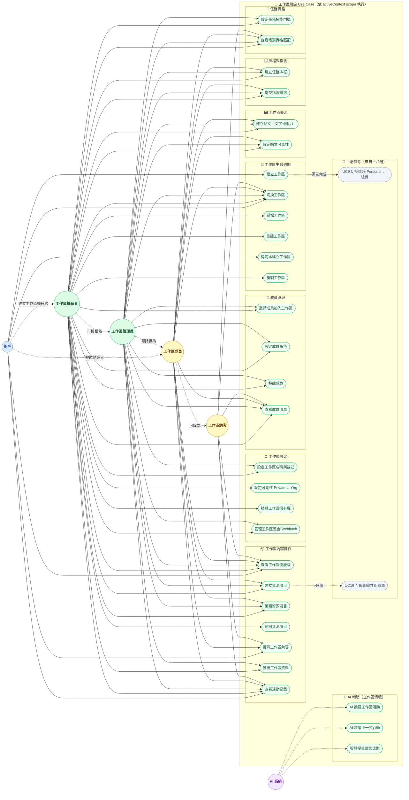

---

## 設計備註

- **WS2 切換工作區** 與上層的 UC9 切換情境不同：UC9 是 Personal ↔ Org 的大情境切換，WS2 是同一情境下多個工作區之間的切換。
- **可見性（WS8）**：`Private` = 僅工作區成員可見；`Org-visible` = 同組織所有成員可瀏覽但不可編輯。
- **WSAdmin 限制**：無法執行 WS3（歸檔）、WS4（刪除）、WS6（複製）、WS8（改可見性）、WS9（移轉擁有權）、WS18（刪除資源項目），避免過度授權。
- **WS18 刪除策略**：刪除僅限 WSOwner；WSAdmin/WSMember 不提供直接刪除，改採資源層歸檔（R11）與流程審核替代。
- **Team/Partner 放位**：`Team` 留在 L1 組織治理語意；`Partner` 在 L2 以邀請後 ACL 映射為 `WSMember/WSViewer`。
- **WS5 從範本建立** 依訂閱方案 gating，部分範本為 Pro/Enterprise 限定。
- **資料隔離**：工作區內所有查詢必須攜帶 `workspaceId` scope，`orgId`/`personalId` 由上層 `activeContext` 帶入，不重複傳遞。
- **下一層**：工作區內的 `Resource / Item` 層級（單一資源的 CRUD 詳細流程）見 `use-case-diagram-resource.md`。
- **技能門檻先於指派**：`WS29 設定任務技能門檻` 是 `WS28 提交指派需求` 的前置條件，若任務未定義門檻則只能做人工指派，不能做資格匹配推薦。

### WS29 門檻對照（`required_level` -> XP）

| `required_level` | 門檻名稱 | 通過門檻所需 `user_skill.xp_total` |
|---|---|---|
| `1` | Apprentice（學徒） | `>= 0` |
| `2` | Journeyman（熟練） | `>= 75` |
| `3` | Expert（專家） | `>= 150` |
| `4` | Artisan（大師） | `>= 225` |
| `5` | Grandmaster（宗師） | `>= 300` |
| `6` | Legendary（傳奇） | `>= 375` |
| `7` | Titan（泰坦） | `>= 450` |

> 判定規則：`matching_result.threshold_passed = (user_skill.current_level >= task_skill_requirement.required_level)`，等級由 `xp_total` 依上表推導。

## 增量設計（功能 1 / 2）

| 功能 | L2 放位（工作區層） | 對應文件 |
|---|---|---|
| 1. 組織<->工作區照片牆 | `F1-L2-1 建立貼文（文字+圖片）`、`F1-L2-2 貼文可見性設定` | `docs/architecture/specs/org-workspace-feed-architecture.md` |
| 2. 工作區排程 + 組織指派 | `F2-L2-1 建立任務排程`、`F2-L2-2 提交指派需求` | `docs/architecture/specs/scheduling-assignment-architecture.md` |
````

## File: src/features/auth/service/bootstrap-client-capabilities.ts
````typescript
import {
	logFirebaseAnalyticsEvent,
	setFirebaseAnalyticsActor,
} from "#/integrations/firebase/analytics.write";
import type { FirebaseForegroundMessageRecord } from "#/integrations/firebase/anti-corruption";
import { subscribeFirebaseAppCheckToken } from "#/integrations/firebase/app-check.read";
import {
	initializeFirebaseAppCheck,
	setFirebaseAppCheckAutoRefresh,
} from "#/integrations/firebase/app-check.write";
import {
	type FirebaseAuthSession,
	subscribeAuthSession,
} from "#/integrations/firebase/auth.read";
import { firebaseClientFeatureConfig } from "#/integrations/firebase/client";
import { mergeFirestoreDocument } from "#/integrations/firebase/firestore.write";
import {
	getFirebaseMessagingToken,
	registerFirebaseMessagingServiceWorker,
	subscribeFirebaseForegroundMessages,
} from "#/integrations/firebase/messaging.read";
import { deleteFirebaseMessagingToken } from "#/integrations/firebase/messaging.write";
import {
	BROWSER_DEVICE_DOCUMENT_ID,
	type UserDeviceRegistrationDocument,
	type UserProfileDocument,
} from "./capability-contracts";
import {
	resetCapabilityRuntime,
	updateCapabilityRuntime,
} from "./capability-runtime";
export function startFirebaseClientCapabilityBootstrap(): () => void
⋮----
let stopAppCheck = () =>
let stopForegroundMessages = () =>
const clearCapabilitySubscriptions = () =>
⋮----
stopAppCheck = () =>
stopForegroundMessages = () =>
⋮----
function createDeviceRegistration(
		partial: Partial<UserDeviceRegistrationDocument> = {},
): UserDeviceRegistrationDocument
async function syncUserProfile(
		session: FirebaseAuthSession,
		payload: Partial<UserProfileDocument>,
)
async function syncDeviceRegistration(
		session: FirebaseAuthSession,
		payload: Partial<UserDeviceRegistrationDocument>,
)
async function persistForegroundMessage(
		session: FirebaseAuthSession,
		message: FirebaseForegroundMessageRecord,
		messagingToken: { token: string; provider: string } | null,
)
async function syncSessionCapabilities(session: FirebaseAuthSession | null)
````

## File: src/features/graph/service/commands/move-node.ts
````typescript
import {
	type GraphRealtimeSnapshot,
	subscribeGraphRealtime,
	writeGraphRealtime,
} from "#/integrations/firebase/realtime";
export interface MoveNodeInput {
	workspaceId: string;
	nodeId: string;
	x: number;
	y: number;
}
export async function moveNode(input: MoveNodeInput): Promise<void>
function readOnce(workspaceId: string): Promise<GraphRealtimeSnapshot>
````

## File: src/features/graph/service/commands/reorder-node.ts
````typescript
import { moveNode } from "#/features/graph/service/commands/move-node";
export interface ReorderNodeInput {
	workspaceId: string;
	nodeId: string;
	targetX: number;
	targetY: number;
}
export async function reorderNode(input: ReorderNodeInput): Promise<void>
````

## File: src/features/graph/service/sync-graph.ts
````typescript
import {
	type GraphRealtimeSnapshot,
	subscribeGraphRealtime,
} from "#/integrations/firebase/realtime";
import {
	createGraphDataSet,
	type GraphVisDataSet,
	syncGraphDataSet,
} from "#/integrations/vis/dataset";
export interface GraphSyncHandle {
	dataSet: GraphVisDataSet;
	dispose: () => void;
}
export function startGraphSync(workspaceId: string): GraphSyncHandle
````

## File: src/integrations/firebase/analytics.write.ts
````typescript
import {
	getAnalytics,
	isSupported,
	logEvent,
	setUserId,
} from "firebase/analytics";
import { firebaseClientApp, firebaseClientFeatureConfig } from "./client";
import { isFirebaseBrowserRuntime } from "./runtime";
type FirebaseAnalyticsValue = string | number | boolean | null;
export type FirebaseAnalyticsParams = Record<string, FirebaseAnalyticsValue>;
⋮----
async function getFirebaseAnalyticsInstance()
export async function logFirebaseAnalyticsEvent(
	eventName: string,
	params: FirebaseAnalyticsParams = {},
): Promise<boolean>
export async function setFirebaseAnalyticsActor(
	userId: string | null,
): Promise<boolean>
````

## File: src/integrations/firebase/app-check.read.ts
````typescript
import { getToken, onTokenChanged } from "firebase/app-check";
import {
	type FirebaseAppCheckTokenRecord,
	mapAppCheckToken,
} from "./anti-corruption";
import { initializeFirebaseAppCheck } from "./app-check.write";
export async function getFirebaseAppCheckToken(
	forceRefresh = false,
): Promise<FirebaseAppCheckTokenRecord | null>
export async function subscribeFirebaseAppCheckToken(
	onData: (token: FirebaseAppCheckTokenRecord | null) => void,
): Promise<() => void>
````

## File: src/integrations/firebase/app-check.write.ts
````typescript
import {
	type AppCheck,
	initializeAppCheck,
	ReCaptchaV3Provider,
	setTokenAutoRefreshEnabled,
} from "firebase/app-check";
import { firebaseClientApp, firebaseClientFeatureConfig } from "./client";
import { isFirebaseBrowserRuntime } from "./runtime";
⋮----
export async function initializeFirebaseAppCheck(): Promise<AppCheck | null>
export async function setFirebaseAppCheckAutoRefresh(
	enabled: boolean,
): Promise<boolean>
````

## File: src/integrations/firebase/messaging.write.ts
````typescript
import { deleteToken, getMessaging, isSupported } from "firebase/messaging";
import { firebaseClientApp } from "./client";
import { isFirebaseBrowserRuntime } from "./runtime";
⋮----
async function getFirebaseMessagingInstance()
export async function deleteFirebaseMessagingToken(): Promise<boolean>
````

## File: src/integrations/firebase/realtime.ts
````typescript
import { onValue, ref, set } from "firebase/database";
import { firebaseRealtimeDatabase } from "./client";
export interface GraphRealtimeNode {
  id: string
  label: string
  x?: number
  y?: number
  updatedAt?: number
}
export interface GraphRealtimeEdge {
  id: string
  from: string
  to: string
  label?: string
  updatedAt?: number
}
export interface GraphRealtimeSnapshot {
  nodes: GraphRealtimeNode[]
  edges: GraphRealtimeEdge[]
}
export function subscribeGraphRealtime(
  workspaceId: string,
  onData: (snapshot: GraphRealtimeSnapshot) => void,
): () => void
export async function writeGraphRealtime(
  workspaceId: string,
  payload: GraphRealtimeSnapshot,
): Promise<void>
````

## File: src/integrations/firebase/runtime.ts
````typescript
export function isFirebaseBrowserRuntime(): boolean
````

## File: src/lib/ui/custom-ui/graph-empty-state.tsx
````typescript
import { Card, CardContent, CardHeader, CardTitle } from "#/lib/ui/shadcn/card";
import { m } from "#/paraglide/messages";
export function GraphEmptyState()
````

## File: src/lib/ui/custom-ui/graph-node-card.tsx
````typescript
import { useEffect, useRef, useState } from "react";
import {
	bindGraphDraggable,
	bindGraphDropTarget,
	type GraphDragPayload,
} from "#/integrations/pragmatic-dnd/adapter";
import { GraphDropIndicator } from "#/integrations/pragmatic-dnd/drop-indicator";
import { Badge } from "#/lib/ui/shadcn/badge";
import { Card, CardContent, CardHeader, CardTitle } from "#/lib/ui/shadcn/card";
export interface GraphNodeCardData {
	id: string;
	label: string;
	x: number;
	y: number;
}
interface GraphNodeCardProps {
	node: GraphNodeCardData;
	workspaceId: string;
	onReorder: (payload: GraphDragPayload, target: GraphNodeCardData) => void;
}
export function GraphNodeCard({
	node,
	workspaceId,
	onReorder,
}: GraphNodeCardProps)
````

## File: src/lib/ui/custom-ui/graph-toolbar.tsx
````typescript
import { Button } from "#/lib/ui/shadcn/button";
import { m } from "#/paraglide/messages";
interface GraphToolbarProps {
	onRefresh: () => void;
}
export function GraphToolbar(
````

## File: src/lib/ui/shadcn/badge.tsx
````typescript
import { cva, type VariantProps } from "class-variance-authority"
import { Slot } from "@radix-ui/react-slot"
import { cn } from "#/lib/utils"
⋮----
function Badge({
  className,
  variant = "default",
  asChild = false,
  ...props
}: React.ComponentProps<"span"> &
VariantProps<typeof badgeVariants> &
⋮----
className=
````

## File: src/lib/ui/shadcn/button.tsx
````typescript
import { cva, type VariantProps } from "class-variance-authority"
import { Slot } from "@radix-ui/react-slot"
import { cn } from "#/lib/utils"
⋮----
className=
````

## File: src/lib/ui/shadcn/sidebar.tsx
````typescript
import { cva, type VariantProps } from "class-variance-authority"
import { PanelLeftIcon } from "lucide-react"
import { Slot } from "radix-ui"
import { useIsMobile } from "#/lib/hooks/use-mobile"
import { cn } from "#/lib/utils"
import { Button } from "#/lib/ui/shadcn/button"
import { Input } from "#/lib/ui/shadcn/input"
import { Separator } from "#/lib/ui/shadcn/separator"
import {
  Sheet,
  SheetContent,
  SheetDescription,
  SheetHeader,
  SheetTitle,
} from "#/lib/ui/shadcn/sheet"
import { Skeleton } from "#/lib/ui/shadcn/skeleton"
import {
  Tooltip,
  TooltipContent,
  TooltipProvider,
  TooltipTrigger,
} from "#/lib/ui/shadcn/tooltip"
⋮----
type SidebarContextProps = {
  state: "expanded" | "collapsed"
  open: boolean
  setOpen: (open: boolean) => void
  openMobile: boolean
  setOpenMobile: (open: boolean) => void
  isMobile: boolean
  toggleSidebar: () => void
}
⋮----
function useSidebar()
⋮----
const handleKeyDown = (event: KeyboardEvent) =>
⋮----
className=
````

## File: src/routes/auth.tsx
````typescript
import { createFileRoute } from "@tanstack/react-router";
import { lazy, Suspense } from "react";
⋮----
function AuthRoutePage()
````

## File: src/routes/graph.tsx
````typescript
import { createFileRoute } from "@tanstack/react-router";
import { lazy, Suspense } from "react";
⋮----
function GraphRoutePage()
````

## File: .serena/memories/repo/project_folder_tree_plan.md
````markdown
# project_folder_tree_plan

> **Tags**: `#architecture` `#folder-tree` `#planning` `#correctness-first`

## 規劃目標

- 以「正規架構」與「架構正確性優先」為核心，先固定資料夾樹，再進行內容擴充。
- 將 `docs/architecture` 作為架構 SSOT 文件樹，其他模組僅引用，不重複定義。

## A. 專案頂層（規劃基準）

```text
xuanwu-platform/
├─ .github/                  # 規範、模板、Copilot/Agent 設定
├─ .serena/                  # Serena 專案記憶（架構索引與決策）
├─ .vscode/                  # IDE / MCP 設定（非業務邏輯）
├─ docs/                     # 架構與流程文件（SSOT）
├─ messages/                 # i18n 訊息來源
├─ public/                   # 靜態資源
├─ src/                      # 應用程式實作
├─ package.json
└─ biome.json / tsconfig.json / vite.config.ts
```

## B. docs/architecture（先規劃再填充）

```text
docs/architecture/
├─ README.md                           # 總導覽（層級、狀態、順序）
├─ use-cases/                          # L1-L5 邊界驗證輸入
│  ├─ use-case-diagram-saas-basic.md
│  ├─ use-case-diagram-workspace.md
│  ├─ use-case-diagram-resource.md
│  ├─ use-case-diagram-sub-resource.md
│  └─ use-case-diagram-sub-behavior.md
├─ models/                             # L6 領域模型
│  ├─ README.md
│  └─ domain-model.md
├─ specs/                              # L7 契約與功能規格
│  ├─ README.md
│  ├─ contract-spec.md
│  ├─ resource-attribute-matrix.md
│  ├─ resource-relationship-graph.md
│  ├─ org-workspace-feed-architecture.md
│  └─ scheduling-assignment-architecture.md
├─ blueprints/                         # L8 應用服務與 Saga
│  ├─ README.md
│  └─ application-service-spec.md
├─ guidelines/                         # L9 基礎設施準則
│  ├─ README.md
│  └─ infrastructure-spec.md
├─ diagrams/                           # 只放匯出圖（PNG/SVG）
│  └─ README.md
├─ patterns/                           # 模式與 Mermaid Legend/Quality 規範
│  └─ README.md
├─ glossary/                           # 術語對齊（Ubiquitous Language）
│  └─ README.md
└─ adr/                                # 架構決策記錄
   ├─ README.md
   └─ ADR-000x-*.md
```

## C. src（規劃建議，保持邊界清楚）

```text
src/
├─ routes/                  # 路由入口與頁面組裝
├─ features/                # 業務切片與 feature UI
├─ lib/                     # 技術工具、shadcn primitive、共用 low-level 能力
│  └─ ui/
│     └─ shadcn/            # shadcn 官方元件唯一位置
│     └─ custom-ui/         # shadcn 再加工元件唯一位置
├─ data/                    # 靜態/示例資料
├─ integrations/            # 第三方整合封裝
├─ utils/                   # 通用工具
└─ paraglide/               # i18n runtime
```

## UI 目錄硬規則

- shadcn 官方元件只能放在 `src/lib/ui/shadcn/*`
- shadcn 再加工元件只能放在 `src/lib/ui/custom-ui/*`
- 不建立 `src/components` 作為通用 UI 容器
- 業務 UI 一律放在 `src/features/*/ui`

## D. 邊界優先工作流（固定）

1. 先更新 `docs/architecture/README.md` 與層級規劃。
2. 先做 L1-L5 邊界驗證。
3. 再做 L6-L9 設計文件。
4. 最後才出 Mermaid 圖與匯出圖檔。

## E. 禁止事項

- 不允許先畫 Mermaid 再回補邊界定義。
- 不允許在 `diagrams/` 放未對應 SSOT 的草圖。
- 不允許在多處重複定義同一術語與規則（以 glossary/specs 為準）。
````

## File: .serena/memories/repo/tech_stack_core_from_package_json.md
````markdown
# tech_stack_core_from_package_json

> **Tags**: `#stack` `#package-json` `#core` `#tanstack` `#react` `#correctness-first`

## 來源

- 來源檔：`package.json`
- 原則：僅記錄「目前專案實際安裝且高機率必用」核心技術棧。

## 核心 Runtime Stack（必用）

1. `react` / `react-dom`（React 19）
2. `@tanstack/react-start`（App 框架核心）
3. `@tanstack/react-router` + `@tanstack/history`（路由核心）
4. `@tanstack/react-query` + `@tanstack/query-core`（資料查詢/快取）
5. `@tanstack/start-server-functions-handler`（Server Functions handler）
6. `@trpc/client` + `@trpc/server` + `@trpc/tanstack-react-query`（型別安全 API）
7. `zod`（輸入/契約驗證）
8. `superjson`（序列化策略）

## 核心互動 / 狀態 / 視覺化（必用）

1. `@atlaskit/pragmatic-drag-and-drop`
2. `@atlaskit/pragmatic-drag-and-drop-hitbox`
3. `@atlaskit/pragmatic-drag-and-drop-react-drop-indicator`
4. `xstate` + `@xstate/react`
5. `vis-data` + `vis-network` + `vis-timeline` + `vis-graph3d`

## 核心 UI / Styling Stack（必用）

1. `tailwindcss` + `@tailwindcss/vite`（樣式系統）
2. `class-variance-authority` + `clsx` + `tailwind-merge`（樣式組合）
3. `radix-ui` + `lucide-react`（UI primitive 與圖示）
4. `tw-animate-css`（動畫輔助）

## 開發基礎工具（必用）

1. `typescript`
2. `vite` + `@vitejs/plugin-react` + `vite-tsconfig-paths`
3. `@biomejs/biome`（format/lint/check）
4. `vitest` + `@testing-library/react` + `jsdom`

## i18n / 平台整合（高機率必用）

1. `@inlang/paraglide-js`（i18n runtime）
2. `@modelcontextprotocol/sdk`（MCP 協議整合）
3. `@capacitor/core` + `@capacitor/cli`（Apple App / Android 打包與原生 bridge 基礎）

## Mobile Packaging Guardrail

- Capacitor 是雙平台上架（App Store / Google Play）的必要基礎，不可降級為 optional。
- 行動端原生能力需透過 Capacitor bridge 邊界接入，不得以 ad-hoc 平台分支繞過既有架構。

## TanStack 擴展（按功能啟用，不預設全必用）

- `@tanstack/react-form` / `@tanstack/react-table` / `@tanstack/react-virtual` / `@tanstack/react-store`
- `@tanstack/ai*` 家族
- `@tanstack/intent`
- `@tanstack/react-devtools` / `@tanstack/react-router-devtools` / `@tanstack/react-query-devtools`

## 使用準則（架構正確性優先）

- 先確立邊界與契約，再決定是否引入擴展套件。
- `latest` 版本依賴在重大改動前需先做相容性驗證（尤其 TanStack 套件群）。
- Mermaid 文件只描述已被邊界驗證的設計，不反向驅動技術選型。
````

## File: components.json
````json
{
  "$schema": "https://ui.shadcn.com/schema.json",
  "style": "new-york",
  "rsc": false,
  "tsx": true,
  "tailwind": {
    "config": "",
    "css": "src/styles.css",
    "baseColor": "zinc",
    "cssVariables": true,
    "prefix": ""
  },
  "aliases": {
    "components": "#/lib/ui",
    "utils": "#/lib/utils",
    "ui": "#/lib/ui/shadcn",
    "lib": "#/lib",
    "hooks": "#/lib/hooks"
  },
  "iconLibrary": "lucide"
}
````

## File: docs/architecture/diagrams/README.md
````markdown
# diagrams/ — 圖表匯出資源

> **用途**：存放由 Mermaid 定義或工具產生的**靜態圖表圖片**（PNG / SVG）。
> 原始 Mermaid 程式碼留在各層的 `.md` 文件內；此資料夾只存放匯出快照用於簡報或外部引用。

---

## 命名規則

```
{layer}-{diagram-type}-{short-name}-{YYYY-MM-DD}.{ext}
```

範例：
- `L3-usecase-resource-2025-01-01.png`
- `L6-er-domain-model-2025-01-15.svg`
- `L8-sequence-assignment-saga-2025-02-01.png`

---

## 注意事項

- 圖片不可作為架構設計的 SSOT；SSOT 永遠是對應的 `.md` 文件。
- 圖片更新時，同步更新檔名中的日期，舊版本可直接覆蓋或刪除。
- 大型圖片（> 500KB）請先壓縮再提交。

---

## Mermaid 出圖前檢查模板（Boundary-First）

> 原則：Serena 能做高品質 Mermaid 的前提，是先做架構邊界驗證，不是直接畫圖。

### A. 邊界完成度

- [ ] L1-L3 已完成（平台/工作區/資源）
- [ ] L4 已完成（子資源 ownership/scope/parent_id）
- [ ] L5 已完成（行為守衛/狀態機/事件）
- [ ] L6-L9 已同步（domain/spec/blueprint/guideline）

### B. 圖面一致性

- [ ] 每個節點都標示 scope（workspace / org / personal）
- [ ] 每條關係都有語義（depends_on / requires_skill / feed_source）
- [ ] 每條狀態轉移都有觸發條件（command 或 event）
- [ ] 拒絕路徑與 guard failure 有明確標示

### C. 可追溯性

- [ ] 圖中的術語都可在 `../glossary/README.md` 查到
- [ ] 圖中流程都可在 `../specs/contract-spec.md` 對到 command/event
- [ ] 圖中決策都可在 `../adr/README.md` 對到 ADR

---

## 推薦出圖流程

1. 先更新對應層文件（use-cases / models / specs / blueprints / guidelines）。
2. 用本模板完成 A/B/C 三段檢查。
3. 再產生 Mermaid 並匯出 PNG/SVG。
4. 最後更新 `docs/architecture/README.md` 的狀態與索引。

---

## Diagram Catalog 模板

| Diagram ID | 圖類型 | 來源文件 | 邊界狀態 | 匯出檔案 | 審核狀態 | 更新日 |
|-----------|--------|---------|---------|---------|---------|-------|
| `L5-SM-task-item` | stateDiagram | `docs/architecture/use-cases/use-case-diagram-sub-behavior.md` | Verified | `L5-state-task-item-YYYY-MM-DD.svg` | Draft | YYYY-MM-DD |
| `L8-SEQ-xp-settlement` | sequenceDiagram | `docs/architecture/blueprints/application-service-spec.md` | Verified | `L8-sequence-xp-settlement-YYYY-MM-DD.png` | Draft | YYYY-MM-DD |

欄位規則：

- `Diagram ID`：跨文件唯一，推薦格式 `{Layer}-{Type}-{Name}`。
- `邊界狀態`：`Draft` / `Validated` / `Verified`。
- `審核狀態`：`Draft` / `Reviewed` / `Published`。
````

## File: docs/architecture/glossary/README.md
````markdown
# glossary/ — Architecture Glossary

> **用途**：定義專案中使用的核心術語、領域模型名稱與技術層級對應。確保開發團隊在溝通與命名上具備一致的語言（Ubiquitous Language）。

---

## L1-L9 層級詞彙

| 詞彙 | 定義 | 參考 |
|-----|------|------|
| L1 Platform Boundary | 平台/個人/組織的頂層邊界 | `../use-cases/use-case-diagram-saas-basic.md` |
| L2 Workspace Boundary | 工作區生命週期與 ACL 邊界 | `../use-cases/use-case-diagram-workspace.md` |
| L3 Resource Boundary | 資源型別與操作邊界（R1-R53）| `../use-cases/use-case-diagram-resource.md` |
| L4 Sub-Resource Boundary | 子資源 ownership/scope/parent 規則 | `../use-cases/use-case-diagram-sub-resource.md` |
| L5 Sub-Behavior Boundary | 命令行為、守衛、狀態機與事件 | `../use-cases/use-case-diagram-sub-behavior.md` |
| L6 Domain Model | 聚合根、不變式、跨聚合事件橋 | `../models/domain-model.md` |
| L7 Contract | Command/Event 型別與 payload 契約 | `../specs/contract-spec.md` |
| L8 Application Service | Handler/Saga 編排層 | `../blueprints/application-service-spec.md` |
| L9 Infrastructure | Repository/EventBus/Adapter 實作層 | `../guidelines/infrastructure-spec.md` |

---

## 角色與情境詞彙

| 詞彙 | 定義 |
|-----|------|
| activeContext | 當前使用者活躍情境，至少包含 userId、orgId、workspaceId、role |
| OrgOwner | 組織擁有者，具跨工作區高權限 |
| WSOwner / WSAdmin / WSMember / WSViewer | 工作區四級角色層級 |
| Scope | 資源可見與可操作範圍：workspace / org / personal |

---

## 領域模型詞彙

| 詞彙 | 定義 |
|-----|------|
| Aggregate Root | 聚合根，封裝狀態轉移與不變式的唯一入口 |
| TaskItem Aggregate | WBS 任務聚合（epic/feature/story/task/subtask） |
| Post Aggregate | 貼文聚合，包含 post_media |
| ScheduleItem Aggregate | 排程聚合，包含 assignment_record |
| UserSkill Aggregate | 技能資產聚合，包含 skill_mint_log |
| FeedProjection | Read Model（CQRS），只能由事件管線建立或更新 |

---

## Guard 與一致性詞彙

| 詞彙 | 定義 |
|-----|------|
| ScopeGuard | 驗證 actor 情境與資源 scope 是否一致 |
| IdempotencyGuard | 保證重送同指令不重複執行 |
| OptimisticLockGuard | 以 version 防止併發覆寫 |
| DFSCycleGuard | 驗證任務依賴圖不形成循環 |
| ThresholdGuard | 驗證技能門檻是否達標 |
| AvailabilityConflictGuard | 驗證排程時段是否衝突 |

---

## 事件與流程詞彙

| 詞彙 | 定義 |
|-----|------|
| Domain Event | 聚合狀態改變後發出的不可變事件 |
| Saga | 跨聚合長流程協調者，透過事件驅動，不直接承載領域規則 |
| Read Model | 供查詢最佳化的投影資料模型 |
| DLQ | Dead Letter Queue，事件重試失敗後的隔離佇列 |

---

## 術語治理規則

1. 文件與程式命名優先使用本詞彙表術語。
2. 新增術語時，需補上「定義 + 所屬層級 + 參考文件」。
3. 若術語語義改變，需同步更新對應 ADR 或 specs。
4. Mermaid 圖使用術語前，先確認該術語已在本表定義。
````

## File: docs/architecture/specs/org-workspace-feed-architecture.md
````markdown
# L7 社群動態架構規格 — Org / Workspace / Feed Architecture

> **層級定位**：本文件定義組織 (Org)、工作區 (Workspace)、以及社群動態 (Feed) 三個核心維度的架構設計：創建流程、情境切換 (activeContext)、貼文發佈流程（Post → FeedProjection）。
> 來源：[L1 UC8/UC9](../use-cases/use-case-diagram-saas-basic.md)、[L2 WS1-WS26](../use-cases/use-case-diagram-workspace.md)、[L3 R46](../use-cases/use-case-diagram-resource.md)、[L5 SB20-SB22](../use-cases/use-case-diagram-sub-behavior.md)

---

## 一、Org 與 Workspace 層級結構

```
Platform
  └── Org（組織，ADR-0005 — GitHub Repository 模型）
        ├── workspace 1
        │     ├── member A（WSOwner）
        │     └── member B（WSMember）
        ├── workspace 2
        │     └── member A（WSAdmin）
        └── workspace 3 （personal workspace）
              └── owner A（WSOwner）
```

### Org 不變式

| 規則 | 描述 |
|-----|-----|
| 唯一 OrgOwner | 每個 Org 有且僅有一個 OrgOwner |
| OrgOwner 繼承 | OrgOwner 自動對其擁有的所有 Workspace 具有 WSOwner 等效權限 |
| Workspace 建立 | 只有 OrgOwner/OrgAdmin 可建立 Workspace（L2 WS1） |
| activeContext | 用戶同時只能有一個活躍的 `activeContext`（orgId + workspaceId）|

---

## 二、activeContext 情境模型（ADR-0005）

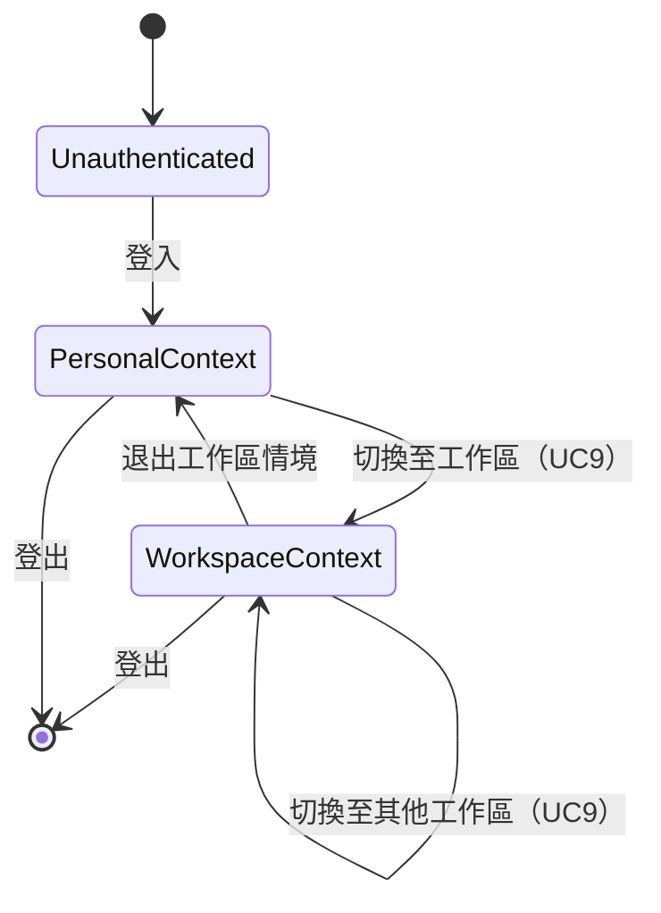

### activeContext 物件結構

```typescript
interface ActiveContext {
  userId: string;
  orgId: string;           // 當前組織
  workspaceId: string;     // 當前工作區（可為個人工作區）
  role: WorkspaceRole;     // WSOwner | WSAdmin | WSMember | WSViewer
  orgRole: OrgRole;        // OrgOwner | OrgAdmin | OrgMember
}
```

### 情境切換規則

1. 用戶必須先加入 Org 成為 OrgMember（UC8/UC10）才可進入該 Org 的 Workspace。
2. 切換 Workspace 不需重新認證，僅需驗證成員關係（`membership` 記錄存在且 `status = active`）。
3. `activeContext` 存放在 Session / JWT Claim，不是 DB 欄位。
4. 所有 Command 的 ScopeGuard（SB51）從 `activeContext` 取 workspaceId / orgId 進行比對。

---

## 三、Workspace 角色層級

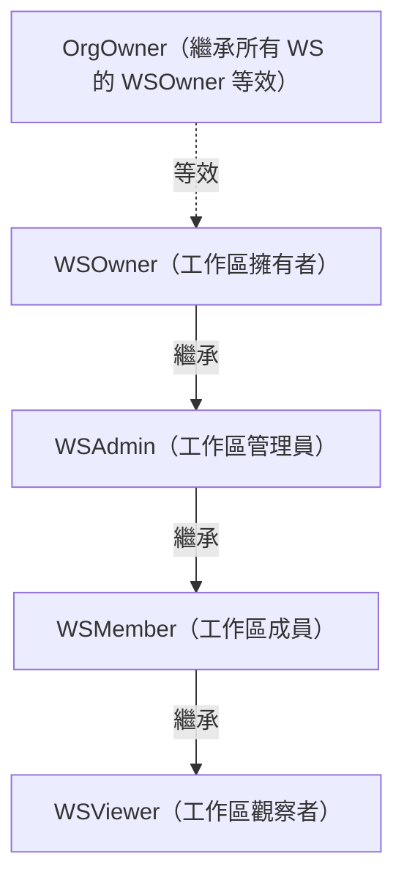

| 角色 | 建立資源 | 指派任務 | 修改成員 | 存檔/刪除工作區 |
|------|---------|---------|---------|----------------|
| WSOwner | ✅ | ✅ | ✅ | ✅ |
| WSAdmin | ✅ | ✅ | ✅（非 WSOwner）| ❌ |
| WSMember | ✅（自己的）| ❌ | ❌ | ❌ |
| WSViewer | ❌ | ❌ | ❌ | ❌ |

---

## 四、貼文發佈流程（Post → FeedProjection Pipeline）

### 流程圖

```mermaid
sequenceDiagram
    actor Actor
    participant AppService as L8 Application Service
    participant PostAggregate as Post Aggregate (L6)
    participant EventBus as L9 Event Bus
    participant FeedPipeline as Feed Projection Pipeline (L8)
    participant FeedDB as feed_projection (org scope)

    Actor->>AppService: PublishPostCommand { postId, actorId }
    AppService->>AppService: ScopeGuard(workspaceId) ✅
    AppService->>AppService: IdempotencyGuard(idempotencyKey) ✅
    AppService->>PostAggregate: post.publish()
    PostAggregate-->>AppService: PostPublished event
    AppService->>PostAggregate: save(version++)
    AppService->>EventBus: publish(PostPublished)
    EventBus-->>FeedPipeline: PostPublished event
    FeedPipeline->>FeedDB: INSERT feed_projection (org scope)
    FeedPipeline-->>EventBus: FeedProjectionCreated event
```

### FeedProjection 寫入規則（ADR-0003）

| 規則 | 說明 |
|-----|-----|
| 只有事件管線可寫 | `feed_projection` 表不能被任何 Command 直接 INSERT/UPDATE |
| 來源為 `PostPublished` 事件 | FeedPipeline 訂閱此事件，確認 `post.status = published` 後建立 |
| Org scope 投影 | 同一個 Org 下所有成員可見（不限 Workspace）|
| Idempotent 建立 | FeedPipeline 使用 `sourcePostId` 作為 upsert key，防止重複投影 |
| 不可由 Command 刪除 | 存檔貼文時，只發出 `PostArchived`；FeedPipeline 負責將對應 projection 標記隱藏 |

---

## 五、Post 狀態機

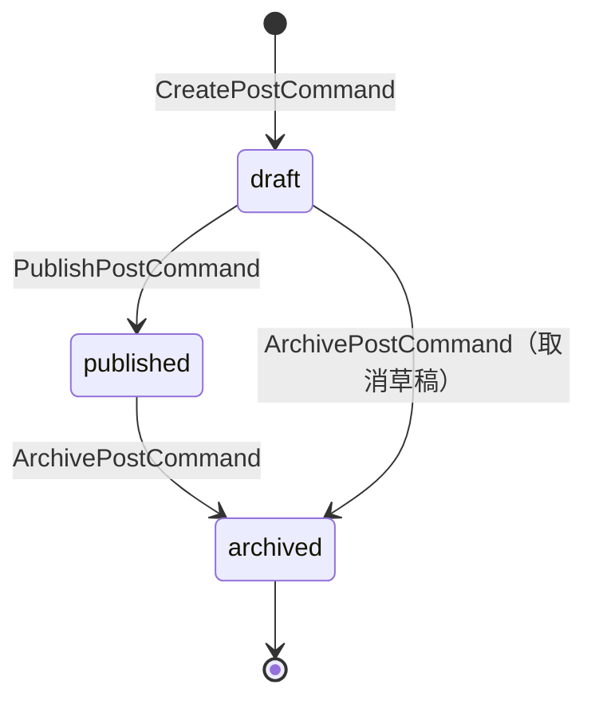

| State | 可見性 | 可操作 |
|-------|-------|-------|
| `draft` | 僅業務 owner 可見 | publish / archive |
| `published` | Workspace 成員可見（Feed 投影到 Org）| archive |
| `archived` | 僅 WSAdmin+ 可查閱 | — |

---

## 六、資料流全覽（L1→L6 Mapping）

| 操作 | L1/L2 UC | L3 Resource | L5 Command | L6 Aggregate | L8 Pipeline |
|-----|---------|------------|-----------|-------------|------------|
| 建立組織 | UC8 | org | — | Org（非 resource_items）| — |
| 切換情境 | UC9 | — | — | activeContext（session）| — |
| 建立貼文 | WS25 | R21（post）| CreatePostCommand | Post | — |
| 發佈貼文 | WS26 | R21（post）→ R46（feed）| PublishPostCommand | Post | FeedProjection Pipeline |
| Feed 投影 | L3 R46 | feed_projection | （事件管線，非 Command）| — | FeedProjection Pipeline |
````

## File: docs/architecture/specs/resource-attribute-matrix.md
````markdown
# L7 資源屬性矩陣 — Resource Attribute Matrix

> **層級定位**：本文件定義系統所有 20 個 resource_type 的欄位規格、scope 語義، dual-ownership 規則與儲存策略。
> 來源：[L3 Use Case Diagram Resource](../use-cases/use-case-diagram-resource.md)、[L6 Domain Model](../models/domain-model.md)

---

## 三表基礎模型

```sql
-- 型別定義表（系統常數，CDN 配置層管理）
resource_types (
  code              VARCHAR(50) PRIMARY KEY,    -- 'task_item', 'post', ...
  name              VARCHAR(100) NOT NULL,
  required_fields   JSONB NOT NULL DEFAULT '[]',
  validation_rules  JSONB NOT NULL DEFAULT '{}',
  state_machine_id  VARCHAR(50),               -- 對應 L6 state machine 定義
  default_scope     VARCHAR(20) NOT NULL        -- 'workspace' | 'org' | 'personal'
);

-- 資源實例表（所有資源的統一儲存）
resource_items (
  id                UUID PRIMARY KEY DEFAULT gen_random_uuid(),
  type              VARCHAR(50) NOT NULL REFERENCES resource_types(code),
  sub_type          VARCHAR(50),               -- WBS level discriminator
  workspace_id      UUID,                      -- nullable（org/personal scope 資源）
  org_id            UUID,                      -- nullable（workspace/personal scope 資源）
  personal_id       UUID,                      -- nullable（workspace/org scope 資源）
  parent_id         UUID REFERENCES resource_items(id),
  assignee_id       UUID,                      -- 業務 owner（接受者）
  business_owner_id UUID NOT NULL,             -- 業務 owner（建立者或提名人）
  status            VARCHAR(30) NOT NULL DEFAULT 'draft',
  version           INTEGER NOT NULL DEFAULT 0,
  extension_fields  JSONB NOT NULL DEFAULT '{}',
  created_at        TIMESTAMPTZ NOT NULL DEFAULT NOW(),
  updated_at        TIMESTAMPTZ NOT NULL DEFAULT NOW()
);

-- 資源關聯表（依賴、技能需求、feed 投影連結等）
resource_relations (
  id            UUID PRIMARY KEY DEFAULT gen_random_uuid(),
  from_id       UUID NOT NULL REFERENCES resource_items(id),
  to_id         UUID NOT NULL REFERENCES resource_items(id),
  relation_type VARCHAR(50) NOT NULL,          -- 'depends_on' | 'skill_requires' | ...
  workspace_id  UUID,
  created_by    UUID NOT NULL,
  created_at    TIMESTAMPTZ NOT NULL DEFAULT NOW()
);
```

---

## 20 個 Resource Type 屬性矩陣

| # | code | 中文名稱 | scope | parent_id 指向 | sub_type 用途 | status 狀態機 | 刪除策略 |
|---|------|---------|-------|--------------|----------------|-------------|---------|
| 1 | `task_item` | 工作項目（WBS 節點） | workspace | task_item（自引用）| epic \| feature \| story \| task \| subtask | 7-state（draft→archived）| forbidden（有子項）/ cascade（subtask）|
| 2 | `post` | 工作區貼文 | workspace | — | — | 3-state（draft→archived）| soft-delete |
| 3 | `post_media` | 貼文媒體附件 | workspace | post | image \| video \| file | — | cascade（隨 post）|
| 4 | `schedule_item` | 排程事項 | workspace | — | — | 5-state（pending→cancelled）| soft-delete |
| 5 | `assignment_record` | 指派記錄 | workspace | schedule_item | — | 5-state（pending→cancelled）| cascade（隨 schedule_item）|
| 6 | `availability_slot` | 時段可用性 | **org** | — | — | — | soft-delete（is_deleted） |
| 7 | `user_skill` | 用戶技能資產 | **personal** | — | — | — | forbidden |
| 8 | `skill_mint_log` | 技能鑄造紀錄 | personal | user_skill | — | 4-stage（declared→settled）| **immutable**（禁止刪除）|
| 9 | `skill` | 技能字典條目 | **org** | — | — | active \| deprecated | soft-delete |
| 10 | `task_skill_requirement` | 工作技能需求 | workspace | task_item | — | — | cascade（隨 task_item）|
| 11 | `matching_result` | 技能門檻匹配結果 | workspace | task_item | — | — | cascade（隨 task_item）|
| 12 | `feed_projection` | 動態消息投影（read model）| **org** | — | — | — | 不可由 Command 操作（ADR-0003）|
| 13 | `workspace` | 工作區 | org | — | — | active \| archived \| deleted | soft-delete |
| 14 | `org` | 組織 | — | — | — | active \| suspended \| deleted | soft-delete |
| 15 | `membership` | 成員關係 | workspace / org | — | workspace_member \| org_member | active \| suspended \| removed | soft-delete |
| 16 | `role_assignment` | 角色授權 | workspace | membership | — | — | cascade（隨 membership）|
| 17 | `skill_threshold` | 技能門檻設定 | workspace | task_item \| schedule_item | — | — | cascade |
| 18 | `comment` | 評論 | workspace | task_item \| post | — | 2-state（active \| deleted）| soft-delete |
| 19 | `notification` | 系統通知 | personal | — | — | unread \| read \| archived | soft-delete |
| 20 | `audit_log` | 稽核日誌 | org | — | — | — | **immutable**（禁止刪除）|

---

## Dual-Ownership 欄位語義

```
business_owner_id  → 資源的業務負責人（可被轉讓）
                     通常為建立者，可由 WSAdmin/WSOwner 指派給他人
assignee_id        → 資源的執行執行人（接受者）
                     task_item 的執行者；assignment_record 的受指派人
```

### Dual-Ownership 規則矩陣

| resource type | business_owner_id 語義 | assignee_id 語義 | 可轉讓？ |
|--------------|----------------------|-----------------|---------|
| `task_item` | 工作業主（負責完成）| 執行人（可不同於業主）| 雙欄均可轉讓 |
| `post` | 發文者（業主）| — | business_owner 可轉讓 |
| `schedule_item` | 排程建立者 | 指派目標人 | 雙欄均可轉讓 |
| `assignment_record` | 繼承自 schedule_item | 接受者（確認制）| 不可在已 confirmed 後轉讓 |
| `skill_mint_log` | 技能擁有者（user_id）| — | 不可轉讓（immutable）|
| `audit_log` | 系統（system-generated）| — | 不可轉讓 |

---

## Scope 隔離規則

```
workspace scope   → workspace_id NOT NULL, org_id 可填（用於 Feed/Skill 跨組織查詢），personal_id NULL
org scope         → org_id NOT NULL, workspace_id NULL, personal_id NULL
personal scope    → personal_id（= user_id）NOT NULL, workspace_id NULL, org_id NULL
```

### Scope Guard 驗證規則（SB51）

每個 Command 在入口必須確認 actor 的活躍情境（`activeContext`）中的 `workspaceId`、`orgId` 與資源的 scope 欄位一致：

| 資源 scope | 驗證邏輯 |
|-----------|---------|
| workspace | `actor.workspaceId == resource.workspace_id` AND `actor.orgId == resource.org_id` |
| org | `actor.orgId == resource.org_id` |
| personal | `actor.userId == resource.personal_id` |

---

## extension_fields JSONB Schema 範例

### task_item
```json
{
  "description": "string",
  "due_date": "ISO8601",
  "priority": "low|medium|high|critical",
  "gantt_start": "ISO8601",
  "gantt_end": "ISO8601",
  "story_points": "integer"
}
```

### post
```json
{
  "content": "string (markdown)",
  "tags": ["string"],
  "mentions": ["user_id"]
}
```

### skill_mint_log
```json
{
  "evidence_url": "string (L9 Storage URL)",
  "validator_comment": "string",
  "xp_proposal": "integer",
  "settled_at": "ISO8601"
}
```

### availability_slot
```json
{
  "recurrence_rule": "RRULE string (optional)",
  "timezone": "TZ identifier"
}
```
````

## File: docs/architecture/specs/resource-relationship-graph.md
````markdown
# L7 資源關聯圖 — Resource Relationship Graph

> **層級定位**：本文件定義 resource_items 之間的三類關聯拓撲：Parent-Child 樹、任務依賴圖（DAG）、以及技能圖（技能需求 + XP 等級）。
> 來源：[L3 Use Case R25](../use-cases/use-case-diagram-resource.md)、[L4 SR01–SR20](../use-cases/use-case-diagram-sub-resource.md)、[L5 SB14 DFS Guard](../use-cases/use-case-diagram-sub-behavior.md)、[L6 Domain Model](../models/domain-model.md)

---

## 三類關聯的儲存策略

| 關聯類型 | 儲存位置 | relation_type 值 | 特性 |
|---------|---------|----------------|-----|
| Parent-Child 樹 | `resource_items.parent_id` | — | 性能查詢；self-reference FK |
| 任務依賴 DAG | `resource_relations` | `depends_on` | 有向；必須無環（DFS 守衛） |
| 技能需求連結 | `resource_relations` | `requires_skill` | 有向；由 TaskItem 指向 Skill |
| Feed 投影連結 | `resource_relations` | `feed_source` | 有向；由 FeedProjection 指向 Post |

---

## 一、Parent-Child 樹（WBS Tree）

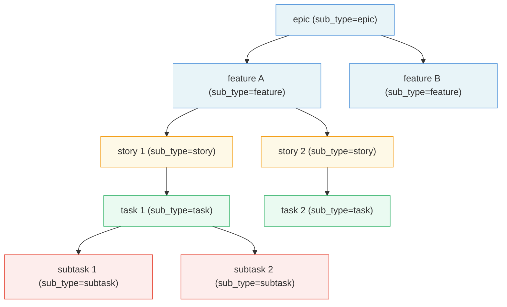

### 樹不變式

1. **無向環**：parent_id 路徑最長 5 層（epic → feature → story/task → subtask），應用層強制層級順序。
2. **同 workspace 隔離**：parent_id 所指向的資源必須與子資源擁有相同的 `workspace_id`。
3. **刪除策略**：
   - `subtask`：parent DELETE 時 cascade。
   - `epic / feature / story / task`：有子項目時 forbidden（必須先移除所有子孫節點）。
4. **根節點**：`parent_id IS NULL AND sub_type = 'epic'` 為工作區頂層節點。

---

## 二、任務依賴 DAG（Dependency Graph）

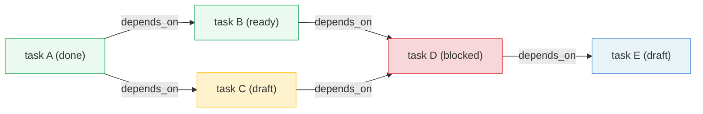

### DAG 不變式と DFS 守衛（SB14）

```
AddDependencyCommand(from: TaskA, to: TaskB)
  │
  ├── DFSCycleGuard 啟動
  │   └── 從 TaskB 出發做深度優先搜索
  │       → 若可抵達 TaskA，則判定形成環
  │
  ├── [有環] → 發出 CyclicDependencyDetected { cyclePath: [B, ..., A] }
  │             Command 失敗（HTTP 422）
  │
  └── [無環] → 寫入 resource_relations { from_id: A, to_id: B, relation_type: 'depends_on' }
               發出 DependencyAdded
```

**Gantt 閘控規則（R28）**：
- 任務若有未完成的依賴（`depends_on` 且依賴目標狀態非 `done`），則 Gantt view 應標記為 blocked。
- 應用層禁止在 Gantt 中拖動進入 `draft` 狀態的 blocked 任務。

---

## 三、技能圖（Skill Graph）

### A. 技能需求連結（TaskItem → Skill）

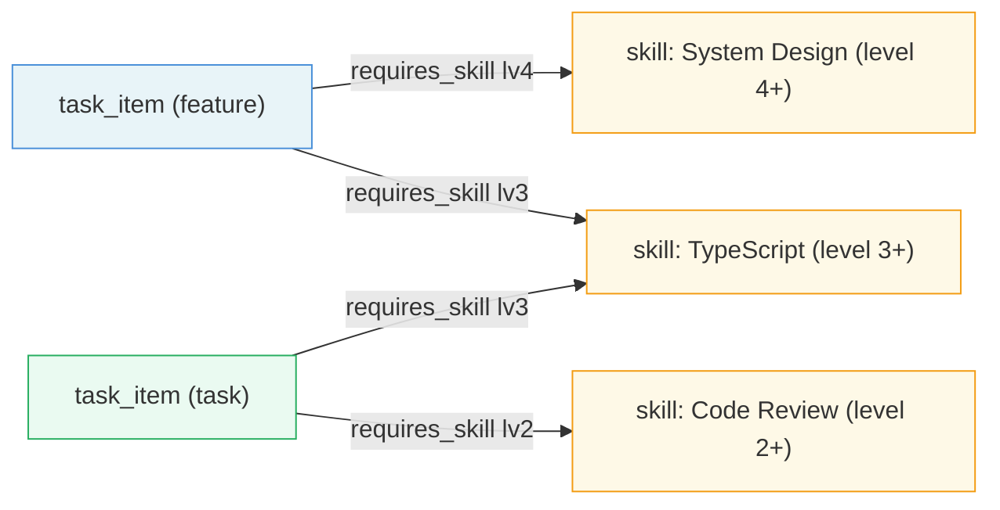

### B. UserSkill XP 積累圖

```mermaid
graph TD
    U["user_skill (userId + skillId)"]
    ML1["skill_mint_log #1 (settled, xp=30)"]
    ML2["skill_mint_log #2 (settled, xp=25)"]
    ML3["skill_mint_log #3 (under_validation)"]

    U -->|xp_total 累加| ML1
    U -->|xp_total 累加| ML2
    U -.->|pending| ML3

    XP["xp_total = 55 → level 1 (Journeyman)"]
    U --> XP

    style U fill:#fef9e7,stroke:#f39c12
    style ML1 fill:#eafaf1,stroke:#27ae60
    style ML2 fill:#eafaf1,stroke:#27ae60
    style ML3 fill:#fff3cd,stroke:#ffc107
    style XP fill:#e8f4f8,stroke:#4a90d9
```

### C. 技能門檻驗證流程（ThresholdGuard SB35）

```mermaid
flowchart LR
    CMD["CreateAssignmentCommand"]
    CHECK{"skill_threshold\n設定是否存在？"}
    FETCH["取得 assignee\n的 user_skill\n(xp_total, current_level)"]
    COMPARE{"current_level\n>= required_level?"}
    PASS["繼續建立 assignment_record"]
    FAIL["發出 ThresholdNotMet\nCommand 失敗"]

    CMD --> CHECK
    CHECK -->|"否（無門檻）"| PASS
    CHECK -->|"是"| FETCH
    FETCH --> COMPARE
    COMPARE -->|"是"| PASS
    COMPARE -->|"否"| FAIL
```

---

## XP 等級對照表（Level Table — 系統常數）

| Level | 名稱 | xp_total 下界 | xp_total 上界 | 說明 |
|-------|------|--------------|--------------|-----|
| 1 | Apprentice（學徒） | 0 | 74 | 入門級 |
| 2 | Journeyman（熟練） | 75 | 149 | 可接受基礎指派 |
| 3 | Expert（專家） | 150 | 224 | 可主導子任務 |
| 4 | Artisan（大師） | 225 | 299 | 可主導 Story 層級 |
| 5 | Grandmaster（宗師） | 300 | 374 | 可主導 Feature 層級 |
| 6 | Legendary（傳奇） | 375 | 449 | 可主導 Epic 層級 |
| 7 | Titan（泰坦） | 450 | 524 | 技能最高境界 |

> **Edge Case**：`xp_total >= 525` 時 `current_level` 保持 7（Titan），`xp_total` 繼續累積（為未來等級擴展保留空間）。

---

## 四、資源全域關聯圖（簡化版）

```mermaid
graph LR
    ORG["org"]
    WS["workspace"]
    MEMBER["membership"]
    TASK["task_item (WBS)"]
    POST["post"]
    MEDIA["post_media"]
    FEED["feed_projection (read model)"]
    SCHED["schedule_item"]
    ASSIGN["assignment_record"]
    AVAIL["availability_slot"]
    SKILL["skill (dict)"]
    USKILL["user_skill"]
    MINT["skill_mint_log"]
    REQ["task_skill_requirement"]

    ORG -->|has many| WS
    ORG -->|has many| MEMBER
    ORG -->|has skill dict| SKILL
    ORG -->|has many| AVAIL
    WS -->|has many| TASK
    WS -->|has many| POST
    WS -->|has many| SCHED
    POST -->|has many| MEDIA
    POST -.->|event pipeline→| FEED
    TASK -->|has many| REQ
    REQ -->|requires| SKILL
    SCHED -->|has many| ASSIGN
    ASSIGN -->|checks| AVAIL
    ASSIGN -->|checks| REQ
    SKILL -->|tracks| USKILL
    USKILL -->|has immutable log| MINT
    MINT -->|source task| TASK

    style FEED fill:#fff3cd,stroke:#ffc107
    style MINT fill:#f8d7da,stroke:#dc3545
```
````

## File: src/features/graph/ui/graph-canvas.tsx
````typescript
import { useEffect, useMemo, useState } from "react";
import { reorderNode } from "#/features/graph/service/commands/reorder-node";
import { startGraphSync } from "#/features/graph/service/sync-graph";
import { GraphControlsShadcn } from "#/features/graph/ui/graph-controls.shadcn";
import { createGraphNetworkOptions } from "#/integrations/vis/network";
import { GraphEmptyState } from "#/lib/ui/custom-ui/graph-empty-state";
import {
	GraphNodeCard,
	type GraphNodeCardData,
} from "#/lib/ui/custom-ui/graph-node-card";
import { m } from "#/paraglide/messages";
interface GraphCanvasProps {
	workspaceId: string;
}
⋮----
async function handleReorder(
		source: { nodeId: string },
		target: GraphNodeCardData,
)
function handleRefresh()
````

## File: src/features/graph/ui/graph-controls.shadcn.tsx
````typescript
import { GraphToolbar } from "#/lib/ui/custom-ui/graph-toolbar";
import { m } from "#/paraglide/messages";
interface GraphControlsProps {
	onRefresh: () => void;
}
export function GraphControlsShadcn(
````

## File: src/integrations/firebase/anti-corruption.ts
````typescript
import type { AppCheckTokenResult } from "firebase/app-check";
import type { User } from "firebase/auth";
import type { DocumentData } from "firebase/firestore";
import type { MessagePayload } from "firebase/messaging";
import type { FullMetadata } from "firebase/storage";
export interface FirebaseAuthSession {
	uid: string;
	email: string | null;
	displayName: string | null;
	photoURL: string | null;
	emailVerified: boolean;
	isAnonymous: boolean;
}
export interface FirebaseDocumentMetadata {
	version: number;
	createdAt: number | null;
	updatedAt: number | null;
	updatedBy: string | null;
}
export interface FirebaseDocumentWriteMetadata {
	version?: number;
	createdAt?: number;
	updatedAt?: number;
	updatedBy?: string | null;
}
export interface FirebaseDocumentRecord<TPayload> {
	id: string;
	data: TPayload;
	meta: FirebaseDocumentMetadata;
}
export interface FirebaseStorageObjectRecord {
	path: string;
	bucket: string;
	contentType: string | null;
	size: number;
	updatedAt: number | null;
	downloadTokens: string[];
}
export interface FirebaseAppCheckTokenRecord {
	token: string;
	expireTimeMillis: number | null;
}
export interface FirebaseMessagingTokenRecord {
	token: string;
	provider: "fcm";
}
export interface FirebaseForegroundMessageRecord {
	messageId: string | null;
	from: string | null;
	collapseKey: string | null;
	title: string | null;
	body: string | null;
	imageUrl: string | null;
	link: string | null;
	data: Record<string, string>;
}
function isRecord(value: unknown): value is Record<string, unknown>
function toMillis(value: unknown): number | null
export function mapAuthSession(user: User | null): FirebaseAuthSession | null
export function normalizeFirestoreRecord<TPayload>(
	id: string,
	source: DocumentData | undefined,
	project: (payload: Record<string, unknown>) => TPayload,
): FirebaseDocumentRecord<TPayload> | null
export function createFirestoreRecordData<
	TPayload extends Record<string, unknown>,
>(
	payload: TPayload,
	metadata: FirebaseDocumentWriteMetadata = {},
): Record<string, unknown>
export function createFirestoreMergeData<
	TPayload extends Record<string, unknown>,
>(
	payload: Partial<TPayload>,
	metadata: FirebaseDocumentWriteMetadata = {},
): Record<string, unknown>
export function mapStorageObjectRecord(
	path: string,
	metadata: FullMetadata,
): FirebaseStorageObjectRecord
export function mapAppCheckToken(
	result: AppCheckTokenResult,
): FirebaseAppCheckTokenRecord
export function createMessagingTokenRecord(
	token: string,
): FirebaseMessagingTokenRecord
export function mapForegroundMessage(
	payload: MessagePayload,
): FirebaseForegroundMessageRecord
````

## File: src/integrations/firebase/messaging.read.ts
````typescript
import {
	getMessaging,
	getToken,
	isSupported,
	type Messaging,
	onMessage,
} from "firebase/messaging";
import {
	createMessagingTokenRecord,
	type FirebaseForegroundMessageRecord,
	type FirebaseMessagingTokenRecord,
	mapForegroundMessage,
} from "./anti-corruption";
import { firebaseClientApp, firebaseClientFeatureConfig } from "./client";
import { isFirebaseBrowserRuntime } from "./runtime";
⋮----
async function getFirebaseMessagingInstance(): Promise<Messaging | null>
export async function registerFirebaseMessagingServiceWorker(): Promise<ServiceWorkerRegistration | null>
export async function getFirebaseMessagingToken(
	options: { serviceWorkerRegistration?: ServiceWorkerRegistration } = {},
): Promise<FirebaseMessagingTokenRecord | null>
export async function subscribeFirebaseForegroundMessages(
	onData: (message: FirebaseForegroundMessageRecord) => void,
): Promise<() => void>
````

## File: src/lib/ui/shadcn/label.tsx
````typescript
import { cn } from "#/lib/utils"
⋮----
className=
````

## File: src/lib/utils.ts
````typescript
import { clsx, type ClassValue } from 'clsx'
import { twMerge } from 'tailwind-merge'
export function cn(...inputs: ClassValue[])
````

## File: src/router.tsx
````typescript
import { createRouter as createTanStackRouter } from '@tanstack/react-router'
import { routeTree } from './routeTree.gen'
export function getRouter()
⋮----
interface Register {
    router: ReturnType<typeof getRouter>
  }
````

## File: src/styles.css
````css
@custom-variant dark (&:is(.dark *));
body {
.dark {
@theme inline {
````

## File: vite.config.ts
````typescript
import { defineConfig } from 'vite'
import { devtools } from '@tanstack/devtools-vite'
import tsconfigPaths from 'vite-tsconfig-paths'
import { paraglideVitePlugin } from '@inlang/paraglide-js'
import { tanstackStart } from '@tanstack/react-start/plugin/vite'
import viteReact from '@vitejs/plugin-react'
import tailwindcss from '@tailwindcss/vite'
import { nitro } from 'nitro/vite'
````

## File: docs/architecture/specs/scheduling-assignment-architecture.md
````markdown
# L7 排程與指派架構規格 — Scheduling / Assignment Architecture

> **層級定位**：本文件定義排程 (ScheduleItem) 與指派 (AssignmentRecord) 的完整架構：時段衝突守衛、技能門檻驗證、跨工作區指派 Saga，以及技能鑄造（SkillMint）四階段生命週期。
> 來源：[L2 WS27-WS30](../use-cases/use-case-diagram-workspace.md)、[L4 SR30-SR54](../use-cases/use-case-diagram-sub-resource.md)、[L5 SB30-SB46](../use-cases/use-case-diagram-sub-behavior.md)

---

## 一、核心實體關聯

```
org scope
  ├── availability_slot  （org-level 時段可用性，所有 WS 共享）
  └── skill              （org-level 技能字典）

workspace scope
  ├── schedule_item      （排程根實體）
  │     └── assignment_record  （指派記錄，cascade）
  ├── task_item
  │     └── task_skill_requirement  （技能需求，cascade）
  │     └── matching_result         （門檻匹配結果，cascade）

personal scope
  ├── user_skill         （XP 累積）
  │     └── skill_mint_log  （不可變鑄造紀錄）
```

---

## 二、排程建立 + 可用性衝突守衛（SB34）

```mermaid
sequenceDiagram
    actor Scheduler as WSAdmin/WSOwner
    participant App as L8 Application Service
    participant Guard as AvailabilityConflictGuard
    participant SlotDB as availability_slot (org scope)
    participant ScheduleAgg as ScheduleItem Aggregate

    Scheduler->>App: CreateAssignmentCommand { assigneeId, startTime, endTime }
    App->>Guard: checkAvailabilityConflict(assigneeId, startTime, endTime)
    Guard->>SlotDB: SELECT WHERE assignee_id = ? AND NOT is_deleted\n  AND start_time < endTime AND end_time > startTime
    alt 有衝突
        SlotDB-->>Guard: rows > 0（conflicting slots）
        Guard-->>App: AvailabilityConflictDetected { conflictSlots }
        App-->>Scheduler: 422 Conflict（附衝突時段清單）
    else 無衝突
        SlotDB-->>Guard: rows = 0
        Guard-->>App: ✅ pass
        App->>App: ThresholdGuard（見下節）
        App->>ScheduleAgg: create AssignmentRecord
        ScheduleAgg-->>App: AssignmentCreated
        App-->>Scheduler: 201 Created
    end
```

### 衝突邏輯（overlap 判斷）

```sql
-- 查詢是否有衝突時段
SELECT id FROM availability_slot
WHERE assignee_id = :assigneeId
  AND is_deleted = false
  AND start_time < :endTime
  AND end_time > :startTime;
-- 有記錄 = 衝突
```

---

## 三、技能門檻驗證守衛（ThresholdGuard SB35）

```mermaid
flowchart TD
    A[CreateAssignmentCommand] --> B{task_item 有\ntask_skill_requirement?}
    B -->|否| PASS[建立 AssignmentRecord]
    B -->|是| C[取得 assignee 的\nuser_skill.current_level]
    C --> D{current_level\n>= required_level?}
    D -->|是| PASS
    D -->|否| FAIL[發出 ThresholdNotMet\n附 skillId + required_level\nCommand 失敗 422]
```

### 多技能門檻規則

若 `task_item` 有多個 `task_skill_requirement`，**所有**需求均需通過（AND 邏輯）：

```typescript
function checkAllThresholds(
  requirements: TaskSkillRequirement[],
  userSkills: Map<skillId, UserSkill>
): ThresholdCheckResult {
  for (const req of requirements) {
    const skill = userSkills.get(req.skillId);
    if (!skill || skill.currentLevel < req.requiredLevel) {
      return { passed: false, failedSkillId: req.skillId, requiredLevel: req.requiredLevel };
    }
  }
  return { passed: true };
}
```

---

## 四、指派確認流程

```mermaid
stateDiagram-v2
    [*] --> pending : CreateAssignmentCommand ✅
    pending --> confirmed : ConfirmAssignmentCommand（受指派人確認）
    pending --> cancelled : CancelAssignmentCommand（拒絕）
    confirmed --> in_execution : 排程時間到（系統自動 or 手動 StartExecution）
    in_execution --> completed : CompleteAssignmentCommand
    in_execution --> cancelled : CancelAssignmentCommand（中途取消）
    confirmed --> cancelled : CancelAssignmentCommand（未開始前取消）
    completed --> [*]
    cancelled --> [*]
```

| State | 觸發者 | 備註 |
|-------|-------|-----|
| `pending` | 系統（BuildAssignment）| 等待受指派人確認 |
| `confirmed` | 受指派人（Assignee）| 可繼續鑄造技能 |
| `in_execution` | 系統/手動 | 排程時間開始後 |
| `completed` | WSMember/WSAdmin | 執行完成 |
| `cancelled` | 任何有權限角色 | 附 reason |

---

## 五、技能鑄造（SkillMint）四階段生命週期

```mermaid
stateDiagram-v2
    [*] --> declared : DeclareSkillMintCommand\n（宣告學習意圖）
    declared --> practicing : SubmitPracticingEvidenceCommand\n（提交練習證據）
    practicing --> under_validation : SubmitForValidationCommand\n（提交待驗證）
    under_validation --> validated : ApproveValidationCommand\n（驗證者核准）
    under_validation --> declared : RejectValidationCommand\n（驗證者退回，可重新練習）
    validated --> settled : SettleSkillMintCommand\n（L8 Settlement Saga 自動執行）
    settled --> [*]
```

### 鑄造不變式

| 規則 | 說明 |
|-----|-----|
| `settled` 後不可變 | `skill_mint_log` 狀態為 `settled` 後，任何欄位均不可更新（ADR-0004）|
| `xp_granted` 只在 settled 後生效 | `under_validation` 中的 `xp_proposal` 是提案，`settled` 後才寫入 `xp_granted` |
| `xp_total` 不可直接設定 | 只能從已 `settled` 的 `skill_mint_log.xp_granted` 加總（`RecalculateXpCommand`）|
| 一個 task 對一個 skill 只能有一個 active mint | 同一個 `(task_id, skill_id, user_id)` 組合，同時只能有一個非 `settled/cancelled` 的 mint log |

---

## 六、XP 結算 Saga（L8 Settlement Saga）

```mermaid
sequenceDiagram
    participant EventBus
    participant Saga as XP Settlement Saga (L8)
    participant MintRepo as skill_mint_log Repository
    participant SkillRepo as user_skill Repository

    EventBus->>Saga: ValidationApproved { mintLogId, xpProposal }
    Saga->>MintRepo: findById(mintLogId)
    MintRepo-->>Saga: mintLog (stage=validated)
    Saga->>MintRepo: settle(mintLogId, xpGranted=xpProposal)
    note right of MintRepo: 寫入 xp_granted, 更新 stage=settled\n（此後 immutable）
    MintRepo-->>Saga: SkillMintSettled event
    Saga->>SkillRepo: incrementXp(userId, skillId, xpDelta=xpGranted)
    SkillRepo->>SkillRepo: 重新計算 current_level（對照等級表）
    SkillRepo-->>Saga: XpGranted event
    Saga->>EventBus: publish(XpGranted)
```

---

## 七、跨工作區情境的指派規則

> 指派 (`assignment_record`) 的 `workspace_id` 繼承自 `schedule_item`（單一工作區）。

| 情境 | 規則 |
|-----|-----|
| 指派執行人在同一 Workspace | 正常流程 |
| 指派執行人來自同 Org 另一 Workspace | 需先加入目標 Workspace（WSMember+）才能被指派 |
| 跨組織指派 | **不支援**；`availability_slot` 只有 org scope |
| 個人工作區的排程 | 只有 WSOwner（個人）可建立和確認指派 |

---

## 八、資料流全覽（L2→L6 Mapping）

| 操作 | L2 UC | L5 Command / Guard | L6 Aggregate | L8 Service/Saga |
|-----|-------|-------------------|-------------|----------------|
| 新增排程 | WS27 | CreateAssignmentCommand → AvailabilityConflictGuard → ThresholdGuard | ScheduleItem | Application Service |
| 確認指派 | WS28 | ConfirmAssignmentCommand | AssignmentRecord | Application Service |
| 宣告技能鑄造 | WS29 | DeclareSkillMintCommand | UserSkill / SkillMintLog | Application Service |
| 技能驗證通過 | WS30 | ApproveValidationCommand → SettleSkillMintCommand | UserSkill | XP Settlement Saga |
| XP 結算 | — | （Saga 自動）| UserSkill | XP Settlement Saga |
````

## File: src/integrations/firebase/client.ts
````typescript
import { FirebaseError, getApps, initializeApp } from "firebase/app";
import { getAuth } from "firebase/auth";
import { getDatabase } from "firebase/database";
import { getFirestore } from "firebase/firestore";
import { getStorage } from "firebase/storage";
⋮----
function validateConfig()
````

## File: src/integrations/pragmatic-dnd/adapter.ts
````typescript
import {
	draggable,
	dropTargetForElements,
} from "@atlaskit/pragmatic-drag-and-drop/element/adapter";
export interface GraphDragPayload extends Record<string, unknown> {
	nodeId: string;
	workspaceId: string;
}
export interface BindGraphDraggableOptions {
	element: HTMLElement;
	payload: GraphDragPayload;
}
export interface BindGraphDropTargetOptions {
	element: HTMLElement;
	onDrop: (payload: GraphDragPayload) => void;
	onDragEnter?: () => void;
	onDragLeave?: () => void;
}
export function bindGraphDraggable(options: BindGraphDraggableOptions)
export function bindGraphDropTarget(options: BindGraphDropTargetOptions)
````

## File: .serena/memories/repo/architecture_use_case_diagram.md
````markdown
# Xuanwu SaaS Use Case Diagram — 開放組織結構模型

> **Tags**: `#architecture` `#use-case-diagram` `#saas` `#wbs` `#mermaid` `#rbac` `#multi-tenant` `#l1-l3` `#feed` `#scheduling` `#skills`

## 文件位置
`docs/architecture/use-case-diagram-saas-basic.md`

## 設計模型
採用 GitHub 式開放結構（非傳統靜態角色分類）：

### Actor 設計原則
- **User** 是唯一基礎 Actor（根 Actor），角色是「情境派生」非固定職稱
- **OrgOwner**（組織擁有者）= User 執行「建立組織」後在該組織內自動升格的角色
- **OrgMember**（組織成員）= User 接受邀請後在特定組織內的協作角色
- 同一 User 可同時是組織 A 的 OrgOwner + 組織 B 的 OrgMember，可管理無上限組織數量
- **PlatformAdmin** = SaaS 運營方，與業務角色完全分離
- **AI System** = 系統自動觸發，虛線表示

### 10 大功能邊界（UC1–UC39）
1. 🔐 身份驗證（UC1-UC6）：註冊、Email/OAuth 登入、登出、重設密碼、MFA
2. 👤 個人帳號（UC7-UC11）：個人工作區、建立組織、**切換情境**、組織清單、個人訂閱
3. 🏢 組織管理 Org Owner（UC12-UC17）：設定、邀請成員、角色設定、移轉擁有權、帳單、刪除
4. 👥 組織協作 Org Member（UC18-UC20）：存取共用資源、建立工作區、離開組織
5. ⚡ 核心功能（UC21-UC25）：儀表板、資料管理、搜尋、匯出、通知（依 activeContext scope 隔離）
6. 🖼️ 組織交流牆（UC33-UC34）：組織瀑布流瀏覽、聚合所有工作區 PO
7. 🗓️ 組織排程協作（UC35-UC36）：跨工作區排程總覽、組織指派成員
8. 🧩 技能與資格（UC37-UC39）：技能字典治理、審核成員技能資格、管理任務技能門檻
9. 🤖 AI 功能（UC26-UC28）：智慧建議、語音轉文字、自動完成
10. 🛡️ 平台管理後台（UC29-UC32）：用戶管理、系統日誌、全站設定、使用量監控

### 核心設計決策
- **UC9 切換情境** 是整個圖的樞紐 UC：切換後所有查詢自動套用 `activeContext: { type: 'personal' | 'org', id: string }` scope
- **UC8 建立組織** 後系統自動在 DB 寫入 `owner` 角色記錄（非前端狀態）
- 多租戶隔離：資料讀寫必須攜帶 `orgId` 或 `personalId` scope，禁止跨組織查詢
- 訂閱 gating：UC22、UC24、UC26 依方案開關，邏輯置於 feature slice `guards.ts`

### Mermaid 圖表語法重點
- 情境角色用 `classDef roleActor fill:#dcfce7` 區分（綠色）
- Actor→Actor 情境升格用 `-. label .->` 虛線標籤
- AI 觸發用 `-.->` 無標籤虛線

## 工作區層（第二層）
文件：`docs/architecture/use-case-diagram-workspace.md`

### 工作區角色（同為情境角色）
- WSOwner = User 建立工作區後升格；WSAdmin = WSOwner 授權
- WSMember = 被邀請加入；WSViewer = 唯讀
- 角色繼承：WSOwner ⊇ WSAdmin ⊇ WSMember ⊇ WSViewer

### 工作區 UC 編號（WS1–WS30）
- WS1-WS6：生命週期（建立、切換、歸檔、刪除、範本、複製）
- WS7-WS10：設定（名稱、可見性、移轉、Webhook）
- WS11-WS14：成員管理
- WS15-WS21：內容操作（儀表板、CRUD、搜尋、匯出、活動記錄）
- WS22-WS24：AI 輔助（摘要、建議、語意搜尋）
- WS25-WS26：工作區交流（建立貼文、設定貼文可見性）
- WS27-WS28：排程與指派（建立任務排程、提交指派需求）
- WS29-WS30：任務資格（設定任務技能門檻、查看候選資格匹配）

### 層級差異
- UC9（平台層）= Personal ↔ Org 大情境切換
- WS2（工作區層）= 同一情境下多個工作區之間切換
- 資料攜帶 workspaceId，orgId/personalId 由 activeContext 帶入

## 資源層（第三層）
文件：`docs/architecture/use-case-diagram-resource.md`

### WBS 評估結論：WBS 任務屬於「資源」型態
- 所有權邊界：攜帶 workspaceId scope ✓
- 生命週期：有 CRUD、歸檔、還原 ✓
- 權限控制：依 WS 四級角色有差異 ✓
- 層級結構：Epic → Feature → Story/Task → Sub-task（樹狀資源，parent_id 自參照）✓
- 跨資源關係：依賴關係 = 資源間關聯邊 ✓

### 資源層 UC 編號（R1–R53）
- R1-R8：WBS 結構管理（建立各層級、拆解、移動、樹狀瀏覽）
- R9-R13：資源項目生命週期（編輯、刪除、歸檔、還原、複製）
- R14-R21：進度追蹤（狀態、優先級、指派、截止、完成度、整體儀表板、工作負載）
- R22-R25：依賴關係（新增、移除、視圖、循環偵測）
- R26-R29：視圖（Kanban、List、Gantt、Burndown）
- R30-R33：協作（留言、提及、訂閱、活動記錄）
- R34-R38：AI 輔助（自動拆解、估算工時、建議指派、風險預警、草稿生成）
- R39-R43：資源定義與註冊（型別、欄位、驗證、歸屬、狀態機）
- R44-R46：貼文與瀑布流（建立貼文、媒體、組織投影）
- R47-R49：排程與指派（排程、需求、指派紀錄）
- R50-R53：任務資格與門檻（技能要求、成員技能、資格比對、門檻結果）

### 關鍵設計決策
- WBS 用 resource_items 表 + type 欄位 + parent_id 自參照
- R20 整體進度儀表板 = Sub-tasks 完成率逐層向上聚合至 Epic
- R10 刪除僅限 WSOwner；WSAdmin 只能歸檔（R11）
- R9 WSMember 只能編輯自己建立的項目（guards.ts ownerId 判斷）
- R25 循環依賴 = DFS 拓撲排序，偵測到環阻擋 R22
- R28 甘特圖為 Pro/Enterprise gating 功能
- 技能採「任務門檻」模型：`task_skill_requirement` 定義最低資格，`matching_result.threshold_passed=false` 不得進入自動指派
- 功能 1 放位：L1 組織瀑布流，L2 工作區發文，L3 `post/post_media/feed_projection`
- 功能 2 放位：L1 組織指派，L2 工作區排程，L3 `schedule_item/assignment_record/availability_slot`

## 架構層級全圖
- L1：use-case-diagram-saas-basic.md（平台 / Personal / Organization）
- L2：use-case-diagram-workspace.md（工作區，已建）
- L3：use-case-diagram-resource.md（資源 WBS，已建）
- L3 attribute contract：resource-attribute-matrix.md（中英對照，已建）
- L4：（選配）use-case-diagram-comment.md 或 use-case-diagram-notification.md

## 演進歷史
- v1：靜態 4 Actor 模型（訪客/一般用戶/管理員/AI）
- v2：加入企業管理員（但仍為靜態職稱）
- v3：GitHub 式開放結構，User 為根 Actor + 情境派生角色
- v4：加入工作區層（WS1-WS24），四級角色體系
- v5：加入資源層（R1-R38），WBS 任務追蹤 + 依賴圖 + 四種視圖
- v6（當前）：納入功能 1/2（照片牆、排程指派）與功能 3 的技能門檻概念，L1/L2/L3 graph 與矩陣同步更新
````

## File: src/integrations/firebase/README.md
````markdown
# firebase-client

Client-side Firebase SDK boundary.

## Files

- `client.ts`: Firebase app bootstrap and singleton exports.
- `anti-corruption.ts`: raw SDK shapes -> app-facing normalized records.
- `auth.read.ts`: auth session read boundary.
- `auth.write.ts`: auth command boundary.
- `firestore.read.ts`: Firestore read-side boundary.
- `firestore.write.ts`: Firestore write-side boundary.
- `storage.read.ts`: Storage metadata/download read boundary.
- `storage.write.ts`: Storage upload/delete write boundary.
- `realtime.ts`: Realtime Database adapter for graph sync.
- `analytics.write.ts`: Analytics event logging boundary.
- `app-check.read.ts`: App Check token read boundary.
- `app-check.write.ts`: App Check activation boundary.
- `messaging.read.ts`: Messaging token/foreground message read boundary.
- `messaging.write.ts`: Messaging token cleanup boundary.
- `runtime.ts`: browser/runtime guards for web-only Firebase capabilities.
- `public/firebase-messaging-sw.js`: minimal browser messaging registration endpoint.
- `src/features/auth/service/capability-contracts.ts`: app-facing user profile + browser device registration contracts.
- `src/features/auth/service/capability-runtime.ts`: capability bootstrap / foreground message runtime state.

## Boundary Rules

- Firestore、Storage、Auth 一律採 `*.read.ts` / `*.write.ts` 分離，避免 UI 或 service 直接耦合 SDK 寫法。
- Messaging、App Check 也維持 read/write 或 read/init 分離，避免把瀏覽器限制與 SDK 初始化散落到 feature 層。
- 所有 SDK 輸出先經過 anti-corruption 層再進入 app，避免把 Firebase 專有型別擴散到 feature 層。
- `functions/src/admin.ts` 是唯一 firebase-admin 邊界；`src/` 內不得引入 admin SDK。
- auth session、analytics actor、App Check、Messaging token 的前端串接由 feature service bootstrap 統一協調，不在 route 或 primitive 層分散處理。
- `users/{uid}` 僅承載 profile；browser device registration 固定寫入 `users/{uid}/devices/browser`，避免裝置狀態污染使用者主文件。

## Env Variables

- `VITE_FIREBASE_API_KEY`
- `VITE_FIREBASE_AUTH_DOMAIN`
- `VITE_FIREBASE_DATABASE_URL`
- `VITE_FIREBASE_PROJECT_ID`
- `VITE_FIREBASE_STORAGE_BUCKET`
- `VITE_FIREBASE_MESSAGING_SENDER_ID`
- `VITE_FIREBASE_APP_ID`
- `VITE_FIREBASE_MEASUREMENT_ID` (optional, Analytics)
- `VITE_FIREBASE_APP_CHECK_SITE_KEY` (optional, App Check)
- `VITE_FIREBASE_MESSAGING_VAPID_KEY` (optional, Messaging)
````

## File: src/routes/__root.tsx
````typescript
import {
	createRootRoute,
	HeadContent,
	Outlet,
	Scripts,
} from "@tanstack/react-router";
⋮----
function RootDocument()
````

## File: src/routes/index.tsx
````typescript
import { createFileRoute, Link } from "@tanstack/react-router";
import { m } from "#/paraglide/messages";
⋮----
export function HomePage()
````

## File: .serena/memories/repo/project_folder_tree_planning_principles.md
````markdown
# project_folder_tree_planning_principles

> **Tags**: `#architecture` `#folder-tree` `#boundary-validation` `#correctness-first` `#tanstack-start`

## 核心原則

1. 正規架構優先：先確立責任邊界與所有權，再調整資料夾與命名。
2. 架構正確性優先：以邏輯鏈正確、層級依賴方向正確為第一目標。
3. TanStack Start 導向：以 `@tanstack/react-start` 與 TanStack Router 慣例作為 `src/` 主軸。
4. L1-L9 對齊：資料夾樹必須能對映 L1-L9 的責任，不允許「路徑存在但責任不明」。
5. Mermaid 是結果：僅在邊界驗證完成後輸出圖面，禁止以圖面反推架構。
6. 小步遷移：分批搬遷、每批可驗證可回滾，避免一次性大爆炸改動。

## src 規劃原則（TanStack Start）

1. 路由邏輯以 `src/routes/` 為中心，route data loading/action 與 route 定義保持高內聚。
2. `src/routes/*.tsx` 作為 file-based route 時必須 export `Route`，避免遺漏進 route tree。
3. shadcn 官方產生的共用 UI primitive 固定放在 `src/lib/ui/shadcn/*`，不可建立 `src/components` 作為通用收容層。
4. shadcn 再加工的共用 UI 固定放在 `src/lib/ui/custom-ui/*`。
5. 有業務語義的 UI 必須下沉到 `src/features/*/ui`；只能在 feature UI 或 custom-ui 中組裝 shadcn primitive。
6. 跨功能共用程式碼放在 `src/lib/` 或 `src/integrations/`，避免散落 route 層。
7. `src/routes/` 不直接承載大型可重用業務實作，重邏輯應封裝到 feature/lib 後再由路由組裝。
8. 嚴禁引入 Next.js App Router 專用語意或目錄規則。
9. Firebase 邊界固定：client 在 `src/integrations/firebase/*`，admin 只能在 `functions/`。

## L1-L9 對映到 src 的責任矩陣

1. L1-L3（平台/工作區/資源邊界）: `src/features/*/model`, `src/features/*/policy`。
2. L4（子資源）: `src/features/*/model/sub-resources`。
3. L5（子行為/狀態機）: `src/features/*/service`, `src/features/*/workflow`。
4. L6（領域模型）: `src/features/*/model` 與必要 `src/entities/*`。
5. L7（契約）: `src/features/*/api/contracts`, `src/integrations/trpc`。
6. L8（應用服務/編排）: `src/features/*/service/application`, `src/routes/*` 組裝層。
7. L9（基礎設施）: `src/integrations/*`, `src/lib/ui/shadcn`, `src/lib/ui/custom-ui`, `src/lib/persistence`, `src/lib/eventing`。

## hard-cut 最小骨架原則

1. 允許先收斂為最小可運作樹：`routes/__root.tsx`, `routes/index.tsx`, `router.tsx`, `main.tsx`。
2. hard-cut 階段只保留運作必需入口，不保留「可能之後會用」的檔案。
3. 先保啟動成功，再以切片方式回填 `features`、`integrations`。
4. 回填時仍維持邊界優先，不可為了速度跨層直連。

## 最佳化終態原則（專案最有利）

1. 最小骨架僅作為過渡，終態應回到 feature/integration 分層。
2. `routes` 保持薄層，feature 承載行為，integration 承載外部系統。
3. 任何新增檔案必須先決定對應 L1-L9 層級，再決定放置路徑。
4. 優先回填高價值切片：`feed` -> `scheduling` -> `skill-threshold`。

## 規劃順序（必遵循）

- Step 1: 定義 L1-L9 層級責任與邊界（ownership/invariants/dependency direction）。
- Step 2: 規劃 docs/architecture 樹與子資料夾職責。
- Step 3: 規劃 `src/` 的 TanStack Start route-centric 樹與 feature/shared 邊界。
- Step 4: 建立索引文件與記憶索引（含遷移原則與驗證基準）。
- Step 5: 才開始逐層填內容與 Mermaid。
- Step 6: 每批遷移完成後執行 `npm run check` 與 `npm run test`。
````

## File: .serena/memories/repo/src_folder_tree_plan_draft.md
````markdown
# src_folder_tree_plan_draft

> **Tags**: `#architecture` `#src` `#folder-tree` `#draft` `#correctness-first` `#boundary-validation` `#tanstack-start`

## 規劃定位

- 本稿為 `src/` 正規架構雛形。
- 原則：先確立邊界與責任，再調整路徑與命名。
- 技術前提：本專案使用 `@tanstack/react-start`，檔案樹採 route-centric 最佳化。
- Mermaid 只在邊界驗證完成後產出，不作為規劃起點。

## 0) 目前現況（as-is）

```text
src/
├─ integrations/
│  ├─ firebase/
│  │  ├─ client.ts
│  │  └─ realtime.ts
│  ├─ pragmatic-dnd/
│  │  ├─ adapter.ts
│  │  ├─ drop-indicator.tsx
│  │  └─ hitbox.ts
│  └─ vis/
│     ├─ dataset.ts
│     └─ network.ts
├─ features/
│  └─ graph/
│     ├─ service/
│     │  ├─ sync-graph.ts
│     │  └─ commands/
│     │     ├─ move-node.ts
│     │     └─ reorder-node.ts
│     └─ ui/
│        ├─ graph-canvas.tsx
│        └─ graph-controls.shadcn.tsx
├─ routes/
│  ├─ __root.tsx
│  └─ index.tsx
├─ router.tsx
└─ main.tsx
```

## 1) 目標雛形（to-be, TanStack Start optimized）

```text
src/
├─ routes/
│  ├─ __root.tsx
│  └─ index.tsx
├─ router.tsx
└─ main.tsx
```

> 此版本為 hard-cut 最小骨架：先確立最小可運作路由與入口，再逐步回填 feature/integration。

## 1.1) 最佳化終態（L1-L9 aligned）

```text
src/
├─ routes/                                  # L8 組裝層（薄路由）
│  ├─ __root.tsx
│  ├─ index.tsx
│  ├─ workspace.$workspaceId.feed.tsx
│  ├─ workspace.$workspaceId.scheduling.tsx
│  └─ workspace.$workspaceId.skills.tsx
├─ features/                                # L1-L8 業務切片核心
│  ├─ feed/
│  │  ├─ ui/
│  │  ├─ model/                             # L3/L4/L6
│  │  ├─ policy/                            # L1/L2
│  │  ├─ service/                           # L5/L8
│  │  ├─ api/contracts/                     # L7
│  │  └─ index.ts
│  ├─ scheduling/
│  └─ skill-threshold/
├─ entities/                                # L6 穩定實體（必要時）
├─ integrations/                            # L9 基礎設施 adapter
│  ├─ trpc/
│  ├─ tanstack-query/
│  └─ firebase/
├─ lib/                                     # 共用 low-level 能力與 UI primitive
│  ├─ ui/
│  │  └─ shadcn/
│  │  └─ custom-ui/
│  ├─ eventing/
│  └─ persistence/
├─ i18n/
│  └─ messages/
├─ router.tsx
└─ main.tsx
```

> 最佳化終態目標：route-centric + feature-sliced + infrastructure adapter 分層，對應 L1-L9 全責任鏈。

## 1.2) 基礎落地進度（已完成）

1. `src/integrations/firebase/client.ts` 已建立。
2. `src/integrations/firebase/realtime.ts` 已建立。
3. `src/integrations/vis/dataset.ts`、`src/integrations/vis/network.ts` 已建立。
4. `src/integrations/pragmatic-dnd/*` 已建立第一版骨架。
5. `src/features/graph/service/*` 與 `src/features/graph/ui/*` 已建立第一版骨架。

## 2) 邊界規則（優先於搬遷）

1. `routes` 不可直接調用第三方 SDK；待回填整合時必須經 `integrations` 或 feature service。
2. feature 間互相引用只能走公開入口 `index.ts`。
3. shadcn 官方元件固定放在 `src/lib/ui/shadcn/*`，不得建立 `src/components` 作為通用 UI 收容層。
4. shadcn 再加工的共用元件固定放在 `src/lib/ui/custom-ui/*`。
5. UI 元件若含業務語義，必須歸到對應 `features/*/ui`；feature UI 與 custom-ui 只負責組裝 primitive。
6. side effects（network/storage）留在 `service` 或 `integrations`，`model` 保持可測、可推理。
7. i18n 字串集中於 message key，避免頁面硬字串。
8. 禁止將 Next.js App Router 命名慣例混入 `src/`。
9. 在 hard-cut 階段，不引入非必要檔案；先保最小可啟動。
10. 回填為 file-based route 時，每個 route 檔必須 export `Route`。

## 3) 分階段落地（不破壞式）

### Phase A — 邊界標記（不搬檔）

- 為現有 `lib/`, `utils/`, `routes/` 建立責任標籤清單（route/feature/shared/integration）。
- 輸出 mapping 表（old path -> target layer）。

### Phase B — 建立目標骨架（最小目錄）

- 保留最小骨架：`routes/__root.tsx`, `routes/index.tsx`, `router.tsx`, `main.tsx`。

### Phase C — 批次遷移（按切片）

- 由最小骨架逐批回填 `features`、`integrations`、`entities`。
- 每搬一批即修 import，避免大爆炸改動。

### Phase C.1 — L1-L9 驅動回填順序

- Wave 1（L1-L3）: 先建立 `feed` 邊界模型與 policy。
- Wave 2（L4-L5）: 建立 sub-resource/sub-behavior workflow 與 guard。
- Wave 3（L6-L7）: 收斂 domain model + contracts（含 trpc 契約）。
- Wave 4（L8-L9）: 路由組裝 + integration adapter + idempotency/retry。

### Phase D — 清理與鎖定

- 維持最小結構純度，避免暫時性檔案回流至 `src/` 根目錄。
- 在 lint 規則或 review checklist 鎖定邊界（禁止跨層直連）。

## 4) 禁止事項

- 禁止先畫 src 架構 Mermaid 再補邊界。
- 禁止一次性全搬檔（高風險、難回滾）。
- 禁止在最小骨架階段引入與目標路由無關的檔案。
- 禁止建立 `src/components` 作為 shadcn 或共用 UI 的預設落點。

## 5) 下一步（可直接執行）

1. 驗證最小骨架啟動。
2. 產出 L1-L9 對映的回填清單（feature/contract/service/integration）。
3. 先挑 `feed` 切片做第一批回填 POC。
````

## File: .serena/memories/repo/infra_vis_pragmatic_shadcn_firebase.md
````markdown
# infra_vis_pragmatic_shadcn_firebase

> **Tags**: `#infrastructure` `#vis` `#vis-data` `#firebase` `#pragmatic-dnd` `#shadcn` `#l7-l9` `#correctness-first`

## 目標

- 建立可長期維護的基礎設施設計：`vis`、`@atlaskit/pragmatic-drag-and-drop`、`shadcn`、`firebase`。
- 以架構正確性優先：先邊界、再流程、最後 UI/動效。

## 邊界分層（L7-L9 對映）

1. L7 契約層：
- 定義 Graph/Timeline 資料契約（Node/Edge/Group/Window）。
- 定義 DnD 命令契約（MoveNode、ReorderGroup、ResizeWindow）。

2. L8 應用服務層：
- `features/*/service` 只負責流程編排。
- 接收 DnD 事件後，先做業務驗證，再寫入 Firebase adapter。

3. L9 基礎設施層：
- Firebase adapter：讀寫 Firestore/Realtime Database。
- vis adapter：把資料流映射到 `vis-data` DataSet。
- UI adapter：shadcn component 與 pragmatic-dnd 行為綁定。

## 核心動態設計（必遵循）

- `vis` 動態效果實作以 `vis-data` 為唯一資料驅動中心。
- 流程：Firebase 即時資料 -> adapter 正規化 -> `vis-data` DataSet 增量更新 -> vis-network/vis-timeline 重繪。
- 禁止直接從 UI 元件繞過 DataSet 改畫面，避免狀態漂移。

## 參考資料流

1. Read Path（即時顯示）
- Firebase listener (`onSnapshot` / `onValue`)
- -> `src/integrations/firebase/realtime.ts`
- -> `vis-data` (`nodes.update`, `edges.update`, `items.update`)
- -> vis renderer

2. Write Path（互動變更）
- pragmatic-dnd drag/drop event
- -> `features/*/service`（業務驗證 + 權限）
- -> Firebase adapter 寫入
- -> Firebase listener 回流
- -> `vis-data` 更新與動畫刷新

## 套件角色定位

1. `vis-data`
- 單一前端圖資料來源（DataSet/DataView）。
- 負責增量更新，減少整體重建造成閃爍。

2. `@atlaskit/pragmatic-drag-and-drop`
- 負責互動事件擷取（drag source/drop target/hitbox）。
- 不直接操作資料庫；只能呼叫 service 命令。
- integration 落點固定為 `src/integrations/pragmatic-dnd/*`。

3. `shadcn`
- 提供控制面板與設定 UI（篩選、布局切換、縮放控制）。
- 元件層不持有業務狀態主權。
- 官方產生的 primitive 固定放在 `src/lib/ui/shadcn/*`，不得放在 `src/components`。

4. `firebase`
- 提供即時資料同步與持久化。
- 安全規則與索引為上線前必要條件。

## Firebase 防腐與讀寫分離（新增）

1. Firestore、Storage、Auth 一律採 `*.read.ts` / `*.write.ts` 拆分。
- read adapter 只負責監聽、查詢、正規化回傳。
- write adapter 只負責命令式寫入、刪除、上傳、登入/登出。

2. anti-corruption boundary 固定於 `src/integrations/firebase/anti-corruption.ts`。
- feature/service/UI 不直接接觸 Firebase `User`、`DocumentSnapshot`、`FullMetadata` 等 SDK 專有型別。
- 進入 app 的資料形狀需先轉成 app-facing record（session/document/storage object）。

3. firebase-admin 唯一邊界固定於 `functions/src/admin.ts`。
- 前端 `src/` 僅允許 client SDK。
- admin SDK 只能透過 functions 邊界落地，避免 client/admin 漂移成雙軌實作。

4. Firebase Web capability boundary（新增）。
- Analytics：只走 `analytics.write.ts`，不讓 feature 層直接 `logEvent`。
- App Check：先經 `runtime.ts` 檢查 browser 環境與 site key，再透過 `app-check.write.ts` 初始化、`app-check.read.ts` 讀 token。
- Messaging：先檢查 browser support 與 vapid key，再透過 `messaging.read.ts` / `messaging.write.ts` 取得或清除 token，foreground message 先正規化後再往上游傳。

5. Capability bootstrap orchestration（新增）。
- 單一前端接線點：`src/features/auth/service/bootstrap-client-capabilities.ts`。
- 責任：auth session 變更 -> analytics actor 對齊 -> App Check/Messaging capability 啟動 -> Firestore `users/{uid}` profile 與 `users/{uid}/devices/browser` 註冊同步。
- 奧卡姆剃刀：不為每個 capability 再建獨立 route-level glue code；以單一 service 協調最短責任鏈。

6. Route isolation 與 bundle 收斂（新增）。
- `/` 首頁只保留導流，不直接引入 auth card 與 graph canvas。
- `/auth` 與 `/graph` 分別承載 capability orchestration 與 graph interaction。
- route 檔採 lazy import page component，降低初始 bundle 壓力。

## 目錄建議（TanStack Start 對齊）

- `src/integrations/firebase/client.ts`
- `src/integrations/firebase/anti-corruption.ts`
- `src/integrations/firebase/auth.read.ts`
- `src/integrations/firebase/auth.write.ts`
- `src/integrations/firebase/firestore.read.ts`
- `src/integrations/firebase/firestore.write.ts`
- `src/integrations/firebase/storage.read.ts`
- `src/integrations/firebase/storage.write.ts`
- `src/integrations/firebase/realtime.ts`
- `src/integrations/firebase/analytics.write.ts`
- `src/integrations/firebase/app-check.read.ts`
- `src/integrations/firebase/app-check.write.ts`
- `src/integrations/firebase/messaging.read.ts`
- `src/integrations/firebase/messaging.write.ts`
- `src/integrations/firebase/runtime.ts`
- `functions/src/admin.ts`（firebase-admin 唯一邊界）
- `functions/src/index.ts`（Cloud Functions entry）
- `src/integrations/pragmatic-dnd/adapter.ts`
- `src/integrations/pragmatic-dnd/hitbox.ts`
- `src/integrations/pragmatic-dnd/drop-indicator.tsx`
- `src/integrations/vis/dataset.ts`
- `src/integrations/vis/network.ts`
- `src/lib/ui/shadcn/*`
- `src/features/graph/service/sync-graph.ts`
- `src/features/graph/service/commands/move-node.ts`
- `src/features/graph/service/commands/reorder-node.ts`
- `src/features/graph/ui/graph-canvas.tsx`
- `src/features/graph/ui/graph-controls.shadcn.tsx`
- `src/features/auth/service/session-commands.ts`
- `src/features/auth/service/capability-contracts.ts`
- `src/features/auth/service/capability-runtime.ts`
- `src/features/auth/service/bootstrap-client-capabilities.ts`
- `src/features/auth/ui/auth-session-card.tsx`
- `src/features/auth/ui/auth-capability-status.tsx`
- `src/features/auth/ui/auth-capability-bootstrap.tsx`
- `src/features/auth/ui/auth-page.tsx`
- `src/features/graph/ui/graph-page.tsx`
- `src/routes/auth.tsx`
- `src/routes/graph.tsx`

## 目錄決策（已採用）

1. `firebase-client` 已移至 `src/integrations/firebase/*`，避免根目錄污染應用邏輯邊界。
2. `firebase-admin` 以 Firebase CLI 標準 `functions/` 目錄承載，作為部署邊界，不進入 `src/`。
3. 根目錄 `firebase/` 舊結構已淘汰，避免 client/admin 混置造成責任模糊。

## 強制治理規則（不可違反）

1. `firebase-client` 只能存在於 `src/integrations/firebase/*`。
2. `firebase-admin` 一律透過 `functions/` 實作與部署，不可在其他資料夾建立平行 admin 實作。
3. `functions/` 視為唯一 firebase-admin 邊界；任何 admin SDK 程式碼不得進入 `src/`。
4. 若發現根目錄再次出現 `firebase/` 混合結構，視為架構漂移，需立即回復到上述邊界。

## 目前落地狀態（2026-03-12）

1. 已落地 `src/integrations/firebase/client.ts`。
2. 已落地 `src/integrations/firebase/realtime.ts`。
3. 已落地 `src/integrations/vis/dataset.ts` 與 `src/integrations/vis/network.ts`。
4. 已落地 `src/features/graph/service/sync-graph.ts`。
5. 已落地 `src/features/graph/service/commands/move-node.ts`。
6. 已落地 `src/features/graph/service/commands/reorder-node.ts`。
7. 已落地 `src/integrations/pragmatic-dnd/adapter.ts`、`hitbox.ts`、`drop-indicator.tsx`。
8. 已落地 `src/features/graph/ui/graph-canvas.tsx` 與 `src/features/graph/ui/graph-controls.shadcn.tsx`。
9. 已落地 `src/integrations/firebase/anti-corruption.ts` 與 Firestore/Storage/Auth 的 read/write adapters。
10. 已落地 `functions/src/admin.ts` 作為唯一 firebase-admin bootstrap。
11. 已收斂 `firestore.rules` 與 `storage.rules` 為 least-privilege baseline，預設拒絕未明確授權路徑。
12. 已落地 Analytics、Messaging、App Check 的前端 capability adapters，並以 browser-safe runtime guard 避免 SSR/不支援環境誤初始化。
13. 已落地最小 auth login flow，並將 analytics actor / Messaging token / App Check 狀態透過 bootstrap service 回寫 Firestore profile/device documents。
14. 已把使用者主文件與 browser device registration 分離為 `users/{uid}` 與 `users/{uid}/devices/browser`。
15. 已把 auth 與 graph 從首頁拆成正式 route page，首頁僅作導流，減少初始載入負擔。

## 非功能性要求

1. 效能：
- 優先使用 DataSet 增量更新，不做全量 replace。
- 事件節流與批次更新（高頻拖曳場景）。

2. 一致性：
- 所有寫入帶 `updatedAt` / `updatedBy` / `version`。
- 衝突以 server timestamp + version guard 處理。

3. 安全性：
- 不在前端硬編 admin 權限。
- 敏感設定走環境變數與 Secret Manager。

## 驗收基準

1. DnD 拖曳後，Firebase 寫入成功並由 listener 回流更新。
2. vis 圖面更新來源可追溯到 `vis-data` DataSet。
3. UI 元件（shadcn）不直接改資料庫，只走 service。
4. 任一層變更不破壞 L7-L9 邊界責任。
````

## File: .serena/memories/repo/project_overview.md
````markdown
# project_overview

> **Tags**: `#project` `#stack` `#overview` `#tanstack` `#vite` `#typescript` `#react`

- Project: Xuanwu platform demo/reference workspace for semantic matching architecture and TanStack React app.
- Project objective: production release target includes both Apple App Store and Google Play (not web-only delivery).
- Stack: TypeScript, React 19, Vite 7, TanStack Start/Router/Query, Server Functions handler, tRPC, Zod, Tailwind 4, Atlaskit Pragmatic DnD, XState, vis-network/timeline/graph3d, Vitest, Biome.
- Mobile distribution is a first-class product scope and must stay aligned with architecture correctness-first decisions.
- Core stack source-of-truth: see `repo/tech_stack_core_from_package_json` (extracted from package.json, includes Atlaskit DnD/XState/vis stack).
- Key docs for architecture reasoning: `docs/architecture/README.md` plus L1-L9 documents under `docs/architecture/*`.
- Current repo structure centers on `src/features`, `src/integrations`, `src/lib`, and `src/routes`, plus `docs/architecture` and `docs/copilot`.
- SaaS Use Case Diagram: docs/architecture/use-case-diagram-saas-basic.md — GitHub 式開放組織結構，User 為根 Actor，OrgOwner/OrgMember 為情境派生角色，詳見 repo/architecture_use_case_diagram。
- Architecture docs now include feed, scheduling/assignment, and resource attribute matrix: `org-workspace-feed-architecture.md`, `scheduling-assignment-architecture.md`, `resource-attribute-matrix.md`; skill threshold concept has been inserted into L1/L2/L3 graphs for later expansion.
- Mermaid governance rule: architecture boundary validation is mandatory before diagram rendering (Boundary-First workflow: L1-L3 -> L4 -> L5 -> L6-L9 -> Mermaid).
````

## File: docs/architecture/README.md
````markdown
# docs/architecture — 架構文件資料夾樹

> **導覽原則**：本資料夾採 L1→L9 層級流，每層文件驗證通過後才可進入下一層設計或繪圖。
> 高品質 Mermaid 的前提是先完成架構邊界驗證，不是直接畫圖。
> 在滿足邊界正確性後，採用奧卡姆剃刀：優先保留依賴最少、責任最清楚的實作路徑。

---

## 資料夾樹全覽

```
docs/architecture/
│
├── README.md                                       ← 本檔，資料夾樹導覽
│
├── use-cases/                                       ← Use Case 文件 (L1–L5)
│   ├── use-case-diagram-saas-basic.md              ✅ L1  平台 / 個人 / 組織層
│   ├── use-case-diagram-workspace.md               ✅ L2  工作區層
│   ├── use-case-diagram-resource.md                ✅ L3  資源層（R1–R53）
│   ├── use-case-diagram-sub-resource.md            ✅ L4  子資源層（SR01–SR54）
│   └── use-case-diagram-sub-behavior.md            ✅ L5  子行為層（SB01–SB54，4 狀態機）
│
├── models/                                         ← L6  領域模型層
│   ├── README.md
│   └── domain-model.md                             ✅  ER 圖 + 4 聚合根邊界 + XP 等級表
│
├── specs/                                          ← L7  契約層 + 功能規格
│   ├── README.md
│   ├── contract-spec.md                            ✅  Command/Event Registry（L5 → L7 完整映射）
│   ├── resource-attribute-matrix.md                ✅  20 種資源型別欄位矩陣 + dual-ownership
│   ├── resource-relationship-graph.md              ✅  Parent-Child 樹 / DAG / 技能圖 / XP 等級表
│   ├── org-workspace-feed-architecture.md          ✅  Org/Workspace/Feed 架構 + activeContext 模型
│   └── scheduling-assignment-architecture.md       ✅  排程 + 指派 + SkillMint 四階段 + XP Saga
│
├── blueprints/                                     ← L8  應用服務層
│   ├── README.md
│   └── application-service-spec.md                 ✅  Command Handler 骨架 + 3 核心 Saga 設計
│
├── guidelines/                                     ← L9  基礎設施層
│   ├── README.md
│   └── infrastructure-spec.md                      ✅  Repository / EventBus / IdempotencyStore / StorageAdapter
│
├── diagrams/                                       ← 圖表匯出資源 (PNG / SVG / Mermaid 快照)
│   └── README.md
│
├── patterns/                                       ← 架構模式手冊（how-to）
│   └── README.md
│
├── glossary/                                       ← 架構術語表（ubiquitous language）
│   └── README.md
│
└── adr/                                            ← Architecture Decision Records
    └── README.md
```

---

## 層級職責速查

| 層 | 資料夾 / 檔案 | 圖型 | 核心關注點 |
|----|--------------|------|-----------|
| L1 | `use-cases/use-case-diagram-saas-basic.md` | Use Case | 平台邊界、組織/個人情境、訂閱 gating |
| L2 | `use-cases/use-case-diagram-workspace.md` | Use Case | 工作區 ACL、四級角色、activeContext scope |
| L3 | `use-cases/use-case-diagram-resource.md` | Use Case | 資源型別、WBS 樹、技能門檻、依賴圖 |
| L4 | `use-cases/use-case-diagram-sub-resource.md` | Use Case | 子資源 owner scope、parent_id 約束、讀/寫分離 |
| L5 | `use-cases/use-case-diagram-sub-behavior.md` | Use Case / State | 原子行為、precondition / postcondition、audit log |
| L6 | `models/domain-model.md` | ER / Aggregate | 聚合根邊界、值物件、invariant、跨聚合事件 |
| L7 | `specs/contract-spec.md` | Schema / Contract | API schema、事件 payload、command/query 型別、版本 |
| L8 | `blueprints/application-service-spec.md` | Sequence / Flow | Command Handler、Saga、Query Handler 編排 |
| L9 | `guidelines/infrastructure-spec.md` | Component / Infra | Repository、EventBus Adapter、DB migration、idempotency |

---

## 資料夾用途說明

| 資料夾 | 用途 |
|--------|------|
| `models/` | 領域實體 ER 圖、聚合根設計；對應 L6 |
| `specs/` | 契約定義 + 功能規格；對應 L7 及跨層 feature spec |
| `blueprints/` | 應用服務藍圖；對應 L8，含 Saga 流程圖 |
| `guidelines/` | 基礎設施實作準則；對應 L9，含 DB schema 策略 |
| `diagrams/` | 匯出的圖表圖片 (PNG/SVG)，不含原始文字定義 |
| `patterns/` | 架構模式實作手冊（How-to），強調邊界驗證先於 Mermaid |
| `glossary/` | 架構術語與定義（Ubiquitous Language） |
| `adr/` | Architecture Decision Records（決策紀錄），格式：`ADR-NNNN-title.md` |

---

## 邊界驗證順序（Serena 繪圖前必讀）

```
L1 平台/組織邊界  ✅
  └── L2 工作區邊界  ✅
        └── L3 資源邊界  ✅
              └── L4 子資源邊界  ✅ → use-cases/use-case-diagram-sub-resource.md
                    └── L5 子行為邊界  ✅ → use-cases/use-case-diagram-sub-behavior.md
                          └── L6 領域模型  ✅ → models/domain-model.md
                                └── L7 契約  ✅ → specs/contract-spec.md
                                      └── L8 應用服務  ✅ → blueprints/application-service-spec.md
                                            └── L9 基礎設施  ✅ → guidelines/infrastructure-spec.md
```

> ✅ = 已建立並通過邊界驗證　　🔲 = 待建立

---

## 現況同步備註

- 共享 UI 邊界：shadcn 官方 primitive 固定於 `src/lib/ui/shadcn/*`；共享再加工元件固定於 `src/lib/ui/custom-ui/*`。
- Firebase 邊界：client 固定於 `src/integrations/firebase/*`；admin 僅允許透過 `functions/`。
- Firebase 基礎設施：Firestore、Storage、Auth 以 `*.read.ts` / `*.write.ts` 分離，並以 anti-corruption adapter 隔離 SDK 專有型別。
- Firebase Web 能力：Analytics 採 write boundary；Messaging 與 App Check 採 browser-safe adapter，避免 SSR 或非支援瀏覽器直接碰 SDK 初始化。
- 前端接線現況：`src/features/auth/service/bootstrap-client-capabilities.ts` 統一處理 auth session、analytics actor、App Check、Messaging token 與 Firestore profile/device registration 同步；`src/features/auth/ui/auth-page.tsx` 與 `src/features/graph/ui/graph-page.tsx` 已拆成正式 route page，首頁僅做導流。
- 視覺互動基礎：graph drag/drop 以 `src/integrations/pragmatic-dnd/*`、`src/features/graph/service/*`、`src/features/graph/ui/*` 三段式落地，避免把互動邏輯直接塞進 primitive 層。
````

## File: docs/architecture/patterns/README.md
````markdown
# patterns/ — Architecture Patterns

> **用途**：紀錄專案通用的設計模式、代碼組織規範與最佳實踐。相較於 ADR 的「決策過程」，此處更著重於「如何實作」的具體指引。

---

## 核心前提：邊界驗證先於 Mermaid

Serena 能做高品質 Mermaid 的前提，是先完成架構邊界驗證，不是直接畫圖。

## 核心治理：奧卡姆剃刀

- 當兩個方案都滿足 L1-L9 邊界、契約與安全要求時，優先採用依賴更少、路徑更短、解釋成本更低的方案。
- 奧卡姆剃刀不能凌駕邊界正確性；它只在「架構正確」之後，用來刪除多餘抽象、重複封裝與裝飾性流程。
- 新增層、目錄、adapter、wrapper 前，必須先回答：若不新增這一層，現有責任是否已經能清楚承載？若答案是能，則不新增。

### 標準順序

1. 驗證 L1-L3（平台/工作區/資源邊界）。
2. 驗證 L4（子資源 ownership、scope、parent_id 規則）。
3. 驗證 L5（行為守衛、狀態機、事件輸出）。
4. 建立 L6-L9（領域模型、契約、應用服務、基礎設施）。
5. 最後才產出或優化 Mermaid 圖。

若邊界未定義清楚（scope、owner、invariant、狀態轉移）就直接畫圖，圖面品質會高機率失真。

---

## 本專案主要架構模式

| Pattern | 說明 | 對應文件 |
|--------|------|---------|
| Hexagonal Architecture（Ports & Adapters）| 應用層依賴介面，基礎設施層提供實作 | `../blueprints/application-service-spec.md`, `../guidelines/infrastructure-spec.md` |
| Clean Architecture Layering | L1→L9 單向依賴，禁止逆向耦合 | `../README.md` |
| CQRS + Event Pipeline | Command 寫聚合；Read Model 由事件管線投影 | `../specs/contract-spec.md`, `../specs/org-workspace-feed-architecture.md` |
| Aggregate + Invariants | 用聚合根封裝狀態轉移與不變式 | `../models/domain-model.md` |
| Saga Orchestration | 跨聚合流程由 Saga 協調 | `../blueprints/application-service-spec.md` |
| Guard-first Command Handling | Scope / Idempotency / Optimistic Lock / Business Guard | `../specs/contract-spec.md` |
| Anti-Corruption Adapter Boundary | Firebase/Auth/Storage/Firestore SDK 形狀在 integration 邊界正規化，read/write 分離 | `../README.md` |
| Browser-safe Capability Adapter | Messaging/App Check/Analytics 先做 runtime 支援檢查，再決定初始化與事件流程 | `../README.md` |
| Capability Bootstrap Orchestration | 多個前端 capability 的初始化由單一 feature service 協調，避免 route/UI 重複拼裝 | `../README.md` |
| Route-level Responsibility Isolation | 首頁只做導流，重型 capability 與 graph 頁面各自成 route 並延遲載入 | `../README.md` |

---

## 採用準則

| 情境 | 優先模式 | 不建議做法 |
|-----|---------|-----------|
| 需要跨聚合資料一致性 | 事件 + Saga | 在單一 Command Handler 內硬寫跨聚合交易 |
| 需要高併發寫入保護 | Optimistic Lock + Idempotency | 靠前端重送或資料庫最後覆寫 |
| 需要跨工作區可讀視圖 | CQRS Read Model | 直接查詢多聚合表並即時計算 |
| 需要長流程協作 | 明確事件鏈 + 補償策略 | 隱式副作用（在 repository 中偷偷呼叫外部系統）|

---

## 與 ADR 的分工

- ADR：記錄「為何選這個方向」。
- patterns：記錄「如何在程式與文件裡落地」。

參考：`../adr/README.md`

---

## 文件同步規則

當 L1-L9 任一層有重大變更，至少同步以下文件：

1. `../README.md`（層級狀態與導覽）
2. `../adr/README.md`（決策索引）
3. `.serena` 或 repo 記憶中的架構目錄索引（catalog）

若變更涉及共享 UI、整合層或互動基礎設施，也要同步目前落地狀態，避免記憶與專案現況漂移。

---

## Mermaid 品質檢查清單（出圖前）

在產生 Mermaid 前，以下項目必須全部可回答：

1. `scope`：每個節點屬於 workspace / org / personal 何者？
2. `owner`：每個核心資源的 business owner 與 assignee 語義是否明確？
3. `invariant`：關鍵不變式（例如無環、不可變、門檻）是否已定義？
4. `state transition`：狀態機轉移條件與拒絕路徑是否完整？

若任一項為「否」，先補邊界文件，暫停 Mermaid 產圖。

---

## Mermaid Legend 標準（跨圖一致）

### 線型語義

- `-->`：同步流程（Command / blocking call）
- `-.->`：非同步事件（Event publish/consume）
- `==>`：強約束轉移（guard 通過後唯一主路徑）
- `x-->`：失敗/拒絕路徑（guard fail / validation fail）

### 節點色彩語義（建議）

- `#e8f4f8`：Workspace scope
- `#fef9e7`：Org scope
- `#eafaf1`：Personal scope
- `#fff3cd`：Read Model / Projection
- `#f8d7da`：Failure / Rejected 狀態

### 標記規則

- 每張圖至少標出一個 `Guard` 節點或註記（如 `ScopeGuard`、`ThresholdGuard`）。
- 每張圖至少標出一個可追溯到 L7 的 `Command` 或 `Event` 名稱。
- 若圖含失敗分支，必須標示 failure 類型（conflict / threshold / lock / idempotency）。
````

## File: package.json
````json
{
  "name": "xuanwu-platform",
  "private": true,
  "type": "module",
  "imports": {
    "#/*": "./src/*"
  },
  "scripts": {
    "dev": "vite dev --port 3000",
    "build": "vite build",
    "preview": "vite preview",
    "test": "vitest run",
    "format": "biome format",
    "lint": "biome lint",
    "check": "biome check",
    "repomix:skill": "repomix --skill-generate xuanwu-skill --skill-output .github/skills/xuanwu-skill --force",
    "firebase:apphosting:init": "npx firebase-tools init apphosting",
    "firebase:apphosting:deploy": "npx firebase-tools deploy --only apphosting --project xuanwu-i-00708880-4e2d8",
    "firebase:functions:init": "npx firebase-tools init functions",
    "firebase:functions:install": "npm --prefix functions install",
    "firebase:functions:build": "npm --prefix functions run build",
    "firebase:functions:deploy": "npx firebase-tools deploy --only functions --project xuanwu-i-00708880-4e2d8"
  },
  "dependencies": {
    "@atlaskit/pragmatic-drag-and-drop": "^1.7.9",
    "@atlaskit/pragmatic-drag-and-drop-hitbox": "^1.1.0",
    "@atlaskit/pragmatic-drag-and-drop-react-drop-indicator": "^3.2.12",
    "@capacitor/cli": "^8.2.0",
    "@capacitor/core": "^8.2.0",
    "@faker-js/faker": "^10.3.0",
    "@hookform/resolvers": "^5.2.2",
    "@modelcontextprotocol/sdk": "^1.27.1",
    "@radix-ui/react-slot": "^1.2.4",
    "@tailwindcss/vite": "^4.1.18",
    "@tanstack/ai": "latest",
    "@tanstack/ai-anthropic": "latest",
    "@tanstack/ai-client": "latest",
    "@tanstack/ai-gemini": "latest",
    "@tanstack/ai-ollama": "latest",
    "@tanstack/ai-openai": "latest",
    "@tanstack/ai-react": "latest",
    "@tanstack/eslint-plugin-query": "^5.91.4",
    "@tanstack/eslint-plugin-router": "^1.161.4",
    "@tanstack/history": "^1.161.4",
    "@tanstack/intent": "^0.0.14",
    "@tanstack/match-sorter-utils": "latest",
    "@tanstack/query-core": "^5.90.20",
    "@tanstack/react-devtools": "latest",
    "@tanstack/react-form": "latest",
    "@tanstack/react-query": "latest",
    "@tanstack/react-query-devtools": "latest",
    "@tanstack/react-router": "latest",
    "@tanstack/react-router-devtools": "latest",
    "@tanstack/react-router-ssr-query": "latest",
    "@tanstack/react-start": "latest",
    "@tanstack/react-store": "latest",
    "@tanstack/react-table": "latest",
    "@tanstack/react-virtual": "^3.13.21",
    "@tanstack/router-plugin": "^1.132.0",
    "@tanstack/start-server-functions-handler": "^1.120.19",
    "@tanstack/store": "latest",
    "@trpc/client": "^11.11.0",
    "@trpc/server": "^11.11.0",
    "@trpc/tanstack-react-query": "^11.11.0",
    "@xstate/react": "^6.1.0",
    "class-variance-authority": "^0.7.1",
    "clsx": "^2.1.1",
    "cmdk": "^1.1.1",
    "date-fns": "^4.1.0",
    "embla-carousel-react": "^8.6.0",
    "firebase": "^12.10.0",
    "highlight.js": "^11.11.1",
    "input-otp": "^1.4.2",
    "lucide-react": "^0.577.0",
    "next-themes": "^0.4.6",
    "nitro": "npm:nitro-nightly@latest",
    "radix-ui": "^1.4.3",
    "react": "^19.2.0",
    "react-day-picker": "^9.14.0",
    "react-dom": "^19.2.0",
    "react-hook-form": "^7.71.2",
    "recharts": "^2.15.4",
    "repomix": "^1.12.0",
    "sonner": "^2.0.7",
    "streamdown": "^2.3.0",
    "superjson": "^2.2.2",
    "tailwind-merge": "^3.0.2",
    "tailwindcss": "^4.1.18",
    "tw-animate-css": "^1.3.6",
    "vaul": "^1.1.2",
    "vis-data": "^8.0.3",
    "vis-graph3d": "^7.0.2",
    "vis-network": "^10.0.2",
    "vis-timeline": "^8.5.0",
    "xstate": "^5.28.0",
    "zod": "^4.3.6"
  },
  "devDependencies": {
    "@biomejs/biome": "2.4.5",
    "@inlang/paraglide-js": "^2.13.1",
    "@tailwindcss/typography": "^0.5.16",
    "@tanstack/devtools-event-client": "latest",
    "@tanstack/devtools-vite": "latest",
    "@testing-library/dom": "^10.4.1",
    "@testing-library/react": "^16.3.0",
    "@types/node": "^22.10.2",
    "@types/react": "^19.2.0",
    "@types/react-dom": "^19.2.0",
    "@vitejs/plugin-react": "^5.1.4",
    "jsdom": "^28.1.0",
    "typescript": "^5.7.2",
    "vite": "^7.3.1",
    "vite-tsconfig-paths": "^5.1.4",
    "vitest": "^3.0.5"
  },
  "pnpm": {
    "onlyBuiltDependencies": [
      "esbuild",
      "lightningcss"
    ]
  }
}
````

## File: .serena/memories/repo/architecture_docs_catalog.md
````markdown
# architecture_docs_catalog

> **Tags**: `#architecture` `#docs` `#catalog` `#navigation` `#l1-l9` `#boundary-validation` `#mermaid-quality`

## Mermaid 產出前置原則（Serena）

- 高品質 Mermaid 的前提是**先完成架構邊界驗證**，不是先畫圖。
- 驗證順序：L1 → L2 → … → L9，逐層確認邊界後才進圖面產出。
- 驗證完成後才進入圖面產出（Use Case / Sequence / ER / State / Contract），避免圖文語意漂移。
- 若多個方案都符合邊界，套用奧卡姆剃刀：保留依賴更少、責任更清楚、可驗證路徑更短的方案。

## 底層命名決策記錄

### 1. 基礎設施層 vs 原子操作層

採用**基礎設施層**，理由：

- 「原子操作」有兩種語意：ACID 原子性（屬 L9 DB adapter 內部機制）與原子動作（已在 L7 Contract 定義），兩者均不需再獨立成層。
- 「基礎設施層」對應 Hexagonal Architecture 的外部 Adapter（Repo、EventBus、外部 API），職責邊界清晰，與 L6 Domain Model 的 Port 定義形成互補。

### 2. 底層應有幾層

**決定：2 層（L8 + L9）**，全架構共 9 層。

| 理由 | 說明 |
|------|------|
| 職責分離需要 | Command Handler / Saga（業務編排）與 DB Adapter / EventBus（技術適配）責任截然不同，合併會違反 SRP |
| 不需 L10 部署層 | 部署/IaC/監控屬維運分類，不在邏輯架構鏈上，以獨立 ops 文件管理 |
| 對齊 Clean Architecture | L8 = Application Service 圈；L9 = Infrastructure / Framework 圈 |

## 層級文件索引（L1–L9 全覽）

### 已建立（L1–L3）

- `docs/architecture/use-cases/use-case-diagram-saas-basic.md`：**L1 平台/組織層**；平台 Use Case 主圖，含功能 1/2 與技能門檻概念。
- `docs/architecture/use-cases/use-case-diagram-workspace.md`：**L2 工作區層**；工作區行為圖，含貼文、排程、技能門檻設定與資格匹配入口。
- `docs/architecture/use-cases/use-case-diagram-resource.md`：**L3 資源層**；資源 Use Case 圖，含 WBS、貼文、排程、技能門檻資源（R1–R53）。

### 已建立（L4–L9）

- `docs/architecture/use-cases/use-case-diagram-sub-resource.md`：**L4 子資源層**；親子結構、owner scope 繼承、discriminator 欄位、讀寫路徑分離；SR01–SR54（WBS/media/assignment/skill）。（✅ 完整建立）
- `docs/architecture/use-cases/use-case-diagram-sub-behavior.md`：**L5 子行為層**；原子行為 SB01–SB54；task_item 狀態機、4 階段技能鑄造狀態機、post 發布狀態機、assignment 狀態機、DFS 循環偵測守衛、通用入口守衛（scope/冪等/樂觀鎖）。（✅ 完整建立）
- `docs/architecture/models/domain-model.md`：**L6 領域模型層**；ER / 聚合根圖，描述實體、值物件、聚合邊界、invariant 與跨聚合事件關係。（✅ 已建立）
- `docs/architecture/specs/contract-spec.md`：**L7 契約層**；API schema、事件 payload、command/query 型別、版本策略與破壞性變更規則。（✅ 已建立）
- `docs/architecture/blueprints/application-service-spec.md`：**L8 應用服務層**；Command Handler、Query Handler、Saga/Process Manager 的編排規格；協調 Domain 執行、發送領域事件、處理跨聚合工作流。（✅ 已建立）
- `docs/architecture/guidelines/infrastructure-spec.md`：**L9 基礎設施層**；Repository、EventBus、外部 API Adapter（Auth、AI、Storage）的實作規格；DB schema/migration 策略與 idempotency 設計。（✅ 已建立）

## 邊界驗證檢查點（L4–L9）

- **L4 子資源**：owner scope、parent_id 自參照約束、跨資源依賴方向、command vs projection 讀寫責任分離。
- **L5 子行為**：precondition / postcondition、失敗補償路徑、audit log 事件、最小權限判定。
- **L6 領域模型**：聚合根不跨 workspace scope、值物件不可變、invariant 在聚合內強制、跨聚合僅透過領域事件通訊。
- **L7 契約**：API schema 版本標記、破壞性變更 major bump、command/query 型別不共用、事件 payload 含 `correlationId` + `causationId`。
- **L8 應用服務**：每個 Command Handler 僅操作單一聚合根、Saga 狀態可持久化與補償、Query Handler 僅讀 projection 不觸發副作用。
- **L9 基礎設施**：所有 DB 寫入透過 Repository 抽象（不直接操作 ORM）、EventBus 發布符合 L7 payload 契約、外部服務呼叫包裝在 Adapter 內並有 fallback。
- **通則**：任一層級未通過驗證，禁止向下繼續繪圖或實作；需先在對應文件補齊邊界定義。

## docs/architecture 資料夾樹（實體結構）

> 建立於 2025-07；各子資料夾用途與層級對應如下。

```
docs/architecture/
├── README.md                                       ← 資料夾樹導覽 + 層級全覽
├── use-cases/
│   ├── use-case-diagram-saas-basic.md              ✅ L1
│   ├── use-case-diagram-workspace.md               ✅ L2
│   ├── use-case-diagram-resource.md                ✅ L3
│   ├── use-case-diagram-sub-resource.md            ✅ L4（SR01–SR54，邊界驗證通過）
│   └── use-case-diagram-sub-behavior.md            ✅ L5（SB01–SB54，4 狀態機，邊界驗證通過）
├── models/                                         ← L6
│   ├── README.md
│   └── domain-model.md                             ✅ 已建立
├── specs/                                          ← L7 + feature spec
│   ├── README.md
│   ├── contract-spec.md                            ✅ 已建立
│   ├── resource-attribute-matrix.md                ✅ 已建立
│   ├── resource-relationship-graph.md              ✅ 已建立
│   ├── org-workspace-feed-architecture.md          ✅ 已建立
│   └── scheduling-assignment-architecture.md       ✅ 已建立
├── blueprints/                                     ← L8
│   ├── README.md
│   └── application-service-spec.md                 ✅ 已建立
├── guidelines/                                     ← L9
│   ├── README.md
│   └── infrastructure-spec.md                      ✅ 已建立
├── diagrams/                                       ← 圖表匯出
│   └── README.md
└── adr/                                            ← ADR
    └── README.md
```

## Spec 設計備用記憶索引

> 以下為從現有 use-case docs 萃取的設計要點，分檔儲存以避免污染主目錄。
> 設計 L4–L9 文件前先查閱對應記憶檔。

| 記憶檔 | 對應 spec（待建立） | 涵蓋層 | 核心主題 |
|--------|---------------------|--------|---------|
| `.serena/memories/repo/spec_org_workspace_feed.md` | `docs/architecture/specs/org-workspace-feed-architecture.md` | L1/L2/L3 | `post`、`post_media`、`feed_projection`；投影寫入責任、可見性規則 |
| `.serena/memories/repo/spec_resource_attribute_matrix.md` | `docs/architecture/specs/resource-attribute-matrix.md` | L3/L4/L6 | 20 種資源型別完整清單、雙層歸屬語意、三表資料模型 |
| `.serena/memories/repo/spec_resource_relationship_graph.md` | `docs/architecture/specs/resource-relationship-graph.md` | L3/L4/L5 | 親子關係、依賴圖、技能關聯圖、鑄造流、XP 等級對照表 |
| `.serena/memories/repo/spec_scheduling_assignment.md` | `docs/architecture/specs/scheduling-assignment-architecture.md` | L1/L2/L3/L8 | `schedule_item`、`assignment_record`、`availability_slot`；門檻前置條件、跨工作區 Saga |

## 補充更新（2026-03-12）

- `.github/PULL_REQUEST_TEMPLATE.md`：新增「Mermaid 前置邊界驗證（Boundary-First）」檢核區塊。
- `docs/architecture/patterns/README.md`：新增 Mermaid 品質檢查清單（scope/owner/invariant/state transition）。
- `docs/architecture/diagrams/README.md`：新增出圖前檢查模板與推薦出圖流程。
- 新增記憶：`repo/mermaid_gap_backlog`（Mermaid 缺口盤點與優先順序）。
- 新增記憶：`repo/project_folder_tree_planning_principles`、`repo/project_folder_tree_plan`（正規架構與資料夾樹先規劃）。
- 新增記憶：`repo/src_folder_tree_plan_draft`（src 資料夾樹雛形；邊界優先、分階段遷移）。
- 新增記憶：`repo/repomix_skill_usage_and_outputs`（`npm run repomix:skill` 使用方式與產出物）。
- graph 互動基礎現況：`src/integrations/pragmatic-dnd/*`、`src/features/graph/service/*`、`src/features/graph/ui/*` 已建立最小 drag/drop 責任鏈；共享包裝元件位於 `src/lib/ui/custom-ui/*`。
- Firebase 現況：`src/integrations/firebase/*` 已擴充為 Firestore/Storage/Auth 的 read/write 分離與 anti-corruption 邊界；`functions/src/admin.ts` 為唯一 firebase-admin bootstrap。
- Firebase Web 現況：`src/integrations/firebase/*` 已補上 `analytics.write.ts`、`app-check.read.ts`、`app-check.write.ts`、`messaging.read.ts`、`messaging.write.ts` 與 `runtime.ts`，用於 Analytics、App Check、Messaging 的 browser-safe capability 邊界。
- 前端能力接線現況：`src/features/auth/service/session-commands.ts` 與 `src/features/auth/service/bootstrap-client-capabilities.ts` 已作為最小 orchestration 層；`src/features/auth/ui/auth-session-card.tsx` 提供實際登入流，不再只停留在 adapter 層。
- route 現況：router 已回收為 `routeTree.gen.ts` 單一路徑；`/auth`、`/graph` 已作為正式 feature route，首頁不再直接承載重型 capability 與 graph 畫面。
- 產品目標現況：專案已明確鎖定 Apple App Store + Google Play 上架；`@capacitor/core`、`@capacitor/cli` 與 mobile-friendly shadcn/custom-ui 規範視為常駐約束。
````

## File: .serena/memories/repo/memory_index.md
````markdown
# memory_index — Serena Repo 記憶索引

> **Tags**: `#index` `#navigation` `#meta` `#boundary-validation` `#mermaid-quality`

## 治理優先原則

- 架構正確性優先於方便性、產圖速度與 CLI 預設輸出。
- 奧卡姆剃刀只在邊界已正確時使用：優先保留最少依賴、最短責任鏈、最少重複抽象的方案。
- 專案目標固定包含雙平台上架（Apple App Store + Google Play）；相關技術決策不得退化成 web-only 假設。

## 記憶清單與標籤索引

| 記憶名稱 | 標籤 | 用途 |
|----------|------|------|
| `repo/project_overview` | `#project` `#stack` `#overview` `#tanstack` `#react` | 專案基本資訊、技術棧 |
| `repo/coding_conventions` | `#coding-style` `#typescript` `#conventions` `#architecture` | 程式碼規範、命名慣例 |
| `repo/suggested_commands` | `#devops` `#commands` `#npm` `#scripts` | 常用 CLI 指令 |
| `repo/task_completion_checklist` | `#workflow` `#checklist` `#quality` `#done-criteria` | 任務完成驗收標準 |
| `repo/architecture_use_case_diagram` | `#architecture` `#use-case-diagram` `#saas` `#wbs` `#mermaid` `#rbac` `#l1-l3` | SaaS Use Case 三層架構圖設計記錄 |
| `repo/architecture_docs_catalog` | `#architecture` `#docs` `#catalog` `#navigation` `#l1-l9` | docs/architecture 文件全目錄與建議閱讀順序 |
| `repo/resource_attribute_matrix` | `#architecture` `#resource-matrix` `#schema` `#bilingual` `#contracts` | 資源屬性中英對照矩陣與資料契約 |
| `repo/org_workspace_feed` | `#architecture` `#feed` `#social` `#workspace` `#org` `#projection` | 功能 1：工作區發文與組織瀑布流聚合 |
| `repo/scheduling_assignment` | `#architecture` `#scheduling` `#assignment` `#workspace` `#org` `#capacity` | 功能 2：工作區排程與組織指派 |
| `repo/skill_threshold` | `#architecture` `#skills` `#qualification` `#task-threshold` `#matching` | 功能 3 前置概念：技能作為任務門檻 |
| `repo/spec_org_workspace_feed` | `#spec` `#feed` `#org` `#workspace` | feed 相關規格備忘 |
| `repo/spec_resource_attribute_matrix` | `#spec` `#resource` `#schema` | 資源屬性矩陣規格備忘 |
| `repo/spec_resource_relationship_graph` | `#spec` `#relation` `#dag` `#xp` | 資源關聯/依賴/XP 規格備忘 |
| `repo/spec_scheduling_assignment` | `#spec` `#scheduling` `#assignment` | 排程與指派規格備忘 |
| `repo/memory_index`（本檔） | `#index` `#navigation` `#meta` | 記憶索引 |
| `repo/mermaid_gap_backlog` | `#mermaid` `#gap` `#backlog` `#boundary-validation` | Mermaid 缺口盤點與後續待辦 |
| `repo/project_folder_tree_planning_principles` | `#architecture` `#folder-tree` `#boundary-validation` `#correctness-first` `#tanstack-start` `#l1-l9` | 正規架構與邊界先行規劃原則（含 L1-L9 對映） |
| `repo/project_folder_tree_plan` | `#architecture` `#folder-tree` `#planning` `#correctness-first` | 專案資料夾樹規劃藍圖（先規劃後填充） |
| `repo/src_folder_tree_plan_draft` | `#architecture` `#src` `#folder-tree` `#draft` `#correctness-first` `#tanstack-start` `#l1-l9` | src 資料夾樹雛形（已同步目前 graph/integrations 基礎骨架） |
| `repo/tech_stack_core_from_package_json` | `#stack` `#package-json` `#core` `#tanstack` `#react` | 由 package.json 萃取的核心必用技術棧 |
| `repo/infra_vis_pragmatic_shadcn_firebase` | `#infrastructure` `#vis` `#vis-data` `#firebase` `#pragmatic-dnd` `#shadcn` `#l7-l9` | vis-data、pragmatic-dnd 與 firebase 動態資料流基礎設計（含已落地檔案） |
| `repo/shadcn_component_inventory` | `#ui` `#shadcn` `#inventory` `#primitive` `#custom-ui` | shadcn 官方元件清單與 custom-ui 放置規則 |
| `repo/repomix_skill_usage_and_outputs` | `#repomix` `#skill` `#commands` `#outputs` `#docs-maintenance` | repomix:skill 使用方式與產出物說明 |

## 架構回憶入口（Boundary-First）

- 第一入口：`repo/architecture_docs_catalog`
- 第二入口：`repo/architecture_use_case_diagram`
- 第三入口：`repo/resource_attribute_matrix`
- 補充入口：`repo/org_workspace_feed`、`repo/scheduling_assignment`、`repo/skill_threshold`
- 規劃入口：`repo/project_folder_tree_planning_principles`、`repo/project_folder_tree_plan`
- src 規劃入口：`repo/src_folder_tree_plan_draft`
- 技術棧入口：`repo/tech_stack_core_from_package_json`
- 視覺化基礎設施入口：`repo/infra_vis_pragmatic_shadcn_firebase`
- UI 元件入口：`repo/shadcn_component_inventory`
- repomix 入口：`repo/repomix_skill_usage_and_outputs`
- 行動端上架與 UX 入口：`repo/project_overview`、`repo/tech_stack_core_from_package_json`、`repo/shadcn_component_inventory`

## Firebase 邊界快取規則

- `firebase-client` 固定位置：`src/integrations/firebase/*`
- `firebase-admin` 固定邊界：`functions/`（必須透過 functions）
- Firestore、Storage、Auth 固定採 `*.read.ts` / `*.write.ts` 分離
- SDK 專有型別固定在 `src/integrations/firebase/anti-corruption.ts` 被正規化後才可外流
- Analytics 固定於 `analytics.write.ts`
- Messaging 與 App Check 固定先經 browser/runtime guard，再初始化對應 adapter
- auth session + capability 接線固定由 `src/features/auth/service/bootstrap-client-capabilities.ts` 協調，不在 route 與 UI 重複拼裝
- 使用者主文件與 browser device registration 固定拆成 `users/{uid}` 與 `users/{uid}/devices/browser`
- 首頁固定維持輕量導流；auth/graph 重型畫面分離到獨立 route

## UI Primitive 快取規則

- shadcn 官方元件固定位置：`src/lib/ui/shadcn/*`
- shadcn 再加工元件固定位置：`src/lib/ui/custom-ui/*`
- 禁止建立 `src/components` 作為官方 primitive 或共用 UI 的預設落點

## Graph 互動現況快取

- `src/integrations/pragmatic-dnd/*`：drag/drop adapter、hitbox、drop indicator 基礎設施
- `src/features/graph/service/*`：graph sync、move、reorder 指令責任
- `src/features/graph/ui/*`：畫面組裝與 workspace composition
- `src/lib/ui/custom-ui/*`：graph toolbar、empty state、node card 等共享再加工 UI

## Mermaid 前置守則（必讀）

- Serena 能做高品質 Mermaid 的前提，是先做架構邊界驗證，不是直接畫圖。
- 標準順序：L1-L3 邊界確認 → L4 子資源 → L5 子行為 → L6-L9 設計文件 → Mermaid。
- 若 scope/owner/invariant/狀態轉移未定義，禁止先產圖。

## 路徑基準（更新後）

- L1-L5 文件位置：`docs/architecture/use-cases/`
- 目錄導覽：`docs/architecture/README.md`
- 模式手冊：`docs/architecture/patterns/README.md`
- 術語手冊：`docs/architecture/glossary/README.md`

## 新增記憶 SOP

1. 在記憶檔頂部加入標籤行。
2. 在本索引表格補上一行。
3. 在對應標籤群組補上條目。
4. 若涉及架構語義，更新 `repo/architecture_docs_catalog` 的補充區塊。
````