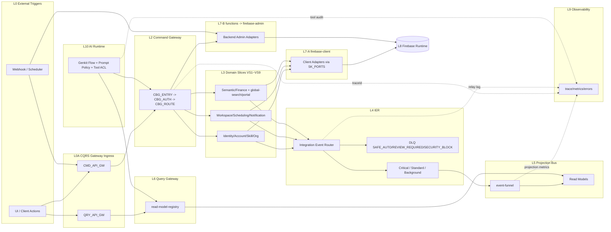
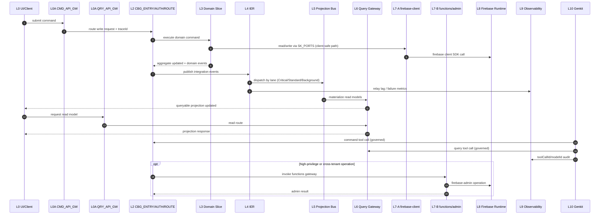

# Architecture Diagrams

參考來源（SSOT 對齊）：
- `00-logic-overview.md`
- `01-logical-flow.md`
- `02-governance-rules.md`
- `03-infra-mapping.md`

## 1. 結構圖（Structure Diagram）

## 2. 時序圖（Sequence Diagram）

