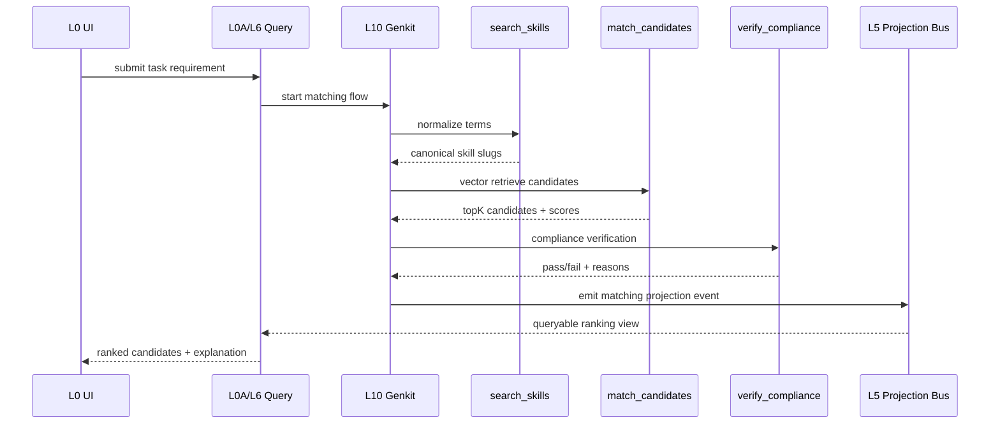

# Semantic Intelligent Matching Architecture

我們正在建構一套「基於語義的智慧匹配架構（Semantic Intelligent Matching Architecture）」，透過整合本體論、向量索引與知識圖譜，解決人力資源中的複雜分派問題。

本文件聚焦在「可落地的實作細節」，並遵循 Xuanwu 架構主鏈與治理規則：

- 寫鏈：`L0 -> L0A(CMD_API_GW) -> L2 -> L3 -> L4 -> L5`
- 讀鏈：`L0 -> L0A(QRY_API_GW) -> L6 -> L5`
- Firebase 邊界：遵守 `D24 / D25 / E8`，Feature 不直連 Firebase SDK，Admin 僅在 server/functions 邊界。

## 1. 目標與輸出

### 1.1 核心目標

- 將任務需求轉為可標準化、可比對、可追溯的語義結構。
- 先做合規與資格過濾，再做語義相似度匹配。
- 對每個推薦結果產生「可解釋理由」，支援稽核與人工覆核。

### 1.2 系統輸出

- 候選名單（含排名分數）。
- 合規檢核結果（pass/fail + reason）。
- 推理軌跡（skills normalizing、vector hit、compliance trace）。

## 2. 知識表示與資料模型

### 2.1 語義基礎設施角色

- 知識圖譜（Knowledge Graph）：邏輯大腦，負責關聯與規則推理。
- 向量資料庫（Vector Database）：記憶模組，負責語義近鄰召回。
- 技能本體論 / 分類法（Skills Ontology / Taxonomy）：語言定義，負責術語標準化。

### 2.2 Firestore 集合

- `skills`：標準技能詞彙、本體論同義詞、分類。
- `employees`：員工技能向量、證照、可用性、組織歸屬。
- `tasks`：任務需求、必要技能、合約硬條件、排程條件。

### 2.3 TypeScript Schema（建議）

```ts
export interface Skill {
	id: string;
	slug: string; // canonical key, e.g. "abb-ecap"
	label: string;
	aliases: string[];
	category: "certification" | "technical" | "domain" | "safety";
	embedding: number[]; // optional for skill-level semantic retrieval
	version: number;
	updatedAt: string;
}

export interface Employee {
	id: string;
	orgId: string;
	displayName: string;
	skillSlugs: string[];
	certifications: string[]; // normalized slugs
	availability: {
		timezone: string;
		weeklyCapacityHours: number;
		nextAvailableAt: string;
	};
	profileEmbedding: number[]; // vector search target
	complianceFlags: string[];
	updatedAt: string;
}

export interface Task {
	id: string;
	orgId: string;
	title: string;
	requiredSkillTerms: string[]; // raw terms from user/business
	requiredSkillSlugs: string[]; // normalized by ontology tool
	requiredCertifications: string[]; // hard gate
	location?: string;
	scheduleWindow?: { startAt: string; endAt: string };
	taskEmbedding: number[];
	updatedAt: string;
}
```

## 3. 索引與檢索策略

### 3.1 向量索引

- 優先對 `employees.profileEmbedding` 建立向量索引（候選人召回主路徑）。
- 視需求補上 `skills.embedding`（技能術語近似匹配）。
- 向量維度需與 embedding model 固定對齊，不可在同索引混用不同維度。

### 3.2 一般查詢索引

- `employees.orgId + updatedAt`：組織內快速候選掃描。
- `skills.slug`（唯一）與 `skills.aliases`（搜尋）
- `tasks.orgId + updatedAt`

### 3.3 結果合併策略

- Hard Filter：證照、租戶、可用時段。
- Semantic Rank：向量相似度 + 技能覆蓋率。
- Tie-breaker：最近可派工時間、歷史履約穩定度。

## 4. Genkit 工具介面

### 4.1 工具定義

1. `search_skills`
	 目的：將非標準術語映射到 canonical `skill.slug`。

2. `match_candidates`
	 目的：根據任務向量召回候選員工。

3. `verify_compliance`
	 目的：檢核候選人是否滿足合約硬性要求（例如 ABB ECAP）。

### 4.2 I/O 契約（建議）

```ts
type SearchSkillsInput = {
	orgId: string;
	terms: string[];
};

type SearchSkillsOutput = {
	normalized: Array<{ term: string; slug: string; confidence: number }>;
	unresolved: string[];
};

type MatchCandidatesInput = {
	orgId: string;
	taskId: string;
	taskEmbedding: number[];
	requiredSkillSlugs: string[];
	topK?: number;
};

type MatchCandidatesOutput = {
	candidates: Array<{
		employeeId: string;
		vectorScore: number;
		skillCoverage: number;
		matchedSkillSlugs: string[];
	}>;
};

type VerifyComplianceInput = {
	orgId: string;
	taskId: string;
	employeeIds: string[];
	requiredCertifications: string[];
};

type VerifyComplianceOutput = {
	decisions: Array<{
		employeeId: string;
		pass: boolean;
		missingCertifications: string[];
		reason: string;
	}>;
};
```

## 5. 編排流程（Orchestration）

### 5.1 主流程

1. 接收任務需求（L0/L0A）。
2. `search_skills`：標準化技能術語。
3. `match_candidates`：向量召回候選。
4. `verify_compliance`：合規硬過濾。
5. 產生最終排序與可解釋理由。
6. 將結果寫入事件/投影（L4/L5），供查詢層讀取（L6）。

### 5.2 最小時序圖



## 6. Prompt 與決策規則

### 6.1 System Prompt 必備約束

- 必須先執行合規過濾，再輸出匹配排名。
- 若技能術語不確定，必須先呼叫 `search_skills`，不可自行猜測。
- 結果必須附上「命中技能 / 缺失技能 / 合規狀態 / 排名理由」。

### 6.2 失敗處理

- 本體論無法解析：回傳 `unresolved terms`，要求人工補詞。
- 向量召回為空：降級為技能規則匹配並標記低信心。
- 合規資料缺失：預設 `fail-closed`（未證明即不通過）。

## 7. 安全、邊界與治理

- 租戶隔離：所有 tool input 必帶 `orgId`，server 端強制驗證。
- 最小權限：Tool 僅可讀必要欄位，敏感欄位不可外洩。
- 邊界一致：Feature 不直接 import Firebase SDK（`D24`），AI flow 不可跨租戶讀寫（`E8`）。
- 可觀測性：每次匹配流程記錄 `traceId`、tool latency、決策摘要。

## 8. 實作落地清單

1. 定義 `Skill / Employee / Task` 介面與 validation schema。
2. 建立 Firestore 集合與必要複合索引、向量索引。
3. 實作資料存取 adapter（經由 ACL 邊界，非 Feature 直連）。
4. 在 Genkit 以 `defineTool` 註冊三個工具與 I/O schema。
5. 建立 matching flow（含錯誤降級與 fail-closed）。
6. 寫入事件與 projection，提供查詢端可讀模型。
7. 補齊測試（tool unit / flow integration / ACL guard）。

## 9. 驗收與測試

### 9.1 最小驗收條件

- 任務輸入後可在 SLA 內回傳可排序候選名單。
- 每個候選都具備 explainable reason。
- 缺證照者必定被過濾，不可進最終名單。

### 9.2 建議測試集

- Unit：`search_skills` 同義詞映射與置信度。
- Unit：`verify_compliance` 對必備證照 fail-closed。
- Integration：完整流程「標準化 -> 召回 -> 合規 -> 排序」。
- Security：跨 `orgId` 請求被拒絕。

## 10. 執行原則

- 先資格與合規，後語義匹配。
- 所有技能詞彙回歸本體論標準詞。
- 匹配結果可追溯、可解釋、可覆核。