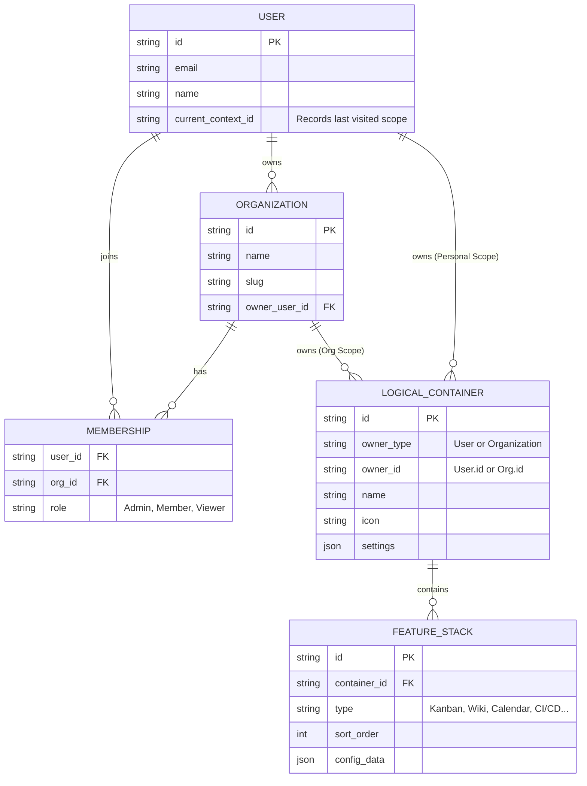

# Database Schema (ER Diagram)

> **Version**: 1.0  
> **Database**: Firestore (NoSQL Document-based)  
> **Last Updated**: 2026-02-05

---

## 🗄️ Entity Relationship Diagram

This diagram represents the core data model for the Xuanwu application, following a multi-tenant architecture with flexible container-based features.



---

## 📊 Entity Descriptions

### USER

**Purpose**: Represents an individual user account in the system.

**Fields**:
- `id` (PK): Unique user identifier
- `email`: User's email address (authentication)
- `name`: Display name
- `current_context_id`: Tracks the last visited scope (User or Organization) for UX continuity

**Relationships**:
- Can own multiple Organizations
- Can be a member of multiple Organizations through MEMBERSHIP
- Can own personal Logical Containers

---

### ORGANIZATION

**Purpose**: Represents a team or organization workspace.

**Fields**:
- `id` (PK): Unique organization identifier
- `name`: Organization display name
- `slug`: URL-friendly identifier
- `owner_user_id` (FK): References the User who created/owns the organization

**Relationships**:
- Owned by one User
- Has multiple Members through MEMBERSHIP
- Can own multiple Logical Containers

---

### MEMBERSHIP

**Purpose**: Association table managing user-organization relationships with roles.

**Fields**:
- `user_id` (FK): References USER
- `org_id` (FK): References ORGANIZATION
- `role`: User's role in the organization
  - `Admin`: Full permissions
  - `Member`: Standard permissions
  - `Viewer`: Read-only permissions

**Composite Key**: (user_id, org_id)

---

### LOGICAL_CONTAINER

**Purpose**: Core organizational unit that can belong to either a User or Organization. Implements polymorphic ownership pattern.

**Fields**:
- `id` (PK): Unique container identifier
- `owner_type`: Discriminator field - "User" or "Organization"
- `owner_id`: Polymorphic foreign key (references User.id or Organization.id)
- `name`: Container name
- `icon`: Icon identifier for UI
- `settings`: JSON field for container-specific configuration

**Design Pattern**: Polymorphic Association (similar to Rails Polymorphic Associations)

**Relationships**:
- Owned by either a User (personal scope) or Organization (team scope)
- Contains multiple Feature Stacks

**Use Cases**:
- Personal workspace for individual users
- Project workspace for organizations
- Department workspace for organizations

---

### FEATURE_STACK

**Purpose**: Represents stackable, modular features within a Logical Container. Allows flexible composition of functionality.

**Fields**:
- `id` (PK): Unique feature stack identifier
- `container_id` (FK): References LOGICAL_CONTAINER
- `type`: Feature type identifier
  - `Kanban`: Task board
  - `Wiki`: Documentation
  - `Calendar`: Schedule
  - `CI/CD`: Pipeline dashboard
  - `Metrics`: Analytics dashboard
  - `Custom`: User-defined features
- `sort_order`: Display order (allows drag-and-drop reordering)
- `config_data`: JSON field for feature-specific configuration

**Design Pattern**: Strategy Pattern + Composition

**Characteristics**:
- Multiple features can coexist in one container
- Features are independently configurable
- Order can be customized per user preference

---

## 🔐 Access Control Model

### Permission Hierarchy

```
Organization Owner (via owner_user_id)
    └─> Admin Members (via MEMBERSHIP.role = 'Admin')
        └─> Regular Members (via MEMBERSHIP.role = 'Member')
            └─> Viewers (via MEMBERSHIP.role = 'Viewer')
```

### Permission Matrix

| Action | Owner | Admin | Member | Viewer |
|--------|-------|-------|--------|--------|
| Delete Organization | ✅ | ❌ | ❌ | ❌ |
| Manage Members | ✅ | ✅ | ❌ | ❌ |
| Create Containers | ✅ | ✅ | ✅ | ❌ |
| Edit Containers | ✅ | ✅ | ✅ | ❌ |
| View Containers | ✅ | ✅ | ✅ | ✅ |
| Add Features | ✅ | ✅ | ✅ | ❌ |
| Configure Features | ✅ | ✅ | ✅ | ❌ |

---

## 🏗️ Firestore Collection Structure

```
/users/{userId}
    - email: string
    - name: string
    - current_context_id: string

/organizations/{orgId}
    - name: string
    - slug: string
    - owner_user_id: string

/memberships/{membershipId}
    - user_id: string
    - org_id: string
    - role: string

/containers/{containerId}
    - owner_type: string
    - owner_id: string
    - name: string
    - icon: string
    - settings: object

/feature-stacks/{featureId}
    - container_id: string
    - type: string
    - sort_order: number
    - config_data: object
```

---

## 🔍 Query Patterns

### Get User's Containers (Personal Scope)

```typescript
const personalContainers = await firestore
  .collection('containers')
  .where('owner_type', '==', 'User')
  .where('owner_id', '==', userId)
  .get();
```

### Get Organization's Containers

```typescript
const orgContainers = await firestore
  .collection('containers')
  .where('owner_type', '==', 'Organization')
  .where('owner_id', '==', orgId)
  .get();
```

### Get User's Organizations

```typescript
const memberships = await firestore
  .collection('memberships')
  .where('user_id', '==', userId)
  .get();

const orgIds = memberships.docs.map(doc => doc.data().org_id);
```

### Get Container's Features (Ordered)

```typescript
const features = await firestore
  .collection('feature-stacks')
  .where('container_id', '==', containerId)
  .orderBy('sort_order', 'asc')
  .get();
```

---

## 🎯 Design Decisions

### Why Polymorphic Ownership?

**Benefit**: Allows containers to be owned by either Users or Organizations without code duplication.

**Trade-off**: Requires discriminator field (`owner_type`) and cannot use foreign key constraints in NoSQL.

**Implementation**: Application layer enforces referential integrity.

### Why Stackable Features?

**Benefit**: Maximum flexibility - users can compose their workspace with exactly the features they need.

**Inspiration**: Linear's flexible project views, Notion's block-based pages.

**Extensibility**: Easy to add new feature types without schema changes.

### Why JSON Config Fields?

**Benefit**: Each feature type can have unique configuration without creating separate tables.

**Trade-off**: Cannot query deeply nested config fields efficiently.

**Solution**: Store queryable fields at top level, use config_data for UI-only settings.

---

## 📚 Related Documentation

- [Project Architecture](./PROJECT_ARCHITECTURE.md) - Overall system architecture
- [DDD Layer Boundaries](./DDD_LAYER_BOUNDARIES.md) - How to implement repositories
- [Import Rules](./IMPORT_RULES.md) - Dependency management

---

**Version History**:
- v1.0 (2026-02-05): Initial schema documentation with ER diagram
