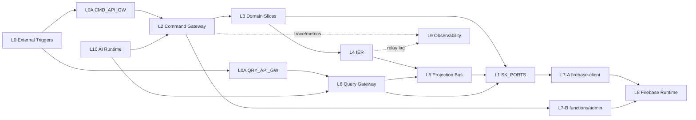

# 架構總覽（Architecture SSOT）

本文件是架構裁決層（Topology SSOT）。

- 規則正文 SSOT：`02-governance-rules.md`
- 路徑/Adapter SSOT：`03-infra-mapping.md`
- 流程可讀視圖：`01-logical-flow.md`

衝突裁決順序：`00 > 02 > 03 > 01`。

## 架構原則

- 架構正確性優先：先守層級、邊界、權威出口，再談實作成本。
- 奧卡姆剃刀：刪除重複表示，不刪除不變量。
- 單一定義：同一規則只允許一個 canonical body。

## 三條主鏈（Canonical Chains）

| 鏈路 | 流向 |
|---|---|
| 寫鏈 | `L0 -> L0A(CMD_API_GW) -> L2 -> L3 -> L4 -> L5` |
| 讀鏈 | `L0/UI -> L0A(QRY_API_GW) -> L6 -> L5` |
| Infra 鏈 A | `L3/L5/L6 -> L1(SK_PORTS) -> L7-A(firebase-client) -> L8` |
| Infra 鏈 B | `L0/L2 -> L7-B(functions + firebase-admin) -> L8` |

## VS 與 Layer 快速對照

### Vertical（VS）

- `VS0`: Foundation（`VS0-Kernel` + `VS0-Infra`）
- `VS1~VS9`: 業務切片（Identity/Account/Skill/Organization/Workspace/Scheduling/Notification/Semantic/Finance）

### Auxiliary Feature Slices（現況補充）

- `global-search.slice`：跨切片搜尋權威出口（D26）。
- `portal.slice`：門戶殼層狀態橋接，承載 portal state 公開 hook。

### Horizontal（L0~L10）

- `L0`: External Triggers
- `L0A`: API Gateway Ingress（Command/Query 分流）
- `L1`: Shared Kernel（contracts/constants/pure）
- `L2`: Command Gateway
- `L3`: Domain Slices
- `L4`: IER
- `L5`: Projection Bus
- `L6`: Query Gateway
- `L7`: Firebase ACL Boundary（A=client, B=functions/admin）
- `L8`: Firebase Runtime（external）
- `L9`: Observability
- `L10`: AI Runtime & Orchestration

## 最小架構圖（簡化）

## VS8：語義智慧匹配架構（Semantic Intelligent Matching Architecture）

VS8 是全系統語義權威，定位為「**基於語義的智慧匹配架構（SIMA）**」，透過整合三大核心支柱解決人力資源中的複雜分派問題：

| 支柱 | 技術 | 目的 |
|------|------|------|
| **支柱一** | 知識圖譜（Knowledge Graph） | 技能/角色/任務有向關係圖（IS_A、REQUIRES）；支援依賴推理 |
| **支柱二** | 向量數據庫（Vector Database） | 全文語義索引；支援模糊語義查詢與相似度排序 |
| **支柱三** | 技能本體論/分類法（Skills Ontology） | 層次化技能分類體系；支援粗細粒度搜尋縮放 |

**分派流程**：請求 → [支柱三] 分類法維度過濾 → [支柱二] 向量相似度排序 → [支柱一] 知識圖譜關係展開 → 輸出匹配候選集（語義提示）。

**設計約束**：VS8 只輸出語義提示；不執行跨切片副作用 [B1]。

詳細架構定義：
- [`03-Slices/VS8-SemanticBrain/architecture.md`](03-Slices/VS8-SemanticBrain/architecture.md) — 三大支柱設計、模組責任、API 邊界
- [`03-Slices/VS8-SemanticBrain/architecture-diagrams.md`](03-Slices/VS8-SemanticBrain/architecture-diagrams.md) — HR 分派流程圖、知識圖譜圖、向量匹配流程圖

## 關鍵不變量（索引）

- `R8`: traceId 只注入一次、全鏈唯讀。
- `S2`: Projection 必須過 version guard。
- `S4`: SLA 只能引用契約常數，不可硬寫。
- `D24/D25`: Firebase 邊界隔離（feature 不直連 SDK；admin 僅 functions）。
- `D26`: cross-cutting authority 出口唯一化（Search / Notification）。
- `D27`: 成本語義決策由 VS8 `_cost-classifier.ts` 提供；VS5 不可自判。
- `D29`: Aggregate + outbox 同交易。
- `D31`: 讀路徑權限投影一致性。
- `E7/E8`: Security/AppCheck/AI Tool ACL 閉環。
- `A19~A22`: 任務-金融生命週期封閉與逆向投影規則。
- `KG-1`: 知識圖譜邊只能透過 VS8 `_actions.ts` 寫入；嚴禁外部切片建立 SemanticEdge。
- `VD-1`: 語義向量索引由 VS8 `_services.ts` 獨家管理；外部切片透過 `_queries.ts` 出口查詢。
- `OT-1`: 新分類法維度只能在 VS8 `_semantic-authority.ts` 定義；嚴禁其他切片自行添加維度。
- `B1`: VS8 只輸出語義提示/匹配結果；嚴禁直接觸發跨切片副作用。

完整正文請見 `02-governance-rules.md`。

## FORBIDDEN（最小集）

- 禁止跨切片直接寫他域 Aggregate。
- 禁止繞過 L2/L4/L5/L6 主鏈路。
- 禁止 feature slice 直連 `firebase/*` 或 `firebase-admin`。
- 禁止讀路徑回呼寫路徑形成反向環。
- 禁止 VS8 直接執行跨切片副作用（僅輸出語義提示）。
- 禁止在 VS8 以外的切片定義新分類法維度（`OT-1`）。
- 禁止外部切片直接建立知識圖譜邊（`KG-1`）。
- 禁止繞過 `_queries.ts` 直調 `_services.ts` 讀取語義索引（`VD-2`）。
- 禁止在任一業務切片重建平行的跨域搜尋入口（必須統一走 `global-search.slice`）。

完整 Forbidden 清單請見 `02-governance-rules.md`。

## 變更協議（Doc Change Protocol）

1. 先改 `02-governance-rules.md` 的 canonical rule body。
2. 再更新 `00` 的索引與裁決語句。
3. 同步 `01`（流程視圖）與 `03`（路徑映射）。
4. 最後用 `99-checklist.md` 做審查。
