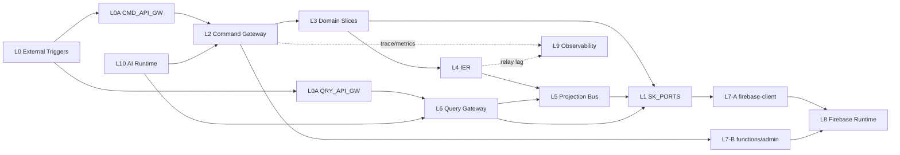

# 架構總覽（Architecture SSOT）

本文件是架構裁決層（Topology SSOT）。

- 規則正文 SSOT：`02-governance-rules.md`
- 路徑/Adapter SSOT：`03-infra-mapping.md`
- 流程可讀視圖：`01-logical-flow.md`
- 統一治理藍圖：[`06-DecisionLogic/03-unified-governance-blueprint.md`](06-DecisionLogic/03-unified-governance-blueprint.md)

衝突裁決順序：`00 > 02 > 03 > 01`。

## 三大核心原則（North Star）

> 源自統一架構編排藍圖（`06-unified-governance-blueprint`）

| 原則 | 說明 |
|------|------|
| **架構正確性優先** | 先守層級、邊界、權威出口，再談實作成本。任何「為了方便」的繞道均視為違規。 |
| **Everything as a Tag** | 系統中的能力、資格、角色、偏好均以語義標籤（Tag Slug）表示；禁止裸字串傳遞語義。業務結果回饋自動更新標籤權重 [BF-1]。 |
| **語義權威治理** | VS8 是全系統唯一語義 SSOT；所有切片不得自行維護語義標籤定義；跨切片語義訊號必須帶 `semanticTagSlugs` [G7]。 |

## 四階段系統生命週期（System Lifecycle Phases）

> 完整序列圖：[`06-DecisionLogic/03-unified-governance-blueprint.md`](06-DecisionLogic/03-unified-governance-blueprint.md)

| 階段 | 名稱 | 驅動者 | 核心規則 |
|------|------|--------|---------|
| **Phase 0** | 語義基石（Ontology Foundation） | Admin / VS0 | VS0 注入 SharedKernel 契約 [FI-003]；Admin 定義全域 Tag 本體 |
| **Phase 1** | 數據攝取與語義化（Ingestion） | UI / L0A → L2 → L3 | D3 同步寫入業務實體；IER 非同步觸發 Embedding 提取 [E8-I] |
| **Phase 2** | 智慧匹配執行（Matching） | L3 → L10 → Genkit Tools | search_skills → match_candidates → verify_compliance [GT-2] |
| **Phase 3** | 投影物化與反饋（Read + Feedback） | IER → L5 → L8 | 結果物化至投影視圖；業務指紋自動回饋更新 Employee 標籤 [BF-1] |

## 架構原則（工程實作）

- 架構正確性優先：先守層級、邊界、權威出口，再談實作成本。
- 奧卡姆剃刀：刪除重複表示，不刪除不變量。
- 單一定義：同一規則只允許一個 canonical body。

## 三條主鏈（Canonical Chains）

| 鏈路 | 流向 |
|---|---|
| 寫鏈 | `L0 -> L0A(CMD_API_GW) -> L2 -> L3 -> L4 -> L5` |
| 讀鏈 | `L0/UI -> L0A(QRY_API_GW) -> L6 -> L5` |
| Infra 鏈 A | `L3/L5/L6 -> L1(SK_PORTS) -> L7-A(firebase-client) -> L8` |
| Infra 鏈 B | `L0/L2 -> L7-B(functions + firebase-admin) -> L8` |

## VS 與 Layer 快速對照

### Vertical（VS）

- `VS0`: Foundation（`VS0-Kernel` + `VS0-Infra`）
- `VS1~VS9`: 業務切片（Identity/Account/Skill/Organization/Workspace/Scheduling/Notification/Semantic/Finance）

### Auxiliary Feature Slices（現況補充）

- `global-search.slice`：跨切片搜尋權威出口（D26）。
- `portal.slice`：門戶殼層狀態橋接，承載 portal state 公開 hook。

### Horizontal（L0~L10）

- `L0`: External Triggers
- `L0A`: API Gateway Ingress（Command/Query 分流）
- `L1`: Shared Kernel（contracts/constants/pure）
- `L2`: Command Gateway
- `L3`: Domain Slices
- `L4`: IER
- `L5`: Projection Bus
- `L6`: Query Gateway
- `L7`: Firebase ACL Boundary（A=client, B=functions/admin）
- `L8`: Firebase Runtime（external）
- `L9`: Observability
- `L10`: AI Runtime & Orchestration

## 最小架構圖（簡化）

## VS8：語義智慧匹配架構（Semantic Intelligent Matching Architecture）

VS8 是全系統語義權威，定位為「**基於語義的智慧匹配架構（SIMA）**」，透過整合三大核心支柱解決人力資源中的複雜分派問題：

| 支柱 | 技術 | 角色隱喻 | 目的 |
|------|------|---------|------|
| **支柱一** | 知識圖譜（Knowledge Graph） | 🧠 **邏輯大腦** | 技能/角色/任務有向關係圖（IS_A、REQUIRES）；合規推理（`verify_compliance`） |
| **支柱二** | 向量數據庫（Vector Database） | 💾 **記憶模塊** | Firestore 語義向量索引；模糊語義查詢（`match_candidates`） |
| **支柱三** | 技能本體論/分類法（Skills Ontology） | 📖 **語言定義** | 技能術語標準化；層次化分類體系（`search_skills`） |

**Phase 0 → VS8 語義基石**：Admin 定義全域 Tag 本體至 `skills` 集合；VS0 注入 SharedKernel Tag 型別至 Domain Slices [FI-003]。

**分派流程（Genkit AI 工具調用）**：請求 → `search_skills`（術語標準化）→ `match_candidates`（向量匹配）→ `verify_compliance`（合規驗證優先）→ 輸出匹配候選集（語義提示）。

**資料來源（Firestore 集合）**：`employees`（候選人池 + 向量索引）、`tasks`（分派請求）、`skills`（技能本體論 + 向量索引）。

**Phase 1 異步嵌入**：業務實體寫入後，D3 透過 IER (L4) 非同步觸發 Embedding 提取 → L8 [E8-I]；禁止 Domain Slice 同步呼叫 AI。

**Phase 3 業務指紋回饋 [BF-1]**：任務完成後，D3 發布行為事件 → IER → VS8 調整 `employees.skillEmbedding` 權重；嚴禁其他切片直接寫入 `employees.skillEmbedding`。

**設計約束**：VS8 只輸出語義提示；不執行跨切片副作用 [B1]。

詳細架構定義：
- [`03-Slices/VS8-SemanticBrain/architecture.md`](03-Slices/VS8-SemanticBrain/architecture.md) — 三大支柱設計、Firestore Schema、Genkit 工具規格、API 邊界
- [`03-Slices/VS8-SemanticBrain/05-semantic-data-lifecycle.md`](03-Slices/VS8-SemanticBrain/05-semantic-data-lifecycle.md) — 三階段語義數據生命週期（Phase 1 攝取 → Phase 2 匹配 → Phase 3 反饋 [BF-1]）
- [`03-Slices/VS8-SemanticBrain/architecture-diagrams.md`](03-Slices/VS8-SemanticBrain/architecture-diagrams.md) — HR 分派流程圖、Genkit 工具整合圖、Firestore 集合關聯圖
- [`03-Slices/VS8-SemanticBrain/architecture-build.md`](03-Slices/VS8-SemanticBrain/architecture-build.md) — 實施計畫（Phase 1-4：Schema → Vector Index → Genkit Tools → Prompt Engineering）

## 關鍵不變量（索引）

- `FI-003`: VS0 SharedKernel 必須在 Domain Slice (L3) 執行前注入契約型別；Domain Slice 不得重複定義 SK 已定義的型別。違規可透過靜態匯入分析偵測（禁止在 feature 路徑重新宣告 SK 型別）。完整禁止條目見 `02-governance-rules.md` Forbidden 清單。
- `R8`: traceId 只注入一次、全鏈唯讀。
- `S2`: Projection 必須過 version guard。
- `S4`: SLA 只能引用契約常數，不可硬寫。
- `D24/D25`: Firebase 邊界隔離（feature 不直連 SDK；admin 僅 functions）。
- `D26`: cross-cutting authority 出口唯一化（Search / Notification）。
- `D27`: 成本語義決策由 VS8 `_cost-classifier.ts` 提供；VS5 不可自判。
- `D29`: Aggregate + outbox 同交易。
- `D31`: 讀路徑權限投影一致性。
- `E7/E8`: Security/AppCheck/AI Tool ACL 閉環。
- `E8-I`: Embedding 提取管線必須透過 IER (L4) 非同步隔離，禁止 Domain Slice 同步呼叫 AI。
- `A19~A22`: 任務-金融生命週期封閉與逆向投影規則。
- `KG-1`: 知識圖譜邊只能透過 VS8 `_actions.ts` 寫入；嚴禁外部切片建立 SemanticEdge。
- `VD-1`: 語義向量索引由 VS8 `_services.ts` 獨家管理；外部切片透過 `_queries.ts` 出口查詢。
- `OT-1`: 新分類法維度只能在 VS8 `_semantic-authority.ts` 定義；嚴禁其他切片自行添加維度。
- `B1`: VS8 只輸出語義提示/匹配結果；嚴禁直接觸發跨切片副作用。
- `GT-1`: VS8 Genkit 工具（`search_skills` / `match_candidates` / `verify_compliance`）必須透過 `defineTool` 在 Genkit 中註冊；AI 呼叫合規驗證必須優先於候選人輸出。
- `BF-1`: 業務指紋回饋（Behavioral Fingerprint Update）—任務結果確認後，Domain Slice 必須透過 IER 事件觸發 VS8 更新 `employees.skillEmbedding` 權重；嚴禁其他切片直接寫入 `employees.skillEmbedding`。
- `G7`: 跨切片語義訊號必帶 `semanticTagSlugs`；嚴禁傳遞裸字串語義標籤。

完整正文請見 `02-governance-rules.md`。

## FORBIDDEN（最小集）

- 禁止跨切片直接寫他域 Aggregate。
- 禁止繞過 L2/L4/L5/L6 主鏈路。
- 禁止 feature slice 直連 `firebase/*` 或 `firebase-admin`。
- 禁止讀路徑回呼寫路徑形成反向環。
- 禁止 Domain Slice 同步呼叫 AI 進行 Embedding 提取（必須透過 IER 非同步 [E8-I]）。
- 禁止 VS8 直接執行跨切片副作用（僅輸出語義提示）。
- 禁止在 VS8 以外的切片定義新分類法維度（`OT-1`）。
- 禁止外部切片直接建立知識圖譜邊（`KG-1`）。
- 禁止繞過 `_queries.ts` 直調 `_services.ts` 讀取語義索引（`VD-2`）。
- 禁止在任一業務切片重建平行的跨域搜尋入口（必須統一走 `global-search.slice`）。
- 禁止其他切片直接寫入 `employees.skillEmbedding`（業務指紋回饋必須透過 VS8 [BF-1]）。
- 禁止跨切片傳遞裸字串語義標籤（必須帶 `semanticTagSlugs` [G7]）。

完整 Forbidden 清單請見 `02-governance-rules.md`。

## 變更協議（Doc Change Protocol）

1. 先改 `02-governance-rules.md` 的 canonical rule body。
2. 再更新 `00` 的索引與裁決語句。
3. 同步 `01`（流程視圖）與 `03`（路徑映射）。
4. 最後用 `99-checklist.md` 做審查。
