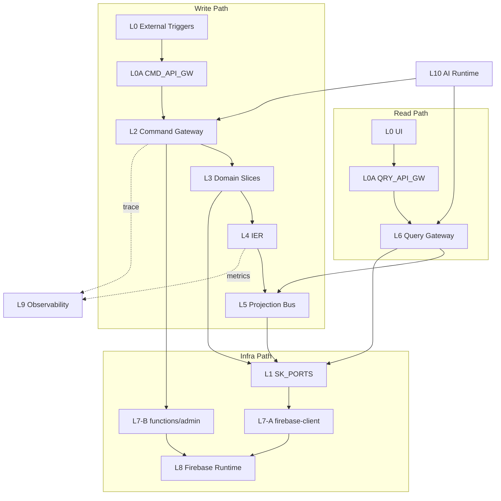

# 邏輯流視圖 (Logical Flow View)

此檔是流程可讀性視圖，非規則正文。  
規則正文請見 `02-governance-rules.md`；路徑映射請見 `03-infra-mapping.md`。

## 讀法

1. 先看三條主鏈。
2. 再看 Firebase A/B 路由決策。
3. 最後對照 `02` 的規則 ID。

## 三條主鏈（最小版）

| 鏈路 | 流向 | 主要約束 |
|---|---|---|
| 寫鏈 | `L0 -> L0A(CMD) -> L2 -> L3 -> L4 -> L5` | `D29` / `S2` / `R8` |
| 讀鏈 | `L0/UI -> L0A(QRY) -> L6 -> L5` | `S3` / `D31` |
| Infra 鏈 | A: `L3/L5/L6 -> L1 -> L7-A -> L8`；B: `L0/L2 -> L7-B -> L8` | `D24` / `D25` / `E7/E8` |

## Firebase 路由決策（A/B）

- A 路（`L7-A`）：使用者會話內、Rules 可封閉、低延遲互動。
- B 路（`L7-B`）：Admin 權限、跨租戶、排程/Webhook、高扇出協調。
- `firebase-admin` 僅允許在 `functions` 容器內使用（`D25`）。

## VS8：語義智慧匹配架構在邏輯流中的定位

VS8（`semantic-graph.slice`）是 L3 Domain Slice 中的語義中樞，透過三大支柱與三個 Genkit 工具為其他切片提供語義匹配能力：

```
分派請求（tasks 集合 / VS5/VS6）
  │
  ├─ [支柱三 語言定義] search_skills      → skills 集合查詢（術語標準化）
  ├─ [支柱二 記憶模塊] match_candidates   → employees 向量索引搜尋（語義匹配）
  └─ [支柱一 邏輯大腦] verify_compliance  → employees.certifications 合規驗證
  │
  └─→ 匹配候選集輸出（語義提示，非最終決策 [B1]）
```

**寫路徑（Tag 命令）**：`L0A → L2 → VS8._actions.ts [D3] → Tag 事件匯流排 [T1] → L4 → L5`

**讀路徑（語義查詢）**：`global-search.slice → VS8._queries.ts [D4] → _services.ts → SemanticSearchHit[]`

**分類法管理路徑**：`wiki-editor → _actions.ts [D3] → validateTaxonomyAssignment [OT-2] → Firestore`

**Genkit AI 分派路徑**：`dispatchFlow → search_skills [支柱三] → match_candidates [支柱二] → verify_compliance [支柱一] → 輸出`

**資料集合**：`employees`（候選人 + skillEmbedding 向量欄位）、`tasks`（分派請求）、`skills`（本體論 + embedding 向量欄位）

詳細架構定義：
- [`03-Slices/VS8-SemanticBrain/architecture.md`](03-Slices/VS8-SemanticBrain/architecture.md) — 三大支柱設計、Firestore Schema、Genkit 工具規格
- [`03-Slices/VS8-SemanticBrain/architecture-diagrams.md`](03-Slices/VS8-SemanticBrain/architecture-diagrams.md) — Genkit 工具整合圖、HR 分派序列圖、Firestore 集合關聯圖
- [`03-Slices/VS8-SemanticBrain/architecture-build.md`](03-Slices/VS8-SemanticBrain/architecture-build.md) — Phase 1-4 實施計畫（Schema-First Approach）

## Auxiliary Slice 邊界（現況）

- `global-search.slice`：系統唯一跨域搜尋入口；查詢路徑對接 VS8 語義索引（支柱二 `querySemanticIndex`）與 L6 讀取出口。
- `portal.slice`：門戶殼層 state 橋接；不取代 L2/L3 業務決策，不可繞過主鏈。

## VS9 Finance 流向索引

- 入口：`TaskAcceptedConfirmed` 經 L4 `CRITICAL_LANE` 進入 L5 `finance-staging-pool`（`A20`）。
- 主體：`Finance_Request` 維持獨立生命週期（`A21`）。
- 回饋：金融狀態經 L5 `task-finance-label-view` 回傳讀側（`A22`）。

## 系統架構圖（精簡）



## 圖後索引（精簡）

- 規則正文：`02-governance-rules.md`
- 路徑與 Adapter：`03-infra-mapping.md`
- 拓撲裁決：`00-logic-overview.md`

## 核心審查提示

- 若看見讀鏈直接回寫，視為違規。
- 若看見 feature 直連 Firebase SDK，視為違規。
- 若看見 VS8 直接執行副作用（非語義提示輸出），視為違規 [B1]。
- 若看見除 `global-search.slice` 之外的跨域搜尋權威入口，視為違規。
- 若看見 VS8 以外的切片定義新分類法維度，視為違規 [OT-1]。
- 若看見外部切片直接建立 SemanticEdge，視為違規 [KG-1]。
- 若看見外部切片繞過 `_queries.ts` 直調 VS8 `_services.ts`，視為違規 [VD-2]。
- 若看見 VS8 Genkit 工具未透過 `defineTool` 宣告，或 `verify_compliance` 非合規優先呼叫，視為違規 [GT-1]。
