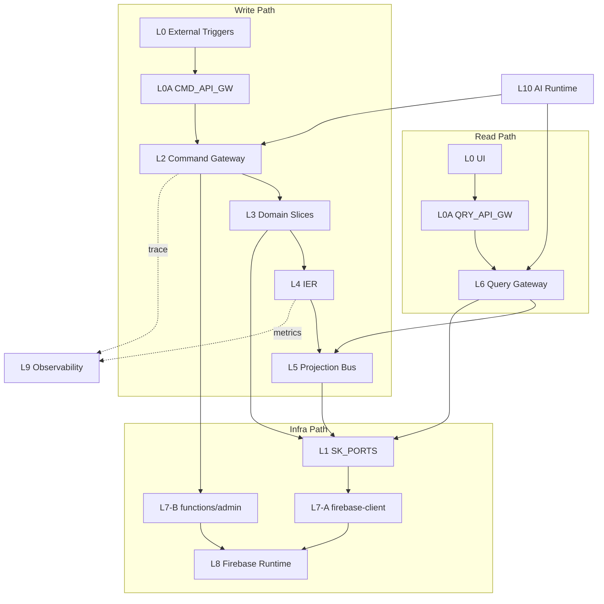

# 邏輯流視圖 (Logical Flow View)

此檔是流程可讀性視圖，非規則正文。  
規則正文請見 `02-governance-rules.md`；路徑映射請見 `03-infra-mapping.md`；拓撲裁決請見 `00-logic-overview.md`。

> 統一架構治理藍圖：[`06-DecisionLogic/03-unified-governance-blueprint.md`](06-DecisionLogic/03-unified-governance-blueprint.md)

## 讀法

1. 先看三條主鏈。
2. 再看四階段系統生命週期。
3. 最後對照 `02` 的規則 ID。

## 四條主鏈（最小版）

| 鏈路 | 流向 | 主要約束 |
|---|---|---|
| 寫鏈 | `L0 → L0A(CMD) → L2 → L3 → L4 → L5` | `D29` / `S2` / `R8` |
| 讀鏈 | `L0/UI → L0A(QRY) → L6 → L5` | `S3` / `D31` |
| Infra 鏈 | A: `L3/L5/L6 → L1 → L7-A → L8`；B: `L0/L2 → L7-B → L8` | `D24` / `D25` / `E7/E8` |
| AI 嵌入鏈 | `L3 → L4(IER) → L10(AI) → L8` | `E8-I`（非同步隔離）|

## Firebase 路由決策（A/B）

- A 路（`L7-A`）：使用者會話內、Rules 可封閉、低延遲互動。
- B 路（`L7-B`）：Admin 權限、跨租戶、排程/Webhook、高扇出協調。
- `firebase-admin` 僅允許在 `functions` 容器內使用（`D25`）。

## 四階段系統生命週期（源自統一治理藍圖）

> 完整序列圖：[`06-DecisionLogic/03-unified-governance-blueprint.md`](06-DecisionLogic/03-unified-governance-blueprint.md)

### Phase 0 — 語義基石（Ontology Foundation）

```
Admin → L8(skills collection): 0.1 定義全域標籤本體（Tag Ontology Slugs）
VS0(SharedKernel) → L3(Domain Slices): 0.2 注入 SK 契約與 Tag 型別 [FI-003]
```

**目的**：建立語義真相基礎。沒有 Phase 0，Phase 2 的術語正規化無法運作。

### Phase 1 — 數據攝取與語義化（Data Ingestion）

```
L0(UI) → L0A(CMD) → L2 → L3: 1.1~1.3 寫入業務實體（Profile / Task）
L3 → L4(IER): 1.4 發布數據變更事件（Integration Event）
L4(IER) → L10(AI): 1.5 [非同步] 觸發 Embedding 提取 [E8-I]
L10(AI) → L8: 1.6 存儲向量特徵（employees.skillEmbedding / tasks.requirementsEmbedding）
```

**關鍵約束**：Domain Slice **不得同步呼叫** AI 進行 Embedding（必須透過 IER 非同步 [E8-I]）。

### Phase 2 — 智慧匹配執行（Matching Execution）

```
L0(UI) → L2 → L3: 2.1~2.2 提交匹配請求
L3 → L10(AI): 2.3 啟動 Genkit Matching Flow [E8 Tool ACL]
  AI → search_skills: 2.4 術語正規化（Ontology Lookup）[支柱三]
  AI → match_candidates: 2.5 向量召回（Vector Search）[支柱二]
  AI → verify_compliance: 2.6 合規硬過濾（Fail-closed）[支柱一][GT-2]
L10(AI) → L3: 2.7 回傳推理軌跡與排名結果
L3 → L4(IER): 2.8 發布 MatchingConfirmed 事件
```

**合規優先（Fail-closed）**：`verify_compliance` 不通過的候選人必須在輸出前排除 [GT-2]。

### Phase 3 — 投影物化與業務指紋反饋（Read + Feedback）

```
L4(IER) → L5(Projection Bus): 3.1 寫入 recommendation-view
L0(UI) → L0A(QRY) → L6 → L5: 3.2~3.4 查詢投影讀模型
L3(VS5/VS9) → L4(IER) → VS8: 3.4 [BF-1] 業務指紋自動回饋
  → 根據任務結果調整 employees.skillEmbedding 權重
```

**Everything as a Tag 閉環**：Phase 3 的業務指紋回饋使語義能力模型隨系統使用自動演進 [BF-1]。

## VS8：語義智慧匹配架構在邏輯流中的定位

VS8（`semantic-graph.slice`）是 L3 Domain Slice 中的語義中樞，透過三大支柱與三個 Genkit 工具為其他切片提供語義匹配能力。完整三階段語義數據生命週期：[`03-Slices/VS8-SemanticBrain/05-semantic-data-lifecycle.md`](03-Slices/VS8-SemanticBrain/05-semantic-data-lifecycle.md)

### Phase 0：語義基石

```
Admin → L8(skills): 定義全域標籤本體（Tag Ontology Slugs）[OT-1]
VS0(SharedKernel) → L3(domain slices): 注入 SK 契約型別 [FI-003]
```

### Phase 1：數據攝取 + 異步嵌入

```
分派請求（tasks 集合 / VS5/VS6）
  │
  ├─ 同步路徑（業務寫入）：
  │   L0A → L2 → VS8._actions.ts [D3] → Tag 事件匯流排 [T1] → L4 → L5
  │
  └─ 異步路徑（Embedding 提取 [E8-I]）：
      L3 → L4(IER, BACKGROUND lane) → L10(AI) → L8(employees.skillEmbedding)
```

### Phase 2：智慧匹配三工具路徑

```
  ├─ [支柱三 語言定義] search_skills      → skills 集合查詢（術語標準化 [OT-2]）
  ├─ [支柱二 記憶模塊] match_candidates   → employees 向量索引搜尋（語義匹配 [VD-2]）
  └─ [支柱一 邏輯大腦] verify_compliance  → employees.certifications 合規驗證（Fail-closed [GT-2]）
  │
  └─→ 匹配候選集輸出（語義提示，非最終決策 [B1]）
```

### Phase 3：結果持久化 + 業務指紋反饋

```
AI → L3(D3): 回傳排名名單與推理軌跡
L3 → L5(Projection Bus): 發布 recommendation-view
L3(VS5/VS9) → L4(IER) → VS8: [BF-1] 業務指紋自動回饋
  → 根據任務結果調整 employees.skillEmbedding 權重（Everything as a Tag 閉環）
```

**讀路徑（語義查詢）**：`global-search.slice → VS8._queries.ts [D4] → _services.ts → SemanticSearchHit[]`

**分類法管理路徑**：`wiki-editor → _actions.ts [D3] → validateTaxonomyAssignment [OT-2] → Firestore`

詳細架構定義：
- [`03-Slices/VS8-SemanticBrain/architecture.md`](03-Slices/VS8-SemanticBrain/architecture.md) — 三大支柱設計、Firestore Schema、Genkit 工具規格
- [`03-Slices/VS8-SemanticBrain/05-semantic-data-lifecycle.md`](03-Slices/VS8-SemanticBrain/05-semantic-data-lifecycle.md) — 三階段語義數據生命週期（Phase 1 攝取 → Phase 2 匹配 → Phase 3 [BF-1] 反饋）
- [`03-Slices/VS8-SemanticBrain/architecture-diagrams.md`](03-Slices/VS8-SemanticBrain/architecture-diagrams.md) — Genkit 工具整合圖、HR 分派序列圖、Firestore 集合關聯圖
- [`03-Slices/VS8-SemanticBrain/architecture-build.md`](03-Slices/VS8-SemanticBrain/architecture-build.md) — Phase 1-4 實施計畫（Schema-First Approach）

## Auxiliary Slice 邊界（現況）

- `global-search.slice`：系統唯一跨域搜尋入口；查詢路徑對接 VS8 語義索引（支柱二 `querySemanticIndex`）與 L6 讀取出口。
- `portal.slice`：門戶殼層 state 橋接；不取代 L2/L3 業務決策，不可繞過主鏈。

## VS9 Finance 流向索引

- 入口：`TaskAcceptedConfirmed` 經 L4 `CRITICAL_LANE` 進入 L5 `finance-staging-pool`（`A20`）。
- 主體：`Finance_Request` 維持獨立生命週期（`A21`）。
- 回饋：金融狀態經 L5 `task-finance-label-view` 回傳讀側（`A22`）。

## 系統架構圖（精簡）



## 圖後索引（精簡）

- 規則正文：`02-governance-rules.md`
- 路徑與 Adapter：`03-infra-mapping.md`
- 拓撲裁決：`00-logic-overview.md`

## 核心審查提示

- 若看見讀鏈直接回寫，視為違規。
- 若看見 feature 直連 Firebase SDK，視為違規。
- 若看見 Domain Slice 同步呼叫 AI 做 Embedding（未透過 IER），視為違規 [E8-I]。
- 若看見 VS8 直接執行副作用（非語義提示輸出），視為違規 [B1]。
- 若看見除 `global-search.slice` 之外的跨域搜尋權威入口，視為違規。
- 若看見 VS8 以外的切片定義新分類法維度，視為違規 [OT-1]。
- 若看見外部切片直接建立 SemanticEdge，視為違規 [KG-1]。
- 若看見外部切片繞過 `_queries.ts` 直調 VS8 `_services.ts`，視為違規 [VD-2]。
- 若看見 VS8 Genkit 工具未透過 `defineTool` 宣告，或 `verify_compliance` 非合規優先呼叫，視為違規 [GT-1/GT-2]。
- 若看見非 VS8 切片直接寫入 `employees.skillEmbedding`（業務指紋繞道），視為違規 [BF-1]。
- 若看見跨切片傳遞裸字串語義標籤（非 `semanticTagSlugs`），視為違規 [G7]。
