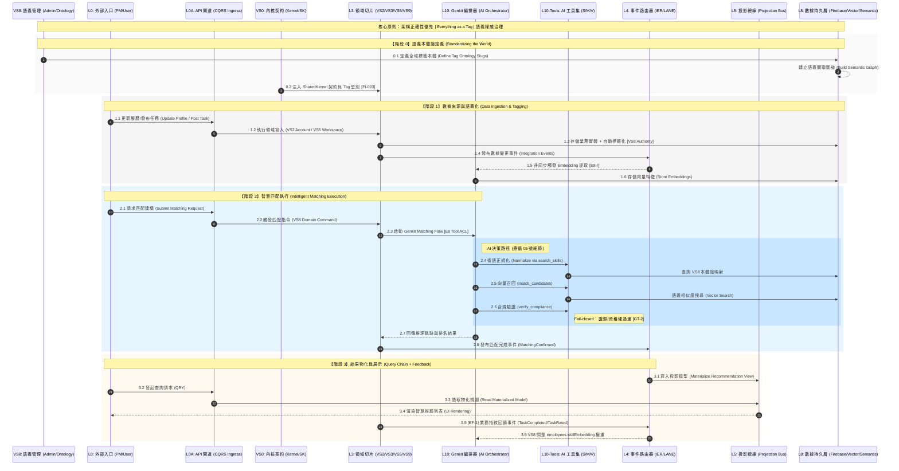
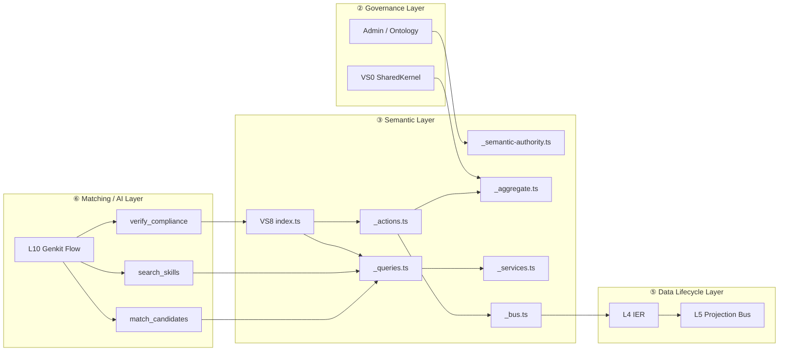
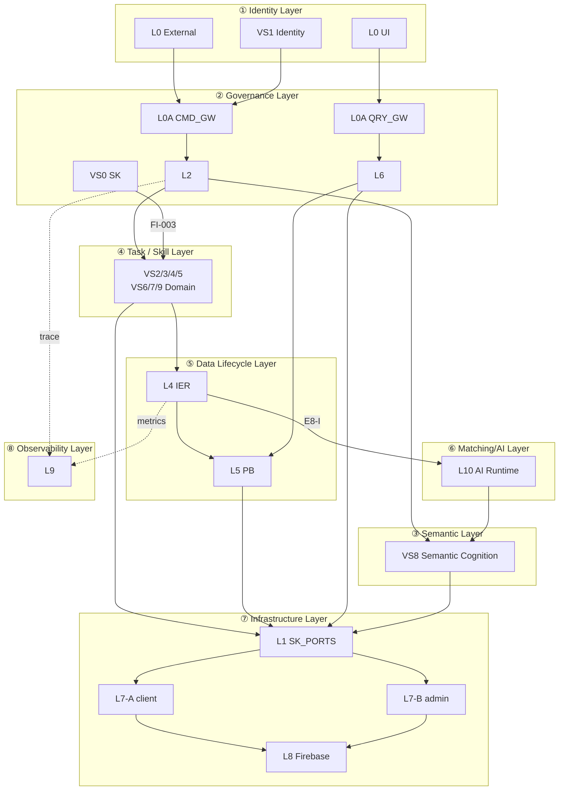

# 邏輯流視圖 (Logical Flow View)

此檔是流程可讀性視圖，非規則正文。  
規則正文請見 `02-governance-rules.md`；路徑映射請見 `03-infra-mapping.md`；拓撲裁決請見 `00-logic-overview.md`。

> 統一架構治理藍圖：[`06-DecisionLogic/03-unified-governance-blueprint.md`](06-DecisionLogic/03-unified-governance-blueprint.md)

## 讀法

1. 先看四條主鏈（系統流向概覽）。
2. 再看四階段系統生命週期序列圖（06 藍圖）。
3. 最後看 VS8 語義認知生命週期序列圖（05 藍圖）。
4. 對照 `02` 的規則 ID 做審查。

## 四條主鏈（最小版）

| 鏈路 | 流向 | 主要約束 |
|---|---|---|
| 寫鏈 | `L0 → L0A(CMD) → L2 → L3 → L4 → L5` | `D29` / `S2` / `R8` |
| 讀鏈 | `L0/UI → L0A(QRY) → L6 → L5` | `S3` / `D31` |
| Infra 鏈 | A: `L3/L5/L6 → L1 → L7-A → L8`；B: `L0/L2 → L7-B → L8` | `D24` / `D25` / `E7/E8` |
| AI 嵌入鏈 | `L3 → L4(IER) → L10(AI) → L8` | `E8-I`（非同步隔離）|

## Firebase 路由決策（A/B）

- A 路（`L7-A`）：使用者會話內、Rules 可封閉、低延遲互動。
- B 路（`L7-B`）：Admin 權限、跨租戶、排程/Webhook、高扇出協調。
- `firebase-admin` 僅允許在 `functions` 容器內使用（`D25`）。

---

## 四階段系統生命週期（源自統一治理藍圖 @ARCH-06）

> 完整藍圖：[`06-DecisionLogic/03-unified-governance-blueprint.md`](06-DecisionLogic/03-unified-governance-blueprint.md)

**關鍵約束一覽**：
- Phase 0：`FI-003` — VS0 SK 必須在 Domain Slice 執行前完成注入
- Phase 1：`E8-I` — Domain Slice **不得同步呼叫** AI 做 Embedding（必須透過 IER 非同步）
- Phase 2：`GT-2` — `verify_compliance` 合規優先（Fail-closed），不通過的候選人排除後才能輸出
- Phase 3：`BF-1` — 業務指紋回饋使語義能力模型隨系統使用自動演進（Everything as a Tag 閉環）

---

## 🧠 VS8 · Semantic Cognition Engine（src/features/semantic-graph.slice）[#A6 #17]

> 完整細節：[`03-Slices/VS8-SemanticBrain/05-semantic-data-lifecycle.md`](03-Slices/VS8-SemanticBrain/05-semantic-data-lifecycle.md)
>
> 定位：VS8 是 L3 的語義權威切片；L10 只負責 AI 編排與 tool orchestration，VS8 則提供標準術語、分類法驗證、語義索引、Tag 生命週期與關係 / 合規語義基礎。`semantic-graph.slice = VS8`（注意：`VS9 = Finance`，與 VS8 的邊界不同）。

| 能力面 | 實際模組 | 在 05/06 藍圖中的角色 |
|------|------|-------------|
| 語義權威 / 分類法 | `index.ts` → `_semantic-authority.ts` / `_aggregate.ts` | 定義 canonical slugs，驗證 taxonomy assignment / path |
| 語義索引 | `index.ts` → `_queries.ts` → `_services.ts` | 提供 `search_skills` / `match_candidates` 所需的語義查詢與召回基礎 |
| 語義寫入 / 關係治理 | `index.ts` → `_actions.ts` | Tag 寫入 funnel；外部切片不得直接寫語義資料 |
| 生命週期與反饋 | `_bus.ts`、`subscribers/`、`outbox/` | 對接 L4/L5 事件鏈，承接 Tag lifecycle 與 BF-1 閉環 |

**讀路徑（語義查詢）**：`global-search.slice → VS8.index.ts → _queries.ts → _services.ts → SemanticSearchHit[]`

**分類法管理路徑**：`wiki-editor → VS8.index.ts → _actions.ts → _aggregate.ts(validateTaxonomyAssignment)`

詳細架構定義：[`03-Slices/VS8-SemanticBrain/05-semantic-data-lifecycle.md`](03-Slices/VS8-SemanticBrain/05-semantic-data-lifecycle.md)

---

## 系統架構圖（VS0~VS9 × 八層架構）

---

## Auxiliary Slice 邊界（現況）

- `global-search.slice`：系統唯一跨域搜尋入口；查詢路徑對接 VS8 `index.ts → _queries.ts → _services.ts` 與 L6 讀取出口。
- `portal.slice`：門戶殼層 state 橋接；不取代 L2/L3 業務決策，不可繞過主鏈。

## VS9 Finance 流向索引

- 入口：`TaskAcceptedConfirmed` 經 L4 `CRITICAL_LANE` 進入 L5 `finance-staging-pool`（`A20`）。
- 主體：`Finance_Request` 維持獨立生命週期（`A21`）。
- 回饋：金融狀態經 L5 `task-finance-label-view` 回傳讀側（`A22`）。

---

## 圖後索引（精簡）

- 規則正文：`02-governance-rules.md`
- 路徑與 Adapter：`03-infra-mapping.md`
- 拓撲裁決：`00-logic-overview.md`
