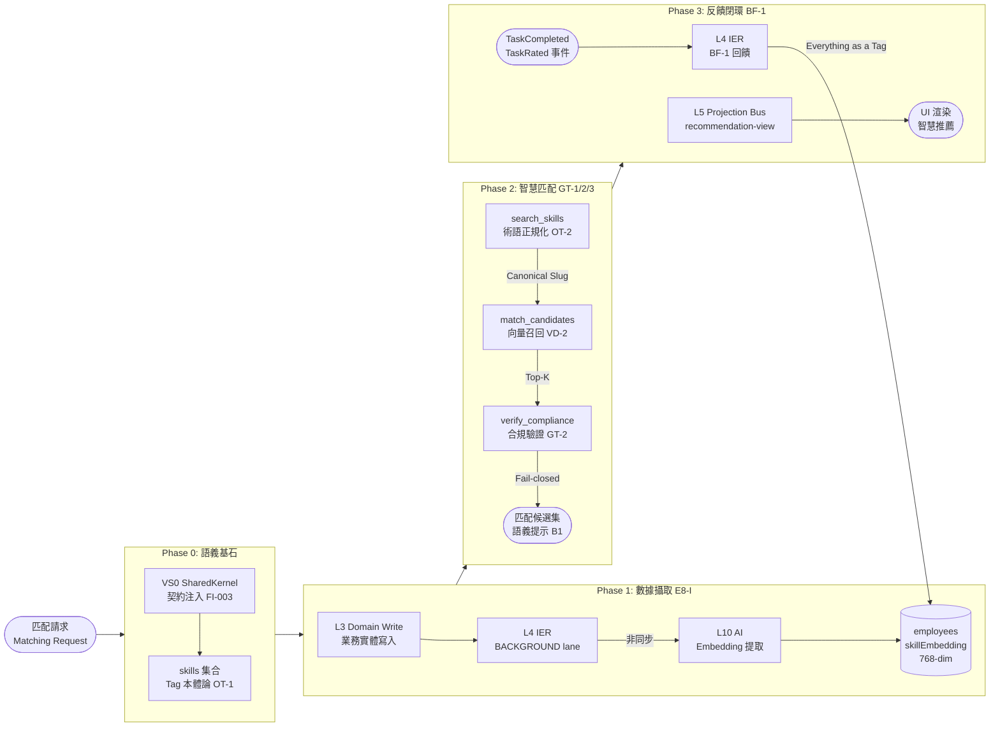

# 治理規則（Governance Rules Canonical）

本檔是規則正文 SSOT。  
`00` 負責拓撲裁決，`03` 負責路徑映射，`01` 僅為流程可讀視圖。

> 統一架構治理藍圖（對齊基礎）：[`06-DecisionLogic/03-unified-governance-blueprint.md`](06-DecisionLogic/03-unified-governance-blueprint.md)  
> VS8 語義數據生命週期細節：[`03-Slices/VS8-SemanticBrain/05-semantic-data-lifecycle.md`](03-Slices/VS8-SemanticBrain/05-semantic-data-lifecycle.md)

## 分類

| 類型 | 代碼 | 定義 |
|---|---|---|
| Hard Invariants | `R / S / A / #` | MUST，長期穩定不變量 |
| Governance | `D / P / T / E` | SHOULD（命中特定控制面時可升級為 MUST） |
| Forbidden | `FORBIDDEN` | MUST NOT，絕對禁止 |

## 審查門（Review Gates）

1. Layer Gate：鏈路與層位方向正確。
2. Rule Gate：命中規則 ID 必須可追溯。
3. Contract Gate：經 SK_PORTS 與公開 API。
4. Atomicity Gate：命令原子性與 outbox 一致。

## 核心規則索引（必審）

| ID | 規則 |
|---|---|
| `FI-003` | VS0 SharedKernel 必須在 Domain Slice (L3) 執行前注入契約型別；Domain Slice 不得重複定義 SK 已定義型別 |
| `R8` | traceId 僅入口注入一次，全鏈唯讀 |
| `R9` | context propagation 由中介層維持，禁止業務碼手動傳遞 |
| `S1` | Outbox contract：至少一次 + idempotency + DLQ 分級 |
| `S2` | Projection 版本守衛（只前進不回退） |
| `S3` | STRONG_READ / EVENTUAL_READ 分流 |
| `S4` | staleness SLA 常數化（禁止硬寫） |
| `D24` | Feature slice 禁止直接 import `@/shared-infra/*` 具體實作 |
| `D24-D` | Client -> Server 僅 plain DTO，不可傳 rich entity |
| `D25` | Next.js server/edge/action 禁止直接 import `firebase-admin` |
| `D26` | Cross-cutting authority 不得寄生 shared-kernel |
| `D27` | 成本語義由 VS8 `_cost-classifier.ts` 決策，VS5 document-parser 不可自判 |
| `E8-I` | Embedding 提取管線必須透過 IER (L4) 非同步執行；Domain Slice 禁止同步呼叫 AI 做嵌入向量計算 |
| `KG-1` | 知識圖譜邊（SemanticEdge）只能透過 VS8 `_actions.ts` 寫入 |
| `KG-3` | 寫入圖譜邊前必須通過循環依賴偵測（`_aggregate.ts`） |
| `VD-1` | 語義向量索引由 VS8 `_services.ts` 獨家管理 |
| `VD-2` | 外部切片透過 `_queries.ts` [D4] 出口查詢語義索引；嚴禁直調 `_services.ts` |
| `VD-3` | 索引實體（`indexEntity`）須在 Tag 寫入成功後觸發；不可先行索引未確認實體 |
| `VD-4` | Firestore 向量索引欄位維度必須與嵌入模型一致；禁止跨模型混用向量 |
| `OT-1` | 新分類法維度只能在 VS8 `_semantic-authority.ts` 定義 |
| `OT-2` | Tag 分配路徑必須通過 `validateTaxonomyAssignment` 驗證後方可寫入 |
| `OT-3` | `TAXONOMY_DIMENSIONS` 為唯讀常數；修改須走架構審查流程 |
| `GT-1` | VS8 Genkit 工具必須透過 `defineTool` 宣告；禁止 AI Flow 直調內部模組 |
| `GT-2` | AI 分派流程必須合規優先：`verify_compliance` 先於候選人輸出 |
| `GT-3` | `search_skills` 返回之 `skillId` 作為後續查詢的標準術語依據 |
| `BF-1` | 業務指紋回饋：任務結果確認後，Domain Slice 透過 IER 事件觸發 VS8 更新 `employees.skillEmbedding` 權重；嚴禁其他切片直接寫入 `employees.skillEmbedding` |
| `G7` | 跨切片語義訊號必帶 `semanticTagSlugs`；嚴禁傳遞裸字串語義標籤 |
| `D28` | 視覺化元件禁止直連 Firebase，必須經 `VisDataAdapter` |
| `D29` | Transactional outbox：Aggregate 與 outbox 同交易 |
| `D30` | hop-limit 循環防禦；SECURITY_BLOCK 禁止自動 replay |
| `D31` | 讀路徑權限一致性依賴 `acl-projection` |
| `E7` | App Check/security gate 不可繞過 |
| `E8` | AI flow 禁止直接呼叫 `firebase/*` 或跨租戶讀寫 |
| `A19` | VS5 任務狀態封閉生命週期 |
| `A20` | Finance staging pool 唯一寫入路徑 |
| `A21` | Finance_Request 獨立生命週期 |
| `A22` | Finance 狀態回饋必經 L5 label projection |

補充實作對照（2026-03-11）：

- `global-search.slice`：跨域搜尋權威出口（D26）。
- `portal.slice`：門戶 state 橋接切片（不編入 VS1~VS9）。

## VS8：語義智慧匹配架構（SIMA）規則集

> 定位：語義智慧匹配架構（SIMA）；三大支柱：Knowledge Graph / Vector DB / Skills Ontology。
> 詳細設計：[`architecture.md`](03-Slices/VS8-SemanticBrain/architecture.md) · [`05-semantic-data-lifecycle.md`](03-Slices/VS8-SemanticBrain/05-semantic-data-lifecycle.md)

### VS8 三工具分派引擎（Genkit Matching Flow）

### FI（Foundation Injection — 基礎契約注入）

- `FI-003`：VS0 SharedKernel 必須在 Domain Slice 執行前完成契約型別注入（Tag 型別、SK 常數）；Domain Slice 嚴禁重複定義 SharedKernel 已定義的型別。此為 Phase 0（語義基石）的前提條件。

### G（Governance — 語義治理）

- `G1`：全域語義標籤 SSOT 由 VS8 `_semantic-authority.ts` 與 `_aggregate.ts` 維護；嚴禁其他切片自行管理 Tag 語義。
- `G7`：跨切片語義訊號必帶 `semanticTagSlugs`（SK 定義的型別）；嚴禁傳遞裸字串標籤。

> **Everything as a Tag 原則**：系統中所有能力、資格、角色偏好均以語義 Slug 表示；業務結果透過 [BF-1] 回饋更新標籤權重，形成語義演進閉環。此原則是 G7 與 BF-1 的共同設計基礎。

### KG（Knowledge Graph — 知識圖譜 / 邏輯大腦）

- `KG-1`：圖譜邊（`SemanticEdge`）只能透過 VS8 `_actions.ts` 寫入；嚴禁外部切片直接建立邊。
- `KG-2`：邊的 `weight`（關係強度）啟用後視為不可變；修改須走更新命令。
- `KG-3`：寫入圖譜邊前必須通過循環依賴偵測（`_aggregate.ts`）；禁止 A→B→A 循環圖。

### VD（Vector Database — 向量數據庫 / 記憶模塊）

- `VD-1`：語義向量索引由 VS8 `_services.ts` 獨家管理；外部切片不可直接讀寫索引內部結構。
- `VD-2`：所有索引查詢必須透過 VS8 `_queries.ts` 出口 [D4]；嚴禁繞過出口直調 `_services.ts`。
- `VD-3`：索引實體（`indexEntity`）須在 Tag 寫入成功後觸發；不可先行索引未確認的實體。
- `VD-4`：Firestore 向量索引欄位（`employees.skillEmbedding`、`skills.embedding`）維度必須與所選嵌入模型一致；禁止跨模型混用嵌入向量。

### OT（Ontology / Taxonomy — 技能本體論 / 語言定義）

- `OT-1`：新分類法維度（`TaxonomyDimension`）只能在 VS8 `_semantic-authority.ts` 定義；嚴禁其他切片自行添加維度。
- `OT-2`：Tag 分配路徑必須通過 `validateTaxonomyAssignment` 驗證後方可寫入 Firestore。
- `OT-3`：`TAXONOMY_DIMENSIONS` 為唯讀常數；修改須走架構審查流程（`99-checklist.md`）。

### GT（Genkit Tools — AI 工具整合）

- `GT-1`：VS8 Genkit 工具（`search_skills` / `match_candidates` / `verify_compliance`）必須透過 `defineTool` 在 Genkit 中宣告；禁止在 AI Flow 中直接呼叫內部模組。
- `GT-2`：AI 分派流程必須遵守「合規優先（Fail-closed）」順序：若任務含 `requiredCertifications`，必須先呼叫 `verify_compliance`，不合規候選人排除後才能輸出。
- `GT-3`：`search_skills` 返回的 `skillId` 必須作為後續 `match_candidates` 的標準術語依據；禁止 AI 自行發明未經本體論驗證的技能術語。

### E8-I（Embedding Isolation — 嵌入向量非同步隔離）

- `E8-I`：Phase 1 Embedding 提取管線必須透過 IER (L4) 非同步執行（BACKGROUND lane）；Domain Slice 嚴禁同步呼叫 AI 服務計算嵌入向量。非同步隔離確保業務寫入延遲不受 AI 推理延遲影響。

### BF（Behavioral Fingerprint — 業務指紋回饋）

- `BF-1`：任務結果確認後（`TaskCompleted` / `TaskRated` 等事件），Domain Slice (VS5/VS9) 必須透過 IER 發布行為事件，由 VS8 消費並更新 `employees.skillEmbedding` 與標籤權重。嚴禁其他切片直接寫入 `employees.skillEmbedding`。此規則實現「**Everything as a Tag**」的語義演進閉環。

### B（Boundary — 邊界約束）

- `B1`：VS8 只輸出語義提示/匹配結果；嚴禁直接觸發跨切片副作用（分派決策由呼叫方負責）。
- `B3`：AI flow 僅可透過 port 使用 VS8；嚴禁 L10 直接寫 VS8 內部模組。
- `B4`：分類學路徑與向量相似度不可互相取代；兩者必須各司其職。

## Forbidden（精簡主清單）

- 禁止跨切片直接寫他域 Aggregate。
- 禁止 Transaction 外雙重寫入（先 aggregate 後 outbox）。
- 禁止 Feature slice 直連 `firebase/*`、`firebase-admin`。
- 禁止 Query 路徑反向驅動 Command 路徑。
- 禁止 Domain Slice 同步呼叫 AI 服務計算嵌入向量（必須透過 IER 非同步 [E8-I]）。
- 禁止 VS8 直接觸發 VS5/VS6/VS7 副作用（僅輸出語義提示 [B1]）。
- 禁止繞過 `VisDataAdapter` 直連可視化資料來源。
- 禁止繞過 `acl-projection` 在讀路徑重算高成本鑑權。
- 禁止在非 `global-search.slice` 內建立平行的跨域搜尋權威出口。
- 禁止在 VS8 以外的切片定義新分類法維度（`OT-1`）。
- 禁止外部切片直接建立 SemanticEdge 圖譜邊（`KG-1`）。
- 禁止繞過 `_queries.ts` 直調 VS8 `_services.ts`（`VD-2`）。
- 禁止 VS8 Genkit 工具跳過 `verify_compliance` 合規優先步驟直接輸出候選人（`GT-2`）。
- 禁止 AI Flow 使用未在 `skills` 集合驗證過的技能術語（`GT-3`）。
- 禁止其他切片直接寫入 `employees.skillEmbedding`（業務指紋回饋必須透過 VS8 IER 事件 [BF-1]）。
- 禁止跨切片傳遞裸字串語義標籤（必須使用 `semanticTagSlugs` [G7]）。
- 禁止 Domain Slice 重複定義 SharedKernel 已定義的契約型別（`FI-003`）。

## 跨切片強制規則（摘要）

- VS0：SharedKernel 契約注入所有 Domain Slices（`FI-003`）。
- VS5：任務生命週期與金融入口門檻（`A19/A20`）；任務結果觸發業務指紋回饋事件 [BF-1]。
- VS8：語義智慧匹配架構規則（`FI/KG/VD/OT/G/GT/E8-I/BF/B`）。詳見 [`03-Slices/VS8-SemanticBrain/architecture.md`](03-Slices/VS8-SemanticBrain/architecture.md) 與 [`05-semantic-data-lifecycle.md`](03-Slices/VS8-SemanticBrain/05-semantic-data-lifecycle.md)。
- VS9：Finance_Request 獨立狀態機與回饋投影（`A21/A22`）；Finance 結果觸發業務指紋回饋事件 [BF-1]。
- VS6/VS7：排班與通知均不得繞過事件/投影鏈路。

## 變更協議

1. 新規則先在本檔建立 canonical body。
2. 再同步 `00` 的索引與裁決語句。
3. 必要時更新 `03` 的實體路徑映射。
4. `01` 僅更新圖與閱讀指引，不重寫規則正文。
