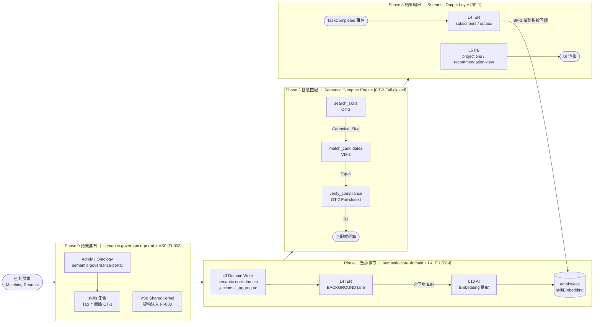

# 治理規則（Governance Rules Canonical）

本檔是規則正文 SSOT。  
`00` 負責拓撲裁決，`03` 負責路徑映射，`01` 僅為流程可讀視圖。

> 統一架構治理藍圖（對齊基礎）：[`06-DecisionLogic/03-unified-governance-blueprint.md`](06-DecisionLogic/03-unified-governance-blueprint.md)  
> VS8 語義數據生命週期細節：[`03-Slices/VS8-SemanticBrain/05-semantic-data-lifecycle.md`](03-Slices/VS8-SemanticBrain/05-semantic-data-lifecycle.md)  
> **語義核心協議 SSOT**（E8 / GT-2 / L4A / 工具呼叫序列）：[`Xuanwu-Semantic-Kernel-and-Matchmaking-Protocol.md`](../../Xuanwu-Semantic-Kernel-and-Matchmaking-Protocol.md)

## 分類

| 類型 | 代碼 | 定義 |
|---|---|---|
| Hard Invariants | `R / S / A / #` | MUST，長期穩定不變量 |
| Governance | `D / P / T / E` | SHOULD（命中特定控制面時可升級為 MUST） |
| Forbidden | `FORBIDDEN` | MUST NOT，絕對禁止 |

## 審查門（Review Gates）

1. Layer Gate：鏈路與層位方向正確。
2. Rule Gate：命中規則 ID 必須可追溯。
3. Contract Gate：經 SK_PORTS 與公開 API。
4. Atomicity Gate：命令原子性與 outbox 一致。

## 核心規則索引（必審）

| ID | 規則 |
|---|---|
| `FI-003` | VS0 SharedKernel 必須在 Domain Slice (L3) 執行前注入契約型別；Domain Slice 不得重複定義 SK 已定義型別 |
| `R8` | traceId 僅入口注入一次，全鏈唯讀 |
| `R9` | context propagation 由中介層維持，禁止業務碼手動傳遞 |
| `S1` | Outbox contract：至少一次 + idempotency + DLQ 分級 |
| `S2` | Projection 版本守衛（只前進不回退） |
| `S3` | STRONG_READ / EVENTUAL_READ 分流 |
| `S4` | staleness SLA 常數化（禁止硬寫） |
| `D24` | Feature slice 禁止直接 import `@/shared-infra/*` 具體實作 |
| `D24-D` | Client -> Server 僅 plain DTO，不可傳 rich entity |
| `D25` | Next.js server/edge/action 禁止直接 import `firebase-admin` |
| `D26` | Cross-cutting authority 不得寄生 shared-kernel |
| `D27` | 成本語義由 VS8 `_cost-classifier.ts` 決策，VS5 document-parser 不可自判 |
| `E8-I` | Embedding 提取管線必須透過 IER (L4) 非同步執行；Domain Slice 禁止同步呼叫 AI 做嵌入向量計算 |
| `KG-1` | 知識圖譜邊（SemanticEdge）只能透過 VS8 `_actions.ts` 寫入 |
| `KG-3` | 寫入圖譜邊前必須通過循環依賴偵測（`_aggregate.ts`） |
| `VD-1` | 語義向量索引由 VS8 `_services.ts` 獨家管理 |
| `VD-2` | 外部切片透過 `_queries.ts` [D4] 出口查詢語義索引；嚴禁直調 `_services.ts` |
| `VD-3` | 索引實體（`indexEntity`）須在 Tag 寫入成功後觸發；不可先行索引未確認實體 |
| `VD-4` | Firestore 向量索引欄位維度必須與嵌入模型一致；禁止跨模型混用向量 |
| `OT-1` | 新分類法維度只能在 VS8 `_semantic-authority.ts` 定義 |
| `OT-2` | Tag 分配路徑必須通過 `validateTaxonomyAssignment` 驗證後方可寫入 |
| `OT-3` | `TAXONOMY_DIMENSIONS` 為唯讀常數；修改須走架構審查流程 |
| `GT-1` | VS8 Genkit 工具必須透過 `defineTool` 宣告；禁止 AI Flow 直調內部模組 |
| `GT-2` | AI 匹配流程遵循 `search_skills → match_candidates → verify_compliance → output`；`verify_compliance` 必須在候選人輸出前完成；**Fail-closed：證照/資格硬過濾，未通過即排除** |
| `GT-3` | `search_skills` 返回之 `skillId` 作為後續查詢的標準術語依據 |
| `BF-1` | 業務指紋回饋：任務結果確認後，Domain Slice 透過 IER 事件觸發 VS8 更新 `employees.skillEmbedding` 權重；嚴禁其他切片直接寫入 `employees.skillEmbedding` |
| `G7` | 跨切片語義訊號必帶 `semanticTagSlugs`；嚴禁傳遞裸字串語義標籤 |
| `D28` | 視覺化元件禁止直連 Firebase，必須經 `VisDataAdapter` |
| `D29` | Transactional outbox：Aggregate 與 outbox 同交易 |
| `D30` | hop-limit 循環防禦；SECURITY_BLOCK 禁止自動 replay |
| `D31` | 讀路徑權限一致性依賴 `acl-projection` |
| `E7` | App Check/security gate 不可繞過 |
| `E8` | AI flow 禁止直接呼叫 `firebase/*` 或跨租戶讀寫；**Tool-M (`match_candidates`) metadata filter 必須 tenantId 強綁定，未帶入即 fail-closed** |
| `A19` | VS5 任務狀態封閉生命週期 |
| `A20` | Finance staging pool 唯一寫入路徑 |
| `A21` | Finance_Request 獨立生命週期 |
| `A22` | Finance 狀態回饋必經 L5 label projection |

補充實作對照（2026-03-11）：

- `global-search.slice`：跨域搜尋權威出口（D26）。
- `portal.slice`：門戶 state 橋接切片（不編入 VS0~VS9）。

## 🧠 VS8 · Semantic Cognition Engine（src/features/semantic-graph.slice）[#A6 #17]

> 定位：VS8 是全系統語義權威與語義認知引擎，以四子系統運作：`semantic-governance-portal`（Phase 0 本體論治理）｜`semantic-core-domain`（純領域邏輯）｜`Semantic Compute Engine`（三工具分派引擎）｜`Semantic Output Layer`（Phase 3 輸出與反饋）。
> 邊界：`semantic-graph.slice = VS8`；`VS9 = Finance`。VS8 不是 AI Runtime，也不直接執行跨切片副作用。
> 詳細設計：[`architecture.md`](03-Slices/VS8-SemanticBrain/architecture.md) · [`05-semantic-data-lifecycle.md`](03-Slices/VS8-SemanticBrain/05-semantic-data-lifecycle.md)

### VS8 四階段語義生命週期（Semantic Compute Engine · Genkit Matching Flow）

**費用保護原則**（架構正確性優先）：Firebase Snapshot 訂閱費用與連線數（讀取操作數）正比。舉例：若 vis-network、vis-timeline、vis-graph3d 三個元件各自建立 Firebase 訂閱，費用為 3 × 1 = **3 連線**；透過 `VisDataAdapter` 的 DataSet<> 快取，費用為 **1 連線**（一次訂閱，三元件共享推播）。隨元件數增長，費用差距等比放大。符合奧卡姆剃刀原則：不增加不必要的 Firebase 連線，不引入不必要的架構複雜度。

### D29：原子性保證（transactional-outbox-pattern）

> D29 為 Write-Atomicity Gate；凡新增或修改 L2 Command Pipeline 的 Aggregate 寫入路徑時必審

| 規則 | 類型 | 說明 |
|------|------|------|
| `D29` | MUST | L2 `CBG_ROUTE` 必須提供 `TransactionalCommand` 基類，供所有 VS 切片的寫操作繼承 |
| `D29` | MUST | 所有 VS 切片的 Command Handler 必須在同一個 Firestore Transaction 中完成：① 寫入業務 Aggregate 狀態、② 寫入該切片的 `{slice}/_outbox` 集合 |
| `D29` | MUST | 若 Aggregate 寫入成功、Outbox 寫入失敗，整個 Transaction 必須回滾；不得存在「Aggregate 已寫入、Outbox 未寫入」的中間狀態 |
| `D29` | FORBIDDEN | 禁止在 Transaction 外部先寫 Aggregate 再補寫 Outbox（雙重寫入模式），此違反原子性 |

**設計原則**（架構正確性優先）：只要業務存檔成功，事件就一定會發出；若存檔失敗，事件也會隨之復原。此從機制上消除了狀態與事件不同步的不一致性，無需各業務切片自行實作補償邏輯。

### D30：循環依賴防禦（hop-limit-circular-dependency）

> D30 為 Event Loop Guard Gate；凡修改 L4 IER 事件轉發邏輯、或跨切片事件訂閱關係時必審

| 規則 | 類型 | 說明 |
|------|------|------|
| `D30` | MUST | `SK_ENV`（EventEnvelope）必須包含 `hopCount` 欄位，初始值為 0 |
| `D30` | MUST | L4 `IER` 每次轉發事件時，必須將 `hopCount + 1` 後寫入下一個 Envelope |
| `D30` | MUST | 當 `hopCount ≥ 4` 時，IER 必須攔截該事件，拋出 `CircularDependencyDetected` 告警，並將事件路由至 `DLQ SECURITY_BLOCK` |
| `D30` | MUST | `CircularDependencyDetected` 告警必須寫入 L9 `DOMAIN_ERRORS` |
| `D30` | FORBIDDEN | 禁止在 hopCount 超限後繼續轉發事件；禁止對 `SECURITY_BLOCK` DLQ 自動 Replay |

**設計原則**（架構正確性優先）：即使開發者在業務邏輯中不慎設計了循環觸發，系統也能在運行時自動截斷，防止雪崩效應。臨界值 3 次轉發（hopCount ≥ 4）符合奧卡姆剃刀原則：正常業務事件鏈不應超過此深度，超過即視為異常。

### P8：L5 動態背壓與併發池（dynamic-backpressure-worker-pool）

> P8 為 Projection Bus Performance Gate；凡新增高頻 Projection 寫入路徑、或修改 FUNNEL 分派邏輯時必審

| 規則 | 類型 | 說明 |
|------|------|------|
| `P8` | SHOULD | L5 `FUNNEL` 必須按事件的 `priorityLane`（Critical / Standard / Background）分配不同的 Worker Pool 配額（Quota） |
| `P8` | SHOULD | 對於「高密度」投影（同一 Document 被多個事件修改），FUNNEL 在緩衝區中對同一 `docId` 的寫入進行 Debounce / Batching：100ms 內的同一 doc 更新合併為一次寫入 |
| `P8` | SHOULD | Worker Pool 配額邊界必須引用 `SK_STALENESS_CONTRACT` 的 SLA 常數，禁止硬寫配額數字 |

**設計原則**（架構正確性優先）：確保基礎設施能根據負載自動調節，Critical Lane 不會因 Background Lane 的寫入放大而受到影響；Debounce 機制可有效降低寫入次數，符合奧卡姆剃刀原則：不引入不必要的 Firestore 寫入。

### D31：讀寫權限一致性（permission-projection）

> D31 為 CQRS Auth Symmetry Gate；凡修改 CBG_AUTH 權限邏輯、或新增讀取路由時必審

| 規則 | 類型 | 說明 |
|------|------|------|
| `D31` | MUST | 將「存取權限」視為一種 Projection（Read Model）：`acl-projection` |
| `D31` | MUST | 當 `CBG_AUTH` 處理權限變更事件（如 RoleChanged / PolicyChanged）時，L5 必須同步更新 `projection.acl-projection` |
| `D31` | MUST | `QRY_API_GW`（L6 Query Gateway）讀取資料時，必須自動將讀取請求與 `acl-projection` 進行 JOIN / Filter，確保讀寫路徑授權的絕對同步 |
| `D31` | MUST | `projection.acl-projection` 歸屬 `CRITICAL_PROJ_LANE`；SLA 遵守 `PROJ_STALE_CRITICAL ≤ 500ms`[S4] |
| `D31` | FORBIDDEN | 讀路徑禁止重新執行複雜的 Aggregate 鑑權邏輯；必須僅依賴 `acl-projection` 的預計算結果 |

**設計原則**（架構正確性優先）：CQRS 讀寫分離後，鑑權邏輯若只在寫路徑執行，讀路徑就會存在授權漏洞。Permission Projection 是解決讀寫鑑權不對稱的正規架構方案，而非補丁式修補。

### R9：Context Propagation Middleware（context-propagation-middleware）

| 規則 | 類型 | 說明 |
|------|------|------|
| `R9` | MUST | `outbox-relay-worker` 在投遞 Outbox 時，必須驗證來源 Envelope 帶有 `traceId`；若缺失則拒絕投遞並記錄 L9 錯誤 |
| `R9` | MUST | `outbox-relay-worker` 及 L4 IER 執行非同步函式時，必須使用 `AsyncLocalStorage`（Node.js）自動傳遞 `traceId` 上下文，確保整條非同步鏈路 context 不斷鏈 |
| `R9` | MUST | 前端 SDK（`EXT_CLIENT` · `_actions.ts`）必須在每個請求中自動注入 `x-trace-id` HTTP Header |
| `R9` | MUST | `CBG_ENTRY` 在收到請求時，必須優先讀取 `x-trace-id`；僅在 Header 缺失時才由 `CBG_ENTRY` 生成新的 `traceId`[R8] |
| `R9` | FORBIDDEN | 禁止開發者在業務代碼中手動傳遞 `traceId`；`traceId` 的傳遞由底層 Middleware 自動維持 |

> E7 為 Firebase Entry Security Gate；凡新增或修改受保護資料入口、App Check Adapter 或 `firebase/app-check` / `firebase-admin/app-check` 呼叫點時必審

| 規則 | 類型 | 說明 |
|------|------|------|
| `E7` | MUST | HTTP endpoint / Webhook / Callable Function 等外部入口涉及受保護資料或可變更狀態，必須先完成 App Check 驗證（含 token 續期與失效處理）；未通過不得進入 L2/L3 |
| `E7` | MUST | Client 端 `AppCheckAdapter`（L7-A · `src/shared-infra/firebase-client/app-check/`）是唯一合法的 `firebase/app-check` 呼叫點 |
| `E7` | MUST | 服務端驗證 App Check token 必須經 `AdminAppCheckAdapter`（L7-B · `src/shared-infra/firebase-admin/functions/`）；不得在 Next.js Server Components / Server Actions / Edge Functions 直接呼叫 `firebase-admin/app-check` |
| `E7` | FORBIDDEN | Domain Slice / Feature Slice 禁止繞過 App Check 驗證直接存取受保護資源 |
| `E7` | FORBIDDEN | 禁止在 `AppCheckAdapter` / `AdminAppCheckAdapter` 以外的位置實作 `firebase/app-check` 或 `firebase-admin/app-check` 邏輯 |

### P6：平行路由與串流 UI

| 規則 | 類型 | 說明 |
|------|------|------|
| `P6` | SHOULD | 使用 Next.js Parallel Routes 時每個 `@slot` 必須對應單一資料通道（QGWAY channel）與獨立 Suspense fallback |
| `P6` | SHOULD | 使用 Streaming UI 必須定義可中斷/可重試策略，避免跨 slot 共享阻塞 |

### E8：Genkit AI 治理（genkit-tool-governance）

> E8 為 AI Runtime Security Gate；凡新增或修改 Genkit flow、AI tool calling 邏輯或 L10 元件時必審

| 規則 | 類型 | 說明 |
|------|------|------|
| `E8` | MUST | Genkit flow 觸發 tool calling 必須經 Tool ACL（role/scope/tenant）與審計追蹤（traceId/toolCallId/modelId） |
| `E8` | MUST | `match_candidates`（Tool-M）metadata filter **必須 tenantId 強綁定**；未帶入 tenantId 即 **fail-closed**（跨租戶向量查詢一律拒絕） |
| `E8` | FORBIDDEN | AI flow 禁止直接呼叫 `firebase/*` 或跨租戶讀寫 |

---

### L4A：語義決策稽核切片（Semantic Decision Audit Slice）

> L4A 為 AI 匹配決策稽核門（Semantic Decision Audit Gate）；凡 AI 匹配流程（Phase 2）完成後必審

| 規則 | 類型 | 說明 |
|------|------|------|
| `L4A` | MUST | AI 匹配流程（Phase 2）完成後，L4 IER 路由至 L4A 稽核切片，寫入決策稽核記錄 |
| `L4A` | MUST | 稽核記錄必須包含五大欄位：**Who**（操作者/呼叫人）、**Why**（匹配觸發原因）、**Evidence**（推理軌跡 inferenceTrace[]）、**Version**（AI 模型版本/modelId）、**Tenant**（租戶 ID） |
| `L4A` | MUST | 缺失任一欄位視為稽核記錄不完整，禁止進入 L5 Projection |
| `L4A` | MUST | 稽核記錄經 L4 STANDARD_LANE 路由；屬於 STANDARD Projection |
| `L4A` | FORBIDDEN | 禁止 L4A 直接寫入 L3 Aggregate；僅可透過 L5 Projection Bus 物化稽核視圖 |

**設計原則**（架構正確性優先）：稽核切片是 AI 匹配決策的可追溯基礎。五大欄位的完整性確保每次 AI 輸出均可被審計、回溯與持續提升。

### #A19：VS5 任務生命週期收斂（task-lifecycle-convergence）

> #A19 為 VS5 Task State Closure Gate；凡修改 VS5 任務狀態機、驗收流程或 TaskAcceptedConfirmed 事件發送邏輯時必審

| 規則 | 類型 | 說明 |
|------|------|------|
| `A19` | MUST | 任務 Aggregate 必須遵循嚴格狀態路徑：`IN_PROGRESS → PENDING_QUALITY → PENDING_ACCEPTANCE → ACCEPTED` |
| `A19` | MUST | 切換至 `ACCEPTED` 之前，必須通過內部 `task-accepted-validator`，檢查驗收簽核與品質合格證均已物化 |
| `A19` | MUST | 任務狀態變更至 `ACCEPTED` 與 `TaskAcceptedConfirmed` 事件寫入 `ws-outbox` 必須封裝於同一個 L2 Firestore Transaction [D29] |
| `A19` | MUST | `TaskAcceptedConfirmed` 事件必須路由至 L4 IER `CRITICAL_LANE`，保障金融事實的低延遲高可靠性 |
| `A19` | FORBIDDEN | 禁止外部服務（含 VS9）直接修改 VS5 任務狀態；狀態只能由 VS5 任務 Aggregate 內部驅動 |
| `A19` | FORBIDDEN | 禁止在 Firestore Transaction 之外先寫狀態再補寫 Outbox（雙重寫入模式）[D29] |

**設計原則**（架構正確性優先）：任務狀態封閉性（State Closure）確保業務語義的完整性——驗收是業務事實，請款是財務動作；兩者在邏輯與時間上徹底解耦。TaskAcceptedConfirmed 是二者之間唯一合法的訊號橋接，符合奧卡姆剃刀原則。

### #A20：待請款池規則（finance-staging-pool-rules）

> #A20 為 Finance Staging Pool Gate；凡修改 VS9 finance-staging.acl、Finance_Staging_Pool Projection 或打包鎖定邏輯時必審

| 規則 | 類型 | 說明 |
|------|------|------|
| `A20` | MUST | VS9 `finance-staging.acl` 必須透過 L4 IER `CRITICAL_LANE` 反應式監聽 `TaskAcceptedConfirmed` 事件 |
| `A20` | MUST | 若任務標註為可計費（billable），必須自動將任務事實轉錄至 `Finance_Staging_Pool`，轉錄內容包含：taskId, amount, tags, traceId, acceptedAt |
| `A20` | MUST | `Finance_Staging_Pool` 是 L5 Standard Projection，初始狀態為 `PENDING`（已驗收未請款）|
| `A20` | MUST | 財務人員執行打包動作後，被選取任務的 Staging Pool 記錄狀態立即變更為 `LOCKED_BY_FINANCE` |
| `A20` | MUST | `LOCKED_BY_FINANCE` 狀態的任務不可再次被選入另一個打包動作，防止重複請款 |
| `A20` | FORBIDDEN | VS9 禁止直接呼叫 VS5 API 或寫入 VS5 Aggregate 狀態 |
| `A20` | FORBIDDEN | `Finance_Staging_Pool` 禁止消費方直接寫入；唯一寫入路徑為 L5 Projection Bus via `TaskAcceptedConfirmed` 或打包鎖定命令 [S2] |

**設計原則**（架構正確性優先）：Finance_Staging_Pool 是業務與財務之間的物化緩衝層（Materialized Buffer），允許財務端按現實週期（週結/月結）靈活處置驗收成果，無需等待每一筆任務完成即時請款。

### #A21：Finance Request 獨立生命週期（finance-request-independent-lifecycle）

> #A21 為 Finance Request Lifecycle Gate；凡修改 Finance_Request Aggregate 狀態機、CreateBulkPaymentCommand 或 bundledTaskIds 結構時必審

| 規則 | 類型 | 說明 |
|------|------|------|
| `A21` | MUST | 每一筆打包動作觸發 `CreateBulkPaymentCommand`，在 VS9 生成一個全新的 `Finance_Request` Aggregate |
| `A21` | MUST | `Finance_Request` 狀態機必須嚴格遵循：`DRAFT → AUDITING → DISBURSING → PAID` |
| `A21` | MUST | `Finance_Request` 必須完整記錄 `bundledTaskIds[]`，建立明確的 1:N 溯源關係 |
| `A21` | MUST | Finance_Request 狀態變更與 `FinanceRequestStatusChanged` 事件寫入 `finance-outbox` 必須封裝於同一個 L2 Firestore Transaction [D29] |
| `A21` | MUST | `Finance_Request` 的精確狀態讀取必須使用 `STRONG_READ` [S3]；display 用讀取才可使用 `EVENTUAL_READ` |
| `A21` | FORBIDDEN | VS5 任務 Aggregate 禁止直接查詢或修改 VS9 Finance_Request 狀態 |
| `A21` | FORBIDDEN | 禁止為同一批次任務發起兩個 Finance_Request（LOCKED_BY_FINANCE 鎖定防止重複請款）[#A20] |

**設計原則**（架構正確性優先）：Finance_Request 的所有複雜金融規則（請款、預算對帳、撥款）全部收斂至其狀態機中；VS5 任務不需要知道錢怎麼付，VS9 Finance 不需要知道任務怎麼驗收。複雜度的物理隔離使系統在面對 WBS 業務時具備高抗壓性與可追蹤性。

### #A22：逆向回饋投影（finance-task-feedback-projection）

> #A22 為 Finance Feedback Projection Gate；凡修改 FinanceRequestStatusChanged 事件結構或 task-finance-label-view 投影邏輯時必審

| 規則 | 類型 | 說明 |
|------|------|------|
| `A22` | MUST | 當 Finance_Request 狀態變更時，VS9 必須透過 `finance-outbox`（`STANDARD_LANE`）發出 `FinanceRequestStatusChanged` 事件 |
| `A22` | MUST | L5 `task-finance-label-view` 投影消費 `FinanceRequestStatusChanged`，逆向更新 VS5 任務的金融顯示標籤（financeStatus, requestId, requestLabel）|
| `A22` | MUST | 前端 UI 透過 `task-finance-label-view` 投影合成顯示：任務狀態（已驗收）+ 金融狀態（已打包請款 REQ-001 / 審核中）|
| `A22` | MUST | `task-finance-label-view` 投影必須引用 `SK_VERSION_GUARD` [S2] |
| `A22` | FORBIDDEN | 前端禁止直讀 VS9 Finance 域資料以合成任務顯示；必須使用 `task-finance-label-view` 投影 |
| `A22` | FORBIDDEN | L5 投影禁止反向寫入 VS5 任務 Aggregate 狀態；只允許更新讀模型（task-finance-label-view）|

**設計原則**（架構正確性優先）：利用 IER 與 L5 Projection Bus 的透明記錄，可從任意一張請款單（Finance_Request）追蹤回所有原始任務節點，實現零模糊的金融治理審計路徑。

---

## VS8 語義認知引擎正規規則體系（G/C/E/O/B Series）

> **設計動機與診斷**：VS8 語義認知引擎過去面臨十項核心架構缺陷（P1–P10），涵蓋「分類邏輯散落各切片（if-else 字串比對）」、「技能需求硬寫陣列（靜態 JSON）」、「AI 決策不可解釋（黑盒輸出）」、「語義腐爛無人察覺（無監控）」、「人員資格靠人工比對」、「分類結果無法學習（靜態規則）」、「副作用混入語義層」、「向量與本體論脫節」、「治理無強制審核」、「跨切片語義不一致」。G/C/E/O/B 五個系列規則是對上述問題的**完整正式規範（Formal Specification）**，旨在從架構層面根除 Spaghetti 結構，使 VS8 成為語義推理的唯一可信真相。本節規則的設計遵循**架構正確性優先原則**：不以補丁修補結構問題，而是透過正確的抽象與清晰的職責邊界實現必要且充分的簡潔。

> **VS8 Gate**：凡新增或修改 `src/features/semantic-graph.slice/` 中任何模組，或跨切片引用 VS8 Port 介面時，必須對照本節所有適用規則進行完整審查。本節規則以**架構正確性優先原則**為最高裁決標準；任何違規不得以業務進度為由繞過，必須立即進行結構性修正（Structural Correction）而非補丁覆蓋。

---

### G 系列：Semantic Governance 治理規則 [G1–G7]

> G 系列規則屬於語義治理的**硬不變量（Hard Invariants）**，違反即視為架構違規，不接受業務端例外申請。

| 規則 | 類型 | 說明 |
|------|------|------|
| `G1` | MUST | `centralized-tag.aggregate`（CTA）是全域語義字典的唯一真相（SSOT）；所有 `TaskNode` slug、`SkillNode` slug、分類學節點，必須先在 CTA 完成註冊並進入 `Active` 狀態，方可在任何切片中被引用；未註冊的 slug 引用視為架構違規 |
| `G1` | FORBIDDEN | 禁止任何切片自行定義全域語義類別，或引用未在 CTA 完成 `Active` 狀態的 slug |
| `G2` | MUST | 語義標籤生命週期是**單向狀態機**，路徑唯一：`Draft → Active → Stale → Deprecated`；任何跳躍轉換或逆向轉換由 `invariant-guard` 攔截 |
| `G2` | FORBIDDEN | 不接受業務端以任何理由申請跳躍或逆向轉換語義標籤狀態 |
| `G3` | MUST | `invariant-guard` 擁有最高裁決權，負責強制執行物理邏輯不可違反的語義規則；裁決結果不可被任何上游覆蓋 |
| `G3` | MUST | 規則範例：`essence_type = COMPLIANCE` 的 `TaskNode`，其 `required_skills` 中必須存在至少一個 `cert_required = true` 的 `SkillNode`，違反即攔截 |
| `G3` | FORBIDDEN | 禁止任何模組繞過或覆蓋 `invariant-guard` 的裁決結果 |
| `G4` | MUST | VS8 的所有寫入路徑唯一：portal-editor / 任何切片 → L2 `CMD_GWAY` → CTA |
| `G4` | FORBIDDEN | 禁止任何模組繞過 `CMD_GWAY` 直接寫入 CTA、Graph 邊或任何 VS8 內部狀態 |
| `G5` | MUST | `semantic-governance-portal` 的所有治理變更必須經由 `portal-outbox` 廣播，DLQ 分級強制為 `REVIEW_REQUIRED` |
| `G5` | FORBIDDEN | 語義治理變更不允許 `SAFE_AUTO` 自動 Replay，必須經人工確認後方可進入 IER |
| `G6` | MUST | `staleness-monitor` 是語義腐爛的唯一預警點；其時間閾值必須引用 `SK_STALENESS_CONTRACT.TAG_MAX_STALENESS ≤ 30s` [S4] |
| `G6` | FORBIDDEN | 禁止在 `staleness-monitor` 內部硬寫任何時間數值 |
| `G7` | MUST | `semantic-protocol` 是跨切片語義訊號的協議憲法；所有穿越切片邊界的 command 與 event envelope 必須攜帶 `semanticTagSlugs` |
| `G7` | FORBIDDEN | 缺失 `semanticTagSlugs` 的跨切片訊號視為協議違規，由 `semantic-protocol` 攔截，不進入下游處理 |

---

### C 系列：Core Domain 主體圖規則 [C1–C11]

> C 系列規則定義主體圖（Subject Graph）的**結構本體論**，確保圖的語義完整性與一致性。

| 規則 | 類型 | 說明 |
|------|------|------|
| `C1` | MUST | VS8 維護的是**主體圖**（Subject Graph）；主體圖描述「世界中存在什麼以及存在物之間的結構關係」；因果（事件序列、動態過程）從主體圖推論得出，由 IER 與 L5 Projection 承載 |
| `C1` | FORBIDDEN | VS8 不維護因果圖；禁止在 VS8 內執行因果的物化或副作用 |
| `C2` | MUST | 主體圖有且僅有五種合法邊類型：`REQUIRES`（Task→Skill）、`HAS_SKILL`（Person→Skill）、`IS_A`（Skill→Skill 分類學繼承）、`DEPENDS_ON`（Task→Task 前置依賴）、`TRIGGERS`（Task→Task 完成觸發） |
| `C2` | FORBIDDEN | 禁止業務端自定義邊類型；擴充邊類型必須經過 `semantic-governance-portal` 治理流程 |
| `C3` | MUST | 所有邊必須攜帶 `weight ∈ [0,1]`；`REQUIRES` 邊的 weight 來源為對應 `SkillNode` 的 `granularity`；`HAS_SKILL` 邊的 weight 來源為 Person 的 `xp/tier` 換算值 |
| `C3` | FORBIDDEN | 禁止業務端在任何邊上硬寫 weight 數值；所有 weight 由 `weight-calculator` 統一計算 |
| `C4` | MUST | 分類學（Taxonomy）由 `IS_A` 邊與 `hierarchy-manager` 共同構成；父技能的滿足隱含對子技能 `REQUIRES` 的滿足 |
| `C4` | MUST | 分類學的任何修改必須經過 `semantic-governance-portal` 治理流程 [G4] |
| `C5` | MUST | 每個新標籤節點必須透過 `hierarchy-manager` 掛載至少一個父節點；孤立節點（無父節點）不得進入 `Active` 狀態 |
| `C5` | FORBIDDEN | 孤立節點的存在視為未完成的語義定義 |
| `C6` | MUST | `TaskNode.essence_type` 有且僅有三個合法值：`PHYSICAL_INSTALL`、`LOGIC_CONFIG`、`COMPLIANCE`；此欄位由 `cost-item-classifier` 推理賦值 |
| `C6` | FORBIDDEN | 禁止業務端直接賦值或覆蓋 `TaskNode.essence_type` |
| `C7` | MUST | `TaskNode.shouldMaterializeAsTask` 是推理結果（非資料庫欄位）；只有 `essence_type = PHYSICAL_INSTALL` 或符合 EXECUTABLE override 規則（機電檢測/施工測試類）的 TaskNode 才觸發 VS5 `task.aggregate` 物化；override 規則本身是 Graph 上的一條 `IS_A` 邊 |
| `C7` | FORBIDDEN | override 規則不得以 if-else 實作；必須表達為 Graph 邊 |
| `C8` | MUST | `SkillNode.granularity` 是語義匹配的精細度參數，初始值由語義定義時設定，後續只由 `learning-engine` 根據事實事件演化 |
| `C8` | FORBIDDEN | 禁止任何切片手動修改 `granularity` |
| `C9` | MUST | `PersonNode` 是 VS2 `user-account` 在語義圖中的唯讀投影映射；`PersonNode.skill_inventory` 的更新來源唯一，由 VS3 `SkillXpAdded` / `SkillXpDeducted` 事件透過 `ISemanticFeedbackPort` 驅動 |
| `C9` | FORBIDDEN | 禁止任何路徑直接寫入 `PersonNode` |
| `C10` | MUST | `vector-store` 的向量是推理的輸入工具；向量必須與 CTA 標籤定義保持同步刷新，刷新延遲受 `SK_STALENESS_CONTRACT` [S4] 約束 |
| `C10` | FORBIDDEN | 過期向量不得用於任何推理輸入 |
| `C11` | MUST | 向量搜尋的結果必須經過 graph traversal 確認才能成為有效分類；向量負責縮小候選 slug 範圍，Graph 負責確認分類的結構正確性，兩者缺一不可 |
| `C11` | FORBIDDEN | 禁止以純向量相似度作為最終分類依據 |

---

### E 系列：Compute Engine 推理規則 [E1–E12]

> E 系列規則定義 VS8 Compute Engine 各模組的**推理邏輯邊界**，確保推理過程可追蹤、可審計。

| 規則 | 類型 | 說明 |
|------|------|------|
| `E1` | MUST | `semantic-edge-store` 是唯一合法的邊圖操作點；所有對 Graph 邊的讀取與寫入必須經過 `semantic-edge-store` |
| `E1` | FORBIDDEN | 禁止任何模組直接操作底層圖資料結構 |
| `E2` | MUST | `weight-calculator` 是語義相似度的統一出口；`computeSimilarity(a, b)` 是系統中唯一合法的語義相似度計算介面 |
| `E2` | FORBIDDEN | 禁止業務端、AI Flow 或任何其他模組自行實作語義加權邏輯 |
| `E3` | MUST | `adjacency-list` 的拓撲閉包計算是業務端消費圖結構的唯一合法路徑 [T5]；對外暴露 `getTransitiveRequirements`、`isSupersetOf`、`findCriticalPath` 三個介面 |
| `E3` | FORBIDDEN | 禁止業務端直接遍歷圖節點或邊集合 |
| `E4` | MUST | `cost-item-classifier` 是訂單項次語義分類的唯一入口，實作 `ISemanticClassificationPort`；系統中任何位置的訂單項次分類邏輯必須統一路由至此 |
| `E4` | FORBIDDEN | 禁止在 VS5 或任何其他切片中存在基於字串比對的分類邏輯 |
| `E5` | MUST | `cost-item-classifier` 的推理流程是固定三步驟，不可跳躍：① vector similarity 縮小候選 slug 範圍；② graph traversal 確認 `essence_type`；③ 套用 override 規則（override 規則本身是 Graph 邊） |
| `E5` | MUST | 輸出必須包含 `confidence` 與 `inferenceTrace[]` |
| `E6` | MUST | 每次推理必須輸出 `inferenceTrace[]`；`inferenceTrace` 記錄完整的推理路徑，包含每一步的候選 slug、邊類型、weight 值及 override 觸發記錄 |
| `E6` | FORBIDDEN | 無 `inferenceTrace` 的推理結果視為不完整，不得進入任何下游流程 |
| `E7` | MUST | `skill-matcher` 的人員資格推理必須同時滿足三個條件：① tier ≥ Task 要求層級；② granularity 覆蓋度 ≥ REQUIRES 邊 weight；③ `cert_required = true` 的 Skill 必須有對應合規證照 |
| `E7` | FORBIDDEN | 任一條件不滿足即判定不合格；不允許部分滿足的模糊通過 |
| `E8` | MUST | `causality-tracer` 的 BFS 因果傳播邊來源唯一：主體圖的 `TRIGGERS` 與 `DEPENDS_ON` 邊 |
| `E8` | FORBIDDEN | `causality-tracer` 不自行定義因果規則；所有因果路徑必須在主體圖中有對應邊作為依據 |
| `E9` | MUST | `learning-engine` 的權重演化只接受兩種事實事件作為輸入：VS3 `SkillXpAdded` / `SkillXpDeducted`（強化/弱化 HAS_SKILL 邊 weight）與 VS5 `TaskCompleted`（強化 REQUIRES 邊信心值）；強制邊界由 `ISemanticFeedbackPort` 實施 |
| `E9` | FORBIDDEN | 禁止任何其他事件繞過 `ISemanticFeedbackPort` 直接驅動 `learning-engine` |
| `E10` | MUST | `semantic-decay` 的衰退週期必須綁定 `SK_STALENESS_CONTRACT` [S4]；衰退邏輯只作用於長期無事實事件支撐的邊 weight |
| `E10` | FORBIDDEN | 禁止衰退邏輯覆蓋有活躍事實事件支撐的邊 |
| `E11` | MUST | `routing-engine` 只輸出 `SemanticRouteHint` contract，是純語義計算的建議輸出 |
| `E11` | FORBIDDEN | `routing-engine` 禁止持有任何副作用，禁止直接呼叫 VS6 排班或 VS7 通知；副作用的執行由訂閱 `SemanticRouteHint` 的對應切片自行負責 |
| `E12` | MUST | `context-attention` 的 Workspace 語義情境過濾是 Engine 層的統一職責；所有需要 Workspace 情境感知的語義查詢必須透過 `filterByContext(slugs, wsCtx)` 處理 |
| `E12` | FORBIDDEN | 禁止 VS8 以外的切片自行實作語義情境過濾邏輯 |

---

### O 系列：Output 輸出規則 [O1–O6]

> O 系列規則定義 VS8 對外輸出的**唯一合法出口**，確保跨切片語義消費遵守 CQRS 讀寫分離與 Port 介面原則。

| 規則 | 類型 | 說明 |
|------|------|------|
| `O1` | MUST | VS8 對外暴露三個 Port 介面作為唯一合法出口：`ISemanticClassificationPort`（供 VS5 呼叫分類）、`ISkillMatchPort`（供 L10 Genkit Flow 呼叫資格推理）、`ISemanticFeedbackPort`（供 `learning-engine` 接收事實事件） |
| `O1` | FORBIDDEN | 禁止任何切片或 AI Flow 繞過 Port 直接呼叫 VS8 內部模組 |
| `O2` | MUST | 業務端讀取語義資料的唯一合法路徑是 `projection.tag-snapshot` [T5]；`semantic-registry` 的資料來源也必須是 `projection.tag-snapshot`，遵守 CQRS 讀寫分離原則 |
| `O2` | FORBIDDEN | 禁止業務端直接查詢 CTA aggregate 或 `semantic-edge-store` |
| `O3` | MUST | `projection.task-semantic-view` 必須同時包含 `required_skills`（來自 Graph REQUIRES 邊）與 `eligible_persons`（來自 `skill-matcher` 推理結果）；兩者缺一則投影視為不完整，不得對外提供 |
| `O4` | MUST | `projection.causal-audit-log` 的每條記錄必須包含 `inferenceTrace[]` 與 `traceId` [R8]；`traceId` 從 event-envelope 讀取 |
| `O4` | FORBIDDEN | 禁止在 `causal-audit-log` 中重新生成 `traceId`；不含 `traceId` 或 `inferenceTrace` 的審計記錄視為不合規 |
| `O5` | MUST | `tag-outbox` 是 VS8 內部唯一的 outbox 節點，DLQ 分級為 `SAFE_AUTO`；路徑唯一：`tag-outbox → RELAY → IER → L5 FUNNEL → projection.tag-snapshot` |
| `O5` | FORBIDDEN | 禁止在 VS8 任何子模組中重複定義第二個 outbox 節點 |
| `O6` | MUST | `TagLifecycleEvent` 的廣播路徑唯一：必須經由 `tag-outbox → RELAY → IER` |
| `O6` | FORBIDDEN | 禁止 `TagLifecycleEvent` 繞過 IER 直接更新任何 Projection 或觸發任何切片邏輯 |

---

### B 系列：Boundary 邊界規則 [B1–B5]

> B 系列規則定義 VS8 的**切片邊界與依賴方向**，確保 VS8 的純語義職責不被副作用污染。

| 規則 | 類型 | 說明 |
|------|------|------|
| `B1` | MUST | VS8 的職責邊界是「語義推理與語義輸出」；VS8 不執行任何業務副作用；任務物化歸 VS5，排班執行歸 VS6，通知執行歸 VS7 |
| `B1` | FORBIDDEN | 任何試圖在 VS8 內部直接觸發跨切片副作用的設計視為邊界違規 |
| `B2` | MUST | VS8 內部各層的依賴方向是單向的：`Governance → Core → Engine → Output` |
| `B2` | FORBIDDEN | 禁止任何逆向依賴；Output 層只能透過 Port 介面被外部消費，不能被 Engine 層直接呼叫 |
| `B3` | MUST | AI Flow（L10 Genkit）存取 VS8 的路徑有且僅有兩條：透過 `ISemanticClassificationPort` 取得分類結果，透過 `ISkillMatchPort` 取得資格推理結果 |
| `B3` | FORBIDDEN | 禁止 AI Flow 直接呼叫 VS8 任何內部模組 |
| `B4` | MUST | VS8 的分類學（Taxonomy）與向量（Vector）共同服務於語義推理，但職責嚴格分離：分類學是本體論（世界是什麼），向量是認識論工具（如何從模糊輸入找到精確節點） |
| `B4` | FORBIDDEN | 禁止以向量替代分類學；禁止以分類學替代向量的模糊匹配能力 |
| `B5` | MUST | VS8 是主體圖的維護者，不是因果圖的維護者；VS8 可以從主體圖推論出因果路徑（`causality-tracer`），但因果的執行與物化屬於 IER 與 L5 Projection 的職責 |
| `B5` | FORBIDDEN | 禁止在 VS8 內執行因果的物化、狀態更新或任何業務副作用 |

**設計原則**（架構正確性優先）：B 系列規則確保 VS8 的狀態始終是語義現實的靜態鏡像，而不是動態流程的執行引擎。這條邊界使 VS8 在面對複雜業務演化時保持結構穩定、可審計、可演進。

---

## RULESET-MUST 索引（快速查閱）

### R / S 類（基礎設施不變量）

| 索引 | 摘要 |
|------|------|
| `R1` | relay-lag-metrics |
| `R5` | DLQ-failure-rule |
| `R6` | workflow-state-rule |
| `R7` | aggVersion-relay |
| `R8` | traceId-readonly |
| `R9` | context-propagation-middleware |
| `S1` | OUTBOX-contract |
| `S2` | VersionGuard |
| `S3` | ReadConsistency |
| `S4` | Staleness-SLA |
| `S5` | Resilience |
| `S6` | TokenRefresh |

### A / # 類（領域原子性）

| 索引 | 摘要 |
|------|------|
| `A3` | workflow-blockedBy |
| `A5` | scheduling-saga |
| `A8` | 1cmd-1agg |
| `A9` | scope-guard |
| `A10` | notification-stateless |
| `A12` | global-search-authority |
| `A13` | notification-hub-authority |
| `A14` | cost-semantic-dual-key |
| `A15` | finance-lifecycle-gate（進入閘門：task ACCEPTED via task-accepted-validator 才可進入 Finance Staging Pool）|
| ~~`A16`~~ | ~~multi-claim-cycle~~ → **已由 `#A21` 正式升級取代**；VS5 Finance 複雜生命週期移交 VS9 Finance_Request（DRAFT→AUDITING→DISBURSING→PAID）；禁止在新工作中引用 A16 |
| `A17` | skill-xp-award-contract |
| `A18` | org-semantic-extension |
| `A19` | task-lifecycle-convergence（VS5 任務狀態封閉性 + Validator 門禁 + TaskAcceptedConfirmed 原子化）|
| `A20` | finance-staging-pool-rules（VS9 反應式攔截 + LOCKED_BY_FINANCE 打包鎖定）|
| `A21` | finance-request-independent-lifecycle（VS9 Finance_Request：DRAFT→AUDITING→DISBURSING→PAID，1:N bundledTaskIds）|
| `A22` | finance-task-feedback-projection（FinanceRequestStatusChanged → L5 task-finance-label-view 逆向回饋）|

### E 類（Security Gate 閉環）

| 索引 | 摘要 |
|------|------|
| `E7` | app-check-enforcement-closure |
| `E8` | genkit-tool-governance |

### G 類（VS8 Semantic Governance 治理不變量）

| 索引 | 摘要 |
|------|------|
| `G1` | CTA-ssot（CTA 是全域語義字典唯一真相；未 Active 的 slug 不可引用） |
| `G2` | tag-lifecycle-unidirectional（生命週期單向狀態機：Draft→Active→Stale→Deprecated） |
| `G3` | invariant-guard-supreme（最高裁決權；COMPLIANCE TaskNode 必須有 cert_required Skill） |
| `G4` | cta-write-path-exclusive（寫入路徑唯一：CMD_GWAY → CTA；禁止繞過） |
| `G5` | governance-portal-review-required（治理變更 DLQ 強制 REVIEW_REQUIRED；禁止 SAFE_AUTO） |
| `G6` | staleness-monitor-sla-reference（TAG_MAX_STALENESS 必須引用 SK_STALENESS_CONTRACT；禁止硬寫） |
| `G7` | semantic-protocol-cross-slice（跨切片訊號必須攜帶 semanticTagSlugs；缺失即攔截） |

### C 類（VS8 Core Domain 主體圖不變量）

| 索引 | 摘要 |
|------|------|
| `C1` | subject-graph-boundary（VS8 只維護主體圖；因果圖由 IER+L5 承載） |
| `C2` | five-legal-edge-types（五種合法邊：REQUIRES/HAS_SKILL/IS_A/DEPENDS_ON/TRIGGERS；禁止自定義） |
| `C3` | weight-calculator-exclusive（所有邊 weight 由 weight-calculator 計算；禁止硬寫） |
| `C4` | taxonomy-governance（IS_A 邊分類學修改必須走 governance-portal [G4]） |
| `C5` | no-orphan-node（新標籤必須掛載父節點；孤立節點不得 Active） |
| `C6` | essence-type-classifier（TaskNode.essence_type 只由 cost-item-classifier 賦值；禁止業務端覆蓋） |
| `C7` | materialize-as-inference（shouldMaterializeAsTask 是推理結果；override 規則是 IS_A 邊，非 if-else） |
| `C8` | granularity-learning-only（SkillNode.granularity 只由 learning-engine 演化；禁止手動修改） |
| `C9` | person-node-readonly-projection（PersonNode 唯讀；唯一更新來源是 ISemanticFeedbackPort） |
| `C10` | vector-sync-freshness（向量必須與 CTA 同步；過期向量不得用於推理） |
| `C11` | vector-graph-dual-confirmation（向量縮範 + Graph 確認缺一不可；禁止以純向量作最終分類） |

### E 系列（VS8 Compute Engine 推理邊界）

| 索引 | 摘要 |
|------|------|
| `E1` | edge-store-exclusive（所有邊操作必須經 semantic-edge-store；禁止直操作底層圖） |
| `E2` | weight-calculator-sole-interface（computeSimilarity 是唯一語義相似度介面；禁止業務端自行計算） |
| `E3` | adjacency-list-topology（拓撲閉包唯一合法路徑；暴露 3 個介面；禁止直接遍歷） |
| `E4` | cost-item-classifier-sole-entry（ISemanticClassificationPort；禁止切片自行字串比對分類） |
| `E5` | three-step-inference（向量縮範→Graph 確認→override 三步不可跳躍；輸出含 confidence+inferenceTrace） |
| `E6` | inference-trace-mandatory（每次推理必須輸出 inferenceTrace[]；無 trace 不得進入下游） |
| `E7` | skill-matcher-triple-gate（tier+granularity+cert 三條件缺一不可；禁止部分滿足通過） |
| `E8` | causality-tracer-graph-only（BFS 來源唯一為 TRIGGERS+DEPENDS_ON 邊；禁止自定義因果規則） |
| `E9` | learning-engine-fact-events-only（只接受 VS3/VS5 事實事件；禁止繞過 ISemanticFeedbackPort） |
| `E10` | semantic-decay-sla-bound（衰退週期綁定 SK_STALENESS_CONTRACT；禁止覆蓋活躍事件支撐的邊） |
| `E11` | routing-engine-hint-only（只輸出 SemanticRouteHint；禁止持有副作用或直呼 VS6/VS7） |
| `E12` | context-attention-unified（filterByContext 由 VS8 統一；禁止其他切片自行過濾語義情境） |

### O 類（VS8 Output 輸出不變量）

| 索引 | 摘要 |
|------|------|
| `O1` | three-port-interfaces（ISemanticClassificationPort/ISkillMatchPort/ISemanticFeedbackPort 是唯一出口；禁止繞過） |
| `O2` | tag-snapshot-read-path（業務端讀取唯一路徑是 projection.tag-snapshot；禁止直查 CTA） |
| `O3` | task-semantic-view-completeness（required_skills+eligible_persons 必須同時存在；缺一不完整） |
| `O4` | causal-audit-log-with-trace（每條記錄必須含 inferenceTrace[]+traceId；禁止重新生成 traceId） |
| `O5` | tag-outbox-single-node（VS8 唯一 outbox，DLQ=SAFE_AUTO；禁止重複定義第二個 outbox） |
| `O6` | tag-lifecycle-event-ier-path（TagLifecycleEvent 廣播路徑唯一：tag-outbox→RELAY→IER；禁止繞過 IER） |

### B 類（VS8 Boundary 邊界不變量）

| 索引 | 摘要 |
|------|------|
| `B1` | vs8-semantic-only（VS8 只做語義推理輸出；禁止直接觸發跨切片副作用） |
| `B2` | governance-core-engine-output-unidirectional（內部依賴方向單向；禁止逆向依賴） |
| `B3` | ai-flow-port-only（AI Flow 只能透過 ISemanticClassificationPort/ISkillMatchPort 存取 VS8） |
| `B4` | taxonomy-vector-separation（分類學是本體論，向量是認識論工具；禁止互相取代） |
| `B5` | subject-graph-not-causal-executor（VS8 推論因果路徑，但因果執行歸 IER+L5；禁止在 VS8 內執行副作用） |

### D 類（Firebase 隔離 / 視覺化 DataSet / 原子性 / 循環防禦 / 權限一致性）

| 索引 | 摘要 |
|------|------|
| `D28` | vis-data-caching-pattern |
| `D29` | transactional-outbox-pattern |
| `D30` | hop-limit-circular-dependency |
| `D31` | permission-projection |

### P 類（效能與穩定性治理）

| 索引 | 摘要 |
|------|------|
| `P8` | dynamic-backpressure-worker-pool |

---

## 跨切片 RULESET-MUST（分類整理）

### VS5 強制規則

| 規則 | 說明 |
|------|------|
| VS5 MUST document-parser 三層閉環 | Layer-1 原始解析 → Layer-2 呼叫 VS8 `classifyCostItem()` 語義分類 → Layer-3 `shouldMaterializeAsTask()` 唯一物化閘門 [D27 #A14] |
| VS5 MUST 保留 sourceIntentIndex | 任務物化必須寫入 `sourceIntentIndex`；`tasks-view` 按 `createdAt`（批次間）→ `sourceIntentIndex`（批次內）排序 [D27-Order] |
| VS5 MUST 任務狀態封閉性 [#A19] | 禁止外部服務直接變更任務狀態；任務狀態必須遵循嚴格路徑 `IN_PROGRESS → PENDING_QUALITY → PENDING_ACCEPTANCE → ACCEPTED`；過渡至 `ACCEPTED` 須通過內部 `task-accepted-validator`（驗收簽核 + 品質合格證）|
| VS5 MUST TaskAcceptedConfirmed 原子化 [#A19 D29] | 任務狀態變更至 `ACCEPTED` 與 `TaskAcceptedConfirmed` 事件寫入 ws-outbox 必須封裝於同一個 L2 Firestore Transaction |
| VS5 MUST Finance 階段閘 [#A15] | 任務 `ACCEPTED` 之前禁止進入 Finance 流程；Finance 生命週期由 VS9 管理，Completed 條件為所有關聯 Finance_Request.status = PAID |
| VS5 MUST XP 只透過 IER 傳遞至 VS3 | 任務/品質流程禁止直接 mutate VS3 XP；事件 `TaskCompleted` / `QualityAssessed` 必須經 IER 傳入 VS3 [D9 #A17] |
| VS5 MUST 語義讀取僅經 L6 | VS5 語義讀取必須經 L6 Query Gateway；禁止直連 DB 或跨越 VS8 圖結構邊界 [D21-7 T5] |
| VS5 / VS6 MUST vis-* 元件消費 VisDataAdapter DataSet<> | vis-network（任務依賴圖）/ vis-timeline（排班日程）/ vis-graph3d（語義 3D 圖）只能消費 `VisDataAdapter` DataSet<>；禁止直連 Firebase [D28] |

### VS9 強制規則（Finance 金融聚合閘道）

| 規則 | 說明 |
|------|------|
| VS9 MUST 反應式攔截 [#A20] | VS9 `finance-staging.acl` 必須監聽 L4 IER `CRITICAL_LANE` 的 `TaskAcceptedConfirmed` 事件；可計費任務自動轉錄至 `Finance_Staging_Pool`（禁止 VS9 直接呼叫 VS5 API）|
| VS9 MUST 打包鎖定 [#A20] | 財務人員執行打包動作後，`Finance_Staging_Pool` 中被選取的任務狀態必須立即變更為 `LOCKED_BY_FINANCE`；防止重複請款 |
| VS9 MUST Finance_Request 獨立生命週期 [#A21] | 每一筆打包動作觸發 `CreateBulkPaymentCommand`，在 VS9 生成一個新的 `Finance_Request` Aggregate；狀態機 `DRAFT → AUDITING → DISBURSING → PAID`；必須完整記錄 `bundledTaskIds[]`（1:N 溯源關係）|
| VS9 MUST Finance_Request 原子化 [#A21 D29] | Finance_Request 狀態變更與 `FinanceRequestStatusChanged` 事件寫入 finance-outbox 必須封裝於同一個 L2 Firestore Transaction |
| VS9 MUST 逆向回饋投影 [#A22] | 當 Finance_Request 狀態變更時，VS9 必須透過 `finance-outbox` 發出 `FinanceRequestStatusChanged` 事件（STANDARD_LANE），由 L5 `task-finance-label-view` 逆向更新 VS5 任務的金融顯示標籤 |
| VS9 MUST TaskAcceptedConfirmed 走 CRITICAL_LANE | 從 `TaskAccepted` 到 `Finance_Staging_Pool` 的事件流強制路由至 L4 IER `CRITICAL_LANE`，保證金融事實的低延遲高可靠性 [#A19] |
| VS9 MUST 讀取僅經 L6 Query Gateway | VS9 Finance_Staging_Pool 讀取必須經 L6 `QGWAY_FIN_STAGE`；禁止直連 Firebase 或跨切片直讀 |

### VS8 強制規則（Semantic Cognition Engine 語義認知引擎）

| 規則 | 說明 |
|------|------|
| VS8 MUST 寫入唯一路徑 [G4] | 所有語義寫入必須走 L2 CMD_GWAY → CTA；禁止任何模組繞過 CMD_GWAY 直接寫入 CTA、Graph 邊或 VS8 內部狀態 |
| VS8 MUST 標籤生命週期單向 [G2] | 生命週期路徑唯一：Draft→Active→Stale→Deprecated；任何跳躍或逆向由 invariant-guard 攔截 |
| VS8 MUST Port 介面唯一出口 [O1] | VS8 對外只暴露三個 Port：ISemanticClassificationPort（VS5 分類）、ISkillMatchPort（L10 AI Flow）、ISemanticFeedbackPort（learning-engine 事實事件）；禁止繞過 Port 直接呼叫內部模組 |
| VS8 MUST 讀取只經 tag-snapshot [O2] | 業務端讀取語義資料唯一路徑是 projection.tag-snapshot；禁止直查 CTA 或 semantic-edge-store |
| VS8 MUST 推理三步驟完整 [E5 E6] | cost-item-classifier 必須完整執行：① 向量縮範 → ② Graph 確認 → ③ override 規則；輸出必須包含 inferenceTrace[] |
| VS8 MUST skill-matcher 三條件全滿 [E7] | tier ≥ 要求層級 AND granularity 覆蓋度 ≥ REQUIRES 邊 weight AND cert_required Skill 有合規證照；三者缺一不可 |
| VS8 MUST tag-outbox 唯一 [O5 O6] | VS8 只有一個 outbox（tag-outbox，DLQ=SAFE_AUTO）；TagLifecycleEvent 廣播必須經 tag-outbox→RELAY→IER；禁止繞過 IER |
| VS8 MUST learning-engine 只接受事實事件 [E9] | 唯一輸入：VS3 SkillXpAdded/SkillXpDeducted + VS5 TaskCompleted；透過 ISemanticFeedbackPort；禁止其他事件直驅 |
| VS8 MUST staleness-monitor 引用 SLA 常數 [G6] | TAG_MAX_STALENESS 必須引用 SK_STALENESS_CONTRACT [S4]；禁止硬寫數值 |
| VS8 MUST routing-engine 只輸出 SemanticRouteHint [E11] | routing-engine 是純語義計算建議輸出；禁止持有副作用或直呼 VS6/VS7 |
| VS8 MUST governance-portal 治理變更走 REVIEW_REQUIRED [G5] | semantic-governance-portal 所有治理變更 DLQ 強制 REVIEW_REQUIRED；禁止 SAFE_AUTO replay |
| VS8 FORBIDDEN 跨切片副作用 [B1] | VS8 禁止直接觸發任務物化（VS5）、排班執行（VS6）或通知發送（VS7）；副作用由訂閱 SemanticRouteHint 的切片執行 |

### VS6 強制規則

| 規則 | 說明 |
|------|------|
| VS6 MUST 讀 `ORG_ELIGIBLE_MEMBER_VIEW` | 取得可排班成員、tagSlug 技能能力（skills{tagSlug→xp}）與 eligible 狀態 [#14 #15 #16] |
| VS6 MUST 使用語義感知排班路由 | 基於 VS8 tagSlug 語義，禁止硬編碼成員 ID 或技能 ID [D21-5] |
| VS6 MUST 使用 `SK_SKILL_REQ` × Tag Authority | 排班職能需求合法性由 `SK_SKILL_REQ` × tagSlug 確定 [T4] |
| VS6 MUST 走 L6 Query Gateway | 排班視圖讀取只可經 L6；UI 禁止直讀 VS6/Firebase [D27 L6-Gateway] |
| VS6 MUST overlap/resource-grouping 在 L5 完成 | 前端僅渲染，計算責任在 L5 Projection [D27 Timeline] |

### VS3 強制規則

| 規則 | 說明 |
|------|------|
| VS3 MUST 使用 Ledger 記帳 | XP 異動必須寫 Ledger [#13] |
| VS3 MUST `getTier()` 只推導 | 從 `shared-kernel/skill-tier` import；禁止存入 DB [D12 #12] |
| VS3 XP Award MUST 由 VS3 獨占寫入 | 來源只能是 VS5 的 `TaskCompleted(baseXp, semanticTagSlug)` 與 `QualityAssessed(qualityScore)` [A17] |

### 分層規則

| 規則 | 說明 |
|------|------|
| L3 → L4 | 域事件透過 OUTBOX，由 relay-worker 投遞到 IER [D1 S1] |
| L4 → L5 | IER lane-router 分發到 event-funnel，event-funnel 是唯一 Projection 寫入路徑 [#9 #4b] |
| L5 → L6 | Projection Bus 物化後由 Query Gateway 暴露 |
| L2 → L3 | CBG_ROUTE 分發至 handler（CBG_ENTRY 已注入 traceId [D10]）|
| L3 MUST NOT → firebase/* | Feature Slice 禁止跨越 L7，必須走 SK_PORTS [D24] |

### Cross-cutting Authority 出口規則

| 權威 | 說明 |
|------|------|
| `Global Search` | 唯一跨域搜尋出口；業務 Slice 禁止自建搜尋邏輯 [D26 #A12] |
| `Notification Hub`（VS7） | 唯一副作用出口；業務 Slice 只產生事件不決定通知策略 [D26 #A13] |
