# [索引 ID: @VS8-DIAG-04] VS8 語義匹配完整流程圖

> Scope: `src/features/semantic-graph.slice/`
> Purpose: Mermaid sequence diagram — HR 分派三工具 Genkit AI 完整流程（search_skills → match_candidates → verify_compliance）
> Related: `architecture.md`（三大支柱）、`architecture-diagrams.md`（概覽圖）
> SSOT: `Xuanwu-Semantic-Kernel-and-Matchmaking-Protocol.md`（Phase 1/2/3 參與者定義）

```mermaid
sequenceDiagram
    autonumber
    
    participant UI as L0: 外部入口 (UI/Client/PM/User)
    participant GW as L0A: CQRS 閘道 (API Ingress)
    participant SA as L0B: Server Action 串流橋接 (Trace Stream)
    participant CBG as L2: 命令管線 (Write Pipeline)
    participant D3 as L3: 領域切片 (VS1-VS9 Slices)
    participant AI as L10: Genkit 編排器 (AI Orchestrator)
    participant ToolS as Tool-S: 技能檢索 (search_skills)
    participant ToolM as Tool-M: 候選匹配 (match_candidates)
    participant ToolV as Tool-V: 合規驗證 (verify_compliance)
    participant IER as L4: 事件路由器 (IER/LANE)
    participant Audit as L4A: 稽核切片 (Semantic Decision Audit)
    participant P5 as L5: 投影總線 (Projection/Bus)
    participant L8 as L8: 數據持久層 (Firebase/Vector DB)

    Note over UI, L8: Phase 1 寫入鏈 → Phase 2 智慧匹配 → Phase 3 讀取鏈

    %% ── Phase 1：Write Chain ──
    rect rgb(245, 248, 255)
        Note over UI, L8: 【Phase 1】寫入鏈 (Write Chain)：UI → L0A → L2 → L3 → L8(FI-002) → L10(embedding) → L4 → L5 LANE routing
        UI->>GW: 1.1 更新履歷 / 發布任務 (Update Profile / Post Task)
        GW->>CBG: 1.2 路由寫入請求 (Route Write Request)
        CBG->>D3: 1.3 執行領域聚合寫入 [D29 TransactionalCommand]
        D3->>L8: 1.4 存儲業務實體 + 自動標籤化 [FI-002 Firestore 單交易]
        D3->>IER: 1.5 發布數據變更事件 (Integration Events)
        IER-->>AI: 1.6 非同步觸發 Embedding 提取 [E8-I BACKGROUND lane]
        AI->>L8: 1.7 存儲向量嵌入 (Store Task/Profile Embeddings)
        IER->>P5: 1.8 LANE routing → L5 Projection 物化
    end

    %% ── Phase 2：Intelligent Matching ──
    rect rgb(230, 245, 255)
        Note over UI, Audit: 【Phase 2】智慧匹配 (Intelligent Matching Execution)：UI → L0A → L2 → L3 → L10 → Tool-S → Tool-M → Tool-V → L0B → L3 → L4 → L4A → L5

        UI->>GW: 2.1 提交任務匹配需求 (Submit Task Requirement)
        GW->>CBG: 2.2 路由寫入請求 (Route Write Request)
        CBG->>D3: 2.3 執行領域命令 (Execute Domain Command)
        D3->>AI: 2.4 觸發 Genkit 匹配流 (Invoke Genkit Flow) [E8 Tool ACL]
        
        rect rgb(200, 230, 255)
            Note right of AI: AI 決策路徑（遵循 GT-1 Tool 宣告）
            
            %% Step 2.5: 語義標準化
            AI->>ToolS: 2.5 術語映射 (Normalize Terms via search_skills) [OT-2]
            ToolS->>L8: 查詢本體論映射 (Ontology Lookup)
            L8-->>ToolS: 返回標準化標籤 (Canonical Skill Slugs)
            ToolS-->>AI: 標準化技能組 (Normalized Skill Set) [GT-3]

            %% Step 2.6: 向量召回 + E8 fail-closed
            AI->>ToolM: 2.6 向量匹配 (Vector Match via match_candidates) [VD-2]
            Note right of ToolM: E8 Fail-closed：metadata filter 必須 tenantId 強綁定；未帶入即 fail-closed（跨租戶查詢一律拒絕）
            ToolM->>L8: 語義近鄰召回 (Vector Similarity Search, tenantId filter enforced)
            L8-->>ToolM: Top-K 候選名單 (Candidate List)
            ToolM-->>AI: 語義匹配得分 (Semantic Scores)

            %% Step 2.7: 合規硬過濾 GT-2 Fail-closed
            AI->>ToolV: 2.7 資格檢核 (Compliance Check via verify_compliance) [GT-2]
            Note right of ToolV: GT-2 Fail-closed：證照/資格硬過濾；未通過即排除，禁止降級輸出
            ToolV->>L8: 驗證證照與可用性 (Verify Certs/Availability)
            L8-->>ToolV: 原始資格數據 (Raw Qualifications)
            ToolV-->>AI: 通過判定與理由 (Decisions & Reasons)
        end

        AI->>SA: 2.8 排名名單 + 推理軌跡 → L0B 串流橋接 (Ranked List & inferenceTrace via Server Action)
        SA-->>D3: 2.9 串流回 L3 領域切片 (Stream back to Domain Slice)
        D3->>IER: 2.10 發布匹配完成事件 (MatchingConfirmed)
        IER->>Audit: 2.11 路由至 L4A 稽核切片 (Route to Semantic Decision Audit)
        Note right of Audit: L4A 稽核欄位：Who（操作者）/ Why（觸發原因）/ Evidence（inferenceTrace[]）/ Version（modelId）/ Tenant（tenantId）
        Audit->>P5: 2.12 寫入稽核投影 (Write Audit Projection)
        IER->>P5: 2.13 寫入匹配推薦視圖 (Materialize Recommendation View)
    end

    %% ── Phase 3：Read Chain ──
    rect rgb(255, 250, 240)
        Note over P5, UI: 【Phase 3】讀取鏈 (Read Chain)：L3 → L5 → UI / UI → L0A → L6 → L5 → UI

        P5-->>UI: 3.1 投影更新推送 (Projection Update Push)
        UI->>GW: 3.2 發起查詢請求 (QRY Request via L0A)
        GW->>P5: 3.3 L6 查詢閘道讀取物化視圖 (Read Materialized Model via L6)
        P5-->>UI: 3.4 回傳排名名單與解釋 (Ranked List & Explanation)

        %% BF-1 業務指紋回饋
        D3->>IER: 3.5 [BF-1] 業務指紋回饋事件 (TaskCompleted/TaskRated)
        IER-->>AI: 3.6 VS8 調整 employees.skillEmbedding 權重 [BF-1]
        AI->>L8: 3.7 更新向量嵌入權重 (Update Skill Embedding Weights)
    end
```

