# [索引 ID: @VS8-DIAG-05] VS8 語義數據生命週期與匹配流程（Semantic Data Lifecycle and Matching Flow）

> Status: **Reference Blueprint**
> Scope: `src/features/semantic-graph.slice/`
> Purpose: 定義 VS8 四階段語義數據生命週期：(0) 語義基石；(1) 數據攝取與語義化；(2) 智慧匹配執行（search_skills → match_candidates → verify_compliance）；(3) 結果持久化 + 業務指紋自動回饋。
> Related: `architecture.md`（三大支柱）、`architecture-diagrams.md`（架構圖）、`04-semantic-matching-logic.md`（匹配序列）
> SSOT: `Xuanwu-Semantic-Kernel-and-Matchmaking-Protocol.md`（Phase 1/2/3 參與者定義）
>
> 關鍵新增概念：`3.6 語義決策稽核 [L4A]` — AI 匹配結果透過 L4A 稽核切片記錄 Who/Why/Evidence/Version/Tenant；`3.5 業務指紋自動回饋 [BF-1]` — 根據任務結果透過 IER(L4) 非同步觸發 VS8 調整 Employee 標籤權重，形成語義閉環。

```mermaid
sequenceDiagram
    autonumber
    
    %% 參與者定義（對齊 Xuanwu-Semantic-Kernel-and-Matchmaking-Protocol.md SSOT）
    participant Admin as VS8: 語義管理 (Admin/Ontology)
    participant VS0 as VS0: 核心內核 (Kernel/SK)
    participant UI as L0: 外部入口 (UI/Client/PM/User)
    participant SA as L0B: Server Action 串流橋接 (Trace Stream)
    participant CBG as L2: 命令管線 (Write Pipeline)
    participant IER as L4: 事件路由器 (IER/LANE)
    participant Audit as L4A: 稽核切片 (Semantic Decision Audit)
    participant AI as L10: Genkit 編排器 (AI Orchestrator)
    participant ToolS as Tool-S: 技能檢索 (search_skills)
    participant ToolM as Tool-M: 候選匹配 (match_candidates)
    participant ToolV as Tool-V: 合規驗證 (verify_compliance)
    participant D3 as L3: 領域切片 (Domain Slice)
    participant L8 as L8: 語義與數據層 (Semantic/Vector/DB)
    participant L5 as L5: 投影匯流排 (Projection Bus)

    %% 第零階段：語義基石 (Phase 0: Semantic Foundation)
    Note over Admin, L8: 第零階段：語義基石 (Phase 0: Semantic Foundation)

    rect rgb(250, 250, 250)
        Admin->>L8: 0.1 定義全域標籤本體 (Define Tag Ontology Slugs) [OT-1]
        VS0->>D3: 0.2 注入 SharedKernel 契約與 Tag 型別 [FI-003]
    end

    %% 第一階段：數據來源生命週期 (Phase 1: Data Source Lifecycle)
    Note over UI, L8: 第一階段：數據來源生成 (Phase 1: Data Ingestion & Governance)
    
    rect rgb(245, 245, 245)
        UI->>CBG: 1.1 發布任務/更新履歷 (Post Task / Update Profile)
        CBG->>D3: 1.2 執行領域聚合寫入 [D29 TransactionalCommand]
        D3->>L8: 1.3 存儲業務實體 + 自動標籤化 [FI-002 Firestore 單交易]
        D3->>IER: 1.4 發布數據變更事件 (Integration Events)
        IER-->>AI: 1.5 非同步觸發 Embedding 提取 [E8-I BACKGROUND lane]
        AI->>L8: 1.6 存儲向量嵌入 (Store Task/Profile Embeddings)
        IER->>L5: 1.7 LANE routing → L5 Projection 物化
    end

    %% 第二階段：智慧匹配執行 (Phase 2: Intelligent Matching Execution)
    Note over UI, L8: 第二階段：智慧匹配執行 (Phase 2: Execution Flow)

    UI->>CBG: 2.1 提交匹配請求 (Submit Matching Request)
    CBG->>D3: 2.2 觸發匹配指令 (Trigger Match Command)
    D3->>AI: 2.3 啟動 Genkit Matching Flow [E8 Tool ACL]
    
    rect rgb(230, 245, 255)
        Note right of AI: AI 決策路徑 (AI Decision Reasoning)
        
        %% 步驟 2.4: 語義標準化
        AI->>ToolS: 2.4 術語正規化 (Normalize Terms via search_skills) [OT-2]
        ToolS->>L8: 查詢本體論映射 (Ontology Lookup)
        L8-->>ToolS: 返回標準 Slug (Canonical Slugs)
        ToolS-->>AI: 標準化技能組 (Normalized Skill Set) [GT-3]

        %% 步驟 2.5: 向量召回 + E8 fail-closed
        AI->>ToolM: 2.5 執行向量匹配 (Execute Vector Match via match_candidates) [VD-2]
        Note right of ToolM: E8 Fail-closed：metadata filter 必須 tenantId 強綁定；未帶入即 fail-closed（跨租戶查詢一律拒絕）
        ToolM->>L8: 語義近鄰搜尋 (Vector Similarity Search, tenantId enforced)
        L8-->>ToolM: Top-K 候選名單 (Candidate List)
        ToolM-->>AI: 語義匹配得分 (Semantic Scores)

        %% 步驟 2.6: 合規性檢查 (Fail-closed)
        AI->>ToolV: 2.6 合規與資格檢核 (Compliance & Cert Check via verify_compliance) [GT-2]
        Note right of ToolV: GT-2 Fail-closed：證照/資格硬過濾；未通過即排除，禁止降級輸出 [GT-2]
        ToolV->>L8: 驗證證照/可用性 (Verify Certs/Availability)
        L8-->>ToolV: 原始數據 (Raw Qualifications)
        ToolV-->>AI: 通過判定與理由 (Decisions & Reasons)
    end

    %% 第三階段：結果輸出與反饋 (Phase 3: Output & Feedback)
    Note over AI, L5: 第三階段：結果持久化與反饋 (Phase 3: Output & Feedback Loop)

    AI->>D3: 3.1 回傳排名名單與推理軌跡 (Ranked List & inferenceTrace)
    D3->>SA: 3.2 [L0B 串流橋接] 結果經 Server Action streaming 回傳 UI (Stream via L0B)
    SA-->>UI: 3.3 流式回傳匹配結果 (Streaming Matched Results)
    D3->>L5: 3.4 發布投影事件 (Emit Projection Event)
    D3->>IER: 3.5 發布匹配完成事件 (MatchingConfirmed)
    IER->>Audit: 3.6 [L4A] 路由至稽核切片 (Route to Semantic Decision Audit)
    Note right of Audit: L4A 稽核欄位：Who（操作者）/ Why（觸發原因）/ Evidence（inferenceTrace[]）/ Version（modelId）/ Tenant（tenantId）
    Audit->>L5: 3.7 寫入稽核投影 (Write Audit Projection)
    L5-->>UI: 3.8 更新前端讀模型 (Update Read Model / UI)
    
    %% Everything as a Tag 反饋 (BF-1 via IER)
    D3->>IER: 3.9 [BF-1] 業務指紋回饋事件 (TaskCompleted/TaskRated)
    IER-->>AI: 3.10 VS8 調整 employees.skillEmbedding 權重 [BF-1]
    AI->>L8: 3.11 更新向量嵌入權重 (Update Skill Embedding Weights)
    Note right of AI: Everything as a Tag 閉環：根據任務結果調整 Employee 標籤權重 [BF-1]
```

