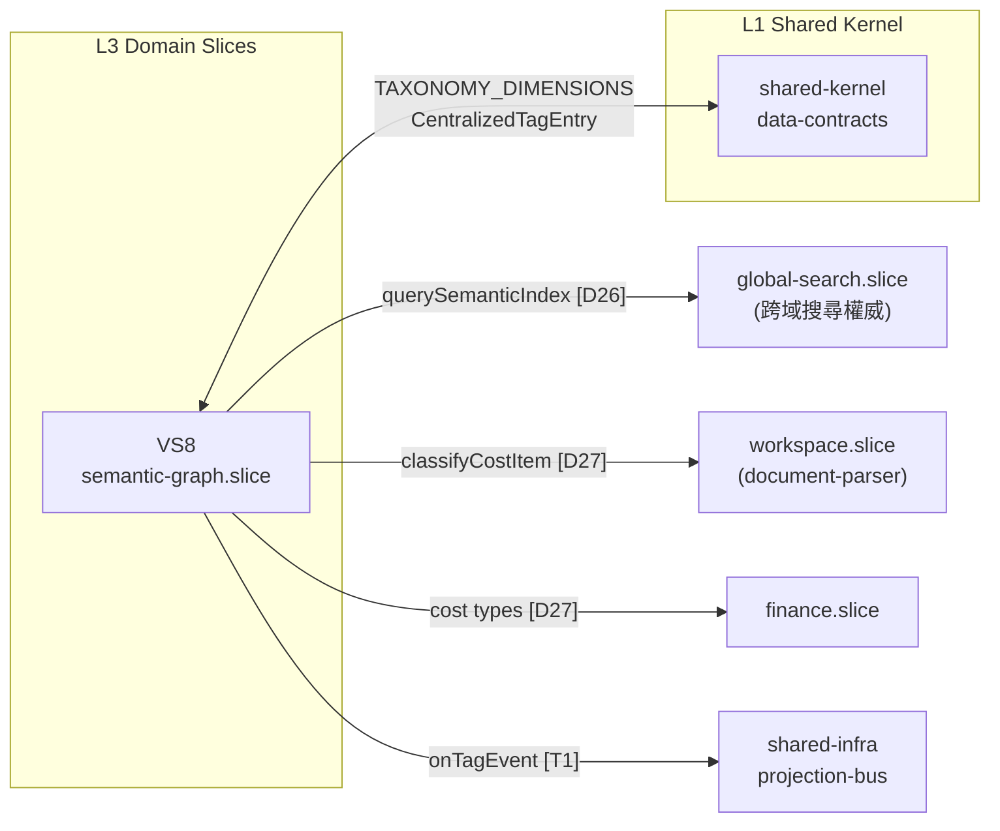
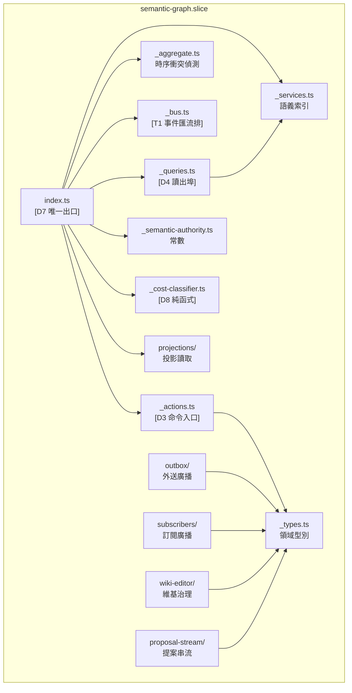
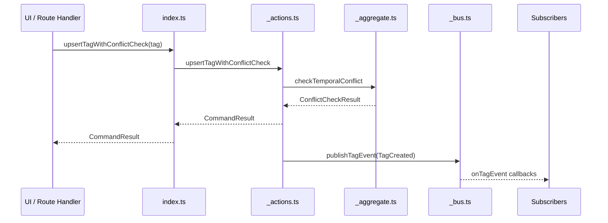
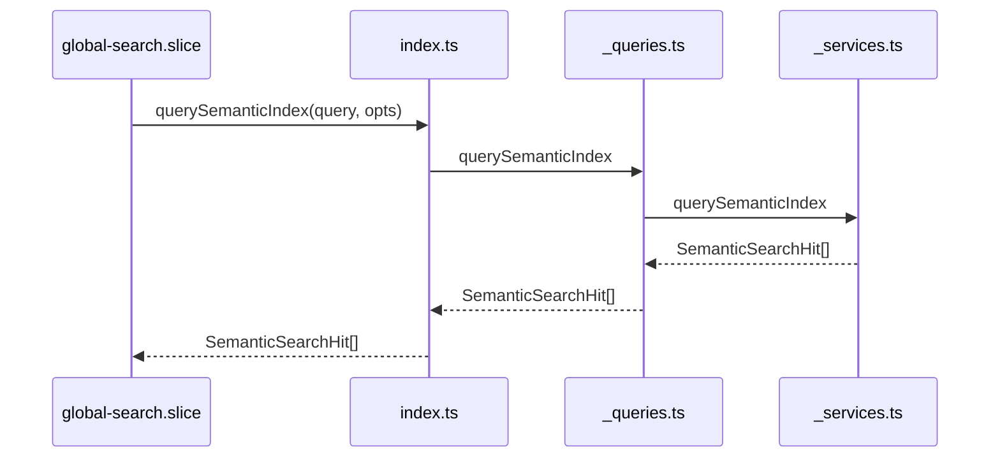
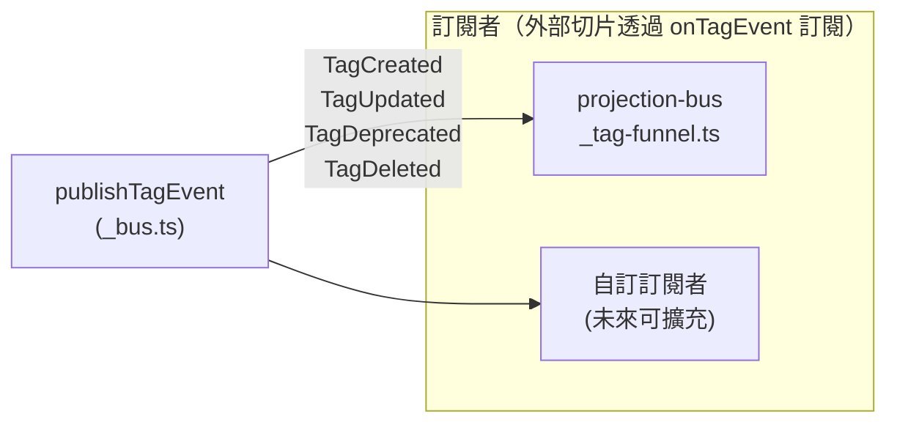
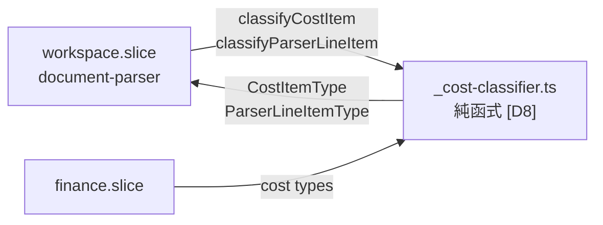

# [索引 ID: @VS8-DIAG] VS8 Semantic Brain — 架構圖

> Status: **Current**
> Scope: `src/features/semantic-graph.slice/`
> Purpose: 視覺化呈現 VS8 層位結構、資料流向與外部整合邊界。
> Related: `architecture.md`（現行架構定義）

---

## VS8 全域定位圖

---

## 根層模組依賴圖

---

## 命令鏈（寫路徑）

---

## 查詢鏈（讀路徑）

---

## 事件匯流排訂閱圖（Tag 生命週期）

---

## 成本分類器定位（D27）

---

## 架構邊界約束摘要

| 邊界                | 規則                                                         |
|--------------------|--------------------------------------------------------------|
| 寫入邊界            | 所有 Tag 寫入必須經由 `_actions.ts` [D3]；嚴禁直接寫 Firestore |
| 讀取邊界            | 所有讀取透過 `_queries.ts` [D4] 或 `projections/`            |
| 公開 API 邊界       | 唯一出口 `index.ts` [D7]；內部模組不對外                      |
| 事件邊界            | 外部切片透過 `onTagEvent()` 訂閱 [T1]                         |
| Firebase 邊界       | 禁止直連 Firebase SDK [D24]                                   |
| 副作用邊界          | VS8 禁止直接觸發跨切片副作用；只輸出語義提示/事件 [B1]         |
