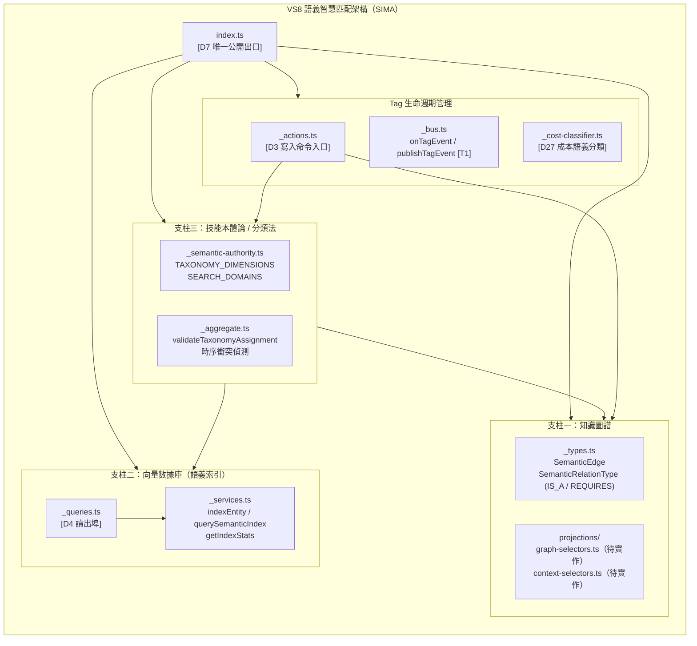
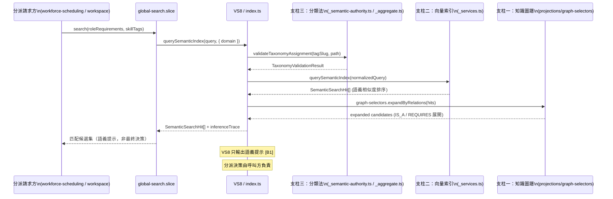
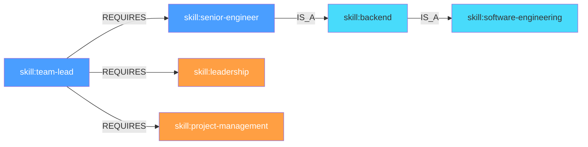
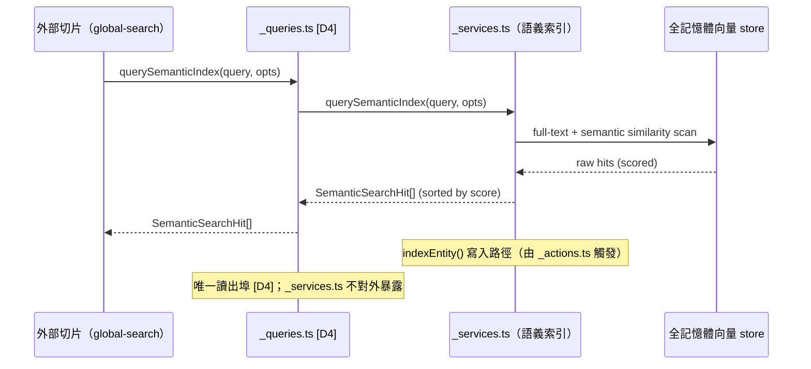
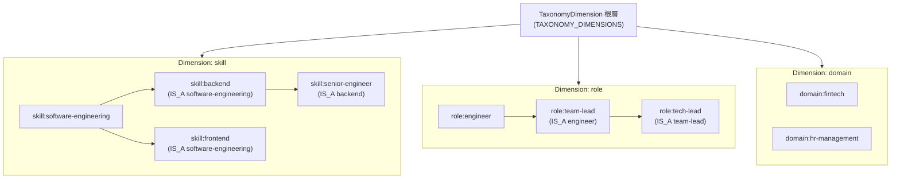
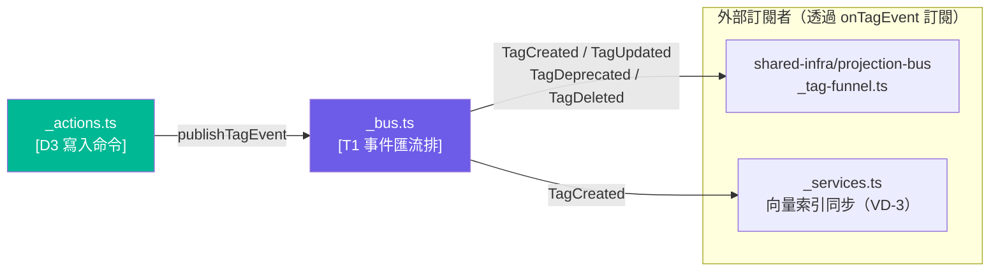
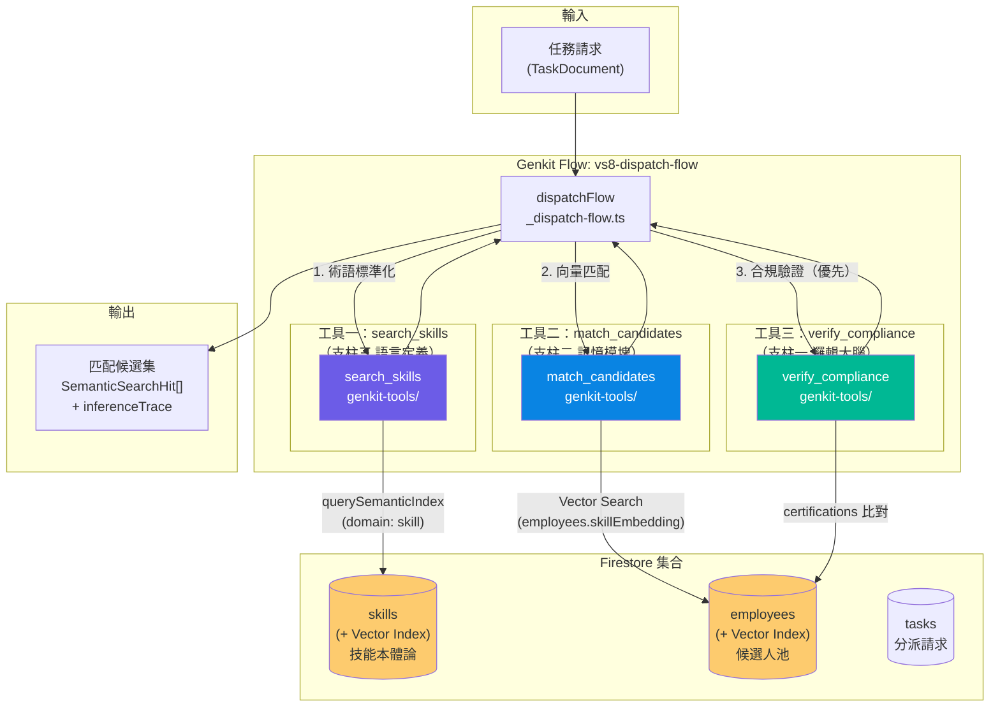
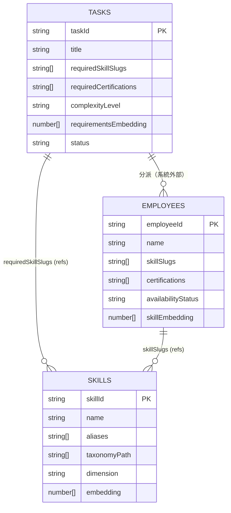
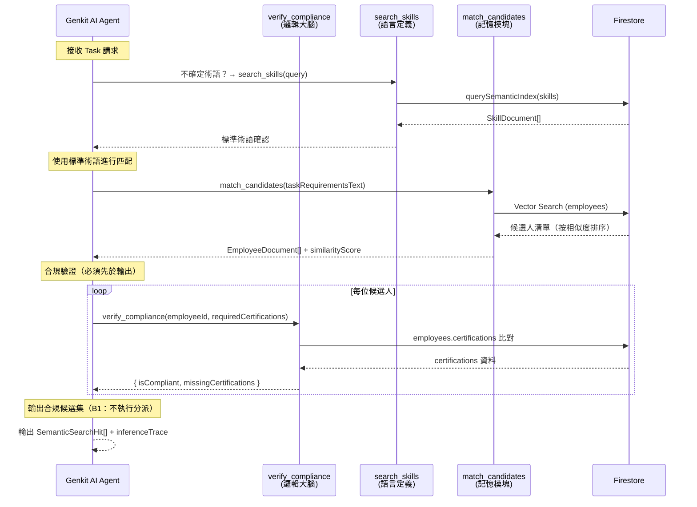

# [索引 ID: @VS8-DIAG] VS8 — 語義智慧匹配架構圖

> Status: **Current**
> Scope: `src/features/semantic-graph.slice/`
> Purpose: 視覺化呈現 VS8 三大支柱架構、HR 分派流程、知識圖譜關係與向量匹配流向。
> Related: `architecture.md`（架構定義）

---

## 一、VS8 三大支柱全覽

---

## 二、HR 分派匹配流程

---

## 三、知識圖譜關係圖（技能依賴範例）

*圖示說明*：
- **藍色節點**：技能/角色節點（SemanticEdge 終點）
- **橙色節點**：依賴項（REQUIRES 目標）
- **青色節點**：父類別（IS_A 目標）

---

## 四、向量索引查詢流（支柱二）

---

## 五、分類法層次結構（支柱三）

---

## 六、Tag 生命週期事件匯流排（支柱整合）

---

## 七、架構邊界約束摘要

| 邊界 | 規則 | 關鍵 ID |
|------|------|---------|
| **寫入邊界** | 所有 Tag / 圖譜邊寫入必須經由 `_actions.ts` | [D3] / [KG-1] |
| **讀取邊界** | 所有查詢透過 `_queries.ts` 出口 | [D4] / [VD-2] |
| **分類法邊界** | 新維度只能在 `_semantic-authority.ts` 定義 | [OT-1] |
| **公開 API 邊界** | 唯一出口 `index.ts`；內部模組不對外 | [D7] |
| **事件邊界** | 外部切片透過 `onTagEvent()` 訂閱 | [T1] |
| **Firebase 邊界** | 禁止直連 Firebase SDK | [D24] |
| **副作用邊界** | VS8 只輸出語義提示/匹配結果；不執行跨切片副作用 | [B1] |
| **分類法驗證邊界** | Tag 路徑必須通過 `validateTaxonomyAssignment` | [OT-2] |

---

## 八、Genkit AI 工具整合（三工具分派引擎）

---

## 九、Firestore 集合關聯圖（資料模型）

---

## 十、AI 分派調用序列圖（Prompt Engineering 強制順序）

