# 基礎設施視圖 (Infrastructure View)

> **原始檔（Source of Truth）**：完整 Mermaid 源碼與所有規則定義請見 [`00-logic-overview.md`](./00-logic-overview.md)
>
> **語義核心協議 SSOT**：L0B / L4A / L10 / Tool-S / Tool-M / Tool-V 路徑定義請見 [`Xuanwu-Semantic-Kernel-and-Matchmaking-Protocol.md`](../../Xuanwu-Semantic-Kernel-and-Matchmaking-Protocol.md)
>
> 邏輯流圖請見 [`01-logical-flow.md`](./01-logical-flow.md) · 治理規則請見 [`02-governance-rules.md`](./02-governance-rules.md)

本視圖提供 **VS0–VS8 路徑對照表、標準目錄結構、L7 Firebase Adapter 索引（決策矩陣請見 [`01-logical-flow.md §Firebase 路由決策`](./01-logical-flow.md#firebase-路由決策l7-a-firebase-client-sdk-vs-l7-b-functionsfirebase-admin)）、AI 平台控制面** 與 **L9 可觀測性藍圖**，
供落地實作與基礎設施對接時快速定位目標路徑。

---

## VS0–VS9 路徑對照表（Path Map）

| Layer | 職責 | 路徑 |
|---|---|---|
| `L0` | External triggers | `src/shared-infra/external-triggers/` |
| `L0A` | API ingress（CQRS Gateway — Command + Query 統一入口） | `src/shared-infra/api-gateway/` |
| `L0B` | Server Action 串流橋接（AI 匹配結果 streaming 回傳 UI） | `src/app/**/_actions.ts`（串流橋接層）|
| `L1` | contracts/constants/pure | `src/shared-kernel/` |
| `L2` | command gateway | `src/shared-infra/gateway-command/` |
| `L3` | domain slices | `src/features/*` |
| `L4` | IER + relay + DLQ | `src/shared-infra/{event-router,outbox-relay,dlq-manager}/` |
| `L4A` | 語義決策稽核切片（Semantic Decision Audit；欄位：Who/Why/Evidence/Version/Tenant） | `src/features/semantic-graph.slice/audit/` |
| `L5` | projection bus | `src/shared-infra/projection-bus/` |
| `L6` | query gateway | `src/shared-infra/gateway-query/` |
| `L7-A` | firebase-client adapters | `src/shared-infra/firebase-client/` |
| `L7-B` | functions/admin adapters | `src/shared-infra/firebase-admin/functions/` |
| `L8` | firebase runtime | external platform |
| `L9` | observability | `src/shared-infra/observability/` |
| `L10` | AI runtime | `src/shared-infra/ai-orchestration/` |

## 標準結構（最小）

- `src/shared-kernel/`
- `src/shared-infra/api-gateway/`
- `src/shared-infra/gateway-command/`
- `src/shared-infra/event-router/`
- `src/shared-infra/projection-bus/`
- `src/shared-infra/gateway-query/`
- `src/shared-infra/firebase-client/`
- `src/shared-infra/firebase-admin/{functions,dataconnect}/`
- `src/shared-infra/{observability,ai-orchestration}/`

## L4/L5/L6 重點清單

### L4（IER）

- Lane：`CRITICAL` / `STANDARD` / `BACKGROUND`
- DLQ：`SAFE_AUTO` / `REVIEW_REQUIRED` / `SECURITY_BLOCK`
- `D30`：hop-limit 防循環，SECURITY_BLOCK 禁止自動 replay
- **AI 嵌入管線 [E8-I]**：`L3(Domain Slice) → L4(IER, BACKGROUND lane) → L10(AI) → L8` — 非同步觸發 Embedding 提取，禁止 L3 同步呼叫 AI
- **業務指紋回饋 [BF-1]**：`L3(VS5/VS9) → L4(IER, BACKGROUND lane) → VS8(L3) → L8(employees.skillEmbedding)` — 任務結果自動調整員工語義權重

### L5（Projection）

- Critical：`workspace-scope-guard-view`、`org-eligible-member-view`、`acl-projection`
- Standard：`workspace-view`、`tasks-view`、`tag-snapshot`、`task-semantic-view`
- Memory/Feedback：`memory-snippet-view`、`feedback-pattern-view`、`memory-quality-view`
- Finance：`finance-staging-pool`、`task-finance-label-view`

### L6（Query）

- 只暴露 read models，不直接查 Aggregate。
- `D31`：所有讀權限過濾依賴 `acl-projection`。

## L7 Firebase Adapter 索引（精簡）

### L7-A（client）

- `AuthAdapter`
- `FirestoreAdapter`
- `FCMAdapter`
- `StorageAdapter`
- `RTDBAdapter`
- `AnalyticsAdapter`
- `AppCheckAdapter`
- `VisDataAdapter`

### L7-B（functions/admin）

- `FunctionsGateway`
- `AdminAuthAdapter`
- `AdminFirestoreAdapter`
- `AdminMessagingAdapter`
- `AdminStorageAdapter`
- `AdminAppCheckAdapter`
- `DataConnectGatewayAdapter`

約束：`firebase-admin` 只允許於 functions 容器（`D25`）。

## AI 控制面（L10）

- Flow Gateway
- Prompt Policy
- Tool ACL
- AI Storage

約束：`E8` 生效時，AI flow 不可直連 `firebase/*`、不可跨租戶。

- **Tool-S** (`search_skills`)：語義技能檢索工具；呼叫 L8 本體論索引。路徑：`src/features/semantic-graph.slice/genkit-tools/search-skills.tool.ts`
- **Tool-M** (`match_candidates`)：向量候選匹配工具；**E8 fail-closed**：`metadata filter 必須 tenantId 強綁定，未帶入即 fail-closed`。路徑：`src/features/semantic-graph.slice/genkit-tools/match-candidates.tool.ts`
- **Tool-V** (`verify_compliance`)：合規驗證工具；**GT-2 Fail-closed**：證照/資格硬過濾，未通過即排除。路徑：`src/features/semantic-graph.slice/genkit-tools/verify-compliance.tool.ts`
- **L0B**（Server Action 串流橋接）：AI 匹配流程結束後，Tool-V → L0B → L3 streaming 回傳 UI，攜帶 traceId。
- **L4A**（語義決策稽核切片）：L4 路由後寫入稽核記錄；欄位必須包含 Who（操作者）/ Why（觸發原因）/ Evidence（推理軌跡）/ Version（模型版本）/ Tenant（租戶 ID）。

## 遷移策略（四階段）

1. 收斂 canonical path（停止新增 legacy 落點）。
2. 導入 adapter/port 合規檢查（D24/D25/D31）。
3. 收斂 projection 與 query 命名（L5/L6 一致）。
4. 以 `99-checklist.md` 做 PR gate。

## 🧠 VS8 · Semantic Cognition Engine（src/features/semantic-graph.slice）[#A6 #17]

VS8 是 L3 的語義權威切片，以四子系統覆蓋完整語義生命週期：`semantic-governance-portal`（Phase 0，wiki-editor / proposal-stream）、`semantic-core-domain`（_types / _aggregate / _actions / _cost-classifier）、`Semantic Compute Engine`（genkit-tools/ + _services.ts，三工具分派）、`Semantic Output Layer`（projections / outbox / subscribers）。L10 消費 VS8，但不取代 VS8。詳細設計見 [`03-Slices/VS8-SemanticBrain/architecture.md`](03-Slices/VS8-SemanticBrain/architecture.md)（`VS8-SemanticBrain` 為歷史文件目錄，對應現行切片 `semantic-graph.slice`；`VS9 = Finance`）。

> VS8 四階段語義認知生命週期：[`03-Slices/VS8-SemanticBrain/05-semantic-data-lifecycle.md`](03-Slices/VS8-SemanticBrain/05-semantic-data-lifecycle.md)

### VS8 四階段基礎設施路徑圖

```mermaid
flowchart TD
    subgraph P0["Phase 0 語義基石 ｜ semantic-governance-portal (Phase 0)"]
        Admin[Admin / Ontology] --> WikiEd[semantic-governance-portal\nwiki-editor / proposal-stream]
        WikiEd --> Authority[_semantic-authority.ts]
        SK[VS0 SharedKernel] --> Aggregate[semantic-core-domain\n_aggregate.ts]
    end

    subgraph P1["Phase 1 數據攝取 ｜ semantic-core-domain + L4 IER [E8-I]"]
        Gateway[L0A / L2] --> DomainWrite[L3 Domain Write]
        DomainWrite --> Actions[semantic-core-domain\n_actions.ts / _aggregate.ts]
        Actions --> IER[L4 IER BACKGROUND]
        IER -->|E8-I| AI[L10 AI]
    end

    subgraph P2["Phase 2 智慧匹配 ｜ Semantic Compute Engine [GT-2 Fail-closed]"]
        Flow[L10 Genkit Flow] --> SCE[Semantic Compute Engine\ngenkit-tools/]
        SCE --> ToolS[Tool-S\nsearch_skills]
        SCE --> ToolM["Tool-M\nmatch_candidates\n[E8 fail-closed tenantId]"]
        SCE --> ToolV["Tool-V\nverify_compliance\n[GT-2 Fail-closed]"]
        ToolS & ToolM --> QrySvc[_queries.ts / _services.ts]
        ToolV --> SA[L0B Server Action\n串流橋接]
        SA --> Output[匹配結果 streaming]
        Output --> IER3[L4 IER → L4A 稽核切片\nWho/Why/Evidence/Version/Tenant]
    end

    subgraph P3["Phase 3 結果輸出 ｜ Semantic Output Layer [BF-1]"]
        Outcome[TaskCompleted 事件] --> IER2[L4 IER]
        IER2 --> SOL[Semantic Output Layer\nsubscribers / outbox]
        IER2 --> PB[L5 Projection Bus]
        PB --> Proj[projections/]
        Proj --> QG[L6 Query Gateway → UI]
    end

```


src/shared-infra/
  api-gateway/               # L0A CMD_API_GW + QRY_API_GW（讀寫分流入口）
  gateway-command/           # L2 CBG_ENTRY + CBG_AUTH + CBG_ROUTE（Write Path Pipeline）
  gateway-query/             # L6 read-model-registry（Read Path Routes）
  event-router/              # L4 IER（outbox-relay-worker / lane-router / dlq）
  projection-bus/            # L5 event-funnel + projectors
  firebase-client/
    auth/                    # AuthAdapter（L7-A · firebase/auth）
    firestore/               # FirestoreAdapter（L7-A · firebase/firestore）
    realtime-database/       # RTDBAdapter（L7-A · firebase/database，即時通訊）
    messaging/               # FCMAdapter（L7-A · firebase/messaging · R8 traceId）
    storage/                 # StorageAdapter（L7-A · firebase/storage）
    analytics/               # AnalyticsAdapter（L7-A · firebase/analytics，遙測只寫）
    app-check/               # AppCheckAdapter（L7-A · firebase/app-check）
    vis-data/                # VisDataAdapter（L7-A · vis-data DataSet<> 快取 · [D28]）
  firebase-admin/
    functions/               # Cloud Functions（firebase-admin 唯一容器）[D25]
      src/claims/            #   Admin Auth → firebase-admin/auth（自訂 Claims）
      src/gateway/           #   functions-gateway HTTP/Callable 入口
      src/ier/               #   IER 三條 Lane
      src/projection/        #   Projection Workers
      src/relay/             #   Outbox Relay Worker
      src/document-ai/       #   Document AI integration
    dataconnect/             # GraphQL 資料契約（受治理 GraphQL）[D25]
  observability/             # L9 metrics/trace/errors
  ai-orchestration/          # L10 Genkit Flow Gateway
```

---

> **CQRS Gateway（讀寫分離統一閘道）**：L0A 入口（`CMD_API_GW` / `QRY_API_GW`）、L2 Command Gateway（CBG_ENTRY/CBG_AUTH/CBG_ROUTE）、L6 Query Gateway（QGWAY + routes）三者在圖中合一為 `UNIFIED_GW`，以讀寫分離為唯一切割線。詳見 [`01-logical-flow.md §三條主鏈`](./01-logical-flow.md)
>
> **L2 Command Gateway 邊界規則**（可下沉 L1 元件 / MUST stay at L2 / D8・D10 禁止）→ [`02-governance-rules.md §L2 Command Gateway 邊界規則`](./02-governance-rules.md#l2-command-gateway-邊界規則d8--d10-附則)
>
> **[D29] Transactional Outbox Pattern**：`CBG_ROUTE` 提供 `TransactionalCommand` 基類；所有 VS 切片的 Command Handler 必須在同一 Firestore Transaction 中完成 Aggregate 寫入 + `{slice}/_outbox` 寫入。禁止在 Transaction 外部以雙步驟執行。

---

| 階段 | VS8 子系統 | 路徑 | 關鍵規則 |
|------|----------|------|---------|
| **Phase 0** 語義基石 | `semantic-governance-portal` | `Admin → wiki-editor / proposal-stream`；`VS0(SK) → semantic-core-domain(_aggregate) → L3` | `FI-003` / `OT-1` |
| **Phase 1** 數據攝取 | `semantic-core-domain` | `L0/L2 → L3 → semantic-core-domain(_actions/_aggregate) → L4 IER → L10 AI → L8` | `E8-I` / `KG-1` |
| **Phase 2** 智慧匹配 | `Semantic Compute Engine` | `L10 Genkit → Semantic Compute Engine(search_skills → match_candidates → verify_compliance)` | `GT-1/2/3` / `E8` |
| **Phase 3** 結果輸出 | `Semantic Output Layer` | `AI result → Semantic Output Layer(projections / outbox / subscribers) → L5 PB → L6 → UI` | `BF-1` / `S2` |

### 三大支柱基礎設施對應

| 支柱 | 角色隱喻 | Genkit 工具 | 資料集合（Firestore） | 模組路徑 |
|------|---------|------------|----------------------|---------|
| **支柱一：知識圖譜** | 🧠 邏輯大腦 | `verify_compliance` | `employees`（certifications 欄位比對） | `_types.ts`、`_actions.ts`、`genkit-tools/verify-compliance.tool.ts` |
| **支柱二：向量數據庫** | 💾 記憶模塊 | `match_candidates` | `employees`（skillEmbedding 向量索引）、`tasks`（requirementsEmbedding） | `_services.ts`、`_queries.ts`、`genkit-tools/match-candidates.tool.ts` |
| **支柱三：技能本體論** | 📖 語言定義 | `search_skills` | `skills`（embedding 向量索引 + taxonomyPath） | `_semantic-authority.ts`、`_aggregate.ts`、`genkit-tools/search-skills.tool.ts` |

### Firestore 集合與向量索引

| 集合 | 向量欄位 | 向量索引 | 用途 |
|------|---------|---------|------|
| `skills` | `embedding`（768 維） | ✅ 需建立 | `search_skills` 語義搜尋 |
| `employees` | `skillEmbedding`（768 維） | ✅ 需建立 | `match_candidates` 候選人匹配；[BF-1] 業務指紋權重 |
| `tasks` | `requirementsEmbedding`（768 維） | ✅ 需建立 | 任務需求語義化 |

### VS8 模組 → Layer 映射（按子系統分組）

| 子系統 | 模組 | Layer | 角色 |
|-------|------|-------|------|
| `semantic-governance-portal` | `wiki-editor/` | L0A → L3 | Admin 分類法治理 [OT-1] |
| `semantic-governance-portal` | `proposal-stream/` | L0A → L3 | Skill / Tag 修訂提案 |
| `semantic-core-domain` | `_types.ts` | L3 (pure) | 領域型別定義 |
| `semantic-core-domain` | `_semantic-authority.ts` | L1 (constants) | 分類法常數；被 L3/L6 消費 [OT-1] |
| `semantic-core-domain` | `_aggregate.ts` | L3 (pure domain) | 時序衝突 + 分類法驗證 [OT-2] |
| `semantic-core-domain` | `_actions.ts` | L3 → L4 (outbox) | Tag / 圖譜邊寫入命令 [KG-1] |
| `semantic-core-domain` | `_cost-classifier.ts` | L3 (pure) | 成本語義分類（被 VS5 消費）[D27] |
| `Semantic Compute Engine` | `genkit-tools/` | L10 (AI Tools) | 三工具分派引擎（`defineTool` 宣告）[GT-1] |
| `Semantic Compute Engine` | `_services.ts` | L3 (internal) | 向量索引管理 [VD-1]；嵌入向量由 L10 AI 非同步觸發 [E8-I] |
| `Semantic Compute Engine` | `_queries.ts` | L3 → L6 (via global-search) | QGWAY_SEARCH 讀出埠 [VD-2] |
| `Semantic Output Layer` | `projections/` | L5 → L6 | 語義投影讀取（Tag 快照） |
| `Semantic Output Layer` | `outbox/` | L3 → L4 | 拓撲異動外送廣播 |
| `Semantic Output Layer` | `subscribers/` | L5 → L3 | 接收 TagLifecycleEvent + [BF-1] 業務指紋事件訂閱 |

### Lane 路由規則

| Lane | 消費場景 | 處理器 | 特性 |
|------|----------|--------|------|
| `CRITICAL_LANE` | RoleChanged / PolicyChanged / Security events / **TaskAcceptedConfirmed [#A19]** | CLAIMS_HANDLER / **finance-staging.acl [#A20]** | 即時，不批次；完成 S6 `SK_TOKEN_REFRESH_CONTRACT`；TaskAcceptedConfirmed → Finance Staging Pool 金融事實低延遲 |
| `STANDARD_LANE` | Domain events / Projections / Notifications / **FinanceRequestStatusChanged [#A22]** | STANDARD_PROJ + VS7 notification-router / **task-finance-label-view** | Eventual consistency |
| `BACKGROUND_LANE` | Analytics / TagLifecycleEvent / Observability | — | Best-effort |

### DLQ 分級（S1 合規要求）

| DLQ 分級 | 適用場景 | 恢復策略 |
|----------|----------|----------|
| `SAFE_AUTO` | 冪等操作（通知投遞失敗等） | 自動 retry backoff |
| `REVIEW_REQUIRED` | 財務 / 排班 / 角色變更 / **Finance_Request 事件 [#A21]** | 人工審查後手動 replay |
| `SECURITY_BLOCK` | 安全事件（RoleChanged / PolicyChanged）/ CircularDependencyDetected [D30] | 凍結 + 警報，禁止自動 replay |

### Outbox relay-worker CDC 鏈路

```
Firestore onSnapshot (CDC)
  → outbox-relay-worker [R9: 驗證 traceId 必帶；AsyncLocalStorage 傳遞上下文]
    → L4 IER Lane Router [D30: hopCount++ → ≥4 → SECURITY_BLOCK + CircularDependencyDetected]
      → [CRITICAL / STANDARD / BACKGROUND]
        → Projectors / Handlers / Subscribers
          → failure: retry backoff → 3 次失敗 → DLQ
          → relay_lag → L9 Observability [R1]
```

---

## L5 Projection Bus SLA

### Critical Projections（PROJ_STALE_CRITICAL ≤ 500ms）[S4]

| Projection | 相關不變量 |
|------------|------------|
| `workspace-scope-guard-view` | [A9] |
| `org-eligible-member-view`（含 `skills{tagSlug→xp}` / eligible） | [#14 #15 #16] |
| `wallet-balance`（display 用 EVENTUAL_READ） | [S3 A1] |
| `acl-projection`（讀取路徑權限鏡像）[D31] | CBG_AUTH 權限變更 → L5 同步更新；QRY_API_GW 自動 JOIN 過濾 |

### Standard Projections（PROJ_STALE_STANDARD ≤ 10s）[S4]

| Projection | 說明 |
|------------|------|
| `workspace-view` | 工作空間概覽 |
| `tasks-view` | 任務清單（按 `createdAt` 批次間 → `sourceIntentIndex` 批次內排序）[D27-Order] |
| `account-schedule` | 帳戶排班快照 |
| `schedule-calendar-view` | 日曆視圖 |
| `schedule-timeline-view` | 時間軸視圖（overlap/grouping 在 L5 預計算） |
| `account-view` | 帳戶資料（含 FCM Token）[#6] |
| `organization-view` | 組織資料 |
| `account-skill-view` | 技能視圖 [S2] |
| `global-audit-view` | 全域審計（含 traceId [R8]） |
| `tag-snapshot` | 語義標籤快照（TAG_MAX_STALENESS T5，禁止直接寫入） |
| `semantic-governance-view` | 語義治理頁讀模型（提案 / 共識 / 關係）；治理頁顯示必經 L5 投影 |
| `memory-snippet-view` | 解析前可檢索記憶片段（semanticTagSlug / org / workspace） |
| `feedback-pattern-view` | 人工修正模式聚合（高頻修正 / 覆寫建議） |
| `memory-quality-view` | 記憶品質與採納率指標（供 L9 治理觀測） |
| `workspace-graph-view` | 任務依賴 Nodes/Edges 拓撲；供 vis-network 消費 [D28] |
| `task-semantic-view` | 任務語義視圖 [O3]；同時包含 `required_skills`（Graph REQUIRES 邊）與 `eligible_persons`（skill-matcher 推理）；兩者缺一則投影不完整 |
| `causal-audit-log` | 因果審計日誌 [O4]；每條記錄必含 `inferenceTrace[]` + `traceId`（從 event-envelope 讀取，禁止重新生成）|
| `finance-staging-pool` | 待請款池：已驗收未請款任務清單；消費 `TaskAcceptedConfirmed`（CRITICAL_LANE）；狀態：`PENDING` ｜ `LOCKED_BY_FINANCE` [#A20] |
| `task-finance-label-view` | 任務金融顯示標籤；消費 `FinanceRequestStatusChanged`（STANDARD_LANE）；欄位：taskId, financeStatus, requestId, requestLabel [#A22] |

> **規則**：`getTier(xp) → Tier` 是純函式 [#12]；Tier 是推導值，永遠不存 DB。

### L5 Worker Pool 分流（Dynamic Backpressure）[P8]

> L5 `FUNNEL` 依 `priorityLane` 分配 Worker Pool Quota；對同一 `docId` 的高密度投影進行 Debounce/Batching，100ms 內合併為 1 次寫入。

| priorityLane | Worker Pool | Debounce |
|---|---|---|
| `CRITICAL_LANE` | 高配額（Critical 不批次） | 禁用（即時寫入） |
| `STANDARD_LANE` | 中配額 | 100ms 同 doc Batching |
| `BACKGROUND_LANE` | 低配額 | 100ms 同 doc Batching |

> **規則**：Worker Pool 配額邊界必須引用 `SK_STALENESS_CONTRACT` SLA 常數，禁止硬寫數字 [P8 S4]。

---

## L6 Query Gateway 路由清單

> **範圍說明**：以下為具有特定治理規則的**命名路由**（Governance-Named Routes），非 L6 全量路由清單。
> 其餘 L5 Projection 透過 `READ_REG` 版本目錄在 Query Gateway 均可一般性存取，無需獨立條目。

| 路由 | 說明 | 合規要求 |
|------|------|----------|
| `org-eligible-member-view` | 排班/組織成員快照 | [#14 #15 #16] |
| `schedule-calendar-view` | 日曆視圖（UI 禁止直讀 VS6/Firebase） | [D27 L6-Gateway] |
| `schedule-timeline-view` | 時間軸視圖（overlap/grouping 預計算） | [D27 Timeline] |
| `account-view` | 帳戶資料（含 FCM Token）；`notification-feed-view` RTDB 即時通知串流（via L7-A RTDBAdapter） | [#6] |
| `workspace-scope-guard-view` | Scope Guard 快路徑 | [A9] |
| `wallet-balance` | display → Projection；precise → STRONG_READ | [S3 A1] |
| `tag-snapshot` | 語義化索引檢索；禁止消費方直寫 | [D21-7 T5 O2] |
| `semantic-governance-view` | 語義治理頁讀模型（提案 / 共識 / 關係）；治理頁顯示必經 L6 Query Gateway 暴露 | [D21-7 T5] |
| `memory-snippet-view` | 解析前可檢索記憶片段；L10 pre-parse retrieval 唯一讀模型來源之一 | [D21-MF1] |
| `feedback-pattern-view` | 人工修正模式聚合；L10 post-parse calibration 唯一讀模型來源之一 | [D21-MF1 D21-MF2] |
| `memory-quality-view` | 記憶採納率/誤判率/信心校準指標 | [D21-MF3] |
| `workspace-graph-view` | 任務依賴 Nodes/Edges 拓撲；L6 暴露後由 VisDataAdapter [D28] 快取至 vis-network DataSet<> | [D28] |
| `task-semantic-view` | 任務語義視圖（required_skills + eligible_persons）；VS5 消費以顯示任務語義資訊；投影不完整時禁止對外提供 | [O3] |
| `causal-audit-log` | 因果審計日誌（inferenceTrace[] + traceId）；合規稽核路徑 | [O4 R8] |
| `acl-projection` | 讀取路徑權限鏡像；QRY_API_GW 讀取自動 JOIN 過濾（禁止讀路徑重新執行 Aggregate 鑑權）| [D31] |
| `finance-staging-pool` | 待請款池（已驗收未請款任務清單）；財務人員操作界面消費此路由 | [#A20] |
| `task-finance-label-view` | 任務金融顯示標籤（financeStatus, requestId, requestLabel）；任務列表 UI 合成顯示金融狀態 | [#A22] |

> **Global Search** 亦透過 Query Gateway 消費 `tag-snapshot` → VS8 semantic index [#A12]
>
> **VS8 提供**：scheduling combo matching→VS6, task semantic tags→VS5, classifyCostItem→document-parser, memory/feedback hints→L10

---

## L7 Firebase ACL Adapters（FIREBASE_ACL）

> Firebase SDK 唯一合法呼叫層 [D24 D25]
>
> **三層分離原則**：
> - **L7-A `firebase-client` SDK**（瀏覽器/Next.js client context）→ `firebase-client/` Client Adapters
> - **L7-B `firebase-admin` SDK**（Admin 特權 API）→ L7-B 後端 Adapters
> - **`functions`（Cloud Functions）→ `firebase-admin` 一律透過 functions** [D25]
>
> **路由決策矩陣**（何時用 L7-A vs L7-B）→ [`01-logical-flow.md §Firebase 路由決策`](./01-logical-flow.md#firebase-路由決策l7-a-firebase-client-sdk-vs-l7-b-functionsfirebase-admin)

### L7-A 前端 Client SDK Adapters（firebase client SDK · `src/shared-infra/firebase-client/`）

| Adapter | 實作介面 | 路徑 | 說明 |
|---------|----------|------|------|
| `AuthAdapter` | `IAuthService` | `.../auth/` | sole `firebase/auth` 呼叫點 |
| `FirestoreAdapter` | `IFirestoreRepo` [S2] | `.../firestore/` | sole `firebase/firestore` 呼叫點；enforces aggregateVersion |
| `FCMAdapter` | `IMessaging` [R8] | `.../messaging/` | sole `firebase/messaging` 呼叫點（Client context 推播；Server-side 推播改用 AdminMessagingAdapter）；adds traceId to FCM metadata |
| `StorageAdapter` | `IFileStore` | `.../storage/` | sole `firebase/storage` 呼叫點 |
| `RTDBAdapter` | — | `.../realtime-database/` | 即時通訊用；禁止承載領域寫入 [D25] |
| `AnalyticsAdapter` | — | `.../analytics/` | 遙測寫入；禁止承載領域寫入 [D25] |
| `AppCheckAdapter` | — | `.../app-check/` | Client attestation token 初始化/續期；未通過不得進入 L2/L3 [D24 D25 E7] |
| `VisDataAdapter` | — | `.../vis-data/` | DataSet<Node\|Edge\|DataItem> 本地快取；訂閱 Firebase Snapshot 一次，推播給所有 vis-* 消費者 [D28] |

### L7-B 後端 Admin SDK Adapters（firebase-admin SDK — 一律透過 Cloud Functions）[D25]

> **firebase-admin 一律透過 functions**：Admin SDK 只在 `src/shared-infra/firebase-admin/functions` 內初始化與執行。禁止在 Next.js Server Components / Server Actions / Edge Functions 中直接 import `firebase-admin`（[D25]）。

| Adapter | 實作介面 | 路徑 | 說明 |
|---------|----------|------|------|
| `FunctionsGateway` | — | `src/shared-infra/firebase-admin/functions/src/gateway/` | HTTP/Callable 入口；Admin SDK 初始化容器 |
| `AdminAuthAdapter` | `IAuthService`（BE） | `.../functions/src/claims/` | sole `firebase-admin/auth` 呼叫點（自訂 Claims）|
| `AdminFirestoreAdapter` | `IFirestoreRepo`（BE） | `.../functions/src/relay/` 與 `.../projection/` | sole `firebase-admin/firestore` 呼叫點（強一致寫入/跨集合 TX）|
| `AdminMessagingAdapter` | `IMessaging`（BE） | `.../functions/src/` | sole `firebase-admin/messaging` 呼叫點（Server-side FCM 主要通道）|
| `AdminStorageAdapter` | `IFileStore`（BE） | `.../functions/src/document-ai/` | sole `firebase-admin/storage` 呼叫點（後端簽署 URL / 跨租戶操作）|
| `AdminAppCheckAdapter` | — | `.../functions/src/` | sole `firebase-admin/app-check` 呼叫點（服務端 App Check token 驗簽）[D25 E7] |
| `DataConnectGatewayAdapter` | — | `src/shared-infra/firebase-admin/dataconnect/` | 受治理 GraphQL schema/connector；sole `firebase/data-connect` 呼叫點 |

---

## AI 平台控制面（AI Platform Control Plane · L10）

| 元件 | 說明 | 規則 |
|------|------|------|
| `Genkit Flow Gateway` | 統一 AI flow 入口，驗證 role/scope/tenant | [E8] |
| `Prompt Policy` | 提示詞治理與版本管理 | [E8] |
| `Tool ACL` | tool calling 前須完成 role/scope/tenant 驗證 + 審計追蹤（traceId/toolCallId/modelId） | [E8 MUST] |
| `AI Storage` | AI 模型/向量存儲，必須由 Genkit gateway 代理訪問 | [E8 MUST] |

**嚴格禁止**：

- AI flow 禁止直接呼叫 `firebase/*` [E8 FORBIDDEN]
- AI flow 禁止跨租戶讀寫 [E8 FORBIDDEN]

---

## L9 可觀測性藍圖（L9 Observability Blueprint）

> L9 **observe-only**：僅記錄觀測資料，禁止產生 mutation 或觸發業務事件

### 觀測維度

| 維度 | 指標 | 規則 |
|------|------|------|
| `trace-identifier` | CBG_ENTRY 注入的 traceId，全鏈唯讀傳遞 | [R8] |
| `relay_lag` | OUTBOX relay 延遲時間 | [R1] |
| `FUNNEL processing time` | 每個 Projection lane 的處理時間 | [S4] |
| `RATE_LIM hits` | Rate limit 命中次數（按 user+org） | [S5] |
| `CIRCUIT state` | Circuit breaker 狀態（consecutive 5xx） | [S5] |
| `domain-metrics` | IER Lane 吞吐量/延遲，DLQ 事件 | [R5] |
| `DOMAIN_ERRORS` | DLQ 事件 / failed relay / circuit-open / CircularDependencyDetected [D30] | [R5] |
| `hopCount-alerts` | L4 IER 循環依賴偵測（hopCount ≥ 4）告警事件 | [D30] |
| `context-propagation-miss` | outbox-relay-worker 缺少 traceId 的投遞拒絕事件 | [R9] |
| `findIsolatedNodes` | VS8 拓撲健康探針，孤立節點寫入 L9 | [D21-10 T7] |
| `global-audit-view` | 全域審計日誌（含 traceId） | [R8] |

---

## 落地採納清單（Optimization Adoption）

### 已啟用

- [x] `getTier()` 純函式 [D12 #12]
- [x] `SK_VERSION_GUARD`（aggregateVersion 單調遞增保護）[S2]
- [x] `SK_STALENESS_CONTRACT` 常數引用 [S4]
- [x] L7 FIREBASE_ACL Adapters [D24 D25]
- [x] L4 IER 三條 Lane + DLQ 分級 [S1]

### 待遷移（Migration Target）

> **遷移原則**：所有待遷移項目以**架構正確性優先原則**為最高指引。遷移是**結構性修正（Structural Correction）**，而非補丁式修補。G/C/E/O/B 規則落地是消除 VS8 P1-P10 架構缺陷的正式規範實作，遵循奧卡姆剃刀：正確的抽象與職責邊界，而非最少實作。

- [ ] D24 違規：43 個檔案仍直接 import `firebase/*` → 須遷移至 FIREBASE_ACL Adapter
- [ ] VS8 Memory & Feedback MVP：`memory-snippet-view` / `feedback-pattern-view` / `memory-quality-view` 三投影上線 [D21-MF1~3]
- [ ] `feedback-outbox` + IER 路徑完成（人工修正事件化，禁止 UI 直寫規則）[D21-MF2 O1]
- [ ] L10 pre-parse retrieval 僅走 L6 讀模型（禁止直讀 VS8 內部）[D21-MF1 T5]
- [ ] D21-MF1~MF3 合規檢核加入 PR Gate
- [ ] VS8 Semantic Graph Compute Engine（四層語義引擎正式落地）[D21]
- [ ] VS8 G/C/E/O/B 正規規則落地：skill-matcher、ISemanticClassificationPort、ISkillMatchPort、ISemanticFeedbackPort Port 介面實作 [O1 E4 E7]
- [ ] VS8 projection.task-semantic-view 實作：required_skills（REQUIRES 邊）+ eligible_persons（skill-matcher）[O3]
- [ ] VS8 projection.causal-audit-log 實作：每條記錄含 inferenceTrace[] + traceId [O4 E6 R8]
- [ ] VS8 SemanticRouteHint contract 實作：routing-engine 只輸出 hint；禁止持有副作用 [E11]
- [ ] VS8 inferenceTrace[] 強制輸出：cost-item-classifier 三步推理全程可審計 [E5 E6]
- [ ] VS8 learning-engine ISemanticFeedbackPort 強制邊界：只接受 VS3/VS5 事實事件 [E9]
- [ ] VS8 invariant-guard G3 規則落地：COMPLIANCE TaskNode 必須有 cert_required Skill [G3]
- [ ] VS8 staleness-monitor 引用 SK_STALENESS_CONTRACT [G6 S4]
- [ ] VS8 B3 邊界驗證：AI Flow (L10 Genkit) 只透過 ISemanticClassificationPort / ISkillMatchPort 存取 VS8；禁止直呼內部模組 [B3 O1]
- [ ] VS8 B4 認識論分離：IS_A 分類學（本體論）與向量縮範（認識論工具）各自獨立，禁止以一者替代另一者 [B4 C11]
- [ ] VS8 B5 主體圖邊界：VS8 只推論因果鏈；因果物化、排班、通知副作用必須通過 IER+L5 承載 [B5 B1]
- [ ] VS4 org-semantic-registry（組織語義字典）[D21-1 A18]
- [ ] L10 AI Runtime（Genkit Flow Gateway / Tool ACL）[E8]
- [ ] App Check 全面啟用 [E7]
- [ ] L9 Observability（metrics/trace dashboard）[R1 R5 R8]
- [ ] Skill XP Award Contract 完整驗收 [A17]
- [ ] D28 Visualization Bus：`VisDataAdapter` DataSet<> 快取實作；vis-network/vis-timeline/vis-graph3d 消費層遷移 [D28]
- [ ] D29 Transactional Outbox：L2 `TransactionalCommand` 基類實作；所有 VS 切片 Command Handler 遷移至單一 Firestore TX [D29]
- [ ] D30 Hop Limit：`SK_ENV.hopCount` 欄位加入；L4 IER 實作 hopCount 遞增與臨界值攔截 [D30]
- [ ] P8 Dynamic Backpressure：L5 FUNNEL Worker Pool 分流 + Debounce/Batching 實作 [P8]
- [ ] D31 Permission Projection：`projection.acl-projection` 實作；L6 Query Gateway JOIN 過濾接入 [D31]
- [ ] R9 Context Propagation Middleware：AsyncLocalStorage 上下文傳遞實作；前端 `x-trace-id` 自動注入 [R9]
- [ ] VS5 Task Lifecycle Convergence：任務狀態機 IN_PROGRESS→PENDING_QUALITY→PENDING_ACCEPTANCE→ACCEPTED 落地；task-accepted-validator 實作；TaskAcceptedConfirmed 與狀態變更同一 Firestore TX [#A19 D29]
- [ ] VS9 Finance Slice：`src/features/finance.slice` 建立；Finance_Staging_Pool 實作；Finance_Request Aggregate（DRAFT→AUDITING→DISBURSING→PAID）落地 [#A21]
- [ ] VS9 finance-staging-pool Projection：消費 CRITICAL_LANE TaskAcceptedConfirmed；LOCKED_BY_FINANCE 鎖定邏輯 [#A20]
- [ ] VS9 task-finance-label-view Projection：消費 STANDARD_LANE FinanceRequestStatusChanged；逆向更新任務金融顯示標籤 [#A22]

---

> **跨切片強制規則**（VS6 / VS3 / 分層規則 / 出口規則）→ [`02-governance-rules.md §跨切片 RULESET-MUST`](./02-governance-rules.md#跨切片-ruleset-must分類整理)
