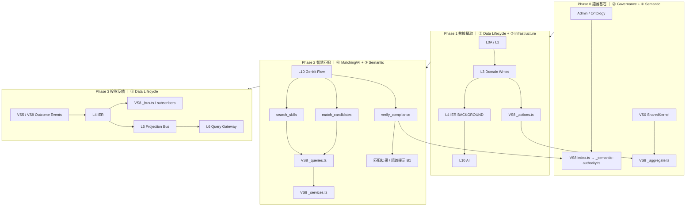

# 基礎設施映射（Infrastructure Mapping）

本檔是路徑與 Adapter 對照 SSOT。  
流程看 `01`，規則正文看 `02`，拓撲裁決看 `00`。

## VS 對照

| VS | 名稱 | 目標路徑 |
|---|---|---|
| `VS0-Kernel` | Foundation Contracts | `src/shared-kernel/*` |
| `VS0-Infra` | Foundation Execution | `src/shared-infra/*` |
| `VS1` | Identity | `src/features/identity.slice` |
| `VS2` | Account | `src/features/account.slice` |
| `VS3` | Skill XP | `src/features/skill-xp.slice` |
| `VS4` | Organization | `src/features/organization.slice` |
| `VS5` | Workspace | `src/features/workspace.slice` |
| `VS6` | Scheduling | `src/features/workforce-scheduling.slice` |
| `VS7` | Notification Hub | `src/features/notification-hub.slice` |
| `VS8` | Semantic Cognition Engine | `src/features/semantic-graph.slice` — 架構：[`architecture.md`](03-Slices/VS8-SemanticBrain/architecture.md) · [架構圖](03-Slices/VS8-SemanticBrain/architecture-diagrams.md) |
| `VS9` | Finance | `src/features/finance.slice` |

Auxiliary slices（非 VS 編號）：

| Slice | 角色 | 目標路徑 |
|---|---|---|
| `global-search.slice` | Cross-domain search authority | `src/features/global-search.slice` |
| `portal.slice` | Portal shell state bridge | `src/features/portal.slice` |

## Layer 對照

| Layer | 職責 | 路徑 |
|---|---|---|
| `L0` | External triggers | `src/shared-infra/external-triggers/` |
| `L0A` | API ingress | `src/shared-infra/api-gateway/` |
| `L1` | contracts/constants/pure | `src/shared-kernel/` |
| `L2` | command gateway | `src/shared-infra/gateway-command/` |
| `L3` | domain slices | `src/features/*` |
| `L4` | IER + relay + DLQ | `src/shared-infra/{event-router,outbox-relay,dlq-manager}/` |
| `L5` | projection bus | `src/shared-infra/projection-bus/` |
| `L6` | query gateway | `src/shared-infra/gateway-query/` |
| `L7-A` | firebase-client adapters | `src/shared-infra/firebase-client/` |
| `L7-B` | functions/admin adapters | `src/shared-infra/firebase-admin/functions/` |
| `L8` | firebase runtime | external platform |
| `L9` | observability | `src/shared-infra/observability/` |
| `L10` | AI runtime | `src/shared-infra/ai-orchestration/` |

## 標準結構（最小）

- `src/shared-kernel/`
- `src/shared-infra/api-gateway/`
- `src/shared-infra/gateway-command/`
- `src/shared-infra/event-router/`
- `src/shared-infra/projection-bus/`
- `src/shared-infra/gateway-query/`
- `src/shared-infra/firebase-client/`
- `src/shared-infra/firebase-admin/{functions,dataconnect}/`
- `src/shared-infra/{observability,ai-orchestration}/`

## L4/L5/L6 重點清單

### L4（IER）

- Lane：`CRITICAL` / `STANDARD` / `BACKGROUND`
- DLQ：`SAFE_AUTO` / `REVIEW_REQUIRED` / `SECURITY_BLOCK`
- `D30`：hop-limit 防循環，SECURITY_BLOCK 禁止自動 replay
- **AI 嵌入管線 [E8-I]**：`L3(Domain Slice) → L4(IER, BACKGROUND lane) → L10(AI) → L8` — 非同步觸發 Embedding 提取，禁止 L3 同步呼叫 AI
- **業務指紋回饋 [BF-1]**：`L3(VS5/VS9) → L4(IER, BACKGROUND lane) → VS8(L3) → L8(employees.skillEmbedding)` — 任務結果自動調整員工語義權重

### L5（Projection）

- Critical：`workspace-scope-guard-view`、`org-eligible-member-view`、`acl-projection`
- Standard：`workspace-view`、`tasks-view`、`tag-snapshot`、`task-semantic-view`
- Memory/Feedback：`memory-snippet-view`、`feedback-pattern-view`、`memory-quality-view`
- Finance：`finance-staging-pool`、`task-finance-label-view`

### L6（Query）

- 只暴露 read models，不直接查 Aggregate。
- `D31`：所有讀權限過濾依賴 `acl-projection`。

## L7 Firebase Adapter 索引（精簡）

### L7-A（client）

- `AuthAdapter`
- `FirestoreAdapter`
- `FCMAdapter`
- `StorageAdapter`
- `RTDBAdapter`
- `AnalyticsAdapter`
- `AppCheckAdapter`
- `VisDataAdapter`

### L7-B（functions/admin）

- `FunctionsGateway`
- `AdminAuthAdapter`
- `AdminFirestoreAdapter`
- `AdminMessagingAdapter`
- `AdminStorageAdapter`
- `AdminAppCheckAdapter`
- `DataConnectGatewayAdapter`

約束：`firebase-admin` 只允許於 functions 容器（`D25`）。

## AI 控制面（L10）

- Flow Gateway
- Prompt Policy
- Tool ACL
- AI Storage

約束：`E8` 生效時，AI flow 不可直連 `firebase/*`、不可跨租戶。

## 遷移策略（四階段）

1. 收斂 canonical path（停止新增 legacy 落點）。
2. 導入 adapter/port 合規檢查（D24/D25/D31）。
3. 收斂 projection 與 query 命名（L5/L6 一致）。
4. 以 `99-checklist.md` 做 PR gate。

## 🧠 VS8 · Semantic Cognition Engine（src/features/semantic-graph.slice）[#A6 #17]

VS8 是 L3 的語義權威切片，為 05/06 藍圖提供分類法治理、語義索引、Tag 生命週期與關係 / 合規語義基礎；L10 消費 VS8，但不取代 VS8。詳細設計見 [`03-Slices/VS8-SemanticBrain/architecture.md`](03-Slices/VS8-SemanticBrain/architecture.md)（`VS8-SemanticBrain` 為歷史文件目錄名稱，對應現行切片 `semantic-graph.slice`；`VS9 = Finance`，`semantic-graph.slice` 屬於 VS8 而非 VS9）。

> VS8 三階段語義認知生命週期：[`03-Slices/VS8-SemanticBrain/05-semantic-data-lifecycle.md`](03-Slices/VS8-SemanticBrain/05-semantic-data-lifecycle.md)

### VS8 四階段基礎設施路徑圖

| 階段 | 架構層次 | 路徑 | 關鍵規則 |
|------|---------|------|---------|
| **Phase 0** 語義基石 | Governance + Semantic Layer | `Admin → VS8(_semantic-authority)`；`VS0(SK) → VS8/_aggregate → L3(domain)` | `FI-003` / `OT-1` |
| **Phase 1** 數據攝取 | Data Lifecycle + Infrastructure Layer | `L0A → L2 → L3 → VS8(_actions/_aggregate) → L4(BACKGROUND) → L10 → L8` | `E8-I` / `VD-3` |
| **Phase 2** 智慧匹配 | Matching/AI + Semantic Layer | `L10(Genkit) → [search_skills → match_candidates → verify_compliance] → VS8(_queries/_services/_semantic-authority)` | `GT-1/2/3` / `E8` |
| **Phase 3** 反饋閉環 | Data Lifecycle Layer | `L4 → L5(recommendation-view)`；`L3(VS5/VS9) → L4 → VS8(_bus/subscribers) → L8` | `BF-1` / `S2` |

### 三大支柱基礎設施對應

| 支柱 | 角色隱喻 | Genkit 工具 | 資料集合（Firestore） | 模組路徑 |
|------|---------|------------|----------------------|---------|
| **支柱一：知識圖譜** | 🧠 邏輯大腦 | `verify_compliance` | `employees`（certifications 欄位比對） | `_types.ts`、`_actions.ts`、`genkit-tools/verify-compliance.tool.ts` |
| **支柱二：向量數據庫** | 💾 記憶模塊 | `match_candidates` | `employees`（skillEmbedding 向量索引）、`tasks`（requirementsEmbedding） | `_services.ts`、`_queries.ts`、`genkit-tools/match-candidates.tool.ts` |
| **支柱三：技能本體論** | 📖 語言定義 | `search_skills` | `skills`（embedding 向量索引 + taxonomyPath） | `_semantic-authority.ts`、`_aggregate.ts`、`genkit-tools/search-skills.tool.ts` |

### Firestore 集合與向量索引

| 集合 | 向量欄位 | 向量索引 | 用途 |
|------|---------|---------|------|
| `skills` | `embedding`（768 維） | ✅ 需建立 | `search_skills` 語義搜尋 |
| `employees` | `skillEmbedding`（768 維） | ✅ 需建立 | `match_candidates` 候選人匹配；[BF-1] 業務指紋權重 |
| `tasks` | `requirementsEmbedding`（768 維） | ✅ 需建立 | 任務需求語義化 |

### VS8 模組 → Layer 映射

| 模組 | Layer | 角色 |
|------|-------|------|
| `_actions.ts` | L3 → L4 (outbox) | Tag / 圖譜邊寫入命令 [D3] |
| `_services.ts` | L3 (internal) | 向量索引管理 [VD-1]；嵌入向量計算（由 L10 AI 非同步觸發 [E8-I]） |
| `_queries.ts` | L3 → L6 (via global-search) | QGWAY_SEARCH 讀出埠 [D4] [VD-2] |
| `_semantic-authority.ts` | L1 (constants) | 分類法常數；被 L3/L6 消費 [OT-1] |
| `_aggregate.ts` | L3 (pure domain) | 時序衝突 + 分類法驗證 [OT-2] |
| `_bus.ts` | L3 → L5 (events) | Tag 生命週期事件匯流排 [T1] |
| `_cost-classifier.ts` | L3 (pure) | 成本語義分類（被 VS5 消費） [D27] |
| `genkit-tools/` | L10 (AI Tools) | 三工具分派引擎（`defineTool` 宣告）[GT-1] |
| `projections/` | L5 → L6 | 語義投影讀取（Tag 快照；圖譜選擇器暫緩） |
| `outbox/` | L3 → L4 | 拓撲異動外送廣播 |
| `subscribers/` | L5 → L3 | 接收 TagLifecycleEvent + [BF-1] 業務指紋事件訂閱 |

