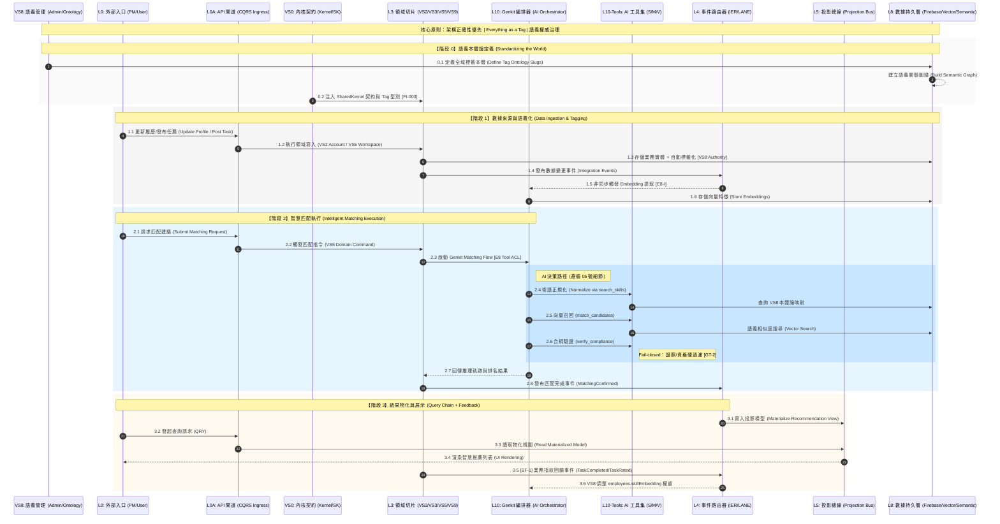

# [索引 ID: @ARCH-06] 統一架構編排與治理藍圖（Unified Architecture Orchestration and Governance Blueprint）

> Status: **Reference Blueprint**
> Scope: 全系統 (VS0~VS9 + L0~L10 + AI Layer)
> Purpose: 定義系統四階段生命週期（語義基石 → 數據攝取 → 智慧匹配 → 讀模型物化），作為 00/01/02/03 治理文件的對齊基礎。
> Cross-reference: `00-logic-overview.md`（拓撲 SSOT）、`02-governance-rules.md`（規則正文）、`docs/architecture/03-Slices/VS8-SemanticBrain/05-semantic-data-lifecycle.md`（VS8 細節）
>
> 核心原則：**架構正確性優先** ｜ **Everything as a Tag** ｜ **語義權威治理**

