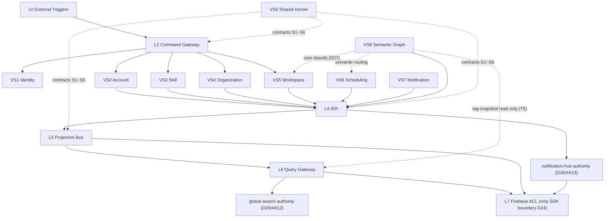

# Graph Sketch（Aligned to SSOT）

此圖為 `docs/architecture/logic-overview.md` 的簡化關係圖。
完整規則仍以 SSOT 為準。

```mermaid
flowchart TD
    EXT["L0 External Triggers"] --> CMD["L2 Command Gateway"]
    CMD --> VS1["VS1 Identity"]
    CMD --> VS2["VS2 Account"]
    CMD --> VS3["VS3 Skill"]
    CMD --> VS4["VS4 Organization"]
    CMD --> VS5["VS5 Workspace"]

    VS2 --> IER["L4 IER"]
    VS3 --> IER
    VS4 --> IER
    VS5 --> IER
    VS6["VS6 Scheduling"] --> IER
    VS7["VS7 Notification"] --> IER
    VS8["VS8 Semantic Graph"] --> IER

    IER --> PB["L5 Projection Bus"]
    PB --> QG["L6 Query Gateway"]

    QG --> GS["global-search authority (D26/#A12)"]
    IER --> NH["notification-hub authority (D26/#A13)"]

    VS8 -. semantic routing .-> VS6
    VS8 -. cost classify (D27) .-> VS5
    VS8 -. tag-snapshot read only (T5) .-> QG

    SK["VS0 Shared Kernel"] -. contracts S1~S6 .-> CMD
    SK -. contracts S1~S6 .-> IER
    SK -. contracts S1~S6 .-> PB

    ACL["L7 Firebase ACL (only SDK boundary D24)"]
    QG --> ACL
    PB --> ACL
    NH --> ACL
```

## Gate Reminder

- Mandatory：`D1~D26`、`S1~S6`、`TE1~TE6`
- Extension：`D27`
