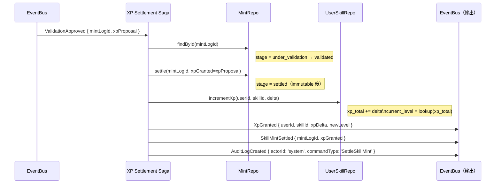
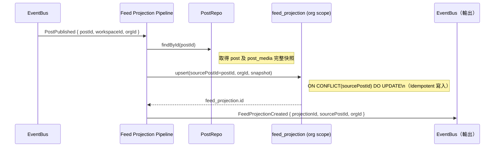
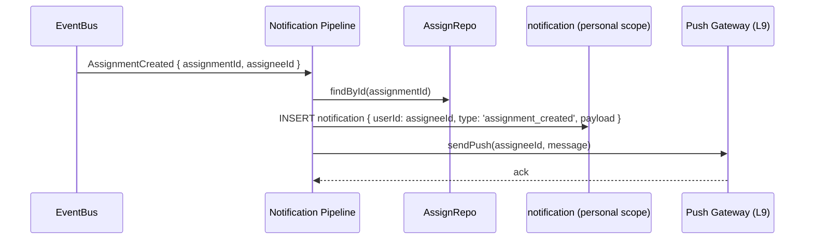

# L8 應用服務規格 — Application Service Specification

> **層級定位**：本文件定義 L8 應用服務層的 Command Handler 模式、三個核心 Saga 設計，以及事件管線的接線模式。
> 來源：[L5 Command 映射表](../use-cases/use-case-diagram-sub-behavior.md#l5-l8-command-mapping)、[L6 Domain Model](../models/domain-model.md)、[L7 Contract Spec](../specs/contract-spec.md)

---

## 一、Command Handler 通用模式

### 標準 Command Handler 骨架

```typescript
/**
 * L8 Application Service — Command Handler 通用模式
 * 所有 Command Handler 遵循此 7-step 流程
 */
async function handleCommand<C extends Command, E extends DomainEvent>(
  command: C,
  context: ActiveContext
): Promise<E | E[]> {
  // Step 1: ScopeGuard — 驗證 actor 情境與資源 scope 一致 (SB51)
  scopeGuard.verify(command, context);

  // Step 2: IdempotencyGuard — 若帶有 idempotencyKey，檢查是否已執行 (SB52)
  const cached = await idempotencyStore.checkAndLock(command.idempotencyKey);
  if (cached) return cached.result;

  // Step 3: Load Aggregate from Repository
  const aggregate = await repository.findById(command.aggregateId);

  // Step 4: OptimisticLockGuard — 若 Command 帶 version，核對 (SB53)
  if ('version' in command) {
    optimisticLockGuard.verify(aggregate.version, command.version);
  }

  // Step 5: Business Guard（DFS Cycle / Availability Conflict / Threshold 等）
  await businessGuard.verify(command, aggregate);

  // Step 6: Invoke Domain Method → Collect Events
  const events = aggregate.handle(command);

  // Step 7: Save + Publish Events
  await repository.save(aggregate);           // version++ inside
  await eventBus.publishAll(events);

  // Step 8: Release Idempotency Lock + Cache Result
  await idempotencyStore.setResult(command.idempotencyKey, events);
  return events;
}
```

---

## 二、Command Handler 一覽（L5 → L8 映射）

| Command 名稱 | Handler 位置 | Repository | Saga 觸發？ |
|-------------|-------------|-----------|-----------|
| `CreateTaskItemCommand` | `TaskItemCommandHandler` | `TaskItemRepository` | — |
| `StartTaskCommand` | `TaskItemCommandHandler` | `TaskItemRepository` | — |
| `CompleteTaskCommand` | `TaskItemCommandHandler` | `TaskItemRepository` | **XP Settlement Saga** (via `TaskCompleted`) |
| `AddDependencyCommand` | `DependencyCommandHandler` | `TaskItemRepository`, `ResourceRelationRepository` | — |
| `CopyTaskTreeCommand` | `TaskTreeCommandHandler` | `TaskItemRepository` | — |
| `PublishPostCommand` | `PostCommandHandler` | `PostRepository` | **Feed Projection Pipeline** (via `PostPublished`) |
| `CreateAssignmentCommand` | `AssignmentCommandHandler` | `ScheduleItemRepository`, `AvailabilitySlotRepository` | — |
| `ConfirmAssignmentCommand` | `AssignmentCommandHandler` | `ScheduleItemRepository` | **Notification Pipeline** (via `AssignmentConfirmed`) |
| `DeclareSkillMintCommand` | `SkillMintCommandHandler` | `UserSkillRepository` | — |
| `ApproveValidationCommand` | `SkillMintCommandHandler` | `UserSkillRepository` | **XP Settlement Saga** (via `ValidationApproved`) |
| `RecalculateXpCommand` | `XpCommandHandler` | `UserSkillRepository` | — |

---

## 三、Saga 設計

### Saga 1：XP 結算 Saga（XP Settlement Saga）

**觸發器**：`ValidationApproved` event

**步驟**：



**補償（Compensation）**：
- `settle()` 寫入失敗 → 重試最多 3 次（指數退避）；超出 → 寫入 DLQ，發出 `SettlementFailed` alert。
- **不可 Rollback**：`skill_mint_log` 一旦進入 `validated` 即視為 soft-committed；`settle` 失敗需人工介入（不刪除記錄）。

---

### Saga 2：FeedProjection 管線（Feed Projection Pipeline）

**觸發器**：`PostPublished` event

**步驟**：



**不變式**：
- **只有此管線**可寫 `feed_projection`（ADR-0003）。
- 每個 `postId` 最多一個有效 `feed_projection`（upsert on `source_post_id`）。
- `PostArchived` 事件：管線更新 `feed_projection.is_hidden = true`（不刪除）。

---

### Saga 3：通知管線（Notification Pipeline）

**觸發器**：`AssignmentCreated`、`AssignmentConfirmed`、`TaskBlocked`、`XpGranted`、`ValidationRejected` 等

**步驟（以 AssignmentCreated 為例）**：



**不變式**：
- `notification` 為 personal scope，只有目標 `userId` 可讀取。
- Push 失敗不影響主流程；通知已寫入 DB，用戶可從 inbox 查看。

---

## 四、Application Service 層邊界規則

| 規則 | 說明 |
|-----|-----|
| **無 DB 直接存取** | Application Service 只透過 Repository 介面操作，不直接查詢 DB |
| **無 Domain Logic** | Application Service 只呼叫 Aggregate 方法；業務 invariant 在 Aggregate 中 |
| **無 Infrastructure 依賴** | Application Service 只依賴 Interface（Repository / EventBus / Guard interface）；實作在 L9 |
| **單一入口點** | 每個 Command 只有一個 Handler；不允許多個 Handler 監聽同一 Command |
| **Saga 為獨立協調者** | Saga 不是 Command Handler；Saga 透過 EventBus 事件驅動，不直接呼叫 Application Service |

---

## 五、Guard 執行順序保證

```
Command 進入 → ScopeGuard → IdempotencyGuard → LoadAggregate
                                                    → OptimisticLockGuard
                                                    → BusinessGuard（DFS / Availability / Threshold）
                                                    → aggregate.handle()
                                                    → save() + eventBus.publishAll()
```

**BusinessGuard 只套用於特定 Command**：

| Guard | 套用 Command |
|-------|------------|
| DFSCycleGuard | `AddDependencyCommand` |
| AvailabilityConflictGuard | `CreateAssignmentCommand` |
| ThresholdGuard | `CreateAssignmentCommand`（若 task 有 skill requirement）|
