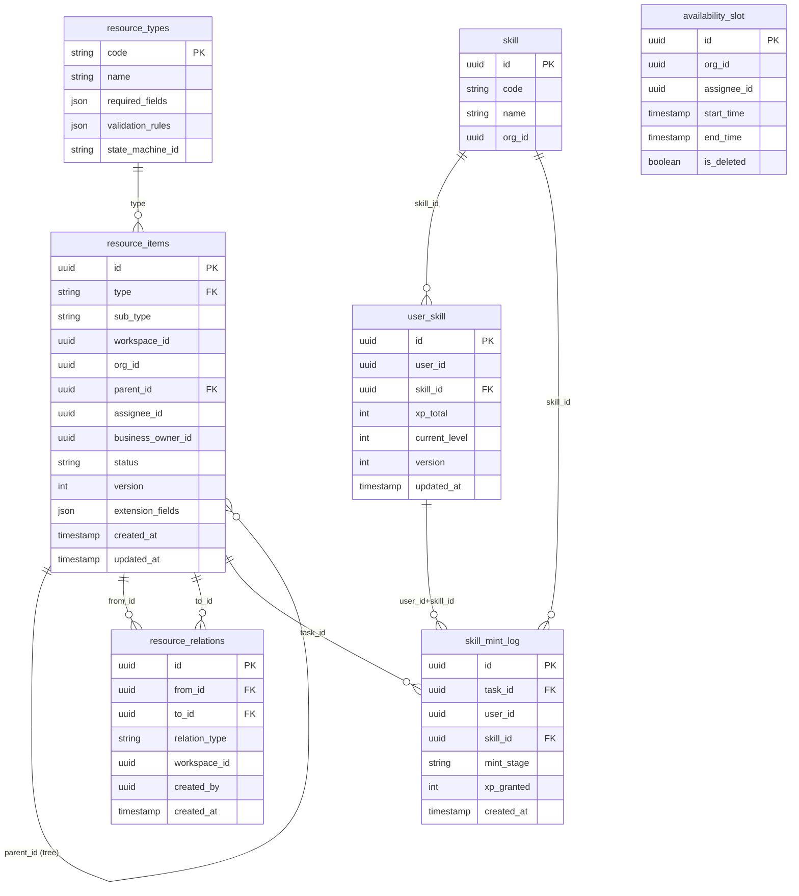

# L6 領域模型 — Xuanwu Domain Model

> **層級定位**：本文件定義聚合根邊界、實體與值物件、領域 invariant，以及跨聚合事件橋。
> 上層輸入來源：[L4 Sub-Resource](../use-cases/use-case-diagram-sub-resource.md)、[L5 Sub-Behavior](../use-cases/use-case-diagram-sub-behavior.md)。
> 下層輸出至：[L7 Contract Spec](../specs/contract-spec.md)。

---

## 邊界驗證前置確認

| 層 | 文件 | 狀態 |
|----|------|------|
| L4 | `use-case-diagram-sub-resource.md` | ✅ 通過（SR01–SR54） |
| L5 | `use-case-diagram-sub-behavior.md` | ✅ 通過（SB01–SB54） |
| **L6** | `domain-model.md`（本文件） | 📝 定義中 |

---

## 資料模型基礎（三表設計）

```
resource_types      ← 型別定義（code / name / required_fields / validation_rules / state_machine_id）
resource_items      ← 所有資源實例（id / type / sub_type / workspaceId / orgId / parent_id / status / version）
resource_relations  ← 資源關聯/依賴邊（from_id / to_id / relation_type / created_by）
```

> 設計依據：[ADR-0002 WBS as Resource Model](../adr/ADR-0002-wbs-as-resource-model.md)

---

## 聚合根邊界（4 個 Aggregate）

### Aggregate 1：TaskItem（工作區資源 + WBS 樹）

**聚合根**：`task_item`（resource_items where type = 'task_item'）

```
TaskItem（Aggregate Root）
  ├── sub_type: epic | feature | story | task | subtask   ← discriminator
  ├── workspaceId（scope key，不可為 null）
  ├── parent_id → TaskItem（self-reference，nullable for root）
  ├── assignee_id（業務 owner）
  ├── status: draft | ready | in_progress | blocked | review | done | archived | cancelled
  ├── version（樂觀鎖）
  │
  ├── [Entity] TaskSkillRequirement（task_skill_requirement）
  │     ├── skill_id → Skill（org aggregate）
  │     ├── required_level: 1-7
  │     └── business_owner_id
  │
  └── [Read-only Association] MatchingResult（matching_result）
        ├── user_id
        ├── skill_id
        ├── threshold_passed: boolean
        └── source: system | manual
```

**Invariants**：
- `sub_type` 層級只能向下包含（epic > feature > story/task > subtask），禁止循環
- 刪除策略：`subtask` cascade；`epic/feature/story/task` 需 forbidden（有子項目時）
- 依賴關係（`resource_relations`）不可形成有向環（DFS 守衛：SB14）

---

### Aggregate 2：Post（工作區貼文）

**聚合根**：`post`（resource_items where type = 'post'）

```
Post（Aggregate Root）
  ├── workspaceId（scope key）
  ├── business_owner_id（業務 owner）
  ├── status: draft | published | archived
  ├── version（樂觀鎖）
  │
  └── [Entity] PostMedia（post_media）
        ├── media_type: image | video | file
        ├── url（儲存路徑，L9 Storage Adapter 提供）
        ├── sort_order: int
        └── business_owner_id

[Read Model - 非聚合內部] FeedProjection（feed_projection）
  ├── orgId（scope key，事件管線寫入）
  ├── source_post_id → Post
  └── feed_content（denormalized snapshot）
```

**Invariants**：
- `FeedProjection` 不屬於 Post 聚合內部，只由事件管線（SB22）寫入，禁止 Command 直接修改（ADR-0003）。
- `published` 狀態的 Post 觸發 `PostPublished` 事件，事件管線負責建立 `FeedProjection`。

---

### Aggregate 3：Assignment（排程 + 指派）

**聚合根**：`schedule_item`（resource_items where type = 'schedule_item'）

```
ScheduleItem（Aggregate Root）
  ├── workspaceId（scope key）
  ├── business_owner_id
  ├── start_time / end_time
  ├── status: pending | confirmed | in_execution | completed | cancelled
  ├── version（樂觀鎖）
  │
  └── [Entity] AssignmentRecord（assignment_record）
        ├── assignee_id（雙層 owner 之業務 owner）
        ├── workspaceId（繼承自 ScheduleItem）
        └── status: pending | confirmed | in_execution | completed | cancelled

[Shared Entity - org scope] AvailabilitySlot（availability_slot）
  ├── orgId（scope key）
  ├── assignee_id
  ├── start_time / end_time
  └── is_deleted（soft-delete）
```

**Invariants**：
- 建立 `AssignmentRecord` 前必須通過 `AvailabilitySlot` 無衝突驗證（L5 SB34）。
- 若有 `TaskSkillRequirement`，`matching_result.threshold_passed` 必須為 `true`（L5 SB35）。
- `AvailabilitySlot` 為 org scope，跨工作區共享，不屬於任何單一 `ScheduleItem` 聚合。

---

### Aggregate 4：SkillAsset（用戶技能資產）

**聚合根**：`user_skill`（個人 scope aggregate，屬 personal/user context）

```
UserSkill（Aggregate Root）
  ├── user_id（personal scope key）
  ├── skill_id → Skill（org aggregate，參照）
  ├── xp_total: int
  ├── current_level: 1-7（由 xp_total 推導，不可直接設定）
  ├── version（樂觀鎖）
  │
  └── [Immutable Log] SkillMintLog（skill_mint_log）
        ├── task_id → TaskItem
        ├── skill_id
        ├── mint_stage: declared | practicing | under_validation | validated | settled
        ├── xp_granted: int（settled 後不可為 null）
        └── created_at（immutable timestamp）
```

**Invariants**：
- `SkillMintLog` 狀態為 `settled` 後不可修改（ADR-0004）。
- `xp_total` 只能從已 `settled` 的 `SkillMintLog.xp_granted` 累加，不可直接設定。
- `current_level` 由 `xp_total` 對照等級表推導；等級表為唯讀系統配置。

---

### 支援實體（非聚合根）

```
Skill（技能字典，org scope）
  ├── code: string（唯一）
  ├── name: string
  └── orgId

ResourceType（型別定義）
  ├── code: string（唯一系統常數）
  ├── name: string
  ├── required_fields: string[]
  ├── validation_rules: json
  └── state_machine_id: string
```

---

## ER 圖（核心表）



---

## 跨聚合事件橋

| 觸發事件（來源聚合）| 目標效果 | 處理層 |
|-------------------|---------|-------|
| `TaskCompleted`（TaskItem）| 觸發 XP 結算判斷（若有 SkillMintLog 在 validated 狀態）| L8 Settlement Saga |
| `PostPublished`（Post）| 觸發 FeedProjection 建立（SB22）| L8 事件管線 |
| `ValidationApproved`（SkillAsset）| 觸發 Settlement 寫入 SkillMintLog + 更新 UserSkill XP | L8 Settlement Saga |
| `AssignmentConfirmed`（Assignment）| 通知 MemberAssigned（通知管線）| L8 事件管線 |
| `CyclicDependencyDetected`（TaskItem dep 守衛）| 阻擋 AddDependency Command；觸發 AI 背景掃描告警 | L5 Guard（不入聚合）|

---

## XP 等級對照表（系統常數）

| Level | 名稱 | xp_total 下界（inclusive）| xp_total 上界（inclusive）|
|-------|------|--------------------------|--------------------------|
| 1 | Apprentice（學徒） | 0 | 74 |
| 2 | Journeyman（熟練） | 75 | 149 |
| 3 | Expert（專家） | 150 | 224 |
| 4 | Artisan（大師） | 225 | 299 |
| 5 | Grandmaster（宗師） | 300 | 374 |
| 6 | Legendary（傳奇） | 375 | 449 |
| 7 | Titan（泰坦） | 450 | 524 |

> XP 上限 524 是當前設計上界；達到後 `current_level` 保持 7（Titan），`xp_total` 繼續累積用於未來等級擴展。
