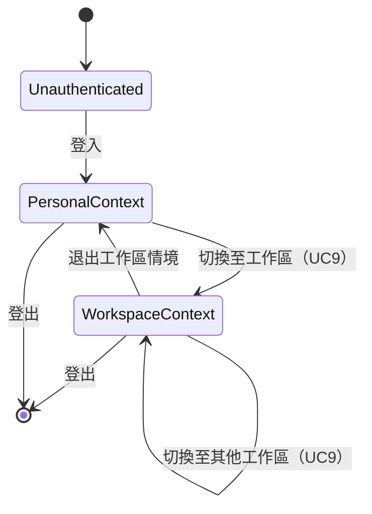
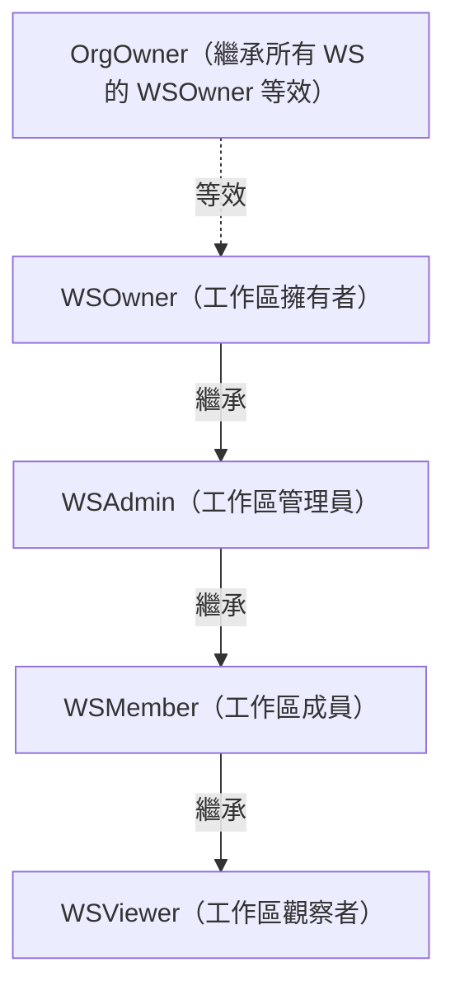
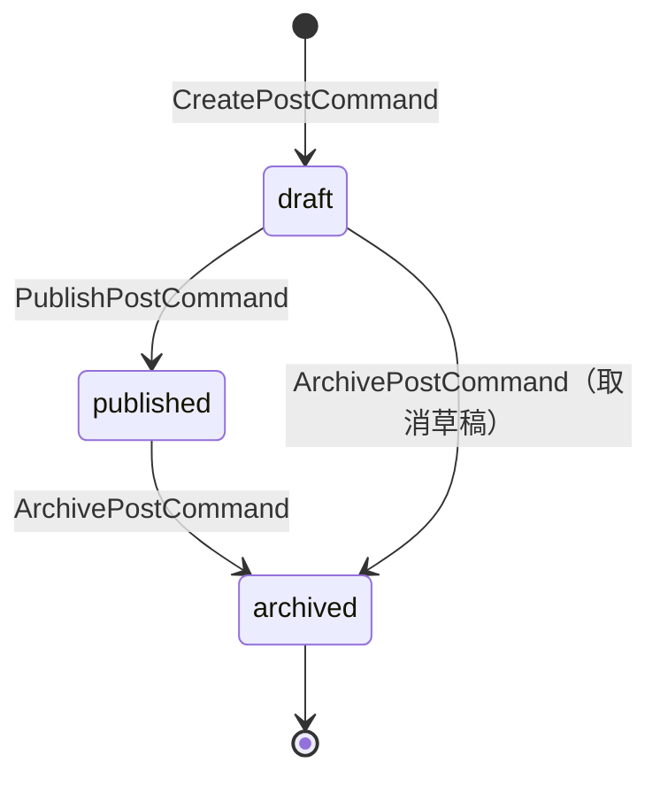

# L7 社群動態架構規格 — Org / Workspace / Feed Architecture

> **層級定位**：本文件定義組織 (Org)、工作區 (Workspace)、以及社群動態 (Feed) 三個核心維度的架構設計：創建流程、情境切換 (activeContext)、貼文發佈流程（Post → FeedProjection）。
> 來源：[L1 UC8/UC9](../use-cases/use-case-diagram-saas-basic.md)、[L2 WS1-WS26](../use-cases/use-case-diagram-workspace.md)、[L3 R46](../use-cases/use-case-diagram-resource.md)、[L5 SB20-SB22](../use-cases/use-case-diagram-sub-behavior.md)

---

## 一、Org 與 Workspace 層級結構

```
Platform
  └── Org（組織，ADR-0005 — GitHub Repository 模型）
        ├── workspace 1
        │     ├── member A（WSOwner）
        │     └── member B（WSMember）
        ├── workspace 2
        │     └── member A（WSAdmin）
        └── workspace 3 （personal workspace）
              └── owner A（WSOwner）
```

### Org 不變式

| 規則 | 描述 |
|-----|-----|
| 唯一 OrgOwner | 每個 Org 有且僅有一個 OrgOwner |
| OrgOwner 繼承 | OrgOwner 自動對其擁有的所有 Workspace 具有 WSOwner 等效權限 |
| Workspace 建立 | 只有 OrgOwner/OrgAdmin 可建立 Workspace（L2 WS1） |
| activeContext | 用戶同時只能有一個活躍的 `activeContext`（orgId + workspaceId）|

---

## 二、activeContext 情境模型（ADR-0005）



### activeContext 物件結構

```typescript
interface ActiveContext {
  userId: string;
  orgId: string;           // 當前組織
  workspaceId: string;     // 當前工作區（可為個人工作區）
  role: WorkspaceRole;     // WSOwner | WSAdmin | WSMember | WSViewer
  orgRole: OrgRole;        // OrgOwner | OrgAdmin | OrgMember
}
```

### 情境切換規則

1. 用戶必須先加入 Org 成為 OrgMember（UC8/UC10）才可進入該 Org 的 Workspace。
2. 切換 Workspace 不需重新認證，僅需驗證成員關係（`membership` 記錄存在且 `status = active`）。
3. `activeContext` 存放在 Session / JWT Claim，不是 DB 欄位。
4. 所有 Command 的 ScopeGuard（SB51）從 `activeContext` 取 workspaceId / orgId 進行比對。

---

## 三、Workspace 角色層級



| 角色 | 建立資源 | 指派任務 | 修改成員 | 存檔/刪除工作區 |
|------|---------|---------|---------|----------------|
| WSOwner | ✅ | ✅ | ✅ | ✅ |
| WSAdmin | ✅ | ✅ | ✅（非 WSOwner）| ❌ |
| WSMember | ✅（自己的）| ❌ | ❌ | ❌ |
| WSViewer | ❌ | ❌ | ❌ | ❌ |

---

## 四、貼文發佈流程（Post → FeedProjection Pipeline）

### 流程圖

```mermaid
sequenceDiagram
    actor Actor
    participant AppService as L8 Application Service
    participant PostAggregate as Post Aggregate (L6)
    participant EventBus as L9 Event Bus
    participant FeedPipeline as Feed Projection Pipeline (L8)
    participant FeedDB as feed_projection (org scope)

    Actor->>AppService: PublishPostCommand { postId, actorId }
    AppService->>AppService: ScopeGuard(workspaceId) ✅
    AppService->>AppService: IdempotencyGuard(idempotencyKey) ✅
    AppService->>PostAggregate: post.publish()
    PostAggregate-->>AppService: PostPublished event
    AppService->>PostAggregate: save(version++)
    AppService->>EventBus: publish(PostPublished)
    EventBus-->>FeedPipeline: PostPublished event
    FeedPipeline->>FeedDB: INSERT feed_projection (org scope)
    FeedPipeline-->>EventBus: FeedProjectionCreated event
```

### FeedProjection 寫入規則（ADR-0003）

| 規則 | 說明 |
|-----|-----|
| 只有事件管線可寫 | `feed_projection` 表不能被任何 Command 直接 INSERT/UPDATE |
| 來源為 `PostPublished` 事件 | FeedPipeline 訂閱此事件，確認 `post.status = published` 後建立 |
| Org scope 投影 | 同一個 Org 下所有成員可見（不限 Workspace）|
| Idempotent 建立 | FeedPipeline 使用 `sourcePostId` 作為 upsert key，防止重複投影 |
| 不可由 Command 刪除 | 存檔貼文時，只發出 `PostArchived`；FeedPipeline 負責將對應 projection 標記隱藏 |

---

## 五、Post 狀態機



| State | 可見性 | 可操作 |
|-------|-------|-------|
| `draft` | 僅業務 owner 可見 | publish / archive |
| `published` | Workspace 成員可見（Feed 投影到 Org）| archive |
| `archived` | 僅 WSAdmin+ 可查閱 | — |

---

## 六、資料流全覽（L1→L6 Mapping）

| 操作 | L1/L2 UC | L3 Resource | L5 Command | L6 Aggregate | L8 Pipeline |
|-----|---------|------------|-----------|-------------|------------|
| 建立組織 | UC8 | org | — | Org（非 resource_items）| — |
| 切換情境 | UC9 | — | — | activeContext（session）| — |
| 建立貼文 | WS25 | R21（post）| CreatePostCommand | Post | — |
| 發佈貼文 | WS26 | R21（post）→ R46（feed）| PublishPostCommand | Post | FeedProjection Pipeline |
| Feed 投影 | L3 R46 | feed_projection | （事件管線，非 Command）| — | FeedProjection Pipeline |
