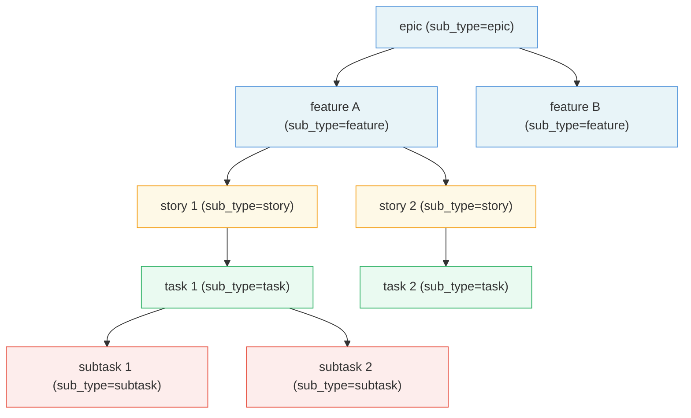
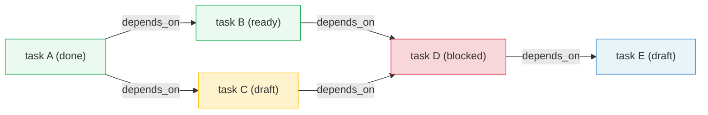
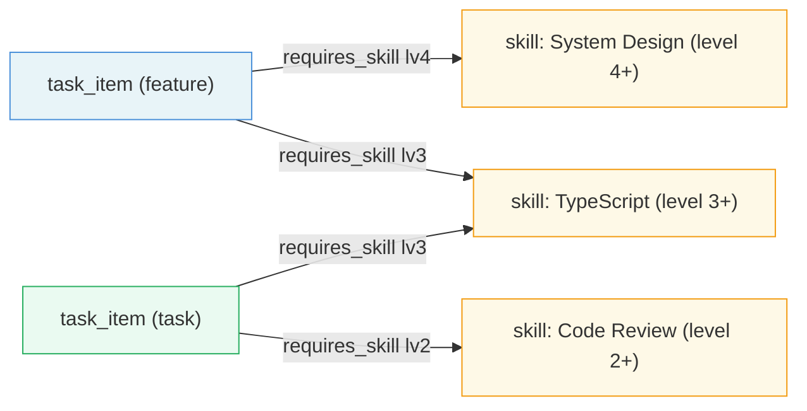
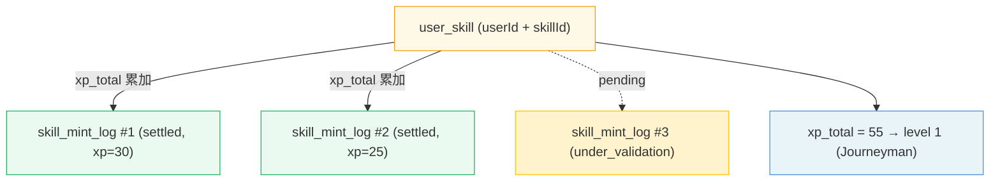
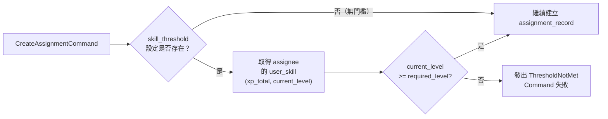
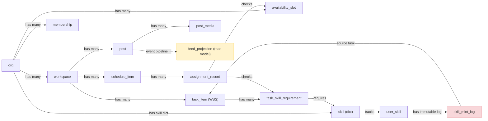

# L7 資源關聯圖 — Resource Relationship Graph

> **層級定位**：本文件定義 resource_items 之間的三類關聯拓撲：Parent-Child 樹、任務依賴圖（DAG）、以及技能圖（技能需求 + XP 等級）。
> 來源：[L3 Use Case R25](../use-cases/use-case-diagram-resource.md)、[L4 SR01–SR20](../use-cases/use-case-diagram-sub-resource.md)、[L5 SB14 DFS Guard](../use-cases/use-case-diagram-sub-behavior.md)、[L6 Domain Model](../models/domain-model.md)

---

## 三類關聯的儲存策略

| 關聯類型 | 儲存位置 | relation_type 值 | 特性 |
|---------|---------|----------------|-----|
| Parent-Child 樹 | `resource_items.parent_id` | — | 性能查詢；self-reference FK |
| 任務依賴 DAG | `resource_relations` | `depends_on` | 有向；必須無環（DFS 守衛） |
| 技能需求連結 | `resource_relations` | `requires_skill` | 有向；由 TaskItem 指向 Skill |
| Feed 投影連結 | `resource_relations` | `feed_source` | 有向；由 FeedProjection 指向 Post |

---

## 一、Parent-Child 樹（WBS Tree）



### 樹不變式

1. **無向環**：parent_id 路徑最長 5 層（epic → feature → story/task → subtask），應用層強制層級順序。
2. **同 workspace 隔離**：parent_id 所指向的資源必須與子資源擁有相同的 `workspace_id`。
3. **刪除策略**：
   - `subtask`：parent DELETE 時 cascade。
   - `epic / feature / story / task`：有子項目時 forbidden（必須先移除所有子孫節點）。
4. **根節點**：`parent_id IS NULL AND sub_type = 'epic'` 為工作區頂層節點。

---

## 二、任務依賴 DAG（Dependency Graph）



### DAG 不變式と DFS 守衛（SB14）

```
AddDependencyCommand(from: TaskA, to: TaskB)
  │
  ├── DFSCycleGuard 啟動
  │   └── 從 TaskB 出發做深度優先搜索
  │       → 若可抵達 TaskA，則判定形成環
  │
  ├── [有環] → 發出 CyclicDependencyDetected { cyclePath: [B, ..., A] }
  │             Command 失敗（HTTP 422）
  │
  └── [無環] → 寫入 resource_relations { from_id: A, to_id: B, relation_type: 'depends_on' }
               發出 DependencyAdded
```

**Gantt 閘控規則（R28）**：
- 任務若有未完成的依賴（`depends_on` 且依賴目標狀態非 `done`），則 Gantt view 應標記為 blocked。
- 應用層禁止在 Gantt 中拖動進入 `draft` 狀態的 blocked 任務。

---

## 三、技能圖（Skill Graph）

### A. 技能需求連結（TaskItem → Skill）



### B. UserSkill XP 積累圖



### C. 技能門檻驗證流程（ThresholdGuard SB35）



---

## XP 等級對照表（Level Table — 系統常數）

| Level | 名稱 | xp_total 下界 | xp_total 上界 | 說明 |
|-------|------|--------------|--------------|-----|
| 1 | Apprentice（學徒） | 0 | 74 | 入門級 |
| 2 | Journeyman（熟練） | 75 | 149 | 可接受基礎指派 |
| 3 | Expert（專家） | 150 | 224 | 可主導子任務 |
| 4 | Artisan（大師） | 225 | 299 | 可主導 Story 層級 |
| 5 | Grandmaster（宗師） | 300 | 374 | 可主導 Feature 層級 |
| 6 | Legendary（傳奇） | 375 | 449 | 可主導 Epic 層級 |
| 7 | Titan（泰坦） | 450 | 524 | 技能最高境界 |

> **Edge Case**：`xp_total >= 525` 時 `current_level` 保持 7（Titan），`xp_total` 繼續累積（為未來等級擴展保留空間）。

---

## 四、資源全域關聯圖（簡化版）


