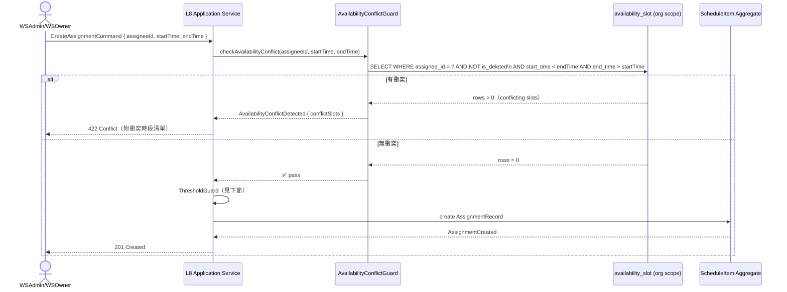
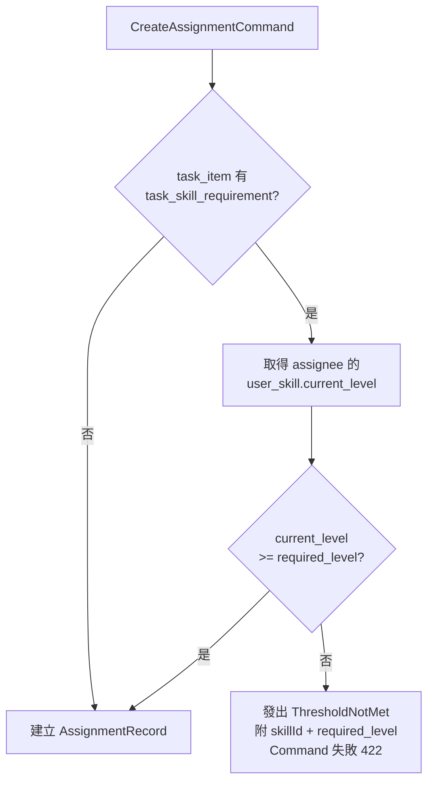
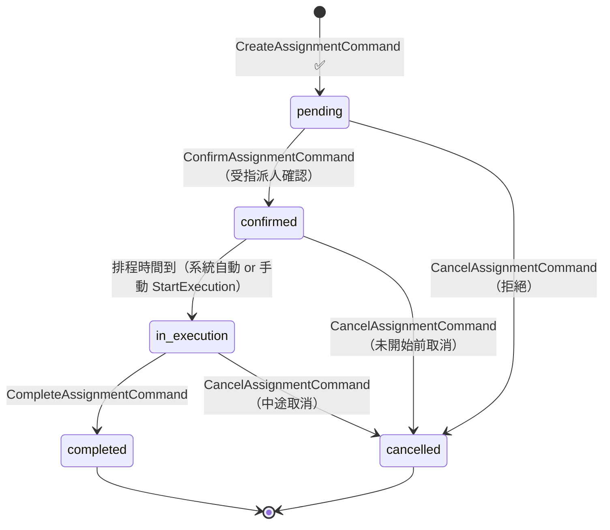
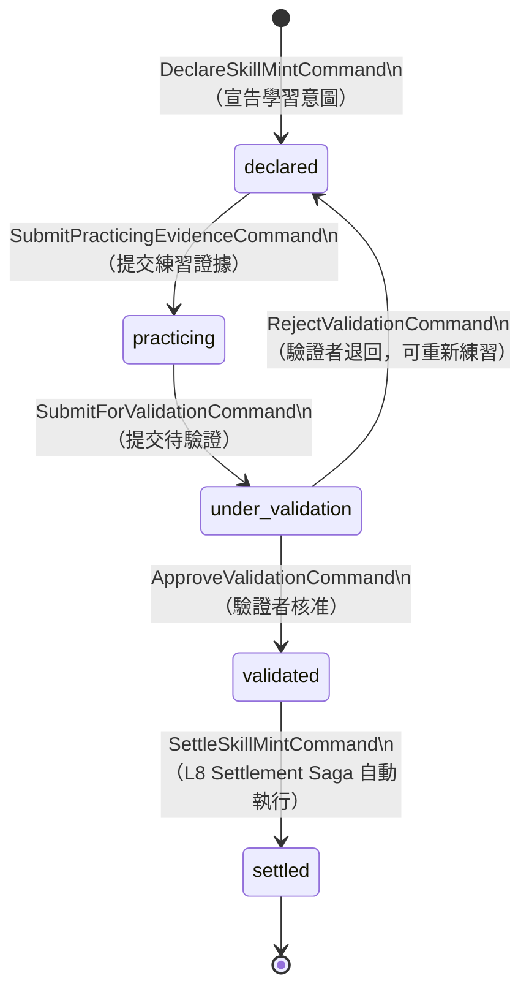
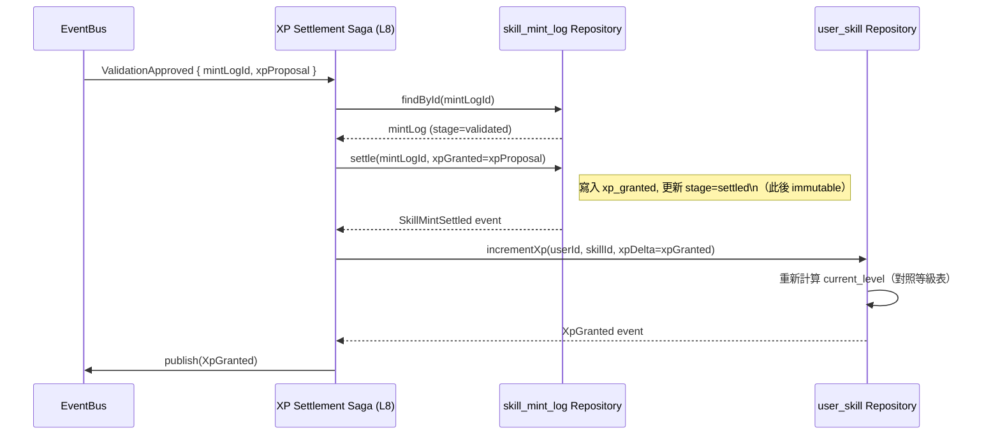

# L7 排程與指派架構規格 — Scheduling / Assignment Architecture

> **層級定位**：本文件定義排程 (ScheduleItem) 與指派 (AssignmentRecord) 的完整架構：時段衝突守衛、技能門檻驗證、跨工作區指派 Saga，以及技能鑄造（SkillMint）四階段生命週期。
> 來源：[L2 WS27-WS30](../use-cases/use-case-diagram-workspace.md)、[L4 SR30-SR54](../use-cases/use-case-diagram-sub-resource.md)、[L5 SB30-SB46](../use-cases/use-case-diagram-sub-behavior.md)

---

## 一、核心實體關聯

```
org scope
  ├── availability_slot  （org-level 時段可用性，所有 WS 共享）
  └── skill              （org-level 技能字典）

workspace scope
  ├── schedule_item      （排程根實體）
  │     └── assignment_record  （指派記錄，cascade）
  ├── task_item
  │     └── task_skill_requirement  （技能需求，cascade）
  │     └── matching_result         （門檻匹配結果，cascade）

personal scope
  ├── user_skill         （XP 累積）
  │     └── skill_mint_log  （不可變鑄造紀錄）
```

---

## 二、排程建立 + 可用性衝突守衛（SB34）



### 衝突邏輯（overlap 判斷）

```sql
-- 查詢是否有衝突時段
SELECT id FROM availability_slot
WHERE assignee_id = :assigneeId
  AND is_deleted = false
  AND start_time < :endTime
  AND end_time > :startTime;
-- 有記錄 = 衝突
```

---

## 三、技能門檻驗證守衛（ThresholdGuard SB35）



### 多技能門檻規則

若 `task_item` 有多個 `task_skill_requirement`，**所有**需求均需通過（AND 邏輯）：

```typescript
function checkAllThresholds(
  requirements: TaskSkillRequirement[],
  userSkills: Map<skillId, UserSkill>
): ThresholdCheckResult {
  for (const req of requirements) {
    const skill = userSkills.get(req.skillId);
    if (!skill || skill.currentLevel < req.requiredLevel) {
      return { passed: false, failedSkillId: req.skillId, requiredLevel: req.requiredLevel };
    }
  }
  return { passed: true };
}
```

---

## 四、指派確認流程



| State | 觸發者 | 備註 |
|-------|-------|-----|
| `pending` | 系統（BuildAssignment）| 等待受指派人確認 |
| `confirmed` | 受指派人（Assignee）| 可繼續鑄造技能 |
| `in_execution` | 系統/手動 | 排程時間開始後 |
| `completed` | WSMember/WSAdmin | 執行完成 |
| `cancelled` | 任何有權限角色 | 附 reason |

---

## 五、技能鑄造（SkillMint）四階段生命週期



### 鑄造不變式

| 規則 | 說明 |
|-----|-----|
| `settled` 後不可變 | `skill_mint_log` 狀態為 `settled` 後，任何欄位均不可更新（ADR-0004）|
| `xp_granted` 只在 settled 後生效 | `under_validation` 中的 `xp_proposal` 是提案，`settled` 後才寫入 `xp_granted` |
| `xp_total` 不可直接設定 | 只能從已 `settled` 的 `skill_mint_log.xp_granted` 加總（`RecalculateXpCommand`）|
| 一個 task 對一個 skill 只能有一個 active mint | 同一個 `(task_id, skill_id, user_id)` 組合，同時只能有一個非 `settled/cancelled` 的 mint log |

---

## 六、XP 結算 Saga（L8 Settlement Saga）



---

## 七、跨工作區情境的指派規則

> 指派 (`assignment_record`) 的 `workspace_id` 繼承自 `schedule_item`（單一工作區）。

| 情境 | 規則 |
|-----|-----|
| 指派執行人在同一 Workspace | 正常流程 |
| 指派執行人來自同 Org 另一 Workspace | 需先加入目標 Workspace（WSMember+）才能被指派 |
| 跨組織指派 | **不支援**；`availability_slot` 只有 org scope |
| 個人工作區的排程 | 只有 WSOwner（個人）可建立和確認指派 |

---

## 八、資料流全覽（L2→L6 Mapping）

| 操作 | L2 UC | L5 Command / Guard | L6 Aggregate | L8 Service/Saga |
|-----|-------|-------------------|-------------|----------------|
| 新增排程 | WS27 | CreateAssignmentCommand → AvailabilityConflictGuard → ThresholdGuard | ScheduleItem | Application Service |
| 確認指派 | WS28 | ConfirmAssignmentCommand | AssignmentRecord | Application Service |
| 宣告技能鑄造 | WS29 | DeclareSkillMintCommand | UserSkill / SkillMintLog | Application Service |
| 技能驗證通過 | WS30 | ApproveValidationCommand → SettleSkillMintCommand | UserSkill | XP Settlement Saga |
| XP 結算 | — | （Saga 自動）| UserSkill | XP Settlement Saga |
