# Xuanwu 資源層 Use Case Diagram — WBS 任務追蹤

> **層級定位**：本文件為工作區 Use Case 的下一層，描述工作區內「資源項目（Resource / Item）」的行為邊界，聚焦於 WBS（Work Breakdown Structure）任務分解與進度追蹤。
> 上層對應：[use-case-diagram-workspace.md](./use-case-diagram-workspace.md) 中的 `WS16 建立資源項目`。

## WBS 是否屬於「資源」？結論：是

評估依據：

| 評估面向 | 結論 |
|----------|------|
| 所有權邊界 | Epic/Feature/Story/Task 皆屬於特定工作區，攜帶 `workspaceId` scope — ✓ 是資源 |
| 生命週期管理 | 有 CRUD、歸檔、還原、版本記錄 — ✓ 符合資源行為 |
| 權限控制 | 依 WSOwner/WSAdmin/WSMember/WSViewer 角色有不同讀寫限制 — ✓ 資源存取控制模式 |
| 層級結構 | Epic → Feature → Story → Task → Sub-task，屬**樹狀資源模型** — ✓ 資源型態 |
| 跨資源關係 | 依賴關係（Dependency）= 資源間的關聯邊 — ✓ 資源圖模型 |
| 進度狀態 | 狀態/完成度屬於資源的屬性欄位，非獨立系統 — ✓ 內嵌於資源 |

**架構決策**：WBS 任務追蹤以 Resource 型態建模，「進度儀表板」為工作區層的聚合視圖，底層資料仍來自各 Resource 項目的狀態欄位。

---

## 架構層級定位

```
Platform SaaS 邊界
└── Personal / Organization                          ← L1（use-case-diagram-saas-basic.md）
    └── Workspace                                    ← L2（use-case-diagram-workspace.md）
        └── Resource / Item（本層）                  ← L3（use-case-diagram-resource.md）
            ├── Epic
            │   └── Feature
            │       └── Story / Task
            │           └── Sub-task
            └── [依賴關係圖 — 資源間關聯]
```

---

## WBS 項目型別

| 型別 | 說明 | 向下包含 |
|------|------|----------|
| **Epic** | 最大粒度，代表一個業務主題或里程碑 | Feature |
| **Feature** | 功能集合，屬於一個 Epic | Story / Task |
| **Story** | 使用者視角的功能需求單元 | Sub-task |
| **Task** | 技術執行單元，可獨立存在 | Sub-task |
| **Sub-task** | 最小可執行單元，不再向下分解 | — |

---

## 開始前先定義：所需資源清單（可擴展）

為了讓後續流程可擴展，先在資源層建立「資源型別註冊表」。

| 資源代碼 | 資源名稱 | 預設 scope | 雙層歸屬建議 |
|----------|----------|------------|---------------|
| `document` | 文件 | workspace/task | `context_*` + `business_owner_id` |
| `file` | 檔案 | workspace/task | `context_*` + `business_owner_id` |
| `image` | 圖片 | workspace/task | `context_*` + `business_owner_id` |
| `task_item` | 任務項目（WBS） | workspace | `context_*` + `assignee_id` |
| `checklist` | 驗收/品質清單 | task | `context_*` + `qa_owner_id` |
| `acceptance_record` | 驗收記錄 | task | `context_*` + `accepted_by` |
| `pack_batch` | 打包批次 | task/workspace | `context_*` + `billing_owner_id` |
| `ar_invoice` | 應收單據 | workspace/org | `context_*` + `billing_owner_id` |
| `ap_bill` | 應付單據 | workspace/org | `context_*` + `billing_owner_id` |
| `post` | 貼文主體 | workspace | `context_*` + `business_owner_id` |
| `post_media` | 貼文媒體 | workspace | `context_*` + `business_owner_id` |
| `feed_projection` | 組織瀑布流投影 | org | `context_*` + `business_owner_id` |
| `schedule_item` | 排程項目 | workspace | `context_*` + `business_owner_id` |
| `assignment_record` | 指派紀錄 | workspace | `context_*` + `assignee_id` |
| `availability_slot` | 可用時段 | org | `context_*` + `assignee_id` |
| `skill` | 技能字典 | org | `context_*` + `business_owner_id` |
| `user_skill` | 用戶技能資產 | personal/user | `context_*` + `assignee_id` |
| `skill_mint_log` | 技能鑄造紀錄 | task/user | `context_*` + `accepted_by` |
| `task_skill_requirement` | 任務技能要求 | task | `context_*` + `business_owner_id` |
| `matching_result` | 資格匹配結果 | task/workspace | `context_*` + `assignee_id` |

> 建議資料模型：`resource_types`（型別定義）+ `resource_items`（實例）+ `resource_relations`（關聯/依賴）。
> 細部欄位契約請見：`docs/architecture/specs/resource-attribute-matrix.md`（中英對照）。

---

## Actor 說明（繼承自工作區層）

| Actor | 繼承自 | 在資源層的能力 |
|-------|--------|---------------|
| **WSOwner** | WS層 | 全資源 CRUD + 刪除 + 設定依賴 + 循環偵測 |
| **WSAdmin** | WS層 | 全資源 CRUD（不含刪除）+ 管理依賴 |
| **WSMember** | WS層 | 建立 Story/Task/Sub-task + 進度更新 + 協作 |
| **WSViewer** | WS層 | 唯讀所有視圖 + 查看活動記錄 |
| **AI 系統** | 平台層 | 自動拆解、估算、預警、草稿生成（系統觸發） |

---

## Use Case 邊界（R1–R53）

| 邊界 | 涵蓋 UC | 色碼 |
|------|---------|------|
| 🧱 資源定義與註冊 | 註冊型別、設定必填欄位、驗證規則、歸屬策略、狀態機模板 | 綠色 |
| 🗂️ WBS 結構管理 | 建立各層級項目、拆解、移動、設定層級關係、樹狀瀏覽 | 藍色 |
| 🔧 資源項目生命週期 | 編輯、刪除、歸檔、還原、複製 | 綠色 |
| 📊 進度追蹤 | 狀態更新、優先級、指派、截止日期、完成度、整體儀表板、工作負載 | 橘色 |
| 🔗 依賴關係 | 新增/移除依賴、查看依賴圖、循環依賴偵測 | 綠色 |
| 👁️ 視圖切換 | Kanban、List、Gantt 甘特圖、Burndown 燃盡圖 | 綠色 |
| 💬 協作 | 留言、提及、訂閱通知、活動記錄 | 綠色 |
| 🖼️ 貼文與瀑布流 | 建立貼文、附加媒體、投影到組織瀑布流 | 綠色 |
| 🗓️ 排程與指派 | 建立排程、提交需求、寫入指派紀錄 | 綠色 |
| 🧩 任務資格與門檻 | 設定任務技能要求、鑄造/維護用戶技能資產、比對資格、標記門檻結果 | 綠色 |
| 🤖 AI 輔助 | 自動拆解 Epic、估算工時、建議指派、風險預警、描述草稿 | 綠色 |

---

## 權限矩陣

| Use Case | WSOwner | WSAdmin | WSMember | WSViewer |
|----------|:-------:|:-------:|:--------:|:--------:|
| R39 註冊資源型別 | ✓ | ✓ | — | — |
| R40 設定型別必填欄位 | ✓ | ✓ | — | — |
| R41 設定驗證規則 | ✓ | ✓ | — | — |
| R42 設定歸屬策略（雙層） | ✓ | — | — | — |
| R43 綁定狀態機模板 | ✓ | ✓ | — | — |
| R1 建立 Epic | ✓ | ✓ | — | — |
| R2 建立 Feature | ✓ | ✓ | — | — |
| R3 建立 Story / Task | ✓ | ✓ | ✓ | — |
| R4 建立 Sub-task | ✓ | ✓ | ✓ | — |
| R5 拆解任務為子項目 | ✓ | ✓ | — | — |
| R6 移動項目至其他層級 | ✓ | ✓ | — | — |
| R7 設定父子層級關係 | ✓ | ✓ | ✓ | — |
| R8 查看 WBS 樹狀結構 | ✓ | ✓ | ✓ | ✓ |
| R9 編輯資源項目 | ✓ | ✓ | ✓（自己建立的）| — |
| R10 刪除資源項目 | ✓ | — | — | — |
| R11 歸檔資源項目 | ✓ | ✓ | — | — |
| R12 還原已歸檔項目 | ✓ | ✓ | — | — |
| R13 複製資源項目 | ✓ | ✓ | — | — |
| R14 更新項目狀態 | ✓ | ✓ | ✓ | — |
| R15 設定優先級 | ✓ | ✓ | ✓ | — |
| R16 指派負責人 | ✓ | ✓ | ✓ | — |
| R17 設定截止日期 | ✓ | ✓ | ✓ | — |
| R18 設定完成百分比 | ✓ | ✓ | ✓ | — |
| R19 標記完成 | ✓ | ✓ | ✓ | — |
| R20 整體進度儀表板 | ✓ | ✓ | ✓ | ✓ |
| R21 查看成員工作負載 | ✓ | ✓ | — | — |
| R22 新增項目依賴 | ✓ | ✓ | ✓ | — |
| R23 移除項目依賴 | ✓ | ✓ | — | — |
| R24 查看依賴關係圖 | ✓ | ✓ | ✓ | ✓ |
| R25 偵測循環依賴 | ✓ | ✓ | — | — |
| R26–R29 四種視圖 | ✓ | ✓ | ✓ | ✓ |
| R30 留言回覆 | ✓ | ✓ | ✓ | — |
| R31 標記提及成員 | ✓ | ✓ | ✓ | — |
| R32 訂閱更新通知 | ✓ | ✓ | ✓ | — |
| R33 查看活動記錄 | ✓ | ✓ | ✓ | ✓ |
| R44 建立貼文 | ✓ | ✓ | ✓ | — |
| R45 為貼文附加圖片 | ✓ | ✓ | ✓ | — |
| R46 投影到組織瀑布流 | ✓ | ✓ | — | — |
| R47 建立排程項目 | ✓ | ✓ | ✓ | — |
| R48 提交指派需求 | ✓ | ✓ | ✓ | — |
| R49 寫入指派紀錄 | ✓ | ✓ | — | — |
| R50 設定任務技能要求 | ✓ | ✓ | — | — |
| R51 鑄造/維護用戶技能資產 | ✓ | ✓ | ✓（執行任務後提交） | — |
| R52 比對候選資格 | ✓ | ✓ | — | ✓ |
| R53 標記門檻是否通過 | ✓ | ✓ | — | ✓ |

---

## Diagram

```mermaid
graph LR
    classDef roleActor fill:#dcfce7,stroke:#16a34a,color:#14532d,font-weight:bold
    classDef roleActorLite fill:#fef9c3,stroke:#ca8a04,color:#713f12,font-weight:bold
    classDef systemActor fill:#f3e8ff,stroke:#a855f7,color:#6b21a8,font-weight:bold
    classDef usecase fill:#f0fdf4,stroke:#22c55e,color:#166534
    classDef wbsUC fill:#eff6ff,stroke:#3b82f6,color:#1e40af
    classDef progressUC fill:#fff7ed,stroke:#f97316,color:#9a3412
    classDef refUC fill:#f1f5f9,stroke:#94a3b8,color:#475569,stroke-dasharray:4 2
    classDef resourceDef fill:#ecfeff,stroke:#0891b2,color:#0c4a6e

    WSOwner((工作區擁有者)):::roleActor
    WSAdmin((工作區管理員)):::roleActor
    WSMember((工作區成員)):::roleActorLite
    WSViewer((工作區訪客)):::roleActorLite
    AI((AI 系統)):::systemActor

    subgraph resource["📋 資源層 Use Case（工作區 scope 內執行）"]

        subgraph requiredResources["🧱 所需資源（先定義再擴展）"]
            RES1([document]):::resourceDef
            RES2([file]):::resourceDef
            RES3([image]):::resourceDef
            RES4([task_item]):::resourceDef
            RES5([checklist]):::resourceDef
            RES6([acceptance_record]):::resourceDef
            RES7([pack_batch]):::resourceDef
            RES8([ar_invoice]):::resourceDef
            RES9([ap_bill]):::resourceDef
            RES10([post]):::resourceDef
            RES11([post_media]):::resourceDef
            RES12([feed_projection]):::resourceDef
            RES13([schedule_item]):::resourceDef
            RES14([assignment_record]):::resourceDef
            RES15([availability_slot]):::resourceDef
            RES16([skill]):::resourceDef
            RES17([user_skill]):::resourceDef
            RES18([skill_mint_log]):::resourceDef
            RES19([task_skill_requirement]):::resourceDef
            RES20([matching_result]):::resourceDef
        end

        subgraph resourceRegistry["🧱 資源定義與註冊"]
            R39([註冊資源型別]):::usecase
            R40([設定型別必填欄位]):::usecase
            R41([設定驗證規則]):::usecase
            R42([設定歸屬策略（雙層）]):::usecase
            R43([綁定狀態機模板]):::usecase
        end

        subgraph wbsStruct["🗂️ WBS 結構管理"]
            R1([建立 Epic]):::wbsUC
            R2([建立 Feature]):::wbsUC
            R3([建立 Story / Task]):::wbsUC
            R4([建立 Sub-task]):::wbsUC
            R5([拆解任務為子項目]):::wbsUC
            R6([移動項目至其他層級]):::wbsUC
            R7([設定父子層級關係]):::wbsUC
            R8([查看 WBS 樹狀結構]):::wbsUC
        end

        subgraph itemLifecycle["🔧 資源項目生命週期"]
            R9([編輯資源項目內容]):::usecase
            R10([刪除資源項目]):::usecase
            R11([歸檔資源項目]):::usecase
            R12([還原已歸檔項目]):::usecase
            R13([複製資源項目]):::usecase
        end

        subgraph progress["📊 進度追蹤"]
            R14([更新項目狀態]):::progressUC
            R15([設定優先級]):::progressUC
            R16([指派負責人]):::progressUC
            R17([設定截止日期]):::progressUC
            R18([設定完成百分比]):::progressUC
            R19([標記完成]):::progressUC
            R20([查看工作區整體進度儀表板]):::progressUC
            R21([查看成員工作負載]):::progressUC
        end

        subgraph dependency["🔗 依賴關係"]
            R22([新增項目依賴]):::usecase
            R23([移除項目依賴]):::usecase
            R24([查看依賴關係圖]):::usecase
            R25([偵測循環依賴]):::usecase
        end

        subgraph views["👁️ 視圖切換"]
            R26([看板視圖 Kanban]):::usecase
            R27([清單視圖 List]):::usecase
            R28([甘特圖 Gantt Timeline]):::usecase
            R29([燃盡圖 Burndown]):::usecase
        end

        subgraph collab["💬 協作"]
            R30([留言回覆]):::usecase
            R31([標記提及成員]):::usecase
            R32([訂閱項目更新通知]):::usecase
            R33([查看項目活動記錄]):::usecase
        end

        subgraph social["🖼️ 貼文與瀑布流"]
            R44([建立貼文]):::usecase
            R45([為貼文附加圖片]):::usecase
            R46([投影到組織瀑布流]):::usecase
        end

        subgraph scheduling["🗓️ 排程與指派"]
            R47([建立排程項目]):::usecase
            R48([提交指派需求]):::usecase
            R49([寫入指派紀錄]):::usecase
        end

        subgraph qualification["🧩 任務資格與門檻"]
            R50([設定任務技能要求]):::usecase
            R51([鑄造/維護用戶技能資產]):::usecase
            R52([比對候選資格]):::usecase
            R53([標記門檻是否通過]):::usecase
        end

        subgraph aiAssist["🤖 AI 輔助（資源情境）"]
            R34([AI 自動拆解 Epic 為 Tasks]):::usecase
            R35([AI 估算工時]):::usecase
            R36([AI 建議指派人選]):::usecase
            R37([AI 進度風險預警]):::usecase
            R38([AI 產生項目描述草稿]):::usecase
        end

        subgraph wsRef["🔗 上層參考（來自工作區層）"]
            REF3([WS15 查看工作區儀表板]):::refUC
            REF4([WS16 建立資源項目]):::refUC
            REF5([WS21 查看活動記錄]):::refUC
        end
    end

    WSOwner --> R1
    WSOwner --> R2
    WSOwner --> R3
    WSOwner --> R4
    WSOwner --> R5
    WSOwner --> R6
    WSOwner --> R7
    WSOwner --> R8
    WSOwner --> R9
    WSOwner --> R10
    WSOwner --> R11
    WSOwner --> R12
    WSOwner --> R13
    WSOwner --> R14
    WSOwner --> R15
    WSOwner --> R16
    WSOwner --> R17
    WSOwner --> R18
    WSOwner --> R19
    WSOwner --> R20
    WSOwner --> R21
    WSOwner --> R22
    WSOwner --> R23
    WSOwner --> R24
    WSOwner --> R25
    WSOwner --> R26
    WSOwner --> R27
    WSOwner --> R28
    WSOwner --> R29
    WSOwner --> R30
    WSOwner --> R31
    WSOwner --> R32
    WSOwner --> R33
    WSOwner --> R44
    WSOwner --> R45
    WSOwner --> R46
    WSOwner --> R47
    WSOwner --> R48
    WSOwner --> R49
    WSOwner --> R50
    WSOwner --> R51
    WSOwner --> R52
    WSOwner --> R53
    WSOwner --> R39
    WSOwner --> R40
    WSOwner --> R41
    WSOwner --> R42
    WSOwner --> R43

    WSAdmin --> R1
    WSAdmin --> R2
    WSAdmin --> R3
    WSAdmin --> R4
    WSAdmin --> R5
    WSAdmin --> R6
    WSAdmin --> R7
    WSAdmin --> R8
    WSAdmin --> R9
    WSAdmin --> R11
    WSAdmin --> R12
    WSAdmin --> R13
    WSAdmin --> R14
    WSAdmin --> R15
    WSAdmin --> R16
    WSAdmin --> R17
    WSAdmin --> R18
    WSAdmin --> R19
    WSAdmin --> R20
    WSAdmin --> R21
    WSAdmin --> R22
    WSAdmin --> R23
    WSAdmin --> R24
    WSAdmin --> R25
    WSAdmin --> R26
    WSAdmin --> R27
    WSAdmin --> R28
    WSAdmin --> R29
    WSAdmin --> R30
    WSAdmin --> R31
    WSAdmin --> R32
    WSAdmin --> R33
    WSAdmin --> R44
    WSAdmin --> R45
    WSAdmin --> R46
    WSAdmin --> R47
    WSAdmin --> R48
    WSAdmin --> R49
    WSAdmin --> R50
    WSAdmin --> R51
    WSAdmin --> R52
    WSAdmin --> R53
    WSAdmin --> R39
    WSAdmin --> R40
    WSAdmin --> R41
    WSAdmin --> R43

    WSMember --> R3
    WSMember --> R4
    WSMember --> R7
    WSMember --> R8
    WSMember --> R9
    WSMember --> R14
    WSMember --> R15
    WSMember --> R16
    WSMember --> R17
    WSMember --> R18
    WSMember --> R19
    WSMember --> R20
    WSMember --> R22
    WSMember --> R24
    WSMember --> R26
    WSMember --> R27
    WSMember --> R28
    WSMember --> R29
    WSMember --> R30
    WSMember --> R31
    WSMember --> R32
    WSMember --> R33
    WSMember --> R44
    WSMember --> R45
    WSMember --> R47
    WSMember --> R48
    WSMember --> R51

    WSViewer --> R8
    WSViewer --> R20
    WSViewer --> R24
    WSViewer --> R26
    WSViewer --> R27
    WSViewer --> R28
    WSViewer --> R29
    WSViewer --> R33
    WSViewer --> R52
    WSViewer --> R53

    AI -.-> R25
    AI -.-> R34
    AI -.-> R35
    AI -.-> R36
    AI -.-> R37
    AI -.-> R38

    R39 -.->|建立型別| RES1
    R39 -.->|建立型別| RES2
    R39 -.->|建立型別| RES3
    R39 -.->|建立型別| RES4
    R39 -.->|建立型別| RES5
    R39 -.->|建立型別| RES6
    R39 -.->|建立型別| RES7
    R39 -.->|建立型別| RES8
    R39 -.->|建立型別| RES9
    R39 -.->|建立型別| RES10
    R39 -.->|建立型別| RES11
    R39 -.->|建立型別| RES12
    R39 -.->|建立型別| RES13
    R39 -.->|建立型別| RES14
    R39 -.->|建立型別| RES15
    R39 -.->|建立型別| RES16
    R39 -.->|建立型別| RES17
    R39 -.->|建立型別| RES18
    R39 -.->|建立型別| RES19
    R39 -.->|建立型別| RES20

    R20 -.->|對應| REF3
    R1 -.->|延伸自| REF4
    R33 -.->|對應| REF5
```



---

## 設計備註

- **WBS 是樹狀資源模型**：Epic → Feature → Story/Task → Sub-task，儲存為 `parent_id` 自參照結構，所有節點共用 `resource_items` 表，以 `type` 欄位區分層級。
- **R9 編輯限制**：WSMember 只能編輯自己建立的項目；若需編輯他人項目須由 WSAdmin 授權，邏輯在 `guards.ts` 中以 `ownerId === currentUserId` 判斷。
- **R10 刪除僅限 WSOwner**：刪除為不可逆操作（或需保留 30 天 soft-delete），WSAdmin 只能歸檔（R11）。
- **R10 與 WS18 對齊**：L3 `R10` 與 L2 `WS18` 均採「僅 WSOwner 可刪除」，避免跨層權限定義漂移。
- **Team/Partner 放位（L3）**：不新增 Actor，僅承接 L2 ACL 結果與 L1 分組維度到資源授權與查詢條件。
- **R20 整體進度儀表板**：為工作區層 WS15 的向下聚合視圖，計算公式 = `已完成 Sub-tasks / 總 Sub-tasks`，依 Epic → 工作區逐層向上匯總。
- **R25 循環依賴偵測**：執行 DFS 拓撲排序，偵測到環時阻擋 R22（新增依賴）操作，同時由 AI 系統定期主動掃描。
- **R28 甘特圖**：需 R17（截止日期）有值才能正確渲染，屬 Pro/Enterprise 訂閱功能（`guards.ts` gating）。
- **R34 AI 自動拆解**：接受 Epic 描述文字，輸出建議的 Feature/Story 清單草稿，用戶確認後批次建立，不自動寫入（需 R3 確認觸發）。
- **技能資產最終寫回 User**：工作區與組織只負責定義門檻與驗證，不擁有技能本體；任務完成後通過驗證的 XP 與等級必須沉澱到 `user_skill`。
- **技能鑄造流程（Minting Process）**：`Declaration` 由 `R50 task_skill_requirement` 宣告需求，`Practice` 由任務執行與產出提交完成，`Validation` 由 AI 審核 + 主管背書，`Settlement` 才寫入 `user_skill` 與 `skill_mint_log`。
- **技能＝任務門檻**：`R50 task_skill_requirement` 先定義任務最低資格，再由 `R52 matching_result` 讀取 `user_skill.current_level` 做候選人比對；未通過門檻者不得進入自動指派流程。
- **R46 與 `feed_projection` 寫入責任**：`R46` 代表「允許投影」的業務決策權；`feed_projection` 寫入由事件管線執行，故 `policy_feed_projection_readonly` 指的是人工不可直接改寫讀模型。

## 技能等級雛形（XP Prototype）

| Level | 中文 | XP 區間 |
|---|---|---|
| 1 | Apprentice（學徒） | 0-74 |
| 2 | Journeyman（熟練） | 75-149 |
| 3 | Expert（專家） | 150-224 |
| 4 | Artisan（大師） | 225-299 |
| 5 | Grandmaster（宗師） | 300-374 |
| 6 | Legendary（傳奇） | 375-449 |
| 7 | Titan（泰坦） | 450-524 |

- **XP 來源**：僅能來自已完成且已驗證的任務，不接受手動直接改等級。
- **XP 釋放條件**：至少需有 `task_item` 完成、`acceptance_record` 通過，並經 AI + 主管完成驗證。
- **門檻讀取方式**：`task_skill_requirement.required_level` 直接對照上述等級區間，由 `matching_result.threshold_passed` 輸出可否進入自動指派。

## 增量資源（功能 1 / 2）

| 功能 | L3 資源放位 | 對應文件 |
|---|---|---|
| 1. 組織<->工作區照片牆 | `post`、`post_media`、`feed_projection` | `docs/architecture/specs/org-workspace-feed-architecture.md` |
| 2. 工作區排程 + 組織指派 | `schedule_item`、`assignment_record`、`availability_slot` | `docs/architecture/specs/scheduling-assignment-architecture.md` |
