# Xuanwu SaaS Use Case Diagram — 開放組織結構模型

> 採用 GitHub 式開放結構：**User 是唯一基礎 Actor，角色（OrgOwner / OrgMember）是情境派生，非靜態職稱。**
> 同一用戶可建立多個組織、同時身為多個組織的不同角色，並透過「切換情境」在 Personal ↔ 組織間自由切換。

## Actor 說明

| Actor | 類型 | 說明 |
|-------|------|------|
| **訪客** (Guest) | 基礎 Actor | 尚未登入，僅能執行公開操作 |
| **用戶** (User) | 基礎 Actor | 所有登入帳號的根 Actor；可同時擁有個人帳號與多個組織情境 |
| **組織擁有者** (OrgOwner) | 情境角色 | User 執行「建立組織」後在該組織內升格的角色，可管理多個組織 |
| **組織成員** (OrgMember) | 情境角色 | User 接受邀請後在特定組織內的協作角色 |
| **平台管理員** (PlatformAdmin) | 運營 Actor | SaaS 平台維運方，與業務角色完全分離 |
| **AI 系統** (AI System) | 系統 Actor | 自動化後台，虛線代表系統觸發而非用戶手動操作 |

> **情境角色說明**：OrgOwner 與 OrgMember 為同一個 User 在不同組織情境下的身份，不是獨立人物。
> 一個 User 可以同時是組織 A 的 OrgOwner、組織 B 的 OrgMember。

## Use Case 邊界

| 邊界 | 涵蓋 UC |
|------|---------|
| 🔐 身份驗證 | 註冊、登入（Email / OAuth）、登出、重設密碼、MFA |
| 👤 個人帳號 | 個人工作區、**建立組織**、**切換情境**、查看組織清單、個人訂閱 |
| 🏢 組織管理（Org Owner） | 設定組織、邀請成員、設定成員角色、移轉擁有權、帳單、刪除組織 |
| 👥 組織協作（Org Member） | 存取共用資源、在組織內建立工作區、離開組織 |
| ⚡ 核心功能 | 儀表板、資料管理、搜尋篩選、匯出、通知（資料依當前情境 scope 隔離） |
| 🖼️ 組織交流牆 | 組織瀑布流瀏覽、聚合所有工作區 PO |
| 🗓️ 組織排程協作 | 跨工作區排程總覽、組織指派成員 |
| 🧩 技能與資格 | 技能字典治理、採認用戶技能資產、任務技能門檻 |
| 🤖 AI 功能 | 智慧建議、語音轉文字、自動完成 |
| 🛡️ 平台管理後台 | 用戶管理、系統日誌、全站設定、使用量監控 |

## Diagram

```mermaid
graph LR
    classDef actor fill:#dbeafe,stroke:#3b82f6,color:#1e40af,font-weight:bold
    classDef roleActor fill:#dcfce7,stroke:#16a34a,color:#14532d,font-weight:bold
    classDef adminActor fill:#fef3c7,stroke:#f59e0b,color:#92400e,font-weight:bold
    classDef systemActor fill:#f3e8ff,stroke:#a855f7,color:#6b21a8,font-weight:bold
    classDef usecase fill:#f0fdf4,stroke:#22c55e,color:#166534

    Guest((訪客)):::actor
    User((用戶)):::actor
    OrgOwner((組織擁有者)):::roleActor
    OrgMember((組織成員)):::roleActor
    PlatformAdmin((平台管理員)):::adminActor
    AI((AI 系統)):::systemActor

    User -. 建立組織後升格 .-> OrgOwner
    User -. 接受邀請後加入 .-> OrgMember

    subgraph platform["🏢 Xuanwu SaaS 平台邊界"]
        subgraph auth["🔐 身份驗證"]
            UC1([註冊帳號]):::usecase
            UC2([電子郵件登入]):::usecase
            UC3([OAuth 社群登入]):::usecase
            UC4([登出]):::usecase
            UC5([重設密碼]):::usecase
            UC6([多因子驗證 MFA]):::usecase
        end
        subgraph personal["👤 個人帳號"]
            UC7([查看個人工作區]):::usecase
            UC8([建立組織]):::usecase
            UC9([切換情境 Personal ↔ 組織]):::usecase
            UC10([查看我的組織清單]):::usecase
            UC11([管理個人訂閱]):::usecase
        end
        subgraph orgManage["🏢 組織管理 — Org Owner 視角"]
            UC12([設定組織資訊]):::usecase
            UC13([邀請成員加入組織]):::usecase
            UC14([設定成員角色]):::usecase
            UC15([移轉組織擁有權]):::usecase
            UC16([管理組織訂閱帳單]):::usecase
            UC17([刪除組織]):::usecase
        end
        subgraph orgCollab["👥 組織協作 — Org Member 視角"]
            UC18([存取組織共用資源]):::usecase
            UC19([在組織內建立工作區]):::usecase
            UC20([離開組織]):::usecase
        end
        subgraph core["⚡ 核心功能（依情境 scope 隔離）"]
            UC21([查看儀表板]):::usecase
            UC22([管理資料]):::usecase
            UC23([搜尋與篩選]):::usecase
            UC24([匯出資料]):::usecase
            UC25([接收通知]):::usecase
        end
        subgraph social["🖼️ 組織交流牆"]
            UC33([組織瀑布流瀏覽]):::usecase
            UC34([聚合所有工作區 PO]):::usecase
        end
        subgraph planning["🗓️ 組織排程協作"]
            UC35([跨工作區排程總覽]):::usecase
            UC36([組織指派成員]):::usecase
        end
        subgraph qualification["🧩 技能與資格"]
            UC37([管理技能字典]):::usecase
            UC38([採認用戶技能資產]):::usecase
            UC39([管理任務技能門檻]):::usecase
        end
        subgraph ai["🤖 AI 功能"]
            UC26([AI 智慧建議]):::usecase
            UC27([語音輸入轉文字]):::usecase
            UC28([自動完成]):::usecase
        end
        subgraph adminPanel["🛡️ 平台管理後台"]
            UC29([管理所有用戶]):::usecase
            UC30([查看系統日誌]):::usecase
            UC31([系統設定]):::usecase
            UC32([監控平台使用量]):::usecase
        end
    end

    Guest --> UC1
    Guest --> UC2
    Guest --> UC3

    User --> UC2
    User --> UC3
    User --> UC4
    User --> UC5
    User --> UC6
    User --> UC7
    User --> UC8
    User --> UC9
    User --> UC10
    User --> UC11
    User --> UC21
    User --> UC22
    User --> UC23
    User --> UC24
    User --> UC25
    User --> UC26
    User --> UC27
    User --> UC28

    OrgOwner --> UC9
    OrgOwner --> UC12
    OrgOwner --> UC13
    OrgOwner --> UC14
    OrgOwner --> UC15
    OrgOwner --> UC16
    OrgOwner --> UC17
    OrgOwner --> UC21
    OrgOwner --> UC33
    OrgOwner --> UC34
    OrgOwner --> UC35
    OrgOwner --> UC36
    OrgOwner --> UC37
    OrgOwner --> UC38
    OrgOwner --> UC39

    OrgMember --> UC9
    OrgMember --> UC18
    OrgMember --> UC19
    OrgMember --> UC20
    OrgMember --> UC21
    OrgMember --> UC33
    OrgMember --> UC34
    OrgMember --> UC35

    PlatformAdmin --> UC21
    PlatformAdmin --> UC29
    PlatformAdmin --> UC30
    PlatformAdmin --> UC31
    PlatformAdmin --> UC32

    AI -.-> UC26
    AI -.-> UC27
    AI -.-> UC28
    AI -.-> UC32
    AI -.-> UC34
```

## 設計備註

- **實線 (`-->`)** = Actor 主動觸發的 Use Case
- **虛線 Actor→Actor (`-. label .->`)** = 同一 User 在特定操作後取得的情境角色關係
- **虛線 AI→UC (`-.->`)** = 系統自動驅動，不需用戶手動觸發
- **UC9 切換情境** 是核心 UC：切換後所有後續查詢自動套用對應 `activeContext: { type: 'personal' | 'org', id }` scope，禁止跨 scope 資料洩漏。
- **UC8 建立組織** 觸發後，系統自動賦予該 User 在新組織內的 `owner` 角色記錄（非前端狀態）。
- **UC34 聚合所有工作區 PO**：定義為讀模型聚合能力，使用者可查看結果，但聚合流程由系統事件管線觸發（AI/System 虛線）。
- **訂閱 gating**：`UC22 管理資料`、`UC24 匯出資料`、`UC26 AI 智慧建議` 依方案開關，邏輯置於 feature slice 的 `guards.ts`。
- **多租戶隔離**：所有 `platform` 邊界內的資料讀寫必須攜帶 `orgId` 或 `personalId` scope，禁止跨組織查詢。
- **OrgOwner 可管理多個組織**：無上限，與 GitHub Organizations 設計一致。
- **Team/Partner 放位**：`Team` 為 Organization 層治理/分組語意；`Partner` 為 Workspace 邀請語意，不在 L1 直接操作資源，需下沉到 L2 ACL 實作。
- **技能資產屬於用戶**：組織只治理 `skill` 字典與採認政策，不擁有技能本體；技能最終沉澱於 `user_skill`，使用者離開組織後仍保有能力資產。
- **技能＝任務門檻 + 鑄造來源**：在組織層先治理 `skill` 字典與採認規則，再由工作區任務設定 `required_skills` 作為排程與指派前的資格門檻；任務完成後經驗證通過，才能把 XP 與等級鑄造回 `user_skill`。

## 增量設計（功能 1 / 2）

| 功能 | L1 放位（組織層） | 對應文件 |
|---|---|---|
| 1. 組織<->工作區照片牆 | `F1-L1-1 組織瀑布流瀏覽`、`F1-L1-2 聚合所有工作區PO` | `docs/architecture/specs/org-workspace-feed-architecture.md` |
| 2. 工作區排程 + 組織指派 | `F2-L1-1 跨工作區排程總覽`、`F2-L1-2 組織指派成員` | `docs/architecture/specs/scheduling-assignment-architecture.md` |
