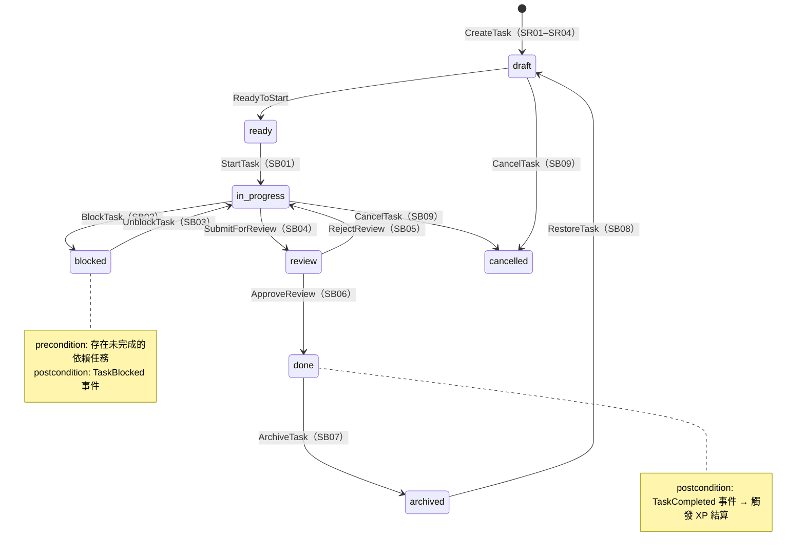
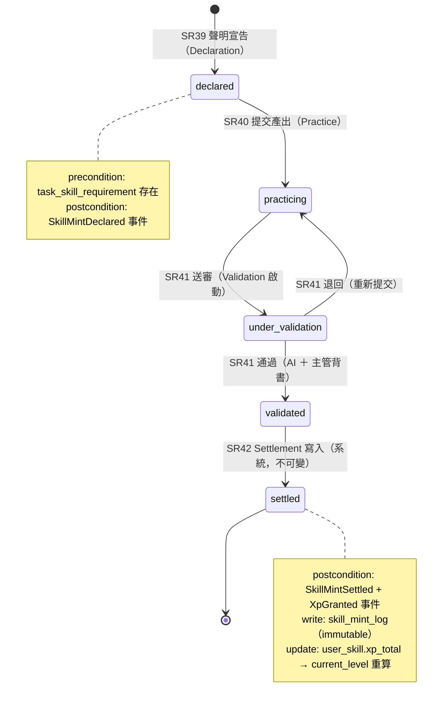
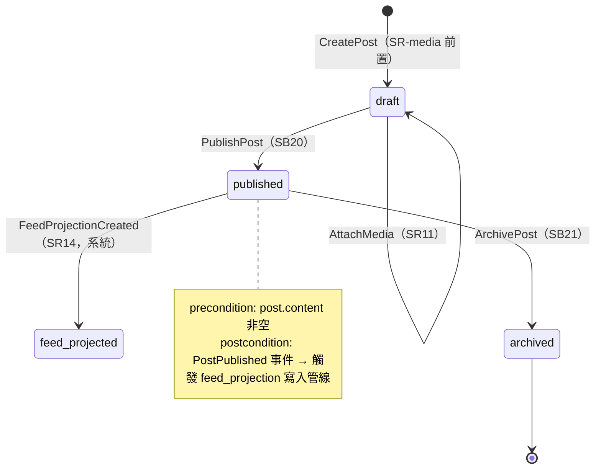
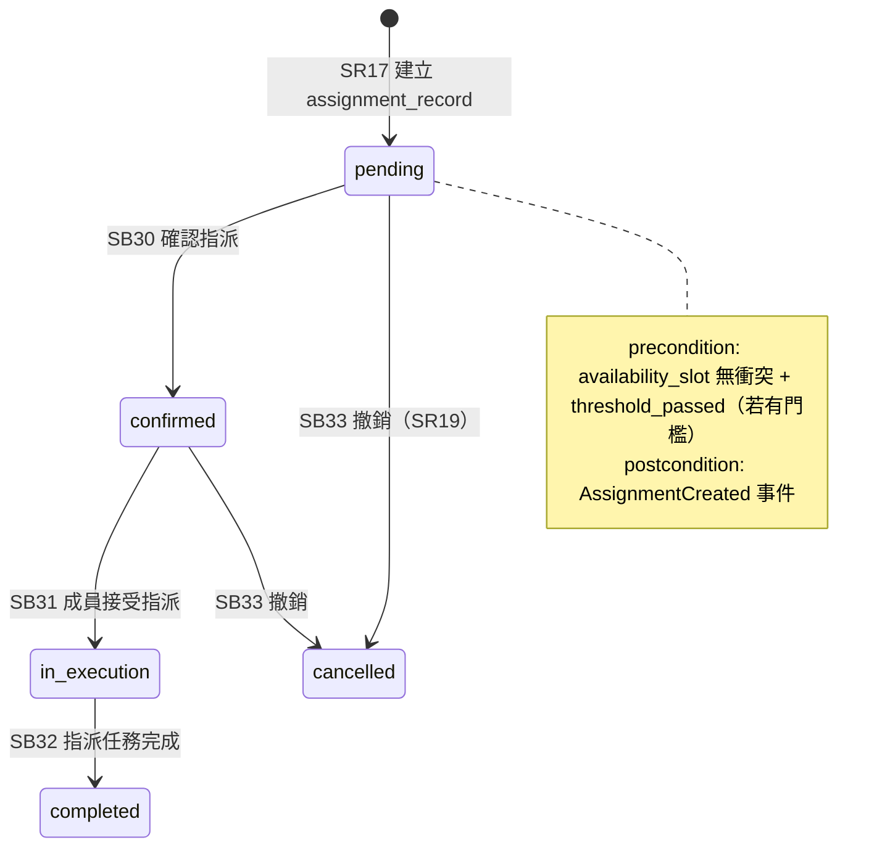
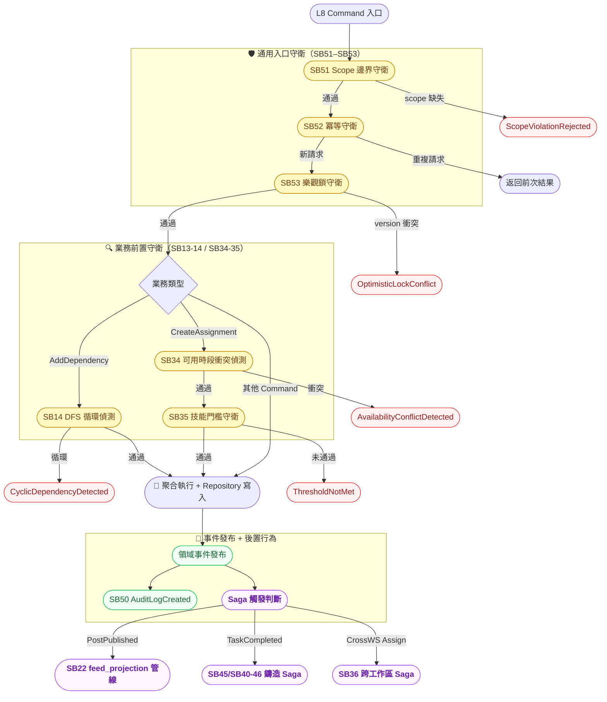

# Xuanwu 子行為層 Use Case / State Diagram — L5 Sub-Behavior Boundary

> **層級定位**：本文件為子資源層（L4）的下一層，定義每個子資源上的**原子行為（Atomic Behavior）**：
> precondition / postcondition、狀態機轉換、補償路徑、audit log 觸發點，以及 L8 Command 對應。
> 上層對應：[use-case-diagram-sub-resource.md](./use-case-diagram-sub-resource.md)（L4）。

---

## 邊界驗證前置確認

| 層 | 文件 | 狀態 |
|----|------|------|
| L1 | `use-case-diagram-saas-basic.md` | ✅ 通過 |
| L2 | `use-case-diagram-workspace.md` | ✅ 通過 |
| L3 | `use-case-diagram-resource.md` | ✅ 通過 |
| L4 | `use-case-diagram-sub-resource.md` | ✅ 通過 |
| **L5** | `use-case-diagram-sub-behavior.md`（本文件） | 📝 定義中 |

---

## 架構層級定位

```
Platform SaaS 邊界
└── Personal / Organization                          ← L1
    └── Workspace                                    ← L2
        └── Resource / Item (R1–R53)                ← L3
            └── Sub-Resource (SR01–SR54)            ← L4
                └── Sub-Behavior（本層）             ← L5
                    ├── WBS 狀態機（task_item 生命週期）
                    ├── 依賴循環偵測行為（DFS CycleCheck）
                    ├── 貼文發布流行為（post lifecycle）
                    ├── 指派前置行為（availability + threshold check）
                    ├── 技能鑄造四階段狀態機（Declaration→Settlement）
                    └── 通用子行為（audit log、冪等守衛、scope 邊界守衛）
```

---

## 原子行為設計準則

1. **每個原子行為 = 一個 Command Handler 或 Guard 函數的邊界**：不含業務編排邏輯，只含前置驗證 + 單一操作 + 事件發布。
2. **Precondition 在 L8 Command Handler 入口強制執行**；失敗直接返回錯誤事件，不進入聚合。
3. **Postcondition 以領域事件表達**；所有狀態轉換必須有對應的 `*Changed` 或 `*Occurred` 事件。
4. **所有狀態轉換產生 `AuditLogCreated` 事件**；寫入 audit log 為跨 domain 不可省略的副作用。
5. **Compensating action（補償）在 L8 Saga 內處理**；L5 只定義補償的觸發條件（precondition 失敗事件）。

---

## 狀態機定義

### 1. task_item 生命週期狀態機



### 2. 技能鑄造四階段狀態機（skill_mint_log）



### 3. post 發布生命週期狀態機



### 4. assignment_record 指派狀態機



---

## 原子行為清單（SB01–SB46）

### ⚙️ WBS 任務生命週期行為（SB01–SB12）

| SB | 行為名稱 | L8 Command | precondition | postcondition（事件） | 補償觸發 |
|----|---------|-----------|-------------|---------------------|---------|
| SB01 | 開始任務 | `StartTaskCommand` | 状態為 ready；無未解除的 blocked 依賴 | `TaskStarted` | — |
| SB02 | 封鎖任務 | `BlockTaskCommand` | 狀態為 in_progress；依賴任務未完成 | `TaskBlocked` | — |
| SB03 | 解除封鎖 | `UnblockTaskCommand` | 狀態為 blocked；所有依賴任務已完成 | `TaskUnblocked` | — |
| SB04 | 提交審核 | `SubmitTaskReviewCommand` | 狀態為 in_progress；完成度 ≥ threshold | `TaskSubmittedForReview` | — |
| SB05 | 拒絕審核（退回） | `RejectTaskReviewCommand` | 狀態為 review；reviewer 有授權 | `TaskReviewRejected` | — |
| SB06 | 批准完成 | `ApproveTaskCommand` | 狀態為 review；reviewer 有授權 | `TaskCompleted` → 觸發 XP 結算判斷 | — |
| SB07 | 歸檔任務 | `ArchiveTaskCommand` | 狀態為 done | `TaskArchived` | — |
| SB08 | 還原歸檔 | `RestoreTaskCommand` | 狀態為 archived | `TaskRestored` | — |
| SB09 | 取消任務 | `CancelTaskCommand` | 狀態為 draft 或 in_progress；無進行中的子任務 | `TaskCancelled` | cascade 子任務取消 |
| SB10 | 設定父子關係 | `SetParentCommand` | 父節點存在且同 workspaceId；不形成循環 | `ParentSet` | — |
| SB11 | 移動任務層級 | `MoveTaskLevelCommand` | 目標 parent 允許此 sub_type | `TaskMoved` | — |
| SB12 | 複製任務子樹 | `CopyTaskTreeCommand` | 目標 parent 存在；複製深度 ≤ 5 | `TaskTreeCopied` | 失敗 → 刪除部分複製（補償） |

### 🔗 依賴循環偵測行為（SB13–SB15）

| SB | 行為名稱 | L8 Command / Guard | precondition | postcondition（事件） | 補償觸發 |
|----|---------|-------------------|-------------|---------------------|---------|
| SB13 | 新增依賴（帶循環前置守衛） | `AddDependencyCommand` | 邊不存在；DFS 偵測通過 | `DependencyAdded` | — |
| SB14 | 循環依賴偵測（DFS 守衛） | Guard（SB13 precondition） | from_id ≠ to_id；DFS 無環 | 偵測失敗 → `CyclicDependencyDetected` | 阻擋 SB13；AI 背景掃描觸發 |
| SB15 | 移除依賴 | `RemoveDependencyCommand` | 依賴邊存在 | `DependencyRemoved` | — |

### 📎 貼文與 feed\_projection 行為（SB20–SB24）

| SB | 行為名稱 | L8 Command | precondition | postcondition（事件） | 補償觸發 |
|----|---------|-----------|-------------|---------------------|---------|
| SB20 | 發布貼文 | `PublishPostCommand` | 狀態為 draft；content 非空；workspaceId 必填 | `PostPublished` → 觸發 feed_projection 管線 | — |
| SB21 | 歸檔貼文 | `ArchivePostCommand` | 狀態為 published | `PostArchived` | cascade feed_projection soft-delete |
| SB22 | 寫入 feed\_projection（系統） | 事件管線觸發（非 Command） | `PostPublished` 事件收到；orgId 存在 | `FeedProjectionCreated` | 失敗 → 重試（冪等鍵） |
| SB23 | 附加媒體 | `AttachMediaCommand` | post 為 draft 或 published（未鎖定） | `MediaAttached` | — |
| SB24 | 移除媒體 | `RemoveMediaCommand` | post_media 存在；post 未鎖定 | `MediaRemoved` | — |

### 🗓️ 指派前置與確認行為（SB30–SB36）

| SB | 行為名稱 | L8 Command / Guard | precondition | postcondition（事件） | 補償觸發 |
|----|---------|-------------------|-------------|---------------------|---------|
| SB30 | 確認指派 | `ConfirmAssignmentCommand` | assignment_record 狀態為 pending；授權確認 | `AssignmentConfirmed` | — |
| SB31 | 接受指派（成員） | `AcceptAssignmentCommand` | 狀態為 confirmed；assignee 本人 | `AssignmentAccepted` | — |
| SB32 | 完成指派任務 | `CompleteAssignmentCommand` | 狀態為 in_execution + task_item 完成 | `AssignmentCompleted` | — |
| SB33 | 撤銷指派 | `RevokeAssignmentCommand` | 狀態為 pending 或 confirmed | `AssignmentRevoked` | — |
| SB34 | 可用時段衝突偵測（守衛） | Guard（SR17 precondition） | availability_slot 不與現有 assignment 重疊 | 衝突 → `AvailabilityConflictDetected` | 阻擋 SR17 |
| SB35 | 門檻前置守衛 | Guard（SR17 precondition） | matching_result.threshold_passed = true（若設門檻） | 未通過 → `ThresholdNotMet` | 阻擋 SR17；推薦 SR27 設定 |
| SB36 | 跨工作區指派協調（Saga 觸發） | Saga（SB30 後觸發） | OrgOwner 指派 + 目標工作區 workspaceId 確認 | `CrossWorkspaceAssignmentInitiated` | Saga 補償 → 回滾所有工作區 assignment_record |

### 🏅 技能鑄造原子行為（SB40–SB46）

| SB | 行為名稱 | L8 Command | precondition | postcondition（事件） | 補償觸發 |
|----|---------|-----------|-------------|---------------------|---------|
| SB40 | 宣告技能鑄造（Declaration） | `DeclareSkillMintCommand` | task_skill_requirement 存在；未有進行中的鑄造 | `SkillMintDeclared` | — |
| SB41 | 提交實作產出（Practice） | `SubmitPracticeCommand` | mint_log 狀態為 declared | `PracticeSubmitted` | — |
| SB42 | 送審驗證（Validation 啟動） | `StartValidationCommand` | mint_log 狀態為 practicing；產出非空 | `ValidationStarted` | — |
| SB43 | 通過驗證（AI + 主管） | `ApproveValidationCommand` | 狀態為 under_validation；AI review + WSAdmin 背書 | `ValidationApproved` | — |
| SB44 | 退回驗證 | `RejectValidationCommand` | 狀態為 under_validation | `ValidationRejected` | → 退回 practicing |
| SB45 | 技能結算寫入（Settlement，系統） | 事件管線觸發 | `ValidationApproved` 事件；skill_mint_log 尚未 settled | `SkillMintSettled` + `XpGranted` | Saga 補償 → 若 XP 寫入失敗則標記 pending_retry |
| SB46 | 重算 XP 等級（冪等修正） | `RecalculateXpCommand` | skill_mint_log 完整；操作者為系統或 OrgOwner | `XpRecalculated` | — |

### 📋 通用子行為（SB50–SB54）

| SB | 行為名稱 | 觸發時機 | postcondition |
|----|---------|---------|--------------|
| SB50 | Audit Log 寫入 | 所有 SB01–SB46 成功執行後 | `AuditLogCreated`（actor / action / resourceId / timestamp） |
| SB51 | Scope 邊界守衛 | 所有 Command Handler 入口 | 缺少 workspaceId / orgId → `ScopeViolationRejected` |
| SB52 | 冪等守衛 | 所有 Command Handler 入口 | 相同 idempotency-key → 直接返回前次結果，不重複寫入 |
| SB53 | 樂觀鎖衝突處理 | 任何 write Command | version 不匹配 → `OptimisticLockConflict`；前端 retry |
| SB54 | 軟刪除歸檔守衛 | 刪除類 Command | 若有子資源未 cascade → `ChildExistsPreventsDeletion` |

---

## 行為-Command 對應表（L5 → L8 介面）

| 行為 SB | 對應 L8 Command Type | 結果事件 | Saga 捲入？ |
|---------|---------------------|---------|-----------|
| SB01 | `StartTaskCommand` | `TaskStarted` | 否 |
| SB06 | `ApproveTaskCommand` | `TaskCompleted` | 條件 Saga（XP 結算） |
| SB12 | `CopyTaskTreeCommand` | `TaskTreeCopied` | 是（補償） |
| SB13 | `AddDependencyCommand` | `DependencyAdded` | 否 |
| SB14 | DFS Guard | `CyclicDependencyDetected` | 否（阻擋） |
| SB20 | `PublishPostCommand` | `PostPublished` | 是（feed_projection 管線） |
| SB22 | 事件管線 | `FeedProjectionCreated` | 是（retry 冪等） |
| SB34 | Availability Guard | `AvailabilityConflictDetected` | 否（阻擋） |
| SB36 | Saga 觸發 | `CrossWorkspaceAssignmentInitiated` | 是（跨 WS 補償） |
| SB45 | 事件管線 | `SkillMintSettled` + `XpGranted` | 是（XP 補償） |

---

## L5 邊界驗證項目

> 以下各項須在進入 L6（領域模型）設計前逐一確認。

- [ ] 所有 Command 均對應唯一的 precondition（無模糊守衛）
- [ ] `CyclicDependencyDetected`、`AvailabilityConflictDetected`、`ThresholdNotMet` 三個阻擋事件均有明確的上游處理路徑
- [ ] `AuditLogCreated` 涵蓋所有狀態轉換類 SB（SB01–SB46），無例外
- [ ] `feed_projection` 的寫入只由事件管線觸發（SB22），人工 Command 只能觸發 SB20（PublishPost）
- [ ] `skill_mint_log`（settled）為 immutable，任何 Command 不可修改已 settled 記錄；XP 修正只透過 SB46（RecalculateXp）
- [ ] 所有跨工作區 Saga 均有明確補償對稱（SB36, SB45）
- [ ] 冪等守衛（SB52）在每個 Command Handler 入口強制執行，idempotency-key 由呼叫方提供
- [ ] 樂觀鎖（SB53）覆蓋所有 write Command（非 Query）

---

## Diagram（行為守衛流概覽）


