# Xuanwu 子資源層 Use Case Diagram — L4 Sub-Resource Boundary

> **層級定位**：本文件為資源層（L3）的下一層，細化每個 Resource 型別的**子資源邊界**：
> 親子結構（parent_id 樹）、owner scope 繼承規則、discriminator 欄位、讀寫路徑分離。
> 上層對應：[use-case-diagram-resource.md](./use-case-diagram-resource.md)（L3）。

---

## 邊界驗證前置確認

| 層 | 文件 | 狀態 |
|----|------|------|
| L1 | `use-case-diagram-saas-basic.md` | ✅ 通過 |
| L2 | `use-case-diagram-workspace.md` | ✅ 通過 |
| L3 | `use-case-diagram-resource.md` | ✅ 通過 |
| **L4** | `use-case-diagram-sub-resource.md`（本文件） | 📝 定義中 |

---

## 架構層級定位

```
Platform SaaS 邊界
└── Personal / Organization                          ← L1
    └── Workspace                                    ← L2
        └── Resource / Item (R1–R53)                ← L3
            └── Sub-Resource（本層）                 ← L4
                ├── WBS 樹：Epic → Feature → Story/Task → Sub-task
                ├── 貼文子資源：post → post_media
                ├── 排程子資源：schedule_item / assignment_record / availability_slot
                ├── 技能資格子資源：task_skill_requirement / matching_result
                └── 技能資產子資源：user_skill / skill_mint_log
```

---

## 子資源型別邊界定義

| 子資源代碼 | 所屬父資源 | parent_id 規則 | scope | 業務 owner 欄位 | discriminator | 刪除策略 |
|-----------|-----------|---------------|-------|---------------|---------------|---------|
| `task_item`（sub_type: feature） | task_item（epic） | 必填（強制歸屬） | workspace | `assignee_id` | `sub_type` | forbidden（移動先） |
| `task_item`（sub_type: story） | task_item（feature） | 必填 | workspace | `assignee_id` | `sub_type` | forbidden |
| `task_item`（sub_type: task） | task_item（story/feature） | 必填 | workspace | `assignee_id` | `sub_type` | forbidden |
| `task_item`（sub_type: subtask） | task_item（task） | 必填 | workspace | `assignee_id` | `sub_type` | cascade |
| `post_media` | `post` | 必填 | workspace | `business_owner_id` | `media_type` | cascade |
| `feed_projection` | `post`（org 投影） | nullable（讀模型） | org | `business_owner_id` | — | cascade |
| `assignment_record` | `schedule_item` | 必填 | workspace | `assignee_id` | — | forbidden |
| `availability_slot` | — | nullable（org scope） | org | `assignee_id` | — | soft-delete |
| `task_skill_requirement` | `task_item` | 必填 | task | `business_owner_id` | — | cascade |
| `matching_result` | `task_skill_requirement` | 必填 | task/workspace | `assignee_id` | — | cascade |
| `skill_mint_log` | `task_item` + `user_skill` | 必填（雙外鍵） | task/user | `accepted_by` | `mint_stage` | immutable |

### 雙層 Owner 語意（繼承 L3 規則）

- **`context_*`（workspaceId / orgId / personalId）**：決定資料可見與查詢的 scope，任何查詢必須帶入此 context，缺少則拒絕（安全邊界）。
- **業務 owner 欄位（assignee_id / business_owner_id / accepted_by 等）**：決定誰有業務操作授權（編輯、刪除、驗收）。
- 兩層必須同時存在；任一缺失均視為 scope 邊界違反。

---

## Actor 說明（繼承自 L3）

| Actor | 在子資源層的能力 |
|-------|---------------|
| **WSOwner** | 所有子資源 CRUD + 刪除 + scope 變更 |
| **WSAdmin** | 子資源 CRUD（不含刪除子資源型 epic/feature/story/task）+ 指派 + 技能設定 |
| **WSMember** | 建立 task/subtask + 進度更新 + 提交技能鑄造 + 留言 |
| **WSViewer** | 唯讀子資源清單與狀態（不含 owner 欄位） |
| **OrgOwner** | availability_slot 管理 + feed_projection 可見性 + 跨工作區指派 |
| **AI 系統** | 自動產生子任務、比對匹配、背景循環掃描 |

---

## Use Case 邊界（SR01–SR54）

| 邊界 | 涵蓋 UC | 說明 |
|------|---------|------|
| 🗂️ WBS 子任務樹 | SR01–SR10 | 子任務（feature/story/task/subtask）的 CRUD、移動、reorder |
| 📎 貼文媒體子資源 | SR11–SR16 | post_media 的附加、移除、排序、feed_projection 建立 |
| 🗓️ 排程與指派子資源 | SR17–SR26 | assignment_record / availability_slot 的建立、查詢、衝突檢查 |
| 🧩 技能資格子資源 | SR27–SR36 | task_skill_requirement 的設定與 matching_result 的比對 |
| 🏅 技能資產子資源 | SR37–SR46 | user_skill 的查詢、skill_mint_log 的寫入與查詢 |
| 📑 子資源讀路徑 | SR47–SR54 | 各型別的 Projection 查詢（Read Side） |

---

## Use Case 清單

### 🗂️ WBS 子任務樹（SR01–SR10）

| UC | 標題 | 操作者 | 前置條件 |
|----|------|--------|---------|
| SR01 | 在 Epic 下建立 Feature | WSOwner/WSAdmin | Epic 存在且 workspaceId 匹配 |
| SR02 | 在 Feature 下建立 Story | WSOwner/WSAdmin/WSMember | Feature 存在且 workspaceId 匹配 |
| SR03 | 在 Story/Task 下建立 Sub-task | WSOwner/WSAdmin/WSMember | 父任務存在；sub_type 不可再建 Epic/Feature |
| SR04 | 移動 Feature 至其他 Epic | WSOwner/WSAdmin | 同一 workspaceId 內 |
| SR05 | 移動 Story/Task 至其他 Feature | WSOwner/WSAdmin | 同一 workspaceId 內 |
| SR06 | 刪除 Sub-task（cascade） | WSOwner | 無下層子項目 |
| SR07 | 查詢 Epic 的所有子項目樹 | 全 Actor | workspaceId context 必填 |
| SR08 | 調整子任務排序（reorder） | WSOwner/WSAdmin | parent_id 不變 |
| SR09 | 複製子任務（含子樹） | WSOwner/WSAdmin | 目標 parent 存在 |
| SR10 | 查詢指定深度的子任務清單 | 全 Actor | depth 參數 ≥ 1 |

### 📎 貼文媒體子資源（SR11–SR16）

| UC | 標題 | 操作者 | 前置條件 |
|----|------|--------|---------|
| SR11 | 為 post 附加 post_media（圖片/影片） | WSOwner/WSAdmin/WSMember | post 存在且為草稿或已發布 |
| SR12 | 移除 post_media | WSOwner/WSAdmin（或 business_owner） | post 未鎖定 |
| SR13 | 調整 post_media 排序 | WSOwner/WSAdmin/WSMember | post 存在 |
| SR14 | 建立 feed_projection（自 post 投影） | 系統/WSOwner/WSAdmin | post 已發布 + orgId context 必填 |
| SR15 | 查詢 post 的 media 清單 | 全 Actor | workspaceId context 必填 |
| SR16 | 查詢組織瀑布流投影（feed_projection） | 全 Actor（org scope） | orgId context 必填 |

### 🗓️ 排程與指派子資源（SR17–SR26）

| UC | 標題 | 操作者 | 前置條件 |
|----|------|--------|---------|
| SR17 | 建立 assignment_record（寫入指派） | WSAdmin/OrgOwner | schedule_item 存在；matching_result.threshold_passed = true（若有門檻） |
| SR18 | 查詢任務的 assignment_record | WSOwner/WSAdmin | workspaceId context 必填 |
| SR19 | 撤銷 assignment_record | WSOwner/WSAdmin | 指派尚未執行（status = pending） |
| SR20 | 建立 availability_slot | OrgOwner/WSAdmin | orgId context 必填；時段不得重疊 |
| SR21 | 查詢成員的 availability_slot | WSOwner/WSAdmin | orgId context 必填 |
| SR22 | 刪除 availability_slot（soft-delete） | OrgOwner | 未被綁定中的 assignment_record |
| SR23 | 查詢 schedule_item 的指派歷史 | 全 Actor | workspaceId context 必填 |
| SR24 | 查詢可用時段衝突狀態 | WSOwner/WSAdmin | orgId context 必填 |
| SR25 | 跨工作區查詢成員排程（聚合視圖） | OrgOwner | orgId context 必填 |
| SR26 | 取消排程（連帶更新 assignment_record） | WSOwner/WSAdmin | schedule_item 狀態為 pending |

### 🧩 技能資格子資源（SR27–SR36）

| UC | 標題 | 操作者 | 前置條件 |
|----|------|--------|---------|
| SR27 | 為 task_item 設定 task_skill_requirement | WSOwner/WSAdmin | task_item 存在；skill code 存在於 skill 字典 |
| SR28 | 更新 task_skill_requirement 等級要求 | WSOwner/WSAdmin | task 尚未進入執行狀態 |
| SR29 | 刪除 task_skill_requirement（cascade matching_result） | WSOwner | 無進行中的 matching_result |
| SR30 | 對指定任務執行資格比對（觸發 matching_result 寫入） | 系統/WSAdmin | task_skill_requirement 存在 + user_skill 存在 |
| SR31 | 查詢 task_item 的資格要求清單 | 全 Actor | workspaceId context 必填 |
| SR32 | 查詢 matching_result（指定任務 + 指定成員） | WSOwner/WSAdmin | task context 必填 |
| SR33 | 查詢未通過門檻的候選人清單 | WSOwner/WSAdmin | matching_result 存在 |
| SR34 | 查詢已通過門檻的候選人清單 | 全 Actor | matching_result.threshold_passed = true |
| SR35 | 標記 matching_result 為已通過（手動背書） | WSOwner/WSAdmin | matching_result 存在 |
| SR36 | 撤銷 matching_result 背書 | WSOwner | matching_result.source = manual |

### 🏅 技能資產子資源（SR37–SR46）

| UC | 標題 | 操作者 | 前置條件 |
|----|------|--------|---------|
| SR37 | 查詢用戶技能資產（user_skill） | 本人/WSAdmin/OrgOwner | personalId context 必填 |
| SR38 | 查詢技能鑄造紀錄（skill_mint_log） | 本人/WSAdmin | task context + personalId context 必填 |
| SR39 | 提交技能聲明（Declaration 啟動鑄造流） | WSMember（執行者） | task_skill_requirement 對應任務存在 |
| SR40 | 提交任務完成產出（Practice → Validation） | WSMember（執行者） | task_item.status = in_progress |
| SR41 | AI 審核 + 主管背書（Validation 通過） | AI 系統 + WSAdmin | 產出已提交 |
| SR42 | 寫入 skill_mint_log（Settlement，不可變） | 系統 | Validation 通過；XP 計算完成 |
| SR43 | 查詢用戶的 XP 累積與等級 | 本人/全 Actor | personalId context 必填 |
| SR44 | 查詢技能等級表（公開唯讀） | 全 Actor | 無前置條件 |
| SR45 | 徽章顯示（依等級計算） | 全 Actor | user_skill.current_level 存在 |
| SR46 | 重算 XP 等級（系統一致性修正） | 系統 | skill_mint_log 完整；冪等操作 |

### 📑 子資源讀路徑（SR47–SR54）

| UC | 標題 | 讀模型型別 | 說明 |
|----|------|-----------|------|
| SR47 | 查詢 WBS 樹（投影） | `WbsTreeView` | 含 sub_type、status、assignee；不含 invariant |
| SR48 | 查詢貼文媒體列表（投影） | `PostMediaListView` | 依 post_id；含 media_type、sort_order |
| SR49 | 查詢組織瀑布流（投影） | `FeedProjectionView` | org scope；依時間排序 |
| SR50 | 查詢指派清單（投影） | `AssignmentListView` | 依 workspace + date range |
| SR51 | 查詢可用時段摘要（投影） | `AvailabilitySlotSummaryView` | org scope；依成員 + 時段 |
| SR52 | 查詢技能資格矩陣（投影） | `SkillRequirementMatrixView` | task + 候選人二維矩陣 |
| SR53 | 查詢鑄造進度（投影） | `MintProgressView` | 依 task_item；四階段 stage 狀態 |
| SR54 | 查詢用戶技能雷達（投影） | `UserSkillRadarView` | 依 personalId；多技能維度 |

---

## 權限矩陣（子資源層）

| UC 範圍 | WSOwner | WSAdmin | WSMember | WSViewer | OrgOwner | AI 系統 |
|---------|:-------:|:-------:|:--------:|:--------:|:--------:|:-------:|
| SR01–SR06（WBS CRUD） | ✓ | ✓ | ✓（task/subtask） | — | — | — |
| SR07–SR10（WBS 查詢/調整） | ✓ | ✓ | ✓（唯讀部分） | ✓（SR07/SR10） | — | — |
| SR11–SR13（media CRUD） | ✓ | ✓ | ✓ | — | — | — |
| SR14–SR16（feed投影/查詢） | ✓ | ✓ | ✓（SR14） | ✓（SR15/SR16） | ✓ | ✓（SR14 系統） |
| SR17–SR19（assignment_record） | ✓ | ✓ | — | — | ✓ | — |
| SR20–SR26（availability/schedule） | ✓ | ✓ | — | ✓（SR23/SR24 唯讀） | ✓ | — |
| SR27–SR36（技能資格） | ✓ | ✓ | ✓（SR31/SR34唯讀） | ✓（SR31/SR34） | — | ✓（SR30/SR41） |
| SR37–SR46（技能資產/鑄造） | ✓ | ✓ | ✓（本人SR37-SR41） | ✓（SR43/SR44/SR45） | — | ✓（SR41/SR42/SR46） |
| SR47–SR54（讀路徑投影） | ✓ | ✓ | ✓ | ✓ | ✓（SR49/SR51） | ✓ |

---

## 邊界驗證項目（L4）

> 以下各項須在進入 L5（子行為層）設計前逐一確認。

- [ ] 所有子資源的 `workspaceId`（或 `orgId`）均從父資源繼承，不可獨立設定
- [ ] `parent_id` 強制歸屬的子資源在父資源刪除時有明確策略（cascade 或 forbidden）
- [ ] `sub_type` discriminator 明確定義每種 task_item 的行為集合邊界
- [ ] `feed_projection` 為唯讀投影，只有系統事件管線可寫入（非人工直接寫入）
- [ ] `skill_mint_log` 寫入後不可修改（immutable），XP 一致性由重算指令（SR46）處理
- [ ] 讀路徑（SR47–SR54）全部為 Read Model Projection，不觸發任何 Command/副作用
- [ ] `assignment_record` 的建立必須驗證 `matching_result.threshold_passed`（若有門檻）
- [ ] 跨工作區子資源操作（SR25、SR14 的 org scope）需傳入 `orgId` context；workspaceId 不可省略

---

## Diagram

```mermaid
graph LR
    classDef roleActor fill:#dcfce7,stroke:#16a34a,color:#14532d,font-weight:bold
    classDef roleActorLite fill:#fef9c3,stroke:#ca8a04,color:#713f12,font-weight:bold
    classDef systemActor fill:#f3e8ff,stroke:#a855f7,color:#6b21a8,font-weight:bold
    classDef orgActor fill:#e0f2fe,stroke:#0284c7,color:#0c4a6e,font-weight:bold
    classDef wbsUC fill:#eff6ff,stroke:#3b82f6,color:#1e40af
    classDef mediaUC fill:#fdf4ff,stroke:#a855f7,color:#6b21a8
    classDef schedUC fill:#fff7ed,stroke:#f97316,color:#9a3412
    classDef skillUC fill:#f0fdf4,stroke:#22c55e,color:#166534
    classDef mintUC fill:#fefce8,stroke:#eab308,color:#713f12
    classDef readUC fill:#f1f5f9,stroke:#94a3b8,color:#475569,stroke-dasharray:4 2

    WSOwner((工作區擁有者)):::roleActor
    WSAdmin((工作區管理員)):::roleActor
    WSMember((工作區成員)):::roleActorLite
    WSViewer((工作區訪客)):::roleActorLite
    OrgOwner((組織擁有者)):::orgActor
    AI((AI 系統)):::systemActor

    subgraph subResource["📦 子資源層 Use Case（L4）"]

        subgraph wbs["🗂️ WBS 子任務樹（SR01–SR10）"]
            SR01([SR01 建立 Feature-in-Epic]):::wbsUC
            SR02([SR02 建立 Story-in-Feature]):::wbsUC
            SR03([SR03 建立 Sub-task]):::wbsUC
            SR04([SR04 移動 Feature]):::wbsUC
            SR05([SR05 移動 Story / Task]):::wbsUC
            SR06([SR06 刪除 Sub-task]):::wbsUC
            SR07([SR07 查詢子項目樹]):::wbsUC
            SR08([SR08 調整排序]):::wbsUC
            SR09([SR09 複製子任務]):::wbsUC
            SR10([SR10 查詢指定深度清單]):::wbsUC
        end

        subgraph media["📎 貼文媒體子資源（SR11–SR16）"]
            SR11([SR11 附加 post_media]):::mediaUC
            SR12([SR12 移除 post_media]):::mediaUC
            SR13([SR13 調整 media 排序]):::mediaUC
            SR14([SR14 建立 feed_projection]):::mediaUC
            SR15([SR15 查詢 media 清單]):::mediaUC
            SR16([SR16 查詢組織瀑布流]):::mediaUC
        end

        subgraph sched["🗓️ 排程與指派子資源（SR17–SR26）"]
            SR17([SR17 建立 assignment_record]):::schedUC
            SR18([SR18 查詢 assignment_record]):::schedUC
            SR19([SR19 撤銷 assignment_record]):::schedUC
            SR20([SR20 建立 availability_slot]):::schedUC
            SR21([SR21 查詢 availability_slot]):::schedUC
            SR22([SR22 刪除 availability_slot]):::schedUC
            SR23([SR23 查詢指派歷史]):::schedUC
            SR24([SR24 查詢時段衝突]):::schedUC
            SR25([SR25 跨工作區排程聚合]):::schedUC
            SR26([SR26 取消排程]):::schedUC
        end

        subgraph skillQual["🧩 技能資格子資源（SR27–SR36）"]
            SR27([SR27 設定 task_skill_requirement]):::skillUC
            SR28([SR28 更新等級要求]):::skillUC
            SR29([SR29 刪除要求]):::skillUC
            SR30([SR30 觸發資格比對]):::skillUC
            SR31([SR31 查詢要求清單]):::skillUC
            SR32([SR32 查詢 matching_result]):::skillUC
            SR33([SR33 查詢未通過候選人]):::skillUC
            SR34([SR34 查詢已通過候選人]):::skillUC
            SR35([SR35 手動背書通過]):::skillUC
            SR36([SR36 撤銷背書]):::skillUC
        end

        subgraph skillMint["🏅 技能資產子資源（SR37–SR46）"]
            SR37([SR37 查詢 user_skill]):::mintUC
            SR38([SR38 查詢 skill_mint_log]):::mintUC
            SR39([SR39 聲明 Declaration]):::mintUC
            SR40([SR40 提交產出 Practice]):::mintUC
            SR41([SR41 AI＋主管 Validation]):::mintUC
            SR42([SR42 系統 Settlement 寫入]):::mintUC
            SR43([SR43 查詢 XP 與等級]):::mintUC
            SR44([SR44 查詢等級表]):::mintUC
            SR45([SR45 顯示技能徽章]):::mintUC
            SR46([SR46 重算 XP 等級]):::mintUC
        end

        subgraph readSide["📑 讀路徑投影（SR47–SR54）"]
            SR47([SR47 WbsTreeView]):::readUC
            SR48([SR48 PostMediaListView]):::readUC
            SR49([SR49 FeedProjectionView]):::readUC
            SR50([SR50 AssignmentListView]):::readUC
            SR51([SR51 AvailabilitySlotSummaryView]):::readUC
            SR52([SR52 SkillRequirementMatrixView]):::readUC
            SR53([SR53 MintProgressView]):::readUC
            SR54([SR54 UserSkillRadarView]):::readUC
        end

    end

    %% WSOwner
    WSOwner --> SR01
    WSOwner --> SR02
    WSOwner --> SR03
    WSOwner --> SR04
    WSOwner --> SR05
    WSOwner --> SR06
    WSOwner --> SR07
    WSOwner --> SR08
    WSOwner --> SR09
    WSOwner --> SR10
    WSOwner --> SR11
    WSOwner --> SR12
    WSOwner --> SR13
    WSOwner --> SR14
    WSOwner --> SR17
    WSOwner --> SR18
    WSOwner --> SR19
    WSOwner --> SR26
    WSOwner --> SR27
    WSOwner --> SR28
    WSOwner --> SR29
    WSOwner --> SR35
    WSOwner --> SR36
    WSOwner --> SR37
    WSOwner --> SR38

    %% WSAdmin
    WSAdmin --> SR01
    WSAdmin --> SR02
    WSAdmin --> SR03
    WSAdmin --> SR04
    WSAdmin --> SR05
    WSAdmin --> SR07
    WSAdmin --> SR08
    WSAdmin --> SR09
    WSAdmin --> SR10
    WSAdmin --> SR11
    WSAdmin --> SR12
    WSAdmin --> SR13
    WSAdmin --> SR14
    WSAdmin --> SR17
    WSAdmin --> SR18
    WSAdmin --> SR19
    WSAdmin --> SR20
    WSAdmin --> SR21
    WSAdmin --> SR26
    WSAdmin --> SR27
    WSAdmin --> SR28
    WSAdmin --> SR30
    WSAdmin --> SR35
    WSAdmin --> SR37
    WSAdmin --> SR38

    %% WSMember
    WSMember --> SR02
    WSMember --> SR03
    WSMember --> SR07
    WSMember --> SR10
    WSMember --> SR11
    WSMember --> SR13
    WSMember --> SR14
    WSMember --> SR39
    WSMember --> SR40
    WSMember --> SR43

    %% WSViewer
    WSViewer --> SR07
    WSViewer --> SR10
    WSViewer --> SR15
    WSViewer --> SR16
    WSViewer --> SR23
    WSViewer --> SR24
    WSViewer --> SR31
    WSViewer --> SR34
    WSViewer --> SR43
    WSViewer --> SR44
    WSViewer --> SR45
    WSViewer --> SR47
    WSViewer --> SR48
    WSViewer --> SR49
    WSViewer --> SR50
    WSViewer --> SR52
    WSViewer --> SR54

    %% OrgOwner
    OrgOwner --> SR16
    OrgOwner --> SR17
    OrgOwner --> SR20
    OrgOwner --> SR21
    OrgOwner --> SR22
    OrgOwner --> SR25
    OrgOwner --> SR49
    OrgOwner --> SR51

    %% AI 系統
    AI --> SR14
    AI --> SR30
    AI --> SR41
    AI --> SR42
    AI --> SR46
```


