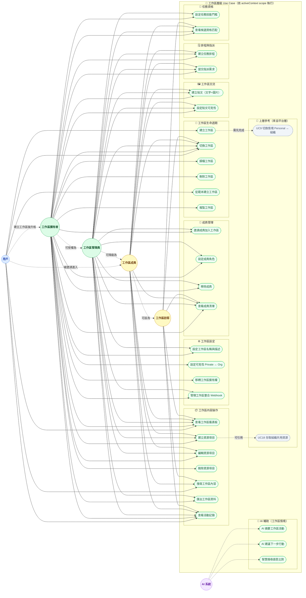

# Xuanwu 工作區層級 Use Case Diagram

> **層級定位**：本文件為平台 Use Case 的下一層，描述單一「工作區」內的行為邊界。
> 上層對應：[use-case-diagram-saas-basic.md](./use-case-diagram-saas-basic.md) 中的 `UC19 在組織內建立工作區` 與 `UC7 查看個人工作區`。

## 工作區在架構中的位置

```
Platform SaaS 邊界
└── Personal Account / Organization   ← 上層圖（use-case-diagram-saas-basic.md）
    └── Workspace（本圖）             ← 當前層
        └── Resource / Item           ← 下一層（已建：use-case-diagram-resource.md）
```

工作區（Workspace）等同於 GitHub 中的 **Repository**：
- 可屬於個人帳號（personal workspace）或組織（org workspace）
- 有自己的成員清單（可以是 Org成員的子集，或個人邀請的外部協作者）
- 有自己的四級角色體系
- 所有操作都在 `activeContext` scope 內執行，嚴格與其他工作區隔離

細部資源欄位請參考：`docs/architecture/specs/resource-attribute-matrix.md`（中英對照）。

---

## Actor 說明

| Actor | 類型 | 說明 |
|-------|------|------|
| **用戶** (User) | 根 Actor | 未加入任何工作區時的狀態；可建立新工作區 |
| **工作區擁有者** (WSOwner) | 情境角色 | User 建立工作區後自動升格；全權限 |
| **工作區管理員** (WSAdmin) | 情境角色 | WSOwner 授權；可管理成員與內容，但無法刪除工作區或移轉擁有權 |
| **工作區成員** (WSMember) | 情境角色 | 被邀請後加入；可讀寫內容 |
| **工作區訪客** (WSViewer) | 情境角色 | 唯讀權限；可查看但不可修改任何資源 |
| **AI 系統** (AI System) | 系統 Actor | 在工作區情境下提供 AI 輔助，虛線表示系統觸發 |

> **角色繼承關係（向下包含）**：
> `WSOwner` ⊇ `WSAdmin` ⊇ `WSMember` ⊇ `WSViewer`
>
> **夥伴放位**：外部夥伴（Partner）不另立新 Actor，透過邀請後套用 `WSMember` 或 `WSViewer` 權限模板；其可見與可操作邊界由 workspace ACL 決定。

---

## Use Case 邊界（WS1–WS30）

| 邊界 | 涵蓋 UC |
|------|---------|
| 🔧 工作區生命週期 | 建立、切換、歸檔、刪除、從範本建立、複製 |
| ⚙️ 工作區設定 | 名稱描述、可見性、移轉擁有權、整合 Webhook |
| 👥 成員管理 | 邀請、設定角色、移除、查看清單 |
| 📦 工作區內容操作 | 儀表板、CRUD 資源項目、搜尋、匯出、活動記錄 |
| 🖼️ 工作區交流 | 建立貼文、設定貼文可見性 |
| 🗓️ 排程與指派 | 建立任務排程、提交指派需求 |
| 🧩 任務資格 | 設定任務技能門檻、查看候選資格匹配 |
| 🤖 AI 輔助 | 摘要工作區活動、建議下一步、語意搜尋 |

---

## 權限矩陣

| Use Case | WSOwner | WSAdmin | WSMember | WSViewer |
|----------|:-------:|:-------:|:--------:|:--------:|
| WS2 切換工作區 | ✓ | ✓ | ✓ | ✓ |
| WS3 歸檔工作區 | ✓ | — | — | — |
| WS4 刪除工作區 | ✓ | — | — | — |
| WS6 複製工作區 | ✓ | — | — | — |
| WS7 設定名稱描述 | ✓ | ✓ | — | — |
| WS8 設定可見性 | ✓ | — | — | — |
| WS9 移轉擁有權 | ✓ | — | — | — |
| WS10 管理整合 Webhook | ✓ | ✓ | — | — |
| WS11 邀請成員 | ✓ | ✓ | — | — |
| WS12 設定成員角色 | ✓ | ✓ | — | — |
| WS13 移除成員 | ✓ | ✓ | — | — |
| WS14 查看成員清單 | ✓ | ✓ | ✓ | ✓ |
| WS15 查看儀表板 | ✓ | ✓ | ✓ | ✓ |
| WS16 建立資源項目 | ✓ | ✓ | ✓ | — |
| WS17 編輯資源項目 | ✓ | ✓ | ✓ | — |
| WS18 刪除資源項目 | ✓ | — | — | — |
| WS19 搜尋工作區內容 | ✓ | ✓ | ✓ | ✓ |
| WS20 匯出工作區資料 | ✓ | ✓ | — | — |
| WS21 查看活動記錄 | ✓ | ✓ | ✓ | ✓ |
| WS25 建立貼文（文字+圖片） | ✓ | ✓ | ✓ | — |
| WS26 設定貼文可見性 | ✓ | ✓ | ✓（自己建立的） | — |
| WS27 建立任務排程 | ✓ | ✓ | ✓ | — |
| WS28 提交指派需求 | ✓ | ✓ | ✓ | — |
| WS29 設定任務技能門檻 | ✓ | ✓ | — | — |
| WS30 查看候選資格匹配 | ✓ | ✓ | ✓ | ✓ |

---

## Diagram



---

## 設計備註

- **WS2 切換工作區** 與上層的 UC9 切換情境不同：UC9 是 Personal ↔ Org 的大情境切換，WS2 是同一情境下多個工作區之間的切換。
- **可見性（WS8）**：`Private` = 僅工作區成員可見；`Org-visible` = 同組織所有成員可瀏覽但不可編輯。
- **WSAdmin 限制**：無法執行 WS3（歸檔）、WS4（刪除）、WS6（複製）、WS8（改可見性）、WS9（移轉擁有權）、WS18（刪除資源項目），避免過度授權。
- **WS18 刪除策略**：刪除僅限 WSOwner；WSAdmin/WSMember 不提供直接刪除，改採資源層歸檔（R11）與流程審核替代。
- **Team/Partner 放位**：`Team` 留在 L1 組織治理語意；`Partner` 在 L2 以邀請後 ACL 映射為 `WSMember/WSViewer`。
- **WS5 從範本建立** 依訂閱方案 gating，部分範本為 Pro/Enterprise 限定。
- **資料隔離**：工作區內所有查詢必須攜帶 `workspaceId` scope，`orgId`/`personalId` 由上層 `activeContext` 帶入，不重複傳遞。
- **下一層**：工作區內的 `Resource / Item` 層級（單一資源的 CRUD 詳細流程）見 `use-case-diagram-resource.md`。
- **技能門檻先於指派**：`WS29 設定任務技能門檻` 是 `WS28 提交指派需求` 的前置條件，若任務未定義門檻則只能做人工指派，不能做資格匹配推薦。

### WS29 門檻對照（`required_level` -> XP）

| `required_level` | 門檻名稱 | 通過門檻所需 `user_skill.xp_total` |
|---|---|---|
| `1` | Apprentice（學徒） | `>= 0` |
| `2` | Journeyman（熟練） | `>= 75` |
| `3` | Expert（專家） | `>= 150` |
| `4` | Artisan（大師） | `>= 225` |
| `5` | Grandmaster（宗師） | `>= 300` |
| `6` | Legendary（傳奇） | `>= 375` |
| `7` | Titan（泰坦） | `>= 450` |

> 判定規則：`matching_result.threshold_passed = (user_skill.current_level >= task_skill_requirement.required_level)`，等級由 `xp_total` 依上表推導。

## 增量設計（功能 1 / 2）

| 功能 | L2 放位（工作區層） | 對應文件 |
|---|---|---|
| 1. 組織<->工作區照片牆 | `F1-L2-1 建立貼文（文字+圖片）`、`F1-L2-2 貼文可見性設定` | `docs/architecture/specs/org-workspace-feed-architecture.md` |
| 2. 工作區排程 + 組織指派 | `F2-L2-1 建立任務排程`、`F2-L2-2 提交指派需求` | `docs/architecture/specs/scheduling-assignment-architecture.md` |
