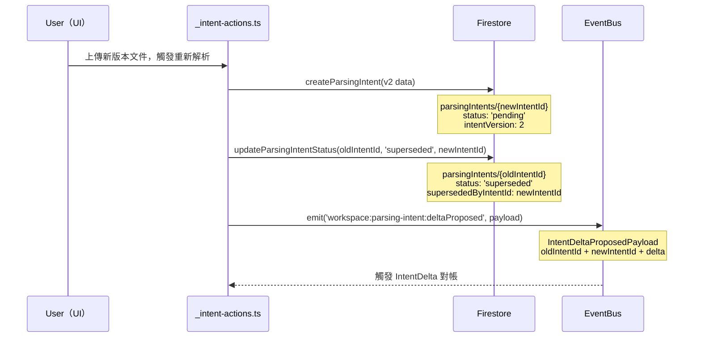
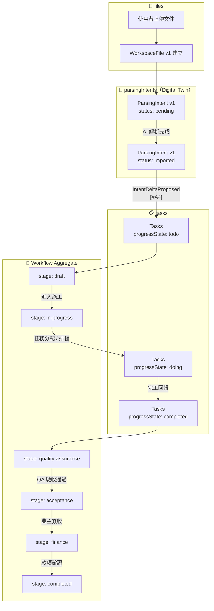
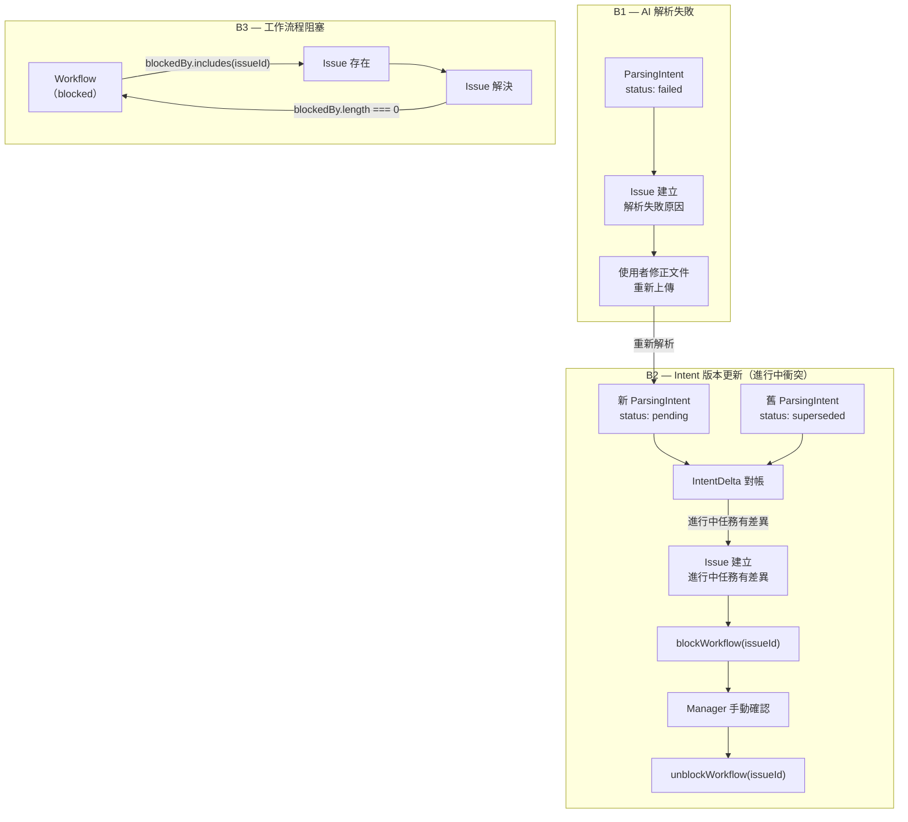
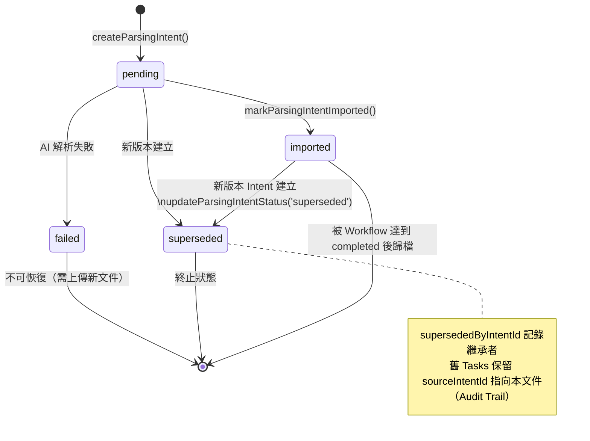
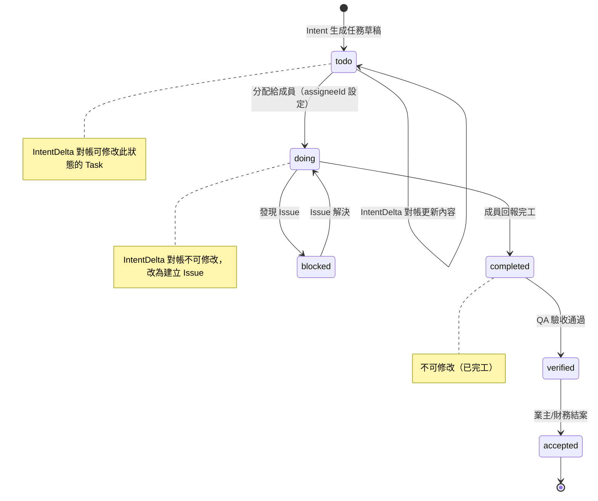

# workspace.slice 業務邏輯設計指南

> **適用版本：** VS5 · Workspace Slice（工作區業務）
>
> 本指南以 **ParsingIntent Digital Twin [#A4]** 為核心，完整定義三個子集合的設計原則、版本機制、任務對帳算法、A/B 雙軌狀態機，以及 Slice 責任邊界。無實作代碼搬運，只記設計決策。

---

## 0 ｜ 設計哲學：Digital Twin 三角

```
WorkspaceFile  ──────────────────────────────────────────
    ▲ 儲存原始上傳物件（帶版本歷史）              files subcollection
    │                                       
    │ 解析觸發                              
    ▼                                       
ParsingIntent  ──────────────────────────────────────────
    ▲ 解析合約（Digital Twin）                 parsingIntents subcollection
    │ 唯讀語義合約，帶版本鏈                    
    │ IntentDeltaProposed 事件               
    ▼                                       
WorkspaceTask  ──────────────────────────────────────────
               任務（可變狀態、可被 Workflow 推進）  tasks subcollection
```

| 子集合 | 職責 | 可變性 |
|---|---|---|
| `files` | 儲存原始文件及其版本歷史 | 可追加版本，不可改現有版本內容 |
| `parsingIntents` | AI 解析的語義合約（Digital Twin） | 建立後內容不可變；僅 `status` 可更新 |
| `tasks` | 由 Intent 生成的工作單元，可被 Workflow 推進 | 完全可變（狀態、指派、進度） |

**最核心的不變量：**

> 🔒 **Invariant #A4** — `ParsingIntent` 建立後，`lineItems`、`skillRequirements`、`taskDraftCount` 絕對不可被覆蓋。
> 若需修改，必須建立新版本 Intent，舊版本標記為 `superseded`。

---

## 1 ｜ 三個子集合的路徑與職責

```
workspaces/{workspaceId}/
├── files/{fileId}                  → WorkspaceFile 文件（含 versions[] 陣列）
├── parsingIntents/{intentId}       → ParsingIntent 解析合約（Digital Twin）
└── tasks/{taskId}                  → WorkspaceTask 工作單元
```

### 為何不用更深的子集合巢狀？

```
❌ 反模式：過深巢狀
workspaces/{workspaceId}/parsingIntents/{intentId}/tasks/{taskId}

原因：
1. Firestore 無法跨集合查詢 — 無法列出工作區所有 tasks
2. Task 生命週期獨立於 Intent — Intent 可能被 superseded，但 Task 仍需繼續
3. 刪除 Intent 不應連帶刪除 Task（業務不允許）
```

```
✅ 正確設計：兄弟集合 + 外鍵引用
workspaces/{workspaceId}/tasks/{taskId}
  └── sourceIntentId: "intent-001"   ← 引用，非包含
```

**三個子集合彼此為兄弟，透過 `sourceIntentId` / `sourceFileId` 鬆耦合連接。**

---

## 2 ｜ Firestore 文件型態規格（Canonical Document Shapes）

### 2.1 WorkspaceFile（`files/{fileId}`）

```typescript
interface WorkspaceFile {
  id: string;
  name: string;
  type: string;
  currentVersionId: string;      // 指向 versions[] 中最新版本
  updatedAt: Timestamp;
  versions: WorkspaceFileVersion[];
}

interface WorkspaceFileVersion {
  versionId: string;             // e.g. "v1", "v2"
  versionNumber: number;
  versionName: string;
  size: number;
  uploadedBy: string;
  createdAt: Timestamp;
  downloadURL: string;
}
```

**版本策略：** 版本陣列內嵌在 WorkspaceFile 文件中（embedded array），每次上傳新版本 append 到 `versions[]` 並更新 `currentVersionId`。文件本身不超過 Firestore 1MB 上限（版本歷史通常僅數十筆）。

---

### 2.2 ParsingIntent（`parsingIntents/{intentId}`）— 統一規格

> ⚠️ **設計問題記錄：** 目前代碼庫中存在兩個衝突的 ParsingIntent 模型：  
> - `src/shared/types/workspace.types.ts` → 持久層模型（有 `lineItems`，缺 `supersedesIntentId`）  
> - `business.parsing-intent/_contract.ts` → 領域契約（有 `supersedesIntentId`，缺 `lineItems`）  
>
> **本節定義的是統一規格（Canonical Spec）** — 兩個模型應向此靠攏。

```typescript
// Canonical Firestore ParsingIntent document
interface ParsingIntent {
  /**
   * Branded string type defined in `src/shared/types/workspace.types.ts`.
   * Cast with `as IntentID` when constructing references from raw strings.
   * 範例: `id as IntentID`
   */
  id: IntentID;
  workspaceId: string;
  
  // ── Source Traceability ──────────────────────────────────────
  sourceFileName: string;
  sourceFileId?: string;            // 引用 files/{fileId}
  sourceVersionId?: string;         // 引用 files/{fileId}.versions[].versionId
  sourceFileDownloadURL?: SourcePointer;

  // ── Parsed Content（建立後不可變）─────────────────────────────
  intentVersion: number;            // 人類可讀版本號（1, 2, 3...）
  lineItems: ParsedLineItem[];      // 原始解析行項目（不可變）
  taskDraftCount: number;           // lineItems 轉換出的任務草稿數
  skillRequirements: SkillRequirement[];  // 職能需求（不可變）

  // ── Status & Version Chain ────────────────────────────────────
  status: 'pending' | 'imported' | 'superseded' | 'failed';
  /**
   * [V-CHAIN] 若本文件已被新版本取代，此欄位記錄新版本的 intentId。
   * 方向：old → new（本文件的繼承者是誰）。
   * 唯有當 status = 'superseded' 時才有值。
   *
   * ⚠️  現有代碼使用 `supersedesIntentId`，語義相同但命名歧義；
   *     建議遷移至 `supersededByIntentId`（見 Section 10.1）。
   */
  supersededByIntentId?: string;

  // ── Timestamps ───────────────────────────────────────────────
  createdAt: Timestamp;             // 伺服器時間戳（serverTimestamp()）
  importedAt?: Timestamp;           // 標記為 imported 的時間
}

interface ParsedLineItem {
  name: string;
  quantity: number;
  unitPrice: number;
  discount?: number;
  subtotal: number;
}
```

> 📌 **欄位命名澄清：**  
> `supersededByIntentId` = 「取代我的那個 Intent 的 ID」  
> 舊代碼 `supersedesIntentId` 語義不明（「我取代的」還是「取代我的」？），建議遷移。

---

### 2.3 WorkspaceTask（`tasks/{taskId}`）

```typescript
interface WorkspaceTask {
  id: string;
  name: string;
  description?: string;

  // ── Progress State Machine ────────────────────────────────────
  progressState: 'todo' | 'doing' | 'blocked' | 'completed' | 'verified' | 'accepted';
  
  // ── Finance Fields ───────────────────────────────────────────
  priority: 'low' | 'medium' | 'high';
  quantity?: number;
  completedQuantity?: number;
  unitPrice?: number;
  unit?: string;
  discount?: number;
  subtotal: number;

  // ── Source Traceability（唯讀，不可被 UI 修改）────────────────
  /** SourcePointer — 唯讀引用 ParsingIntent（Digital Twin）[#A4] */
  sourceIntentId?: string;

  // ── Scheduling ───────────────────────────────────────────────
  assigneeId?: string;
  dueDate?: Timestamp;
  skillRequirements?: SkillRequirement[];
  location?: Location;
  
  // ── Hierarchy ────────────────────────────────────────────────
  parentId?: string;
}
```

**設計原則：** `sourceIntentId` 建立後**唯讀不可修改**，永遠記錄「哪個 Intent 生成了此 Task」。即使 Intent 被 superseded，此欄位也**不會**被更新為新 Intent 的 ID — 這是 Audit Trail 的保證。若需追蹤「任務當前對應的有效 Intent 版本」，可透過 `parsingIntents` 的版本鏈查詢（見 Section 3.3），不應在 Task 層面複製此資訊。

---

## 3 ｜ ParsingIntent 版本機制（Version Chain）

### 3.1 版本觸發場景

```
場景一：使用者上傳新版本文件（最常見）
  WorkspaceFile.versions 追加 v2
  觸發新的 Parse Job
  → 建立 ParsingIntent v2（intentVersion: 2）
  → 標記舊 v1 為 superseded

場景二：AI 解析修正（罕見，通常是 AI 模型升級）
  同一 WorkspaceFile.versions，但 AI 模型輸出不同
  → 手動觸發重新解析
  → 建立新 Intent，舊 Intent superseded

場景三：人工修正（本版本不支援，未來規劃）
  由 Manager 直接編輯 lineItems
  → 建立新 Intent（手動來源標記）
```

### 3.2 版本鏈建立流程



### 3.3 版本鏈遍歷（Debug / Audit 用）

```
parsingIntents/intent-001  →  supersededByIntentId: "intent-002"
parsingIntents/intent-002  →  supersededByIntentId: "intent-003"
parsingIntents/intent-003  →  status: 'imported' (最新有效版本)
```

查詢「最新有效 Intent」：

```typescript
// ✅ 最新有效 Intent：status = 'imported' 或 'pending'（非 superseded/failed）
const latestIntents = await getParsingIntents(workspaceId)
  .filter(i => i.status !== 'superseded' && i.status !== 'failed')
  .sort(by createdAt desc)
```

---

## 4 ｜ IntentDelta 任務對帳算法

### 4.1 問題陳述

當 ParsingIntent v2 supersedes v1 時：
- 已從 v1 生成的 Tasks 仍然存在（`sourceIntentId = v1`）
- v2 可能新增、刪除、或修改了 lineItems
- **如何穩健更新 Tasks？不能破壞進行中的工作。**

### 4.2 任務可變性分級

```
progressState 決定任務的可變等級：

'todo'       → ✅ 可自動更新（尚未開始，v2 內容取代 v1）
'doing'      → ⚠️  僅追加備註，不自動修改（工作中）
'blocked'    → ⚠️  僅追加備註，不自動修改（有 issue 阻擋）
'completed'  → 🔒 不可修改（已完工）
'verified'   → 🔒 不可修改（已驗收）
'accepted'   → 🔒 不可修改（已財務結案）
```

### 4.3 對帳算法（Reconciliation Algorithm）

```
INPUT:
  oldIntentId   // v1 的 ID
  newIntentId   // v2 的 ID
  oldLineItems  // v1.lineItems[]
  newLineItems  // v2.lineItems[]

STEP 1 — 查詢所有受影響的 Tasks
  affectedTasks = getWorkspaceTasks(workspaceId)
    .filter(t => t.sourceIntentId === oldIntentId)

STEP 2 — 計算 Delta（逐名稱比對）
  added   = newLineItems.filter(n => !oldLineItems.find(o => o.name === n.name))
  removed = oldLineItems.filter(o => !newLineItems.find(n => n.name === o.name))
  changed = newLineItems.filter(n => {
    const old = oldLineItems.find(o => o.name === n.name)
    return old && (old.quantity !== n.quantity || old.unitPrice !== n.unitPrice)
  })

STEP 3 — 對每個受影響 Task 做處理

  for task in affectedTasks:
    matchedItem = newLineItems.find(n => n.name === task.name)

    if progressState === 'todo':
      if matchedItem:
        → updateTask: quantity, unitPrice, subtotal（使用 v2 數值）
        ⚠️  不更新 sourceIntentId — 永遠保留原始 Intent 引用（Audit Trail 不可變）
      else:
        → 標記 task.notes += "[v2 對帳] 此行項目已在 v2 移除，請人工確認是否刪除"
        → 不自動刪除（防止意外資料遺失）

    if progressState in ['doing', 'blocked']:
      → 不修改 task 內容
      → createIssue: "Intent v2 與進行中任務 {task.name} 有差異，請 Manager 確認"
      → blockWorkflow(issueId) （如 Workflow 已建立）

    if progressState in ['completed', 'verified', 'accepted']:
      → 忽略（不修改，不創建 Issue）

STEP 4 — 處理新增行項目
  for item in added:
    → createTask from item
    ⚠️  新建 Task 的 sourceIntentId = newIntentId（新 Intent 才是它的建立者）

STEP 5 — 更新 newIntent 狀態（由 business.document-parser 執行，非 business.tasks）
  → updateParsingIntentStatus(newIntentId, 'imported')
```

### 4.4 冪等保證

對帳操作必須冪等（可安全重試）：
- `sourceIntentId` 已為 `newIntentId` 的 Task → 跳過
- `status` 已為 `imported` 的 Intent → 不重複執行對帳

---

## 5 ｜ A-track 主流程（正常路徑）



### A-track 各節點職責

| 節點 | 負責 Slice | 觸發條件 |
|---|---|---|
| 文件上傳 | `business.files` | 使用者手動 |
| AI 解析 | `business.document-parser` | 文件上傳後自動 |
| ParsingIntent 建立 | `business.document-parser` | AI 解析完成 |
| Tasks 生成 | `business.tasks` | `IntentDeltaProposed` 事件 |
| Workflow Draft 建立 | `business.workflow` | Tasks 生成後 |
| 排程任務分配 | `scheduling.slice`（跨 Slice） | Manager 操作 |
| QA 驗收 | `business.quality-assurance` | Manager 操作 |
| 財務結案 | `business.finance`（規劃中） | QA 通過後 |

---

## 6 ｜ B-track 異常處理



### B-track 各場景詳解

#### B1 — AI 解析失敗

```
觸發：AI 無法解析文件格式，或 confidence score 低於閾值

行為：
  1. ParsingIntent.status → 'failed'
  2. 建立 WorkspaceIssue（category: 'parsing', severity: 'high'）
  3. 通知 Workspace Manager（notification-hub）
  4. 不生成任何 Tasks

恢復：
  使用者上傳修正後的文件 → 進入 A-track
```

#### B2 — Intent 版本更新衝突（進行中任務）

```
觸發：舊 Intent 已有 Tasks 在 'doing' 或 'blocked' 狀態時，新 Intent 到來

行為：
  1. 執行 IntentDelta 對帳算法（Section 4）
  2. 對 doing/blocked 任務：不修改內容，建立 Issue
  3. Issue 觸發 blockWorkflow

恢復：
  Manager 確認差異
  → 手動調整 Task（或接受差異）
  → 解決 Issue → unblockWorkflow
```

#### B3 — 工作流程阻塞（一般）

```
觸發：任何原因建立 WorkspaceIssue 並呼叫 blockWorkflow(issueId)

行為：
  WorkflowAggregateState.blockedBy = [..., issueId]
  canAdvanceWorkflowStage → false
  UI 顯示阻塞原因

恢復：
  Issue 解決 → unblockWorkflow(issueId)
  當 blockedBy.length === 0 → Workflow 可繼續推進
```

---

## 7 ｜ 事件契約

### 7.1 IntentDeltaProposed（關鍵事件）

```typescript
// 定義位置：core.event-bus/_events.ts
// 事件名稱：'workspace:parsing-intent:deltaProposed'

interface IntentDeltaProposedPayload {
  intentId: string           // 新 Intent 的 ID（必填）
  workspaceId: string
  sourceFileName: string
  taskDraftCount: number     // 新 Intent 生成的任務草稿數
  skillRequirements?: SkillRequirement[]
  traceId?: string           // [R8] 端對端 Audit Trail

  // ── 版本對帳擴充（建議新增）──────────────────────────────────
  /**
   * 被 supersede 的舊 Intent ID。
   * - `undefined` → 首次解析，無舊版本（直接生成 Tasks，跳過對帳）
   * - 有值      → 版本更新，必須執行 IntentDelta 對帳算法（Section 4）
   *
   * 呼叫者責任：`oldIntentId` 有值時，對帳算法的執行者
   * （business.tasks）應先以 `sourceIntentId === oldIntentId` 查詢
   * 受影響 Tasks，再依 Section 4.3 算法處理。
   * 若 Tasks 不存在（首次 supersede），算法退化為純建立流程。
   */
  oldIntentId?: string
}
```

**事件語義：**
- `oldIntentId === undefined` → 首次解析，直接以 `taskDraftCount` 生成 Tasks，跳過 STEP 1–3（無舊 Tasks 需對帳）
- `oldIntentId` 有值 → 版本更新，觸發完整 IntentDelta 對帳算法；若查詢結果發現無舊 Tasks（罕見），算法退化為純建立流程（STEP 4 只）

### 7.2 相關事件一覽

| 事件名稱 | 觸發者 | 訂閱者 | 語義 |
|---|---|---|---|
| `workspace:parsing-intent:deltaProposed` | `business.document-parser` | `business.tasks` | Intent 版本就緒，請生成/對帳 Tasks |
| `workspace:task:created` | `business.tasks` | `projection.bus` | 任務建立，更新投影 |
| `workspace:workflow:advanced` | `business.workflow` | `projection.bus` | 工作流程階段推進 |
| `workspace:workflow:blocked` | `business.workflow` | `notification-hub` | 工作流程被阻塞 |
| `workspace:issue:resolved` | `business.issues` | `business.workflow` | Issue 解決，可能解除阻塞 |

---

## 8 ｜ 讀寫責任矩陣

### 8.1 子集合讀寫擁有者

| 子集合 | 建立權 | 狀態更新權 | 讀取者 |
|---|---|---|---|
| `files` | `business.files` | `business.files` | `document-parser`, UI |
| `parsingIntents` | `business.document-parser` | `business.document-parser`（`status` 和 `supersededByIntentId`） | `business.tasks`（讀 `lineItems`）, UI |
| `tasks` | `business.tasks`（自 IntentDelta 事件） | `business.tasks`, `scheduling.slice`（`assigneeId`）, `business.quality-assurance`（`progressState`） | 任何讀取者 |

> 📌 **職責邊界澄清：** IntentDelta 對帳算法（Section 4）中的 Task 更新由 `business.tasks` 執行（訂閱 `IntentDeltaProposed` 事件）；最後一步 `updateParsingIntentStatus(newIntentId, 'imported')` 則由 `business.document-parser` 執行（或在同一 Server Action 的最終步驟中），確保 Intent 狀態更新的所有權清晰。

### 8.2 ParsingIntent 欄位不可變性表

| 欄位 | 建立時設定 | 建立後可改 | 備註 |
|---|---|---|---|
| `id` | ✅ | ❌ | Firestore 自動生成 |
| `workspaceId` | ✅ | ❌ | |
| `sourceFileName` | ✅ | ❌ | |
| `sourceFileId` | ✅ | ❌ | |
| `sourceVersionId` | ✅ | ❌ | |
| `intentVersion` | ✅ | ❌ | |
| `lineItems` | ✅ | ❌ | **內容不可變** |
| `taskDraftCount` | ✅ | ❌ | |
| `skillRequirements` | ✅ | ❌ | |
| `status` | ✅ (`pending`) | ✅ | 僅允許向前推進 |
| `supersededByIntentId` | ❌ | ✅ | 只在 supersede 時設定 |
| `importedAt` | ❌ | ✅ | 只在 import 時設定 |
| `createdAt` | ✅ | ❌ | serverTimestamp() |

---

## 9 ｜ WorkflowStage × Task 狀態對照

```
WorkflowStage:  draft → in-progress → quality-assurance → acceptance → finance → completed
                              ↕
TaskProgressState per stage:

  'draft'             Tasks: 全為 'todo'（尚未指派）
  'in-progress'       Tasks: 'todo' / 'doing' / 'blocked' 混合
  'quality-assurance' Tasks: 至少部分 'completed'，等待驗收
  'acceptance'        Tasks: 全為 'verified'（QA 通過）
  'finance'           Tasks: 財務核算中
  'completed'         Tasks: 全為 'accepted'
```

**Stage 推進條件（Invariant）：**

| 從 → 至 | 前置條件 |
|---|---|
| `draft` → `in-progress` | 至少一個 Task 存在；`blockedBy` 為空 |
| `in-progress` → `quality-assurance` | 所有 Task.progressState ≥ `completed` |
| `quality-assurance` → `acceptance` | QA 審核人員簽核完成 |
| `acceptance` → `finance` | 業主/客戶簽收記錄存在 |
| `finance` → `completed` | 款項確認記錄存在 |

任一 Stage 推進前必須 `blockedBy.length === 0`（`isWorkflowUnblocked()`）。

---

## 10 ｜ 現有代碼對齊指引

### 10.1 需要對齊的問題

| 問題 | 位置 | 建議動作 |
|---|---|---|
| `workspace.types.ts::ParsingIntent` 缺少 `supersededByIntentId` | `src/shared/types/workspace.types.ts` | 新增 `supersededByIntentId?: string` 欄位 |
| `_contract.ts::supersedesIntentId` 語義歧義 | `business.parsing-intent/_contract.ts` | 重命名為 `supersededByIntentId`，更新測試 |
| `_contract.ts::ParsingIntentContract` 缺少 `lineItems` | `business.parsing-intent/_contract.ts` | 補充 `lineItems: ParsedLineItem[]`，或明確標注「領域契約不含持久層欄位」 |
| `saveParsingIntent` 沒有 `sourceVersionId` 參數 | `business.document-parser/_intent-actions.ts` | 新增 `sourceVersionId` 至 options |
| `updateParsingIntentStatus` 沒有 `supersededByIntentId` 參數 | 倉庫層 | 新增 `supersededByIntentId` 至 'superseded' 更新 |
| `IntentDeltaProposedPayload` 缺少 `oldIntentId` | `core.event-bus/_events.ts` | 新增 `oldIntentId?: string` |

### 10.2 對齊優先級

```
Priority 1（阻塞業務邏輯）：
  ↳ updateParsingIntentStatus 增加 supersededByIntentId 寫入
  ↳ IntentDeltaProposedPayload 增加 oldIntentId

Priority 2（型態安全）：
  ↳ workspace.types.ts 增加 supersededByIntentId 欄位
  ↳ _contract.ts 重命名 supersedesIntentId → supersededByIntentId

Priority 3（完整性）：
  ↳ _intent-actions.ts 增加 sourceVersionId 支援
  ↳ 補充 IntentDelta 對帳的 Server Action
```

---

## 11 ｜ 常見設計問題 Q&A

**Q: 為什麼 ParsingIntent 建立後內容不可變？**  
A: Digital Twin 的本質是「某一時刻的解析快照」。如果允許修改 lineItems，則 `sourceIntentId` 的引用語義就會失效（任務不知道它基於的到底是哪個版本的數據）。新數據 = 新 Intent，這是強不變量 [Invariant #A4]。

**Q: 為什麼不在 ParsingIntent 下建立 tasks 子集合？**  
A: 任務的生命週期獨立於 Intent。Intent 被 supersede 後，基於它生成的 Task 仍需繼續執行。如果 tasks 是 parsingIntents 的子集合，查詢、遍歷、和業務邏輯都會複雜十倍，且 Firestore 無法跨集合查詢。

**Q: IntentDelta 對帳算法應在哪裡執行？**  
A: Server Action（`_intent-actions.ts` 或獨立的 `_reconcile-actions.ts`）。Client 端只負責觸發事件；實際的 Firestore 寫入和比對邏輯必須在 Server 端執行，避免競爭條件。

**Q: 如果 IntentDelta 對帳中途失敗，怎麼保證一致性？**  
A: 使用 Firestore 批次寫入（`writeBatch`）對同一工作區的 Task 更新做原子操作。但跨 Task + Intent 的狀態更新（超過 500 文件批次上限的場景）需分塊執行，並以 `sourceIntentId` 做冪等鍵確保重試安全。

**Q: `supersededByIntentId` 和 `intentVersion` 哪個是查詢最新版本的依據？**  
A: `status !== 'superseded' && status !== 'failed'` 是最可靠的查詢條件。`intentVersion` 是人類可讀的計數器，不適合用於排序（可能有並發建立的情況）；`createdAt` 排序配合 status 過濾是推薦做法。

---

## 附錄 A ｜ Mermaid 狀態機：ParsingIntent 生命週期



---

## 附錄 B ｜ Mermaid 狀態機：WorkspaceTask 進度狀態


